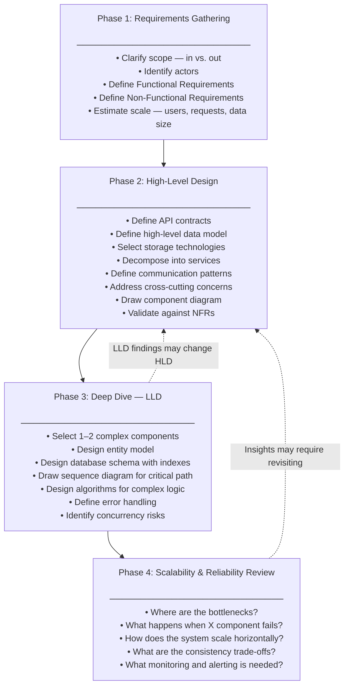
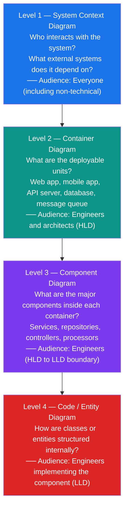
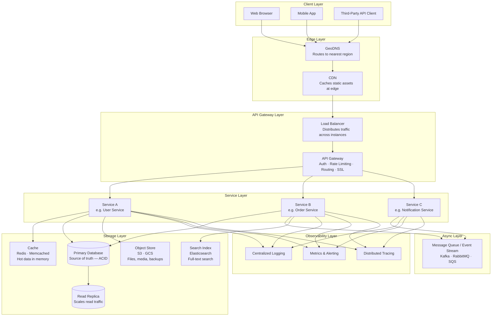
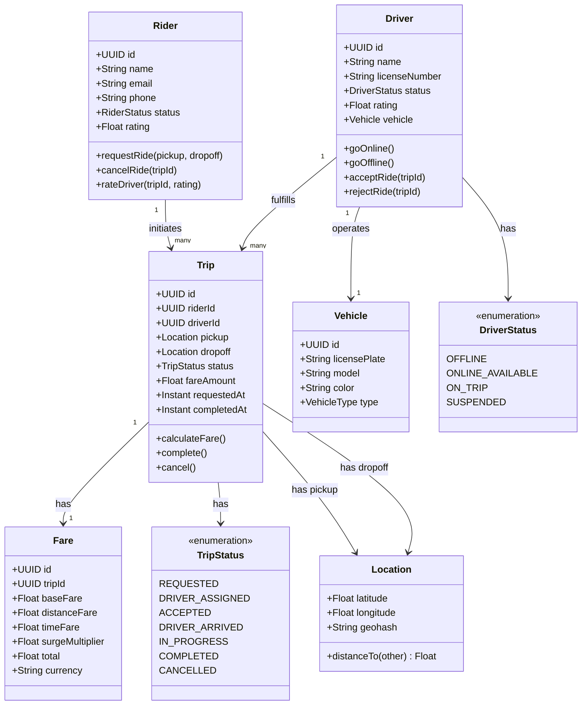
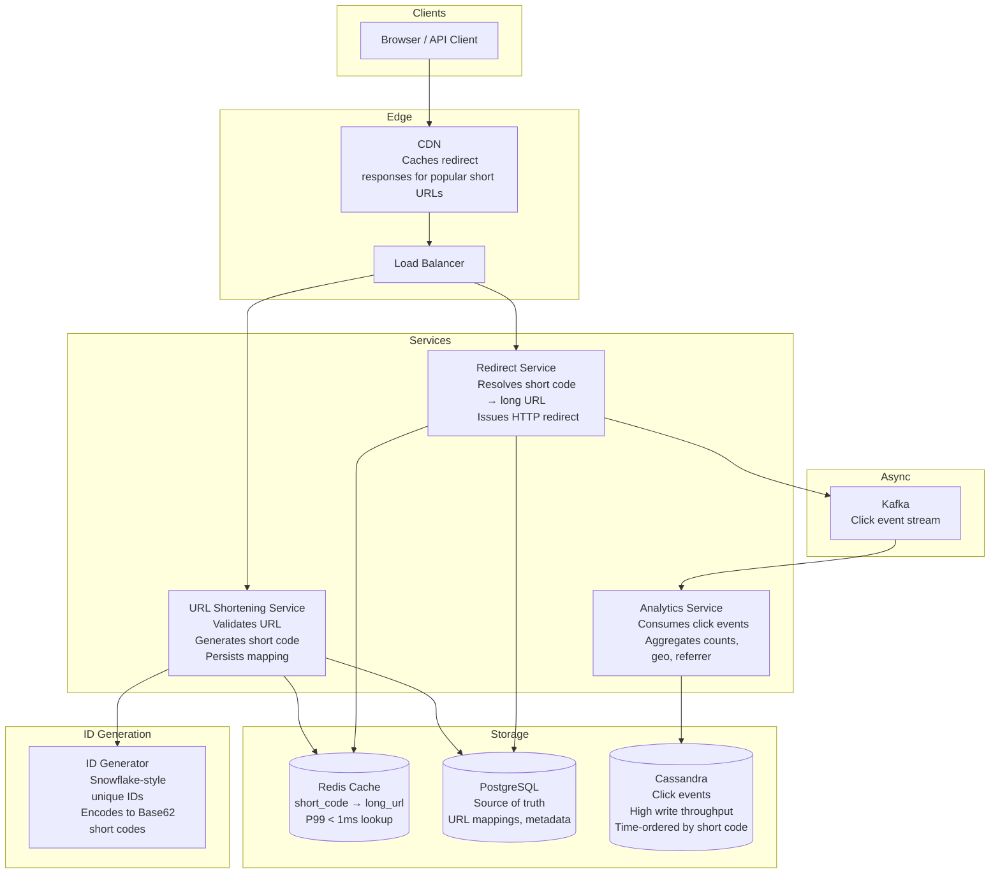
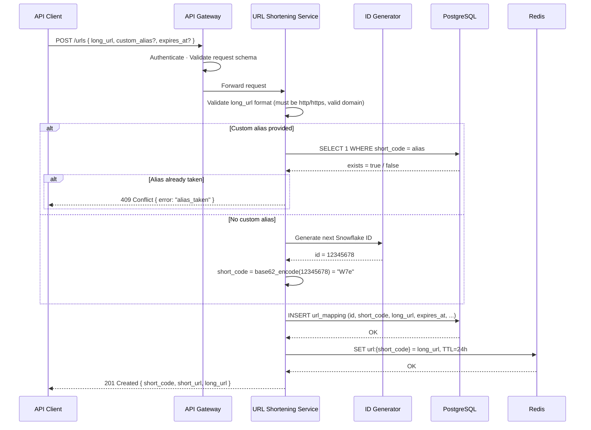

# System Design Fundamentals: FR, HLD & LLD
---

## Table of Contents

1. [Overview](#1-overview)
2. [Problem Statement](#2-problem-statement)
3. [Why These Concepts Exist](#3-why-these-concepts-exist)
4. [The System Design Hierarchy](#4-the-system-design-hierarchy)
5. [Functional Requirements (FR)](#5-functional-requirements-fr)
6. [Non-Functional Requirements (NFR) — Reference Only](#6-non-functional-requirements-nfr--reference-only)
7. [High-Level Design (HLD)](#7-high-level-design-hld)
8. [Low-Level Design (LLD)](#8-low-level-design-lld)
9. [HLD vs LLD — Comparison](#9-hld-vs-lld--comparison)
10. [FR vs NFR — Comparison](#10-fr-vs-nfr--comparison)
11. [End-to-End System Design Flow](#11-end-to-end-system-design-flow)
12. [Architecture Diagrams](#12-architecture-diagrams)
13. [Real-World Case Study — URL Shortener](#13-real-world-case-study--url-shortener)
14. [How Large Companies Apply This](#14-how-large-companies-apply-this)
15. [Advantages of This Framework](#15-advantages-of-this-framework)
16. [Disadvantages and Trade-offs](#16-disadvantages-and-trade-offs)
17. [Best Practices](#17-best-practices)
18. [Common Mistakes](#18-common-mistakes)
19. [Interview Questions](#19-interview-questions)
20. [Summary](#20-summary)
21. [References](#21-references)
22. [Cross References](#22-cross-references)

---

## 1. Overview

System design is the discipline of translating a business problem into a working, maintainable, scalable, and reliable software architecture. It is not about picking the most popular technology. It is about making deliberate, reasoned decisions at every level of abstraction — and being able to justify every one of them.

Every large engineering system ever built — Netflix streaming to 230 million subscribers, WhatsApp delivering 100 billion messages per day, Uber matching millions of riders and drivers in real time — was the result of a structured process. That process always begins with the same questions:

- **What** must the system do?
- **How well** must it do it?
- **What** are the major components and how do they connect?
- **How** does each component work internally?

These four questions map to the four foundational pillars of system design:

| Pillar | Core Question | Level of Abstraction |
|---|---|---|
| **Functional Requirements (FR)** | What must the system do? | Business level |
| **Non-Functional Requirements (NFR)** | How well must it do it? | Quality level |
| **High-Level Design (HLD)** | What are the components and how do they connect? | Architecture level |
| **Low-Level Design (LLD)** | How does each component work internally? | Component level |

> **Note on NFR:** Non-Functional Requirements are introduced here for context only. Each NFR dimension — availability, latency, throughput, consistency, durability, and so on — is covered in its own dedicated document. Do not attempt to internalize NFRs from this document alone.

---

## 2. Problem Statement

When engineers receive a directive like *"build a messaging system"* or *"design a payments platform,"* they face a fundamental challenge: the problem is almost never fully specified.

Without structure, the following failures become inevitable:

**Misalignment:** Engineers build what they *think* the system should do, not what the business actually needs. Features are built that no one uses, while critical capabilities are missed.

**Uncontrolled scope:** Without explicit requirements, work expands without justification and without a clear definition of when the work is done.

**Wrong architecture:** A system designed for 100 users may collapse under 10 million — not because the engineers were incompetent, but because scale was never discussed.

**Incompatibility:** Multiple engineers build different pieces that cannot connect, because there was no shared architectural map.

**Expensive late discovery:** A fundamental architectural flaw discovered during implementation costs 10x more to fix than one caught during design. A flaw discovered in production costs 100x more.

The FR → NFR → HLD → LLD framework exists to prevent all of these failures.

---

## 3. Why These Concepts Exist

### Why Functional Requirements?

FRs capture the *contract* between the business and engineering. They define what the system is supposed to do in unambiguous, testable terms. Without them, there is no agreed-upon definition of correctness, no way to prioritize work, and no way to know when a feature is complete.

### Why Non-Functional Requirements?

A system can be functionally correct — it does exactly what it is supposed to do — and still be completely unfit for production. If it responds in 30 seconds, or goes down for 4 hours per month, or leaks user data, it has failed regardless of its functional correctness. NFRs quantify the *operational quality* of a system. They are the requirements most frequently ignored and most frequently responsible for production failures.

> **First principles insight:** The gap between a prototype and a production system is almost entirely explained by NFRs.

### Why High-Level Design?

Large systems cannot be reasoned about at the code level. HLD provides a *map* — it shows the major components (services, databases, caches, queues) and the connections between them (APIs, protocols, data flows). Without HLD, a team cannot verify that the overall approach is sound before investing weeks in implementation.

### Why Low-Level Design?

HLD tells you *what* to build. LLD tells you *how* to build each piece. Without LLD, critical decisions get deferred to implementation time — the most expensive moment to make them. Multiple engineers implement the same component in incompatible ways. Edge cases and failure modes are only discovered after they cause incidents in production.

---

## 4. The System Design Hierarchy

System design moves through levels of abstraction, from most abstract to most concrete. Each level constrains the level below it.

```
Business Goal
     │
     ▼
Functional Requirements (FR)
     │   ← What must the system do?
     ▼
Non-Functional Requirements (NFR)
     │   ← How well must it do it?
     ▼
High-Level Design (HLD)
     │   ← What components exist and how do they connect?
     ▼
Low-Level Design (LLD)
     │   ← How does each component work internally?
     ▼
Implementation
```

Each layer informs and constrains the layer below. A latency NFR of 100ms may eliminate certain database choices at the HLD level. A throughput NFR of 1 million writes per second may mandate a specific data structure choice at the LLD level.

**This is not a one-way waterfall.** Insights from LLD frequently cause HLD revisions. Load testing results may force NFR renegotiation. NFR renegotiation may prompt a business discussion about FRs. The arrows flow in both directions — and that is expected, healthy engineering.

---

## 5. Functional Requirements (FR)

### 5.1 Definition

Functional Requirements describe the **specific behaviors, features, and capabilities** the system must provide. They define what the system accepts as input, what processing it performs, and what output it produces.

A functional requirement answers one question: *Does the system do X?* The answer is binary — yes or no. Either the system does it or it does not. This makes FRs verifiable by testing.

### 5.2 Characteristics of a Well-Written FR

Every FR must satisfy all five of these properties. A FR that fails any one of them is not fit for use.

| Property | Description | Poor Example | Good Example |
|---|---|---|---|
| **Specific** | Unambiguous — only one possible interpretation | "The system should handle users well" | "A user can reset their password using a link sent to their registered email" |
| **Measurable** | Has a clear, observable acceptance criterion | "Support many users" | "Support 50,000 concurrent authenticated sessions" |
| **Feasible** | Technically achievable within the project's constraints | N/A | Validated against technical capabilities before committing |
| **Testable** | A QA engineer can write a test that verifies it | "Good checkout experience" | "Checkout completes in 3 steps: cart → payment → confirmation" |
| **Traceable** | Linked to a business objective — exists for a reason | Standalone list with no context | Each FR references the business goal it serves |

### 5.3 Categories of Functional Requirements

FRs are not a flat list. Organizing them into categories reveals gaps and prevents important areas from being overlooked.

```
Functional Requirements
├── Core Features
│     The primary value proposition. What the system exists to do.
│
├── Data Requirements
│     What data is stored, read, written, and deleted.
│     What is the data lifecycle?
│
├── User Interactions
│     What actions can each type of user perform?
│     What does the system show or return to each actor?
│
├── Business Rules
│     Constraints and logic specific to the domain.
│     (e.g., "A driver can only accept one ride at a time")
│
├── Integration Points
│     Interfaces with external systems.
│     (e.g., "Payment processed via external payment gateway")
│
└── Reporting and Analytics
      What insights must the system expose?
      (e.g., "Admin can view daily active user count")
```

### 5.4 How to Gather FRs — The Process

In both system design interviews and real engineering projects, FRs must be elicited through a structured process. Never assume them.

**Step 1 — Identify the actors**

Who are the people or systems that interact with this system? Define each actor type and their primary goal.

```
Example: Ride-sharing system
Actors:
  - Rider     → wants to get from A to B
  - Driver    → wants to earn money by completing trips
  - Admin     → wants to monitor operations and resolve disputes
  - Payment Gateway → external system that processes charges
```

**Step 2 — Define core use cases per actor**

For each actor, define the 3–5 most important things they need to accomplish. Start with the happy path. Edge cases come later.

```
Rider:
  1. Request a ride
  2. Track driver arrival in real time
  3. Pay for the completed trip

Driver:
  1. Go online and become available
  2. Accept or reject a ride request
  3. Navigate to pickup and drop-off
```

**Step 3 — Establish scope boundaries**

The out-of-scope list is as important as the in-scope list. Explicitly define what the system will *not* do. This prevents scope creep and keeps the design focused.

**Step 4 — Define data contracts**

For each use case: what data goes in? What comes out? What transformations happen? This seeds the data model for HLD.

**Step 5 — Prioritize**

Not all FRs are equal. Use explicit prioritization so that limited capacity goes to the highest-value work first.

### 5.5 FR Prioritization — The P0/P1/P2 Framework

| Priority | Label | Definition |
|---|---|---|
| **P0** | Must Have | System cannot launch or function without this. Blocking. |
| **P1** | Should Have | Important and expected, but not launch-blocking. |
| **P2** | Nice to Have | Valuable, but can be deferred without user-facing impact. |

> This maps to the **MoSCoW method**: Must Have, Should Have, Could Have, Won't Have (for now).

### 5.6 Complete FR Example — Ride-Sharing System

| # | Functional Requirement | Actor | Priority |
|---|---|---|---|
| FR-01 | Rider can request a ride by providing a pickup and drop-off location | Rider | P0 |
| FR-02 | System matches the ride request to the nearest available driver | System | P0 |
| FR-03 | Driver can accept or reject an incoming ride request | Driver | P0 |
| FR-04 | Rider can view the driver's real-time location on a map after acceptance | Rider | P0 |
| FR-05 | Driver can navigate to pickup and drop-off locations via in-app map | Driver | P0 |
| FR-06 | System calculates fare based on distance and time at trip completion | System | P0 |
| FR-07 | Rider is charged automatically via their saved payment method | Rider / Payment GW | P0 |
| FR-08 | Rider can rate the driver (1–5 stars) after trip completion | Rider | P1 |
| FR-09 | Driver can rate the rider after trip completion | Driver | P1 |
| FR-10 | Rider can view trip history with fare breakdown | Rider | P1 |
| FR-11 | Rider can schedule a ride up to 7 days in advance | Rider | P2 |
| FR-12 | Admin can view a real-time supply/demand heat map by city | Admin | P2 |

### 5.7 FR Anti-Patterns — What to Avoid

These are the most common ways FRs are written incorrectly. Every one of them creates downstream problems in design and delivery.

| Anti-Pattern | Why It Is Harmful | Correct Approach |
|---|---|---|
| **Vague language** ("user-friendly", "fast", "reliable") | Untestable, subjective, means different things to different people | Replace with concrete, measurable statements |
| **NFRs disguised as FRs** ("system must respond in < 200ms") | Mixes concerns; NFRs are tracked and governed differently | Move to the NFR section |
| **No prioritization** | Everything treated as equally critical; team cannot make trade-off decisions | Apply P0/P1/P2 or MoSCoW explicitly |
| **Missing actor** | Requirement has no owner; no one can define "done" from a user perspective | Every FR must be owned by a specific actor |
| **No acceptance criterion** | Engineers cannot know when the requirement is satisfied | Write a clear, testable statement of satisfaction |
| **Unbounded scope** ("support all browsers", "handle all errors") | Impossible to implement or verify | Name specific targets explicitly |
| **Implicit assumptions** | "Users can log in" — with what credentials? What MFA? What session length? | Make all assumptions explicit |

---

## 6. Non-Functional Requirements (NFR) — Reference Only

> **This section is intentionally brief.** NFRs are each covered in their own dedicated document in this handbook. The goal here is only to establish where NFRs sit in the system design hierarchy and why they matter.

Non-Functional Requirements describe **how well** the system performs its functions — not what those functions are. They are sometimes called *quality attributes* or *"-ilities."*

The key NFR dimensions are:

| Dimension | Core Question |
|---|---|
| **Performance** | How fast does the system respond? How much load can it handle? |
| **Availability** | What percentage of the time is the system operational? |
| **Scalability** | How does the system behave as load increases? |
| **Reliability** | Does the system produce correct results consistently, even under failure? |
| **Durability** | Is data preserved even if the system crashes? |
| **Security** | Is the system protected against unauthorized access and data exposure? |
| **Maintainability** | How easy is it to change, debug, and operate the system? |
| **Compliance** | Does the system satisfy legal and regulatory obligations? |

Each of these is a deep topic with its own trade-offs, measurement methods, and architectural implications. They are covered individually in subsequent documents.

---

## 7. High-Level Design (HLD)

### 7.1 Definition

High-Level Design is the **architectural blueprint** of the system. It identifies the major components and defines how they connect and communicate. HLD operates at the level of *services* and *components* — not classes, methods, or database columns.

> **Analogy:** HLD is the floor plan of a building. It shows the rooms, corridors, exits, and their relationships — but not the furniture inside each room.

### 7.2 What HLD Produces

At the end of HLD, the following artifacts should exist:

| Artifact | Description |
|---|---|
| **System context diagram** | The system and its external actors and dependencies |
| **Component diagram** | Internal services and how they connect |
| **Data flow diagram** | How data moves through the system for key use cases |
| **API contracts** | The interfaces between services (not implementation detail) |
| **Database selection** | Which type of database each service uses, and why |
| **Capacity estimation** | Sizing of components based on NFR targets |
| **Key architectural decisions** | Documented choices with rationale |

### 7.3 HLD — Step-by-Step Process

```
Step 1: Absorb the Requirements
        ├── Read every FR — understand the system's purpose
        └── Read every NFR — understand the constraints on the design

Step 2: Identify Actors and External Systems
        ├── Who calls the system? (users, other services, third-party APIs)
        └── What does the system depend on externally?

Step 3: Define API Contracts
        ├── What are the primary endpoints or operations?
        ├── What does each request look like?
        └── What does each response look like?

Step 4: Define the High-Level Data Model
        ├── What are the core entities?
        ├── What relationships exist between them?
        └── What are the dominant read and write patterns?

Step 5: Select Storage Technologies
        ├── What type of database fits each service's access patterns?
        ├── Is a cache needed? Where?
        └── Is object storage needed for files or media?

Step 6: Decompose into Services
        ├── Monolith or microservices? (Why?)
        ├── What does each service own exclusively?
        └── Where are the service boundaries?

Step 7: Define Communication Patterns
        ├── Synchronous (REST, gRPC) — when a real-time response is required
        └── Asynchronous (message queues, event streams) — when decoupling or
            high throughput matters more than immediacy

Step 8: Address Cross-Cutting Concerns
        ├── Authentication and authorization
        ├── Rate limiting and throttling
        ├── Observability (logging, metrics, distributed tracing)
        └── CDN and edge caching (if applicable)

Step 9: Validate Against NFRs
        └── Walk through each NFR. Can this architecture meet it?
            If not, what must change?
```

### 7.4 Database Selection — Decision Guide

Database selection is one of the highest-stakes decisions in HLD. The wrong choice is expensive to reverse and can invalidate the entire design.

| Database Type | Optimized For | Real-World Examples | Avoid When |
|---|---|---|---|
| **Relational (RDBMS)** | Structured data, ACID transactions, complex multi-table queries | PostgreSQL, MySQL, Oracle | Write throughput exceeds ~100K TPS; schema changes too frequently |
| **Document Store** | Semi-structured, schema-flexible, nested objects | MongoDB, Firestore, Couchbase | Complex joins across documents; strict ACID requirements |
| **Key-Value Store** | Caching, session state, simple high-speed lookups | Redis, DynamoDB (simple mode), Memcached | Complex queries; relational data; data too large for memory |
| **Wide-Column Store** | High write throughput, time-ordered data, sparse schemas | Cassandra, HBase, Bigtable | Complex queries; strong consistency required |
| **Search Engine** | Full-text search, relevance ranking, faceted filtering | Elasticsearch, OpenSearch, Solr | Primary data store; ACID transactions; high write throughput |
| **Time-Series DB** | Metrics, monitoring, IoT sensor streams | InfluxDB, Prometheus, TimescaleDB | General-purpose storage; complex relational queries |
| **Graph DB** | Relationship-heavy traversals, social graphs, recommendations | Neo4j, Amazon Neptune | Non-graph use cases; high write throughput |
| **Object Store** | Large binary files, media, backups, archives | Amazon S3, GCS, Azure Blob | Low-latency random access; structured queries |
| **Message Queue / Stream** | Async communication, event streaming, decoupling producers from consumers | Kafka, RabbitMQ, SQS, Pulsar | Synchronous request-response; tiny payloads at low volume |

### 7.5 Service Communication Patterns

Every connection between services in the HLD must have a defined communication pattern. The choice has deep implications for latency, coupling, failure behavior, and consistency.

| Pattern | Mechanism | Use When | Trade-off |
|---|---|---|---|
| **Synchronous REST** | HTTP + JSON | CRUD operations, simple queries, client-facing APIs | Tight coupling; slow downstream = slow caller |
| **Synchronous gRPC** | HTTP/2 + Protocol Buffers | High-performance internal service calls, streaming | Binary protocol — harder to debug and inspect |
| **Asynchronous Messaging** | Kafka, RabbitMQ, SQS | Decoupling services; high throughput; operations that can be delayed | Eventual consistency; harder to trace end-to-end |
| **Event Streaming** | Kafka, Kinesis | Audit logs, event sourcing, fan-out to multiple consumers | Consumer offset management complexity |
| **WebSockets** | TCP with HTTP upgrade | Real-time bidirectional communication (chat, live tracking) | Stateful connections; complex horizontal scaling |
| **Server-Sent Events (SSE)** | HTTP streaming (server → client only) | Notifications, live dashboards, unidirectional updates | One-directional only; connection management |

> **Rule of thumb:** Default to asynchronous communication between internal services wherever the caller does not need an immediate response. Synchronous calls compound latency and create cascading failures.

### 7.6 The Monolith vs Microservices Decision

This is one of the most consequential HLD decisions and the most frequently misunderstood. Neither is universally better.

| Dimension | Monolith | Microservices |
|---|---|---|
| **Deployment** | Single deployable unit | Each service deploys independently |
| **Scaling** | Scale the entire application | Scale each service independently |
| **Complexity** | Lower operational complexity | Higher operational complexity |
| **Development speed (early)** | Faster — no service boundaries to manage | Slower — boundaries must be negotiated |
| **Development speed (at scale)** | Slower — large teams conflict on shared codebase | Faster — teams work independently |
| **Failure isolation** | One bug can affect the whole system | Failures are isolated to one service |
| **Data management** | Single shared database (simpler) | Each service owns its data (complex) |
| **When to choose** | Early-stage, small team, unclear domain boundaries | Mature domain, large team, clear service ownership |

> **Engineering guidance:** Start with a well-structured modular monolith. Extract services only when a specific scaling, deployment, or team-ownership need justifies the added operational complexity. Microservices adopted too early are one of the most common causes of unnecessary engineering cost.

---

## 8. Low-Level Design (LLD)

### 8.1 Definition

Low-Level Design is the **detailed internal design** of individual components identified in HLD. It zooms into a single service or component and specifies the internal structure — the entities, the relationships between them, the data schema, the algorithms, the error handling, and the concurrency model.

> **Analogy:** LLD is the furniture arrangement, wiring plan, and plumbing inside one room of the building described by HLD.

### 8.2 What LLD Produces

| Artifact | Description |
|---|---|
| **Entity model / Class diagram** | The data entities, their attributes, and their relationships |
| **Sequence diagram** | Step-by-step interaction trace for a specific use case |
| **Database schema** | Tables, columns, data types, indexes, constraints |
| **Algorithm design** | The logic inside critical or complex operations |
| **Internal API contracts** | Interfaces between internal layers (e.g., controller → service → repository) |
| **Error handling strategy** | What errors are expected, how they are handled, what the caller receives |
| **Concurrency model** | How shared state is protected; thread pools; atomic operations |

### 8.3 LLD — Step-by-Step Process

```
Step 1: Select One Use Case from HLD
        └── Pick the most complex or most critical user flow
            e.g., "Rider requests a ride and is matched to a driver"

Step 2: Identify the Core Entities
        └── What are the things (nouns) in this domain?
            e.g., Rider, Driver, Trip, Location, Fare, Payment

Step 3: Define Entity Attributes and Behaviors
        ├── What data does each entity hold?
        └── What operations does each entity expose?

Step 4: Design the Sequence
        └── Draw the exact step-by-step interaction between components
            for this use case, including all branches (happy path + failures)

Step 5: Design the Database Schema
        ├── Tables and columns with data types
        ├── Primary keys
        ├── Foreign key relationships
        ├── Constraints (NOT NULL, UNIQUE, CHECK)
        └── Indexes — derived from the queries that must be fast

Step 6: Apply Design Patterns
        └── Identify structural or behavioral patterns that simplify the design
            and make it more maintainable

Step 7: Design Error Handling
        ├── What errors can occur at each step?
        ├── Are they retryable? (transient vs. permanent)
        └── What does the caller receive when something fails?

Step 8: Identify Concurrency Risks
        └── Is there shared mutable state?
            If yes — how is it protected? (locks, atomic operations, queues)
```

### 8.4 Design Patterns Reference — LLD

Design patterns are reusable solutions to commonly occurring design problems. Knowing which pattern to apply — and more importantly, *why* — is a core LLD skill.

| Pattern | Category | Problem It Solves | Example Application |
|---|---|---|---|
| **Repository** | Structural | Separates data access logic from business logic | `TripRepository` hides all database interaction from the trip service |
| **Factory / Factory Method** | Creational | Decouples object creation from the code that uses the object | `PaymentProcessorFactory` returns a Stripe or PayPal processor based on configuration |
| **Strategy** | Behavioral | Allows an algorithm to be selected and swapped at runtime | `FareCalculationStrategy` — standard pricing vs. surge pricing vs. flat rate |
| **Observer / Event Bus** | Behavioral | Allows components to react to events without being coupled to the source | Trip completed event → notify rider, notify driver, trigger billing, update analytics |
| **Decorator** | Structural | Adds behavior to an object without modifying its class | Wrapping a service with logging, caching, or metrics collection |
| **Circuit Breaker** | Resilience | Prevents cascading failures when a downstream dependency is unavailable | Wrapping all calls to the payment service |
| **Saga** | Distributed | Manages transactions that span multiple services | Ride booking: reserve driver → charge payment → confirm trip (with compensating actions on failure) |
| **Builder** | Creational | Constructs complex objects step by step | Building a `Trip` object with many optional fields |
| **Singleton** | Creational | Ensures only one instance of a resource-heavy object exists | Database connection pool |
| **CQRS** | Architectural | Separates the write model (commands) from the read model (queries) | Writes go to primary database; reads come from a denormalized, read-optimized store |

### 8.5 Database Schema Design — Principles

**Normalization:**
- Eliminate redundancy to prevent update anomalies (where the same data is stored in multiple places and gets out of sync)
- Third Normal Form (3NF) is the standard target for transactional data
- Denormalization is a deliberate performance optimization — only do it when profiling shows a genuine need

**Indexing Strategy:**
- Index every column used in WHERE clauses, JOIN conditions, ORDER BY clauses, or GROUP BY clauses
- Composite indexes: put the most selective column first (the one that eliminates the most rows)
- Every index speeds up reads and slows down writes — never over-index
- A covering index includes all columns needed by a query, eliminating the need to touch the table at all

**Partitioning for Scale:**
- **Horizontal partitioning (sharding):** rows are split across multiple database instances by a shard key (e.g., user ID, region, time range)
- **Vertical partitioning:** columns are split — frequently accessed columns separate from rarely accessed large columns (e.g., profile photo stored separately from profile metadata)
- **Range partitioning by time:** the standard approach for event tables — partition by month or year to allow old data to be archived without affecting query performance on recent data

---

## 9. HLD vs LLD — Comparison

| Dimension | High-Level Design (HLD) | Low-Level Design (LLD) |
|---|---|---|
| **Abstraction Level** | System and service level | Class, module, and schema level |
| **Unit of Design** | Service, database, cache, queue | Entity, method, table, algorithm |
| **Primary Audience** | Architects, tech leads, stakeholders | Engineers implementing the component |
| **Output** | Architecture diagrams, API contracts, DB selection | Entity diagrams, sequence diagrams, SQL schema |
| **Questions Answered** | What components exist? How do they connect? | How does this component work internally? |
| **Design Patterns Used** | Architectural (microservices, CQRS, event sourcing) | OOP and behavioral (Factory, Strategy, Repository) |
| **Technology Decisions** | Database type, messaging system, CDN, cloud provider | Data structures, algorithms, indexing strategy |
| **Cost to Change** | Very high — affects all downstream design | Medium — affects one component |
| **Failure Risk** | Wrong decomposition, wrong DB type, wrong communication pattern | Wrong algorithm, N+1 queries, race conditions, missing indexes |
| **Interview Context** | System design rounds (Senior Engineer and above) | Object-oriented design rounds (Mid-level and above) |

---

## 10. FR vs NFR — Comparison

| Dimension | Functional Requirements (FR) | Non-Functional Requirements (NFR) |
|---|---|---|
| **Definition** | What the system does | How well the system does it |
| **Nature** | Feature-based | Quality-based |
| **Verification Method** | Functional tests, acceptance tests | Load tests, chaos engineering, security audits |
| **Failure Symptom** | System does the wrong thing | System does the right thing poorly or not at all |
| **User Visibility** | High — users notice missing features immediately | Low — users only notice when the threshold is violated |
| **Example** | "Users can reset their password via email" | "Password reset email delivered within 5 seconds at P99" |
| **Primary Owner** | Product Management + Engineering | Engineering + Infrastructure / SRE |
| **Documentation Form** | User stories, use cases, feature specifications | SLA documents, runbooks, capacity plans |
| **Negotiability** | Can be phased across releases | Thresholds are often contractual and non-negotiable |

---

## 11. End-to-End System Design Flow

This is the recommended structured approach for any system design problem — whether in a technical interview or in a real engineering project.



---

## 12. Architecture Diagrams

### 12.1 The Four Levels of Architectural Abstraction (C4 Model)

The C4 model provides a standard vocabulary for diagrams at different levels of abstraction.



> In most system design interviews, Level 1 and Level 2 are the expected output of HLD. Level 3 and 4 belong to LLD.

### 12.2 Generic Production System Architecture (HLD Template)



**Component Explanations:**

| Component | Role | Why It Exists |
|---|---|---|
| **GeoDNS** | Routes users to the nearest data center based on geography | Reduces baseline latency for global users |
| **CDN** | Caches static assets (images, JS, CSS) at edge nodes close to users | Reduces load on origin servers; dramatically improves perceived load time |
| **Load Balancer** | Distributes incoming traffic evenly across multiple service instances | Enables horizontal scaling; removes single point of failure at the entry point |
| **API Gateway** | Single entry point for all clients | Centralizes authentication, rate limiting, routing, and SSL termination |
| **Service Layer** | Executes business logic | Independent, deployable, scalable units of capability |
| **Message Queue** | Async communication between services | Decouples producers from consumers; handles backpressure; guarantees delivery |
| **Primary Database** | Transactional source of truth | ACID guarantees; data integrity |
| **Read Replica** | Handles read-only queries | Offloads read pressure from primary; scales read capacity independently |
| **Cache** | In-memory store for hot data | 100x–1000x faster than database reads; reduces load on primary |
| **Object Store** | Binary large object storage | Cheap, durable, effectively unlimited storage for files and media |
| **Search Engine** | Full-text and faceted search | SQL `LIKE` clauses do not scale; dedicated search indexes are required |
| **Observability** | Logs, metrics, and distributed traces | You cannot operate what you cannot observe |

### 12.3 LLD Sequence Diagram — Ride Request Flow

```mermaid
sequenceDiagram
    participant Rider as Rider App
    participant GW as API Gateway
    participant TripSvc as Trip Service
    participant MatchSvc as Driver Matching Service
    participant Cache as Location Cache (Redis)
    participant DB as Trip Database
    participant MQ as Message Queue
    participant DriverApp as Driver App

    Rider->>GW: POST /trips {pickup, dropoff}
    GW->>GW: Authenticate token; rate-limit check
    GW->>TripSvc: Forward request

    TripSvc->>DB: INSERT trip (status=REQUESTED, rider_id, pickup, dropoff)
    DB-->>TripSvc: trip_id = "T123"

    TripSvc->>MatchSvc: FindNearestDriver(pickup_location, trip_id)
    MatchSvc->>Cache: GET drivers_nearby:{geohash}
    Cache-->>MatchSvc: [driver_A, driver_B, driver_C] with locations

    MatchSvc->>MatchSvc: Rank drivers by distance + rating
    MatchSvc-->>TripSvc: matched_driver = driver_A

    TripSvc->>DB: UPDATE trip SET driver_id=driver_A, status=DRIVER_ASSIGNED
    TripSvc->>MQ: Publish DriverAssigned{trip_id, driver_id, rider_id}

    MQ-->>DriverApp: Notify driver_A of new ride request
    DriverApp->>TripSvc: PATCH /trips/T123 {action: ACCEPT}
    TripSvc->>DB: UPDATE trip SET status=ACCEPTED
    TripSvc-->>Rider: 200 OK {trip_id, driver_info, eta}
```

### 12.4 LLD Entity Diagram — Core Entities for a Ride-Sharing System



---

## 13. Real-World Case Study — URL Shortener

This section applies the complete FR → NFR → HLD → LLD flow to a concrete system.

### 13.1 Functional Requirements

| # | Requirement | Priority |
|---|---|---|
| FR-01 | Given a long URL, the system generates a short URL with a maximum of 7 characters | P0 |
| FR-02 | When a short URL is accessed, the system redirects to the original long URL | P0 |
| FR-03 | Short URLs do not expire by default | P0 |
| FR-04 | Users can optionally provide a custom alias instead of an auto-generated code | P1 |
| FR-05 | Users can optionally set an expiry date on a short URL | P1 |
| FR-06 | The system provides click analytics: total clicks, unique visitors, country, referrer | P2 |

**Out of scope (explicit):** User accounts and authentication, URL editing after creation, bulk URL import, QR code generation.

### 13.2 Non-Functional Requirements (Summary Only)

| NFR | Target |
|---|---|
| URL shortening API latency | P99 < 200ms |
| Redirect latency | P99 < 50ms |
| Availability | 99.99% |
| Write throughput | 1,000 URL shortens per second |
| Read throughput | 100,000 redirects per second (100:1 read/write ratio) |
| Durability | No URL data loss |
| Short code uniqueness | Guaranteed — no collisions |

**Scale estimation:**

```
Writes: 1,000/sec × 86,400 sec/day = 86.4 million new URLs/day
Storage per URL: ~500 bytes (URL + metadata)
Daily storage: 86.4M × 500 bytes ≈ 43 GB/day
5-year storage: 43 GB × 365 × 5 ≈ 78 TB

Reads: 100,000 redirects/sec
With 80% cache hit rate: ~20,000 redirects/sec reach the database
```

This tells the design immediately:
- The redirect path must be cached — 100K RPS would overwhelm any database
- Storage is significant but manageable with object/blob storage for old data
- Writes and reads scale very differently — they should be separated

### 13.3 HLD



**Key HLD decisions explained:**

| Decision | Reasoning |
|---|---|
| Separate Shortening and Redirect services | Redirect traffic is 100x higher than shortening — they must scale independently |
| Redis in front of PostgreSQL for redirects | 100K RPS cannot be served from a relational DB; Redis handles it at microsecond latency |
| Cassandra for analytics | Click events are high-volume append-only writes; time-ordered by short code — a perfect fit for Cassandra's wide-column model |
| Kafka between Redirect and Analytics | The redirect response must not wait for analytics to write — decouple them with an async stream |
| Snowflake ID generator | Collision-free, sortable, numeric IDs that encode cleanly to short Base62 strings |
| CDN for popular redirects | Extremely popular short URLs (viral links) would create hot spots — CDN edge caching distributes this load |

### 13.4 Short Code Generation Algorithm (LLD)

The algorithm for generating short codes is one of the most important design decisions in this system.

**Option A: Hash + Truncate (Rejected)**

```
short_code = base62( md5(long_url) )[0:7]

Problem: Collision probability at 3.5 billion URLs ≈ 0.7%
         Hash collisions are silent — two long URLs map to the same short code
         Collision detection and resolution adds significant complexity
```

**Option B: Auto-Increment ID + Base62 Encode (Chosen)**

```
Step 1: Generate a unique integer ID using a Snowflake-style generator
        (timestamp + machine ID + sequence — globally unique, no coordination needed)

Step 2: Encode the integer to Base62

Base62 alphabet: 0–9, a–z, A–Z (62 characters)

Example:
  ID        = 12,345,678
  Base62    = "W7e" (computed by repeatedly dividing by 62 and mapping remainders)

Capacity:
  7 characters = 62^7 ≈ 3.5 trillion unique values
  At 1,000 writes/second → exhausted in ~111 years
```

Why Base62?
- URL-safe — no special characters that need encoding
- Case-sensitive — doubles the character set vs Base32
- Compact — 7 characters covers effectively infinite scale for any real system

### 13.5 Database Schema (LLD)

```sql
-- URL mapping — source of truth
CREATE TABLE url_mapping (
    id            BIGINT          PRIMARY KEY,       -- Snowflake ID, also used to generate short_code
    short_code    VARCHAR(10)     NOT NULL UNIQUE,   -- Base62-encoded ID
    long_url      TEXT            NOT NULL,           -- Original destination URL
    user_id       UUID,                              -- NULL for anonymous
    custom_alias  VARCHAR(50),
    expires_at    TIMESTAMPTZ,                       -- NULL = never expires
    created_at    TIMESTAMPTZ     NOT NULL DEFAULT NOW(),
    is_active     BOOLEAN         NOT NULL DEFAULT TRUE
);

-- Primary lookup index for the redirect hot path
CREATE INDEX idx_short_code ON url_mapping (short_code);

-- Partial index — only active, non-expired URLs (smaller index = faster lookups)
CREATE INDEX idx_active_short_code
    ON url_mapping (short_code)
    WHERE is_active = TRUE
    AND (expires_at IS NULL OR expires_at > NOW());

-- Analytics — conceptual schema (implemented in Cassandra)
-- Partition key: short_code (all clicks for a URL together)
-- Clustering key: clicked_at DESC (most recent first)
CREATE TABLE click_events (
    short_code    VARCHAR(10)     NOT NULL,
    clicked_at    TIMESTAMPTZ     NOT NULL,
    country_code  CHAR(2),
    referrer      TEXT,
    ip_hash       VARCHAR(64),    -- Hashed for privacy; not storing raw IP
    PRIMARY KEY (short_code, clicked_at)
);
```

### 13.6 LLD Sequence — URL Shortening Flow



---

## 14. How Large Companies Apply This

### Netflix

*(Based on publicly available Netflix Tech Blog posts)*

**FR approach:** Netflix's FRs are tightly coupled to the viewing experience — content must start playing within seconds, switching between quality levels must be seamless, recommendations must feel personal. These concrete behavioral requirements drive every architectural decision.

**HLD approach:** Netflix moved from a monolith to approximately 700 microservices (publicly disclosed figure). This decomposition was driven by scale: different parts of the system — streaming, recommendations, billing, content ingestion — have radically different throughput, latency, and availability requirements. A monolith cannot optimize for all of them simultaneously.

**LLD approach:** Netflix's recommendation system separates the offline model training pipeline (batch, runs on Spark, latency-insensitive) from the online serving layer (real-time, latency < 100ms). These are different components with different LLD designs, connected by a shared model store.

> **Inferred:** Specific internal class structures and schema designs are not publicly documented. The architectural decomposition described above is based on Netflix Tech Blog posts.

---

### Uber

*(Based on Uber Engineering Blog and public conference talks)*

**FR approach:** Uber's most critical FR is matching — a rider must be matched to a nearby driver in seconds. This single FR drives the entire architecture: geospatial indexing, real-time location streaming, sub-second matching algorithms.

**HLD approach:** Uber explicitly separated the Rider and Driver services early — a deliberate HLD decision that allowed them to scale each service independently as demand patterns differ between the two populations. Kafka handles driver location updates (inferred to be millions of events per second at peak based on fleet size × update frequency). Redis is used as the geospatial index for driver locations — O(log n) proximity queries in microseconds.

**LLD approach:** The driver matching algorithm uses geohash-based spatial indexing. The LLD of this component specifies the geohash precision level (which determines cell size), the fallback strategy when no driver is found in the target cell (expanding to neighboring cells), and the ranking function that combines distance, driver rating, and estimated arrival time.

> **Inferred:** The specific algorithm implementation is not public. The geohash-based approach is described in Uber Engineering Blog posts.

---

### Discord

*(Based on Discord Engineering Blog — publicly available)*

**FR approach:** Discord's core FR is message delivery — send a message in a channel and every member of that channel receives it, in order, in real time. This FR, combined with Discord's scale (hundreds of millions of messages per day), directly caused their most famous architectural decision.

**HLD approach:** Discord migrated their message storage from MongoDB to Cassandra — a publicly documented, painful migration described in detail on their engineering blog. The reason was purely NFR-driven: MongoDB could not sustain the write throughput at Discord's scale. Cassandra's wide-column model maps exactly to Discord's access pattern — fetch messages by channel ID (partition key), ordered by timestamp (clustering key).

**LLD approach:** Discord's message schema uses the channel ID as the Cassandra partition key and the message snowflake ID (which encodes a timestamp) as the clustering key. This allows efficient range scans: "give me the last 50 messages in channel X before timestamp T" — a single Cassandra partition read.

> **Source:** Discord Engineering Blog, "How Discord Stores Billions of Messages" — publicly available.

---

### LinkedIn

*(Based on LinkedIn Engineering Blog — publicly available)*

**FR approach:** LinkedIn's core FRs include showing a member's professional network feed, search across 900+ million profiles, and job recommendations. Each of these has fundamentally different data access patterns, which drove polyglot persistence — multiple different databases for different use cases.

**HLD approach:** LinkedIn is the origin of Apache Kafka — created internally to handle activity stream processing at scale and later open-sourced. This is a canonical example of a company's NFR (process millions of user activity events per day in real time) driving a fundamental HLD component, which became an industry standard.

**LLD approach:** LinkedIn uses CQRS extensively. Writes flow to primary services with normalized data. Reads come from separate, denormalized, read-optimized stores. The LLD of the feed reader, for example, is entirely separate from the LLD of the feed writer — different schemas, different query patterns, different scaling characteristics.

> **Source:** LinkedIn Engineering Blog, numerous posts on Kafka and distributed systems architecture — publicly available.

---

## 15. Advantages of This Framework

| Benefit | Explanation |
|---|---|
| **Shared understanding** | All stakeholders — product, engineering, QA, operations — work from the same documented requirements and design |
| **Early error detection** | A design mistake caught at HLD costs 10x less to fix than one caught during implementation; 100x less than one caught in production |
| **Scope control** | Explicit FRs with priorities prevent scope creep and give a clear definition of "done" |
| **Parallel development** | A clear HLD allows multiple teams to build different services simultaneously without blocking each other |
| **Knowledge preservation** | New engineers can understand the system by reading HLD and LLD documents, rather than reverse-engineering code |
| **Architectural traceability** | Design documents explain why decisions were made, not just what they are — invaluable for future changes |
| **NFR as contract** | Quantified NFRs become the basis for SLAs with customers and operational contracts with infrastructure teams |
| **Interview effectiveness** | The framework maps directly to what senior interviewers expect and evaluate in system design rounds |

---

## 16. Disadvantages and Trade-offs

| Disadvantage | Context | Mitigation |
|---|---|---|
| **Upfront time cost** | Writing thorough FR/NFR/HLD/LLD takes time before any code is written | Treat documents as living artifacts; iterate rather than trying to perfect upfront |
| **Risk of over-engineering** | Designing for 10M users when you currently have 100 adds unnecessary complexity | Design for 10x current scale; build for extensibility to 100x |
| **Documents become stale** | Code evolves faster than documentation | Require design document updates as part of the PR/code review process |
| **Paralysis by analysis** | Too much time in design, not enough in delivery | Timebox design phases; a good-enough design that ships beats a perfect design that never does |
| **NFRs are hard to validate in advance** | Latency at P99.9 under real load cannot be known with certainty until the system is built | Use load testing to validate NFRs before production launch |
| **False precision in NFRs** | A target of "P99 < 200ms" may be arbitrary if not grounded in user research | Base NFRs on user research, competitor benchmarking, and business requirements |

---

## 17. Best Practices

### Requirements Best Practices

| Practice | Explanation |
|---|---|
| **Always quantify NFRs** | "Fast" and "reliable" are not NFRs. Attach a number and a measurement method to every quality attribute. |
| **Prioritize FRs explicitly** | Not everything is P0. Forced prioritization surfaces the hardest trade-off conversations early. |
| **Separate FR from NFR** | Mixing them in a single list creates confusion about what kind of design decision each drives. |
| **Write an explicit out-of-scope list** | The absence of a scope boundary is an invitation for unlimited expansion. |
| **Derive scale estimates from FRs** | Use back-of-envelope math to translate FRs into concrete throughput, storage, and bandwidth numbers that drive NFRs. |
| **Make assumptions explicit** | Unspoken assumptions are the source of most requirements misunderstandings. Write them down. |

### HLD Best Practices

| Practice | Explanation |
|---|---|
| **Let requirements drive technology** | Never start with a technology preference and work backwards. Start with requirements. |
| **Default to asynchronous between services** | Evaluate every service boundary: does the caller truly need an immediate response? If not, use a queue. |
| **Choose databases based on access patterns** | The query you need to run determines the correct database technology, not the database's popularity. |
| **Design for failure from day one** | Every external call, every database write, every network hop can fail. Name these failure modes in HLD. |
| **Document the WHY behind every decision** | Future engineers — including yourself in six months — need to understand the reasoning, not just the outcome. |
| **Validate every NFR against the HLD** | Walk through each NFR and ask: does this architecture actually meet it? If not, what must change? |

### LLD Best Practices

| Practice | Explanation |
|---|---|
| **Index every foreign key column** | Unindexed FK columns cause full table scans on JOINs as data grows. |
| **Use database constraints as the last line of defense** | NOT NULL, UNIQUE, and CHECK constraints catch bugs that application code misses. |
| **Eliminate N+1 query patterns** | Fetching related data in a loop instead of a single query is the most common cause of database performance problems. |
| **Keep components focused** | Each class, service, or module should have one clear responsibility and one reason to change. |
| **Make failures observable** | Log all errors with enough context to diagnose them in production. Use structured logging. |
| **Think through edge cases at design time** | Empty input, null values, concurrent access, duplicate requests, maximum data size. These are always cheaper to address in design than in production. |

---

## 18. Common Mistakes

### Requirements Mistakes

| Mistake | Why It Is Harmful | Correction |
|---|---|---|
| Skipping NFRs entirely | The system works functionally but fails in production under real load | Allocate dedicated time to NFRs — they are not optional |
| Vague NFRs ("must be fast") | Untestable; different people interpret it differently; no way to know if the system meets it | Attach a number and a percentile to every quality attribute |
| Treating all FRs as P0 | No one can make trade-off decisions; everything is highest priority = nothing is highest priority | Force explicit prioritization; not everything can be P0 |
| No explicit scope boundary | Endless expansion; the work is never done | Maintain an explicit out-of-scope list alongside the FR list |
| Mixing FRs and NFRs | Confuses prioritization and the type of design decision each drives | Maintain them as separate, distinct lists |
| Implicit assumptions | Different engineers interpret the same FR differently | Write every assumption explicitly beside the FR it affects |

### HLD Mistakes

| Mistake | Why It Is Harmful | Correction |
|---|---|---|
| Starting with technology choices | "We'll use Kafka and Kubernetes" before understanding requirements produces a solution looking for a problem | Always start from requirements; let them drive technology selection |
| Making all communication synchronous | Tight coupling; latency compounds across service chains; one slow service blocks everything upstream | Evaluate each service boundary: does this need to be synchronous? |
| Single database for all services | Different access patterns cannot be optimized by a single database technology | Use polyglot persistence when access patterns genuinely differ |
| No caching strategy | The database becomes the bottleneck for every read as traffic grows | Identify hot data in HLD; design caching from the start |
| Ignoring cross-cutting concerns | Auth, rate limiting, and observability become expensive bolt-ons if not designed in | Include them explicitly in the initial HLD |
| Premature microservice decomposition | Operational complexity without the scaling benefit; service boundaries wrong before domain is understood | Start with a modular monolith; extract services when a specific need justifies it |

### LLD Mistakes

| Mistake | Why It Is Harmful | Correction |
|---|---|---|
| Missing database indexes | Queries degrade from milliseconds to seconds as data volume grows | Index every column used in WHERE, JOIN, and ORDER BY |
| No timeout on external calls | One slow dependency eventually consumes all threads and brings the service down | Every outbound network call must have an explicit timeout |
| Integer IDs as public-facing identifiers | Sequential IDs allow enumeration attacks — attackers iterate through all resource IDs | Use non-sequential IDs (UUID, Snowflake) in any public-facing API |
| No idempotency on write operations | Client retries on timeout create duplicate records, duplicate charges, duplicate emails | Implement idempotency keys on any write that must not be duplicated |
| Shared mutable state without protection | Race conditions corrupt data under concurrent load | Identify all shared state in LLD and explicitly design the concurrency protection |
| Ignoring NULL handling | NullPointerExceptions are a leading cause of production errors | Account for NULL in every field; define behavior when optional data is absent |

---

## 19. Interview Questions

### Functional Requirements

| # | Question | What the Interviewer Is Assessing |
|---|---|---|
| 1 | What is the difference between a functional and a non-functional requirement? | Clarity of foundational concepts |
| 2 | Walk me through how you would gather FRs for a real-time collaborative document editor. | Requirements elicitation process and completeness |
| 3 | A product manager tells you "the system must be user-friendly." How do you handle this? | Ability to convert vague inputs into testable specifications |
| 4 | How do you decide which FRs belong in the first release vs. later releases? | Prioritization reasoning; trade-off thinking |
| 5 | What is the difference between a use case and a functional requirement? | Depth of understanding |
| 6 | Give an example of a business rule that is different from a functional requirement. | Domain modeling precision |

### HLD

| # | Question | What the Interviewer Is Assessing |
|---|---|---|
| 1 | Design a URL shortener at scale (100M users, 100:1 read/write ratio). | Full HLD application — the canonical beginner system design problem |
| 2 | How do you choose between a relational and a NoSQL database for a new service? | Database selection reasoning grounded in access patterns |
| 3 | When would you use asynchronous messaging between services instead of a synchronous REST call? | Communication pattern decision-making |
| 4 | How would you design the storage layer to handle 1 million reads per second? | Caching, replicas, sharding — scalability thinking |
| 5 | What is CQRS and when would you apply it? | Advanced pattern knowledge |
| 6 | How would you approach migrating a monolith to microservices? | Operational and architectural maturity |
| 7 | What cross-cutting concerns must be addressed in any HLD? | Completeness and production-readiness thinking |

### LLD

| # | Question | What the Interviewer Is Assessing |
|---|---|---|
| 1 | Design the entity model for a hotel booking system. | Domain modeling, relationship design |
| 2 | Design a rate limiter. What algorithm would you use and what are the trade-offs? | Algorithm selection and concurrency reasoning |
| 3 | What database indexes would you create for a query that fetches a user's orders ordered by created_at DESC? | Indexing strategy |
| 4 | What is the N+1 query problem? How do you detect it and how do you fix it? | Query efficiency and ORM understanding |
| 5 | Design a system that generates unique, URL-safe short codes at 10,000 per second. | Algorithm design, distributed ID generation |
| 6 | How would you design the schema for a messaging system that needs to fetch the last 50 messages in a conversation efficiently? | Schema design informed by access patterns |
| 7 | What design pattern would you apply to allow a system to support multiple payment providers without changing core business logic? | Design pattern application (Strategy) |

---

## 20. Summary

System design is a structured, layered discipline. The following mental model captures everything in this document:

```
┌────────────────────────────────────────────────────────────────────┐
│                    Functional Requirements                         │
│                                                                    │
│  WHAT the system must do                                           │
│  Binary — either the system does X or it does not                  │
│  Verified by functional tests and acceptance criteria              │
│  Prioritized: P0 (must have) → P1 (should have) → P2 (nice)       │
└────────────────────────────┬───────────────────────────────────────┘
                             │ constrains and quantifies
                             ▼
┌────────────────────────────────────────────────────────────────────┐
│                  Non-Functional Requirements                       │
│                                                                    │
│  HOW WELL the system must do it                                    │
│  Always quantified: P99 latency, availability %, throughput RPS    │
│  Covered individually in separate documents in this handbook       │
└────────────────────────────┬───────────────────────────────────────┘
                             │ shapes
                             ▼
┌────────────────────────────────────────────────────────────────────┐
│                     High-Level Design                              │
│                                                                    │
│  WHAT components exist and how they connect                        │
│  Unit of design: service, database, cache, queue                   │
│  Output: architecture diagrams, API contracts, DB selection        │
│  Validates: can this architecture meet the NFRs?                   │
└────────────────────────────┬───────────────────────────────────────┘
                             │ defines implementation of
                             ▼
┌────────────────────────────────────────────────────────────────────┐
│                      Low-Level Design                              │
│                                                                    │
│  HOW each component works internally                               │
│  Unit of design: entity, method, table, algorithm                  │
│  Output: entity diagrams, sequence diagrams, SQL schema            │
│  Validates: can this component actually be built correctly?        │
└────────────────────────────────────────────────────────────────────┘
```

**Five principles to internalize:**

1. FRs define the contract between business and engineering. Every FR must be specific, measurable, and testable.
2. NFRs define operational quality. They are the requirements most likely to be underspecified and most likely to cause production failures. Treat them with the same rigor as FRs.
3. HLD is the shared map. Before writing implementation, the team must agree on what the system looks like from the architecture level.
4. LLD is the proof. It demonstrates that the HLD can actually be built correctly and handles the hard cases.
5. The process is iterative. LLD insights cause HLD revisions. Load testing causes NFR renegotiation. This is not failure — it is good engineering.

---

## 21. References

| Source | Type | Relevance |
|---|---|---|
| *Designing Data-Intensive Applications* — Martin Kleppmann | Book | The definitive reference for distributed systems design |
| *Clean Architecture* — Robert C. Martin | Book | Foundational principles for component and LLD design |
| *System Design Interview, Vol. 1 & 2* — Alex Xu | Book | Practical system design interview preparation |
| Netflix Tech Blog — netflixtechblog.com | Public blog | HLD and LLD decisions at Netflix scale |
| Uber Engineering Blog — eng.uber.com | Public blog | Real architectural decisions with published rationale |
| LinkedIn Engineering Blog — engineering.linkedin.com | Public blog | Origin of Kafka; CQRS at scale |
| Discord Engineering Blog — discord.com/blog/engineering | Public blog | MongoDB → Cassandra migration; message storage at scale |
| Google SRE Book — sre.google/sre-book | Free online | Reliability engineering principles; SLIs, SLOs, SLAs |
| Martin Fowler's Architecture Guides — martinfowler.com | Articles | CQRS, Event Sourcing, Microservices patterns |
| C4 Model — c4model.com | Reference | Standard for architecture diagram abstraction levels |

> **Accuracy note:** Where company-specific implementation details are described, the source is noted. Details marked as "inferred" are reasonable extrapolations from publicly available information but are not confirmed internal documentation.

---

## 22. Cross References

### Prerequisites

Before studying this document, ensure familiarity with:

- **Databases (SQL fundamentals)** — Tables, relationships, indexes, transactions, ACID properties
- **Networking fundamentals** — HTTP/HTTPS, DNS, TCP/IP, request-response model
- **Object-oriented design** — Entities, relationships, encapsulation, interfaces
- **REST API concepts** — Endpoints, HTTP verbs, status codes, request/response format
- **Basic infrastructure** — What a server is, what a database server is, what a load balancer does at a conceptual level

### Related Topics

Topics at the same level of abstraction:

- **CAP Theorem and Consistency Models** — Foundational theory behind distributed database selection
- **API Design Patterns** — REST vs. gRPC vs. GraphQL — deep comparison
- **Caching Strategies** — Cache-aside, write-through, write-behind, eviction policies
- **Message Queue Systems** — Kafka vs. RabbitMQ vs. SQS — when and why
- **Load Balancing** — Algorithms, health checks, layer 4 vs. layer 7

### What to Learn Next

Recommended progression after mastering this document:

1. **Availability and Reliability (NFR Deep Dive #1)** — What "nines" mean, RTO/RPO, fault tolerance patterns
2. **Latency and Throughput (NFR Deep Dive #2)** — Percentiles, back-of-envelope estimation, performance budgets
3. **Scalability (NFR Deep Dive #3)** — Horizontal vs. vertical scaling, database sharding, stateless design
4. **Specific System Designs** — Apply this framework: Design Twitter, Design WhatsApp, Design a Ride-Sharing App
5. **Database Deep Dive** — B-tree indexes, LSM trees, write-ahead logging, MVCC
6. **Distributed Systems Fundamentals** — Consensus algorithms, vector clocks, distributed transactions

---

*System Design Engineering Handbook — Volume 1*
*Language-agnostic. Diagram-first. Built for production understanding.*