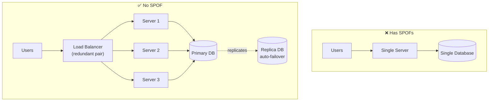

# Availability

> **NFR Deep Dive #2** — Engineering Handbook
> Language-agnostic · 8–10 min read

---

## 1. Overview

Availability is the percentage of time a system is operational and able to serve requests correctly. It is the most visible non-functional requirement — when availability drops, every user notices, and the business loses money and trust.

```
              Uptime
Availability = ─────────────────────
              Uptime + Downtime
```

> **Common confusion — Availability vs Reliability:**
> - **Availability** = is the system *up right now*? (uptime %)
> - **Reliability** = does the system produce *correct results consistently* over time?
>
> A system can be available but unreliable (it responds, but with wrong data), or reliable but unavailable (correct when up, but frequently down).

---

## 2. The "Nines" — How Availability Is Measured

Availability is expressed as a percentage, usually as a number of "nines." Each additional nine roughly multiplies cost and engineering effort by ~10×.

| Availability | Name | Downtime / Year | Downtime / Month | Downtime / Day |
|---|---|---|---|---|
| 90% | one nine | 36.5 days | 73 hours | 2.4 hours |
| 99% | two nines | 3.65 days | 7.3 hours | 14.4 min |
| 99.9% | three nines | 8.77 hours | 43.8 min | 1.44 min |
| 99.99% | four nines | 52.6 min | 4.38 min | 8.6 sec |
| 99.999% | five nines | 5.26 min | 26.3 sec | 864 ms |
| 99.9999% | six nines | 31.6 sec | 2.6 sec | 86 ms |

**Reference points (typical targets):**
- Internal tools: 99% – 99.9%
- Standard SaaS / web apps: 99.9%
- Cloud infrastructure (e.g. compute SLAs): 99.95% – 99.99%
- Payment / telecom / critical systems: 99.999%

> **Key insight:** "Five nines" sounds only slightly better than "three nines," but it is the difference between **8.7 hours** and **5 minutes** of downtime per year. Always translate nines into real time before committing.

---

## 3. SLA, SLO, SLI — The Vocabulary

These three terms are constantly confused. They form a hierarchy.

| Term | Full Name | What It Is | Example |
|---|---|---|---|
| **SLI** | Service Level *Indicator* | The actual measured metric | "Successful requests / total requests = 99.97%" |
| **SLO** | Service Level *Objective* | The internal target you aim for | "Availability ≥ 99.95% per month" |
| **SLA** | Service Level *Agreement* | The contractual promise to customers (with penalties) | "If availability < 99.9%, customer gets a 10% refund" |

```
SLI  →  what you measure
SLO  →  what you aim for      (stricter than SLA)
SLA  →  what you promise      (looser, has financial penalty)
```

> **Practice:** Set your SLO *stricter* than your SLA. If you promise 99.9% (SLA) but target 99.95% internally (SLO), you have a safety buffer before breaching the contract.

### Error Budget

An error budget is the inverse of your SLO — the amount of downtime you are *allowed* to spend.

```
Error budget = 100% − SLO

SLO = 99.9%  →  error budget = 0.1% = 43.8 min/month

If the budget is unspent → ship features faster, take more risk.
If the budget is exhausted → freeze risky changes, focus on stability.
```

This turns availability into a *shared currency* between product (wants features) and operations (wants stability).

---

## 4. Why Systems Become Unavailable

| Cause | Examples |
|---|---|
| **Hardware failure** | Disk crash, server power loss, network card failure |
| **Software bugs** | Memory leaks, deadlocks, unhandled exceptions crashing the process |
| **Dependency failure** | A downstream service or database goes down and takes you with it |
| **Traffic spikes** | Load exceeds capacity; system overwhelmed and unresponsive |
| **Network issues** | Partitions, DNS failures, routing problems |
| **Human error** | Bad config push, accidental deletion, faulty deployment |
| **Datacenter / region outage** | Power, cooling, natural disaster, fiber cut |

> Most large-scale outages are caused by **human error and bad deployments**, not hardware. This is why deployment safety (canary releases, rollback) matters as much as redundant hardware.

---

## 5. How Availability Compounds (Serial vs Parallel)

Availability of a system depends on how its components are wired.

### Components in Series (dependency chain)

If a request must pass through every component, their availabilities **multiply** — overall availability *drops*.

```
Request → A (99.9%) → B (99.9%) → C (99.9%) → Response

Total = 0.999 × 0.999 × 0.999 = 0.997 = 99.7%

Three reliable parts in series = a LESS available system.
```

> **Lesson:** Every dependency you add in the request path lowers availability. Minimize synchronous dependencies.

### Components in Parallel (redundancy)

If any one redundant copy can serve the request, their *failure* probabilities multiply — overall availability *rises*.

```
        ┌── A (99%) ──┐
Request ┤              ├→ Response   (need only ONE to work)
        └── A' (99%) ─┘

Failure = 0.01 × 0.01 = 0.0001
Total   = 1 − 0.0001 = 99.99%

Two 99% nodes in parallel = a 99.99% system.
```

> **This is the core principle of high availability: redundancy.** Two cheap, unreliable copies in parallel beat one expensive, reliable single point of failure.

---

## 6. Techniques to Achieve High Availability

| Technique | How It Helps | Trade-off |
|---|---|---|
| **Redundancy** | Multiple instances; if one dies, others serve | Cost; data must stay in sync |
| **Load balancing** | Routes around failed instances via health checks | Adds a hop; LB itself must be redundant |
| **Replication** | Copies of data on multiple nodes | Replication lag; consistency complexity |
| **Failover** | Automatic switch to standby on failure | Failover lag; risk of split-brain |
| **Multi-AZ / Multi-region** | Survives whole-datacenter outages | High cost; cross-region latency |
| **Auto-scaling** | Adds capacity before load causes failure | Scaling lag; cost spikes |
| **Health checks** | Detect and remove unhealthy nodes automatically | Must be tuned (false positives/negatives) |
| **Graceful degradation** | Serve reduced functionality instead of failing fully | Engineering effort to design fallbacks |

### Eliminating Single Points of Failure (SPOF)

A SPOF is any component whose failure brings down the whole system. The goal of HA design is to have **no SPOF**.



Every layer — load balancer, application, database — must have redundancy.

---

## 7. Resilience Patterns (Failing Gracefully)

Redundancy keeps the system up; resilience patterns keep failures from *cascading*.

| Pattern | Problem It Solves | How It Works |
|---|---|---|
| **Circuit Breaker** | A failing dependency drags you down with it | After N failures, stop calling it; return fast; periodically re-test |
| **Retry + Backoff** | Transient blips cause unnecessary failures | Retry with exponentially increasing delays + jitter |
| **Timeout** | A slow dependency exhausts all your threads | Cap how long any call may wait |
| **Bulkhead** | One slow dependency consumes all resources | Isolate resources per dependency (separate pools) |
| **Graceful degradation** | Total failure when one feature breaks | Disable the broken feature, keep core working (e.g. show cached data) |
| **Rate limiting / Load shedding** | Overload makes the whole system collapse | Reject excess requests to protect the majority |

> **Circuit breaker analogy:** Like an electrical breaker — it trips to protect the rest of the house from one faulty appliance, rather than letting it burn everything down.

---

## 8. Availability vs Consistency (the CAP trade-off)

During a network partition, a distributed system must choose between staying available and staying consistent — it cannot have both. (Full treatment in the CAP Theorem document.)

| Choice | Behaviour During Partition | Use When |
|---|---|---|
| **Choose Availability (AP)** | Keep responding, possibly with stale data | Social feeds, product catalogs, DNS — being up matters more than perfect freshness |
| **Choose Consistency (CP)** | Reject requests rather than serve wrong data | Banking, inventory, bookings — wrong data is worse than no answer |

> Higher availability often means accepting **eventual consistency**. This is a deliberate trade, not a free lunch.

---

## 9. How Large Companies Apply This

| Company | Application | Source |
|---|---|---|
| **Netflix** | Built Chaos Monkey to randomly kill instances in production, forcing engineers to design for failure | Netflix Tech Blog (public) |
| **Amazon** | Multi-AZ by default; SLAs offer service credits when breached | AWS public SLA docs |
| **Google** | Pioneered the SRE model: SLOs, error budgets, and the "embrace risk" philosophy | *Google SRE Book* (public) |
| **Cloud providers** | Region + availability-zone architecture lets customers survive datacenter loss | Public cloud documentation |

> **Inferred:** Specific internal SLO numbers are rarely public; the patterns (chaos engineering, error budgets, multi-AZ) are documented in public engineering material.

---

## 10. Best Practices

- **Translate nines into real time** before committing — know what 99.99% actually costs in downtime.
- **Set SLO stricter than SLA** to keep a safety buffer.
- **Use error budgets** to balance feature velocity against stability.
- **Eliminate every SPOF** — redundancy at every layer (LB, app, DB).
- **Add circuit breakers and timeouts** on every external call to stop cascading failures.
- **Design for graceful degradation** — partial service beats total outage.
- **Practice failure** — chaos testing and regular failover drills; an untested failover is not a failover.
- **Make deployments safe** — canary releases and instant rollback (most outages come from deploys).

---

## 11. Common Mistakes

| Mistake | Consequence | Fix |
|---|---|---|
| Promising more nines than needed | 10× cost for availability no one required | Match the target to the business need |
| Ignoring dependency availability | Your 99.99% app calls a 99% service → you are 99% | Count every dependency in the math; minimize them |
| No circuit breakers | One slow dependency cascades into total outage | Wrap external calls with breakers + timeouts |
| Untested failover | Failover fails exactly when you need it most | Run regular failover drills |
| Redundancy without anti-affinity | Both "redundant" copies on the same physical host | Spread replicas across AZs/racks |
| Confusing availability with reliability | System is "up" but serving wrong/stale data | Measure correctness, not just uptime |

---

## 12. Interview Questions

1. What is the difference between availability and reliability?
2. Convert 99.99% availability into downtime per month. *(≈ 4.4 minutes)*
3. Explain SLA, SLO, and SLI and how they relate.
4. Three services each at 99.9% sit in series. What is the combined availability? *(≈ 99.7%)*
5. How does adding redundant parallel nodes improve availability mathematically?
6. What is an error budget and how does it guide engineering decisions?
7. Why do most large outages come from deployments rather than hardware?
8. How does a circuit breaker prevent cascading failures?

---

## 13. Summary

| Concept | Key Takeaway |
|---|---|
| **Availability** | % of time the system is up. Measured in "nines." |
| **Nines** | Each nine ≈ 10× cost. Always convert to real downtime. |
| **SLA/SLO/SLI** | Promise / target / measurement. Keep SLO stricter than SLA. |
| **Error budget** | `100% − SLO`. The currency balancing features vs stability. |
| **Series** | Dependencies multiply → availability *drops*. Minimize them. |
| **Parallel** | Redundancy multiplies failure odds → availability *rises*. |
| **Resilience** | Circuit breakers, timeouts, degradation stop cascades. |
| **CAP** | Under partition, trade consistency for availability or vice versa. |

---

## 14. Cross References

**Prerequisites:** System Design Fundamentals (FR, HLD, LLD) · Latency & Throughput (NFR #1)

**Related Topics:** CAP Theorem · Replication & Consistency · Load Balancing · Disaster Recovery (RTO/RPO)

**What to Learn Next:** Scalability (NFR Deep Dive #3) · Fault Tolerance & Resilience Patterns

---

*System Design Engineering Handbook — NFR Series*