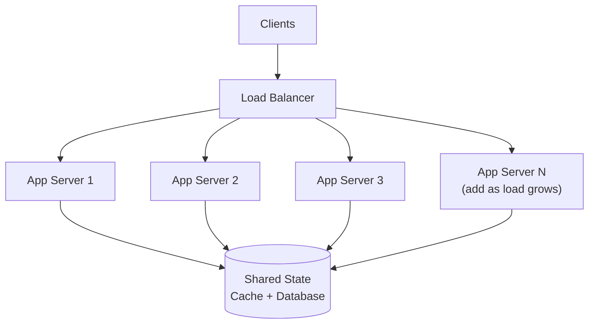

# Scalability

> **NFR Deep Dive #3** — Engineering Handbook
> Language-agnostic · 8–10 min read

---

## 1. Overview

Scalability is a system's ability to handle increased load by adding resources — without a drop in performance. A scalable system grows *gracefully*: 10× the traffic should require roughly 10× the resources, not 100×, and not a rewrite.

> **Scalability is not performance.** Performance is how fast the system is *now*. Scalability is whether it *stays* fast as load grows. A fast system that collapses at 2× load is not scalable.

---

## 2. The Two Directions of Scaling

| | Vertical Scaling (Scale Up) | Horizontal Scaling (Scale Out) |
|---|---|---|
| **Method** | Bigger machine (more CPU, RAM, disk) | More machines working together |
| **Limit** | Hard ceiling — biggest server available | Effectively unlimited |
| **Cost curve** | Exponential — top-end hardware is expensive | Linear — add commodity machines |
| **Downtime** | Often requires restart to upgrade | No downtime — add nodes live |
| **Complexity** | Simple — no code changes | Complex — needs distribution logic |
| **Failure impact** | SPOF — one big machine | Resilient — lose one of many |

```
Vertical:                    Horizontal:
  ┌─────────┐                  ┌───┐ ┌───┐ ┌───┐ ┌───┐
  │ BIG     │                  │ S │ │ S │ │ S │ │ S │
  │ SERVER  │   →  becomes     └───┘ └───┘ └───┘ └───┘
  └─────────┘                  (add more as needed)
```

> **Rule of thumb:** Start vertical (simple, cheap at small scale). Move horizontal when you approach the hardware ceiling or need high availability. Real systems use both.

---

## 3. The Prerequisite for Horizontal Scaling: Statelessness

Horizontal scaling only works if any node can handle any request. This requires **stateless** application servers.

```
❌ STATEFUL: session stored in server memory
   User logs into Server A → next request hits Server B → "who are you?"

✅ STATELESS: session stored in shared store (Redis/DB)
   Any server can handle any request → free to add/remove nodes
```

> **Principle:** Push all state out of the application tier into shared data stores (cache, database). Stateless app servers are the foundation of horizontal scaling.

---

## 4. Scaling the Stateless Tier

This is the easy part. Put a load balancer in front and add identical nodes.



The bottleneck almost always shifts to the **data tier** — which is far harder to scale (Section 5).

---

## 5. Scaling the Data Tier (the hard part)

Databases are stateful by nature, so scaling them is the central challenge of system design.

### 5.1 Read Replicas

Copy data to multiple read-only nodes. Writes go to the primary; reads spread across replicas.

```
        writes
Clients ────────→ Primary DB
                     │ replicates
        reads        ▼
Clients ────────→ Replica 1, Replica 2, Replica 3
```

- **Great for:** read-heavy workloads (most web apps are ~95% reads).
- **Trade-off:** replication lag → replicas may serve slightly stale data.

### 5.2 Sharding (Horizontal Partitioning)

Split data across multiple databases by a **shard key**. Each shard holds a subset of the data.

```
shard_key = user_id

Users A–H  → Shard 1
Users I–P  → Shard 2
Users Q–Z  → Shard 3
```

| Sharding Strategy | How | Risk |
|---|---|---|
| **Range-based** | Partition by key ranges (A–H, I–P…) | Hotspots if data is skewed |
| **Hash-based** | `hash(key) % N` decides the shard | Even spread, but resharding is painful |
| **Geographic** | Partition by region | Data residency, uneven regional load |
| **Consistent hashing** | Hash ring; adding nodes moves minimal data | More complex, but resilient to resizing |

**Sharding trade-offs:**
- Cross-shard queries and joins become expensive or impossible.
- Transactions across shards are very hard.
- Choosing a bad shard key causes **hotspots** (one shard gets most traffic).

> **Pick the shard key carefully** — it is the single most important and hardest-to-reverse decision in a sharded system.

### 5.3 Vertical Partitioning

Split a table by *columns* — hot columns separate from cold ones (e.g. user profile metadata separate from rarely-read bio/avatar blobs).

---

## 6. Caching — Scale by Avoiding Work

The cheapest request is the one you never make. Caching absorbs read load before it reaches the database.

```
Request → Cache (hit? return instantly)
              │ miss
              ▼
            Database → populate cache → return
```

A high cache hit rate can mean a small database serves enormous read traffic. (Full treatment in the Caching document.)

---

## 7. Asynchronous Processing — Scale by Decoupling

Move slow, non-urgent work off the request path into a queue. This lets the system absorb spikes — the queue buffers load instead of overwhelming downstream services.

```
Synchronous:  Request → [do everything now] → slow response, fragile under spikes

Asynchronous: Request → enqueue job → fast response
                              ↓
                        Workers process at their own pace
```

> **Benefit:** The queue acts as a shock absorber. A traffic spike fills the queue rather than crashing the workers.

---

## 8. The Limits of Scaling — Amdahl's Law

Adding machines does not help the parts of a system that *must* run serially. If 5% of work cannot be parallelized, no amount of hardware gets you past a ~20× speedup.

```
Even with infinite machines, the serial fraction caps your gains.

5% serial  → max ~20× speedup
1% serial  → max ~100× speedup
```

> **Lesson:** Find and shrink the serial bottlenecks (shared locks, a single coordinator, one hot database row). Throwing machines at a serial bottleneck wastes money.

---

## 9. How Large Companies Apply This

| Company | Application | Source |
|---|---|---|
| **Instagram** | Scaled reads with heavy caching; shards Postgres by user ID | Public engineering talks |
| **Discord** | Migrated to Cassandra for horizontal write scaling of messages | Discord Eng Blog (public) |
| **Uber** | Geo-sharding; stateless services behind load balancers | Uber Eng Blog (public) |
| **Cloud providers** | Auto-scaling groups add/remove stateless nodes by demand | Public cloud docs |

> **Inferred:** Exact shard counts and internal limits are not public; the techniques (sharding, caching, async, auto-scaling) are well documented publicly.

---

## 10. Best Practices

- **Make app servers stateless** — the prerequisite for horizontal scaling.
- **Start vertical, then go horizontal** when you near the ceiling or need HA.
- **Scale reads with replicas and caching** before sharding (sharding is a big commitment).
- **Choose the shard key deliberately** — it dictates hotspots and query patterns.
- **Push slow work into async queues** to absorb spikes.
- **Auto-scale on real signals** (CPU, queue depth, latency), with headroom for scaling lag.
- **Find and shrink serial bottlenecks** — Amdahl's Law caps the rest.
- **Load-test to find the breaking point** before users do.

---

## 11. Common Mistakes

| Mistake | Consequence | Fix |
|---|---|---|
| Storing session state in app memory | Cannot add/remove nodes freely | Externalize state to a shared store |
| Sharding too early | Massive complexity before it's needed | Exhaust replicas + caching first |
| Bad shard key | Hotspots; one shard overloaded | Pick a high-cardinality, evenly-distributed key |
| Scaling app tier but not data tier | Database becomes the bottleneck | Scale reads/writes deliberately |
| No headroom for scaling lag | Auto-scaling reacts too late; outage during spike | Scale earlier; keep buffer capacity |
| Ignoring the serial bottleneck | Adding machines yields no improvement | Identify and remove serialization points |

---

## 12. Interview Questions

1. What is the difference between vertical and horizontal scaling? When use each?
2. Why is statelessness a prerequisite for horizontal scaling?
3. Explain read replicas vs sharding. When would you reach for each?
4. What makes a good shard key? Give an example of a bad one.
5. How does asynchronous processing help a system absorb traffic spikes?
6. What does Amdahl's Law tell us about the limits of scaling?
7. Your read-heavy app is slow under load. Walk through your scaling options in order.

---

## 13. Summary

| Concept | Key Takeaway |
|---|---|
| **Scalability** | Stays performant as load grows — not the same as raw speed. |
| **Vertical** | Bigger box. Simple, but a ceiling and a SPOF. |
| **Horizontal** | More boxes. Unlimited, but needs statelessness + distribution. |
| **Statelessness** | The prerequisite for scaling out the app tier. |
| **Data tier** | The real challenge: replicas (reads) → sharding (writes). |
| **Async + cache** | Scale by avoiding and deferring work. |
| **Amdahl's Law** | The serial fraction caps your maximum speedup. |

---

## 14. Cross References

**Prerequisites:** System Design Fundamentals · Latency & Throughput (NFR #1) · Availability (NFR #2)

**Related Topics:** Caching Strategies · Load Balancing · Database Sharding · Consistent Hashing

**What to Learn Next:** Reliability (NFR #4) · Consistency (NFR #5) · Fault Tolerance (NFR #6)

---

*System Design Engineering Handbook — NFR Series*