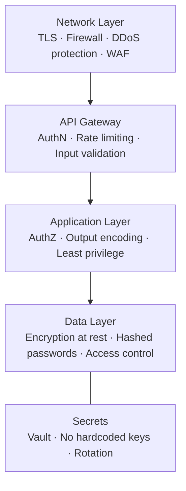

# Security

> **NFR Deep Dive #7** — Engineering Handbook
> Language-agnostic · 8–10 min read

---

## 1. Overview

Security is the protection of a system and its data against unauthorized access, modification, and destruction. Unlike most NFRs, security has an **active adversary** — attackers deliberately probe for weaknesses. A system isn't secure because nothing has gone wrong yet; it's secure because it withstands attempts to break it.

> **Core principle — Defense in Depth:** Never rely on a single safeguard. Layer multiple independent controls so that breaching one doesn't compromise the system. Assume any single layer *will* eventually fail.

---

## 2. The CIA Triad

The three foundational goals of security. Every control serves one or more.

| Goal | Meaning | Protects Against | Example Control |
|---|---|---|---|
| **Confidentiality** | Only authorized parties can read data | Data leaks, eavesdropping | Encryption, access control |
| **Integrity** | Data isn't tampered with | Unauthorized modification | Checksums, signatures, hashing |
| **Availability** | Authorized users can access when needed | DoS attacks, sabotage | Rate limiting, redundancy |

> Note: the "A" overlaps with the Availability NFR — security threats (DDoS) are one cause of unavailability.

---

## 3. Authentication vs Authorization

These two are constantly confused. They are sequential and distinct.

```
AUTHENTICATION (AuthN)        AUTHORIZATION (AuthZ)
"Who are you?"                "What are you allowed to do?"
        │                              │
   verify identity      →       check permissions
   (password, token)            (roles, policies)
```

| | Authentication | Authorization |
|---|---|---|
| **Question** | Who are you? | What can you do? |
| **Happens** | First | After authentication |
| **Mechanisms** | Passwords, MFA, tokens, biometrics | RBAC, ABAC, ACLs |
| **Failure** | 401 Unauthorized | 403 Forbidden |

### Common AuthN/AuthZ mechanisms

| Mechanism | Purpose |
|---|---|
| **Session + cookie** | Server stores session; cookie holds session ID. Stateful. |
| **JWT (token)** | Self-contained signed token; stateless; scales well |
| **OAuth 2.0** | Delegated access ("Log in with Google") without sharing passwords |
| **MFA** | Two+ factors (password + phone code) — defeats stolen passwords |
| **RBAC** | Permissions grouped by role (admin, editor, viewer) |
| **ABAC** | Permissions from attributes (department, location, time) |

---

## 4. Encryption — Protecting Data

Encryption makes data unreadable without a key. Two states must be protected:

| State | What | How |
|---|---|---|
| **In transit** | Data moving over a network | TLS/HTTPS — every connection, no exceptions |
| **At rest** | Data stored on disk/DB | AES-256 disk/DB encryption |

### Symmetric vs Asymmetric

```
SYMMETRIC: one shared key encrypts AND decrypts
  Fast. Problem: how do both sides get the key safely?

ASYMMETRIC: public key encrypts, private key decrypts
  Slower. Solves key distribution. Basis of TLS handshake.

In practice: asymmetric to exchange a symmetric key,
then symmetric for the bulk data. (This is how HTTPS works.)
```

### Hashing ≠ Encryption

```
Encryption: reversible with a key   (protect data you need to read back)
Hashing:    one-way, irreversible   (verify without storing the original)

Passwords are HASHED, never encrypted.
Use bcrypt / scrypt / Argon2 (slow + salted) — never MD5/SHA-1 alone.
```

> **Salt:** a random value added per-password before hashing, so identical passwords produce different hashes. Defeats precomputed "rainbow table" attacks.

---

## 5. Common Attacks & Defenses

The most frequently tested attacks in interviews:

| Attack | What It Does | Defense |
|---|---|---|
| **SQL Injection** | Malicious input alters a database query | Parameterized queries / prepared statements — never string-concatenate input |
| **XSS (Cross-Site Scripting)** | Inject malicious scripts into pages other users see | Escape/sanitize output; Content Security Policy |
| **CSRF** | Trick a logged-in user into an unwanted action | CSRF tokens; SameSite cookies |
| **DDoS** | Flood the system to exhaust capacity | Rate limiting, WAF, CDN, autoscaling |
| **Man-in-the-Middle** | Intercept traffic between parties | TLS everywhere; certificate validation |
| **Credential stuffing** | Reuse leaked passwords across sites | MFA, rate limiting, breach detection |
| **Privilege escalation** | Gain rights beyond what's granted | Least privilege; validate AuthZ on every action |

> **The golden rule against injection attacks: never trust user input.** Validate, sanitize, and parameterize everything that crosses a trust boundary.

---

## 6. Core Security Principles

| Principle | Meaning |
|---|---|
| **Least Privilege** | Grant the minimum access needed — nothing more |
| **Defense in Depth** | Multiple independent layers; assume each can fail |
| **Fail Secure** | On error, deny access (default-deny), don't default-open |
| **Zero Trust** | Never trust by network location; verify every request |
| **Secure by Default** | Safe configuration out of the box, not opt-in |
| **Minimize Attack Surface** | Fewer exposed endpoints/ports/features = less to attack |

---

## 7. Securing the System Layers



| Layer | Key Controls |
|---|---|
| **Network** | TLS, firewalls, DDoS protection, WAF |
| **Gateway** | Authentication, rate limiting, request validation |
| **Application** | Authorization checks, input/output sanitization, least privilege |
| **Data** | Encryption at rest, hashed+salted passwords, row-level access |
| **Secrets** | Secret managers (Vault), no credentials in code, regular rotation |

---

## 8. Compliance (briefly)

Regulations impose mandatory security/privacy requirements. Know the names:

| Regulation | Domain |
|---|---|
| **GDPR** | EU personal data privacy (data residency, right to deletion) |
| **PCI-DSS** | Payment card data handling |
| **HIPAA** | US healthcare data |
| **SOC 2** | Service-org security controls (common for SaaS) |

> Compliance is often non-negotiable — a hard constraint that shapes architecture (e.g. GDPR forcing EU data to stay in EU regions).

---

## 9. How Large Companies Apply This

| Company | Application | Source |
|---|---|---|
| **Google** | BeyondCorp — Zero Trust model; no implicit trust from network location | Google public papers |
| **Banks / Stripe** | PCI-DSS compliance; tokenization so raw card numbers are never stored | Public API docs |
| **Cloud providers** | Shared-responsibility model; secret managers; encryption by default | Public cloud docs |
| **Most major apps** | MFA, bcrypt/Argon2 password hashing, TLS everywhere | Industry standard |

> **Inferred:** Specific internal controls aren't public; the principles (Zero Trust, tokenization, least privilege) are widely documented.

---

## 10. Best Practices

- **TLS everywhere** — no unencrypted traffic, internal or external.
- **Hash passwords** with bcrypt/scrypt/Argon2 + salt — never encrypt or store plaintext.
- **Parameterize all queries** — the definitive SQL-injection defense.
- **Validate AuthZ on every action** — never assume a logged-in user is permitted.
- **Apply least privilege** to users, services, and database accounts.
- **Never hardcode secrets** — use a secret manager; rotate keys.
- **Rate-limit** auth endpoints to blunt brute-force and stuffing.
- **Layer defenses** — assume any single control will be breached.

---

## 11. Common Mistakes

| Mistake | Consequence | Fix |
|---|---|---|
| Storing plaintext passwords | Total compromise on any breach | Hash + salt (bcrypt/Argon2) |
| String-concatenating SQL | SQL injection | Parameterized queries |
| Trusting client-side validation | Bypassed trivially by attackers | Always re-validate server-side |
| AuthN without AuthZ checks | Logged-in users access others' data (IDOR) | Check permissions on every request |
| Hardcoded secrets in code/repo | Leaked keys in version control | Secret manager + rotation |
| No rate limiting on login | Brute-force / credential stuffing | Rate limit + MFA |
| Verbose error messages | Leak internal details to attackers | Generic errors externally; detail in logs |

---

## 12. Interview Questions

1. Difference between authentication and authorization?
2. How do you store passwords securely? Why hash and not encrypt?
3. What is SQL injection and how do you prevent it?
4. Explain symmetric vs asymmetric encryption and where each is used.
5. What is the principle of least privilege?
6. How does TLS protect data in transit (the handshake at a high level)?
7. What is Zero Trust and how does it differ from perimeter security?
8. How would you defend an API against DDoS?

---

## 13. Summary

| Concept | Key Takeaway |
|---|---|
| **CIA Triad** | Confidentiality, Integrity, Availability — the three goals. |
| **AuthN vs AuthZ** | Who you are vs what you can do. Sequential, distinct. |
| **Encryption** | In transit (TLS) + at rest (AES). Symmetric fast, asymmetric for key exchange. |
| **Hashing** | One-way; passwords are hashed+salted, never encrypted. |
| **Input** | Never trust it — parameterize, validate, sanitize. |
| **Principles** | Least privilege, defense in depth, fail secure, zero trust. |

---

## 14. Cross References

**Prerequisites:** System Design Fundamentals · Availability (NFR #2)

**Related Topics:** API Gateway · Rate Limiting · OAuth/JWT · TLS/PKI

**What to Learn Next:** Observability (NFR #8) · Disaster Recovery (NFR #9)

---

*System Design Engineering Handbook — NFR Series*