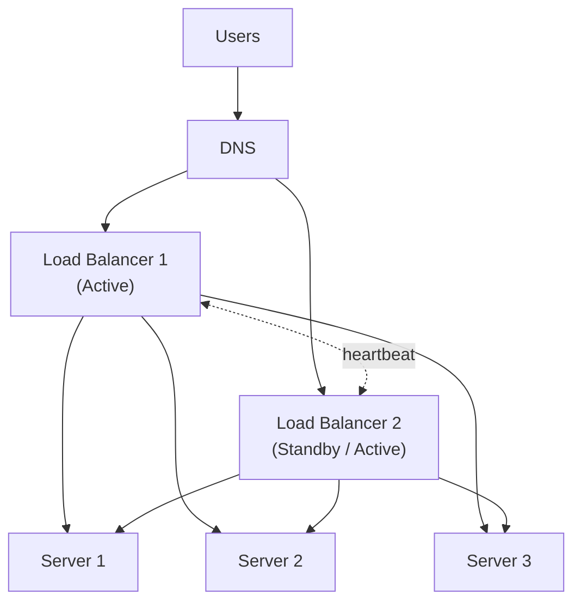

# Load Balancers

> **Building Blocks #1** — Engineering Handbook
> Language-agnostic · 8–10 min read

---

## 1. What Is a Load Balancer?

Imagine a popular restaurant with one cashier. Every customer queues at that one counter. During a lunch rush, the queue grows, people wait too long, and if that cashier gets sick — the entire restaurant stops. Now imagine the restaurant hires three cashiers and a manager who directs each new customer to the shortest queue. That manager is a **load balancer**.

A load balancer sits in front of your servers and distributes incoming requests across them. Users always talk to the load balancer — they never know or care which server actually handles their request.

```
WITHOUT load balancer:          WITH load balancer:

User → Server A                 User → Load Balancer → Server A
       (overloaded or dead               │           → Server B
        = everyone suffers)              │           → Server C
                                 (one dies, others absorb load)
```

---

## 2. Why Do We Need One?

| Problem | What Happens Without LB | How LB Fixes It |
|---|---|---|
| **Traffic spike** | One server gets overwhelmed and slows down | Requests spread across many servers |
| **Server crash** | Everyone gets an error | LB detects failure and stops sending traffic there |
| **Scaling** | Adding a new server means giving users a new address | Users always hit LB; backend grows invisibly |
| **Maintenance** | Taking a server down = downtime | Remove it from rotation silently; no user impact |

> **Core idea:** A load balancer decouples "where users connect" from "which server handles it." This single idea unlocks horizontal scaling and high availability simultaneously.

---

## 3. Layer 4 vs Layer 7 — Two Types of Load Balancers

Load balancers work at different levels of understanding of your traffic.

Think of it this way:
- **Layer 4** is like a postal worker who only reads the address on the envelope — fast, but knows nothing about the letter inside.
- **Layer 7** is like a smart receptionist who reads the letter, understands what you need, and routes you to the right department.

| | Layer 4 (Transport Layer) | Layer 7 (Application Layer) |
|---|---|---|
| **What it sees** | IP address + port only | Full HTTP request: URL, headers, cookies, body |
| **Routes based on** | Network address | URL path, content type, user identity |
| **Speed** | Faster (less work) | Slightly slower (more inspection) |
| **SSL termination** | No | Yes |
| **Smart routing** | No | Yes — `/api/*` → API servers, `/images/*` → image servers |
| **Use case** | Raw TCP, databases, gaming | Web apps, REST APIs, microservices |

> **For most system design interviews, assume Layer 7.** It's what powers modern web infrastructure and enables all the smart features below.

---

## 4. Load Balancing Algorithms

Once the LB receives a request, it must decide *which* server to send it to. Here are the main strategies:

### Round Robin
Send request 1 to Server A, request 2 to Server B, request 3 to Server C, then start again.

```
Request 1 → Server A
Request 2 → Server B
Request 3 → Server C
Request 4 → Server A  (cycle repeats)
```

Simple and fair — but assumes every request takes the same time, which is rarely true.

### Weighted Round Robin
Same as Round Robin, but powerful servers get a bigger share.

```
Server A (8 cores) → weight 3 → gets 3 out of every 5 requests
Server B (2 cores) → weight 1 → gets 1 out of every 5 requests
Server C (2 cores) → weight 1 → gets 1 out of every 5 requests
```

### Least Connections
Send each new request to whichever server currently has the fewest active connections.

```
Server A: 10 active connections
Server B: 3 active connections  ← next request goes here
Server C: 7 active connections
```

Best choice when requests take different amounts of time (e.g. some queries are instant, others take seconds).

### IP Hash
Hash the user's IP address to always send them to the same server.

```
User 192.168.1.1 → hash → always Server A
User 192.168.1.2 → hash → always Server B
```

Used when the app stores session data in server memory and the same user must always reach the same server (called **sticky sessions** — more on this below).

### Least Response Time
Track how fast each server responds and always send to the fastest one. Best for latency-sensitive systems.

| Algorithm | Best When |
|---|---|
| Round Robin | All servers identical; all requests similar cost |
| Weighted Round Robin | Servers have different capacities |
| Least Connections | Requests have variable processing time |
| IP Hash | Session state stored on servers |
| Least Response Time | Minimizing latency is the top priority |

---

## 5. Health Checks — How LB Knows a Server Is Dead

A load balancer continuously monitors each server. If one stops responding, the LB removes it from the pool automatically — no human intervention needed.

```
Every 5 seconds:
LB → "GET /health HTTP/1.1" → Server A
Server A → "200 OK"             → healthy, stays in pool
Server A → no response          → marked unhealthy, removed
Server A → recovers, 200 OK     → added back after 3 successes
```

| Health Check Type | What It Checks | Depth |
|---|---|---|
| **TCP check** | Can I open a connection? | Surface — server process is running |
| **HTTP check** | Does `/health` return 200? | Shallow — app is responding |
| **Deep check** | Does `/health` verify DB, cache, dependencies? | Deep — app is actually functional |

> **Always use deep health checks.** A server can accept TCP connections but have a broken database connection — it will accept requests and fail every single one. A deep check catches this before users do.

---

## 6. SSL Termination

HTTPS (encrypted traffic) is computationally expensive to handle. SSL termination means the load balancer decrypts the traffic and forwards plain HTTP to your backend servers.

```
User ──── HTTPS (encrypted) ──→ Load Balancer ──── HTTP (plain) ──→ Servers
                                 (decrypts here,                    (no crypto
                                  one SSL cert)                      overhead)
```

**Benefits:**
- Backend servers don't spend CPU on encryption/decryption
- Only one SSL certificate to manage (at the LB), not one per server
- LB can read and log request details for debugging

**Trade-off:** Traffic between LB and backend is unencrypted. This is acceptable only on a trusted private network (e.g. inside a VPC). For high-security systems (payments, healthcare), encrypt the internal traffic too.

---

## 7. Sticky Sessions — And Why to Avoid Them

Some applications store user session data (login state, cart contents) in the server's own memory. If the user hits a different server on the next request, that server has no record of them.

Sticky sessions force a user to always hit the same server:

```
User A → always → Server 1  (their session data lives here)
User B → always → Server 2
User C → always → Server 3
```

**The problem:** If Server 1 gets busy or dies, all of User A's sessions are lost or stuck. You also can't freely rebalance load because users are pinned.

> **Sticky sessions are a workaround, not a solution.** The real fix is to store session data in a shared external store (Redis, a database) so every server can access every user's session. Then any server can handle any request — true statelessness.

```
❌ Stateful (needs sticky sessions):
   User → Server A → session in Server A's memory

✅ Stateless (no sticky sessions needed):
   User → any Server → session fetched from Redis
```

---

## 8. The Load Balancer Must Not Be a Single Point of Failure

You added a load balancer to eliminate the single point of failure. But now the load balancer *itself* is a single point of failure. This must be addressed.



**Two approaches:**
- **Active-Passive:** LB2 monitors LB1 via heartbeat. If LB1 dies, a floating IP address moves to LB2 automatically. Users notice nothing.
- **Active-Active:** Both LBs serve traffic simultaneously. DNS distributes between them. If one dies, all traffic flows through the other.

---

## 9. Global Load Balancing

For systems that serve users worldwide, a global load balancer routes each user to the nearest healthy region.

```
User in Mumbai  → GeoDNS → Asia-Pacific region
User in London  → GeoDNS → Europe region
User in New York→ GeoDNS → US-East region

Asia-Pacific region goes down:
User in Mumbai  → GeoDNS → US-West region (next nearest healthy)
```

This is implemented with **GeoDNS** (DNS that returns different IPs based on the user's location) or **anycast** (the same IP address announced from multiple locations; the internet routes to the nearest one).

---

## 10. How Large Companies Use Load Balancers

| Company | How | Source |
|---|---|---|
| **Google** | Built Maglev — a software-based L4 LB running on commodity hardware, replacing expensive hardware LBs | Google Research (public) |
| **Netflix** | Global LB routes users to nearest region; within region, LBs distribute across hundreds of service instances | Netflix Tech Blog (public) |
| **AWS** | Offers ALB (Layer 7, for HTTP/HTTPS) and NLB (Layer 4, for raw TCP/UDP) as managed services | AWS public docs |
| **Cloudflare** | Uses anycast — the same IP is announced from 200+ locations globally; users automatically hit the nearest one | Cloudflare public docs |

> **Inferred:** Internal architecture details vary; the patterns above are publicly documented.

---

## 11. Best Practices

- **Use Layer 7 for web traffic** — content-aware routing, SSL termination, and observability are worth it.
- **Choose Least Connections** when request processing time varies significantly.
- **Use deep health checks** — verify the app is actually functional, not just alive.
- **Terminate SSL at the LB** to reduce backend load and simplify certificate management.
- **Eliminate sticky sessions** by moving session state to a shared external store.
- **Run at least two load balancers** — active-passive minimum; active-active for maximum availability.
- **Monitor LB metrics** — requests per second, error rate, backend latency, active connections per server.

---

## 12. Common Mistakes

| Mistake | Consequence | Fix |
|---|---|---|
| Single load balancer | LB is now the SPOF you added it to eliminate | Active-passive or active-active LB pair |
| Shallow health checks | Dead backends stay in rotation; users get errors | Deep health checks against real application logic |
| Relying on sticky sessions | Limits scaling; sessions lost on server failure | Externalize session state to Redis or DB |
| No timeouts configured | Slow backends hold connections open forever, exhausting LB capacity | Set connection and read timeouts explicitly |
| Forgetting LB can be a bottleneck | LB saturates under very high load | Scale LBs horizontally; use anycast at global scale |

---

## 13. Interview Questions

1. What is a load balancer and what two problems does it solve?
2. What is the difference between Layer 4 and Layer 7 load balancing? When would you use each?
3. Compare Round Robin and Least Connections. When does Round Robin fail?
4. What are sticky sessions? Why are they an anti-pattern?
5. What is SSL termination? What does it trade off?
6. How do you prevent the load balancer itself from becoming a single point of failure?
7. How would you load balance traffic across multiple geographic regions?

---

## 14. Summary

| Concept | Key Takeaway |
|---|---|
| **Purpose** | Distribute traffic across servers; eliminate single point of failure |
| **L4 vs L7** | L4 = fast, sees IP/port only. L7 = smart, sees full HTTP request |
| **Algorithms** | Round Robin (equal), Least Connections (variable), IP Hash (sticky) |
| **Health checks** | Continuously probe backends; remove unhealthy ones automatically |
| **SSL termination** | Decrypt at LB; backends stay simple |
| **Sticky sessions** | Avoid — externalize state instead |
| **LB redundancy** | Run two LBs; the LB cannot be a SPOF |

---

## 15. Cross References

**Prerequisites:** System Design Fundamentals · Availability (NFR #2) · Scalability (NFR #3)

**Related Topics:** API Gateway · Reverse Proxy · DNS · Auto-Scaling · Service Discovery

**What to Learn Next:** API Gateway (Building Blocks #2) · Reverse Proxy (Building Blocks #3)

---

*System Design Engineering Handbook — Building Blocks Series*