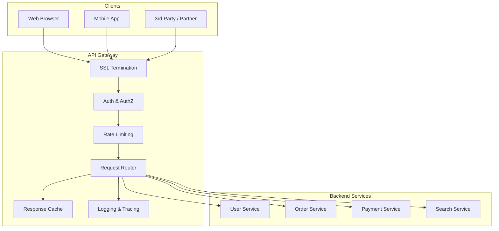

# API Gateway

> **Building Blocks #2** — Engineering Handbook
> Language-agnostic · 8–10 min read

---

## 1. What Is an API Gateway?

Imagine a large hotel. Guests don't wander into the kitchen to order food, walk into the accounts department to pay their bill, or visit the housekeeping room to request towels. They call the front desk, and the front desk coordinates everything on their behalf.

An **API Gateway** is that front desk for your backend services. It is the single entry point through which all client requests enter your system. Instead of clients talking directly to individual services, they talk to the gateway, which then figures out where to route each request.

```
WITHOUT gateway:                WITH gateway:

Mobile App → User Service       Mobile App  ─┐
Mobile App → Order Service      Web Browser ─┤→ API Gateway → User Service
Mobile App → Payment Service    3rd Party   ─┘              → Order Service
(each client knows every                                    → Payment Service
 service's address)             (clients know one address)
```

---

## 2. Why It Exists — The Problem It Solves

In a system with many backend services (microservices), clients face a serious problem: they would need to know the address of every service, handle authentication with each one separately, and manage different protocols. This creates tight coupling — every time a service moves or changes, every client must update.

The API Gateway fixes this by giving every client **one stable address** and handling everything else centrally.

| Problem Without Gateway | How Gateway Solves It |
|---|---|
| Clients must know addresses of all services | One address for everything |
| Each service implements auth separately | Auth enforced once at the gateway |
| Hard to rate-limit individual clients | Rate limiting in one place |
| Clients use different protocols | Gateway translates (REST → gRPC etc.) |
| No central place for logging/analytics | All traffic flows through one point |
| Changing a service address breaks clients | Gateway routes internally; clients unchanged |

---

## 3. What an API Gateway Does

Think of it as a pipeline. Every request passes through several stages:

```
Client Request
      │
      ▼
┌─────────────────────────────────────────────────┐
│                  API Gateway                    │
│                                                 │
│  1. SSL Termination  (decrypt HTTPS)            │
│  2. Authentication   (is this user logged in?)  │
│  3. Authorization    (are they allowed this?)   │
│  4. Rate Limiting    (too many requests?)        │
│  5. Request Routing  (which service handles it?)│
│  6. Protocol Translation (REST → gRPC?)         │
│  7. Request/Response Logging                    │
│  8. Response Caching (serve from cache?)        │
└─────────────────────────────────────────────────┘
      │
      ▼
 Backend Service
```

### Authentication and Authorization

Every request is verified before it reaches any backend service. The gateway checks the token (JWT, session cookie, API key) and rejects invalid requests immediately — backend services never see unauthenticated traffic.

### Rate Limiting

Prevent abuse by limiting how many requests a client can make in a time window.

```
Rule: max 100 requests per minute per API key

Request 1–100:  allowed
Request 101:    rejected with "429 Too Many Requests"
Next minute:    counter resets
```

### Request Routing

The gateway maps incoming URLs to the correct backend service.

```
GET  /users/123       → User Service
POST /orders          → Order Service
GET  /products/search → Search Service
POST /payments        → Payment Service
```

### Protocol Translation

Clients often speak REST (HTTP + JSON). Some internal services speak gRPC (binary protocol, faster). The gateway translates between them so clients don't need to know or care.

### Response Caching

For responses that don't change often (product catalogue, configuration), the gateway can cache and serve them directly — the backend service is never called.

---

## 4. API Gateway vs Load Balancer — What's the Difference?

This is one of the most commonly confused pairs in system design. They look similar but serve different purposes.

| | Load Balancer | API Gateway |
|---|---|---|
| **Primary job** | Distribute traffic across identical server instances | Route requests to the *correct* service |
| **Knows about** | IP addresses and ports | URL paths, headers, business logic |
| **Auth/Rate limiting** | No | Yes |
| **Protocol translation** | No | Yes |
| **Caching** | No | Yes |
| **Works at** | Server/instance level | Service/API level |
| **Analogy** | Traffic cop at a junction | Hotel front desk |

> **They are complementary, not alternatives.** In a real system, the API Gateway handles routing, auth, and rate limiting — then passes the request to a Load Balancer that distributes it across instances of the target service.

```
Client → API Gateway → Load Balancer → Service Instance A
                                     → Service Instance B
                                     → Service Instance C
```

---

## 5. Request Aggregation (Backend for Frontend)

Sometimes a single page needs data from multiple services. Without a gateway, the client makes 3 separate network calls:

```
Mobile app makes 3 calls:
  GET /users/123     → User Service     (100ms)
  GET /orders/recent → Order Service    (150ms)
  GET /notifications → Notify Service   (80ms)

Total: potentially 3 round trips, 3× the mobile network overhead
```

The gateway can **aggregate** these into one call:

```
Mobile app makes 1 call:
  GET /dashboard → API Gateway (fetches all 3 internally) → 1 response

Total: 1 round trip for the client
```

This pattern is called **Backend for Frontend (BFF)** — a gateway tailored for a specific client type (mobile, web, third-party). Each client gets the data shape it needs in one request.

---

## 6. API Gateway Architecture



---

## 7. The Downside — Gateway as Single Point of Failure

Because all traffic flows through the gateway, it must be:

- **Highly available** — run multiple instances behind a load balancer
- **Low latency** — it adds a hop to every request; this overhead must be minimal
- **Not a bottleneck** — scale horizontally as traffic grows

```
All traffic in:   Client → [LB] → [GW1 / GW2 / GW3] → Services
                             ↑             ↑
                  load balance   multiple gateway instances
```

> If the gateway goes down, the entire system becomes unreachable. This is why running it as a redundant, horizontally-scalable cluster is non-negotiable.

---

## 8. How Large Companies Use API Gateways

| Company | Application | Source |
|---|---|---|
| **Netflix** | Zuul gateway handles auth, routing, and rate limiting for thousands of microservices | Netflix Tech Blog (public) |
| **Amazon** | AWS API Gateway as a managed service; powers most AWS-hosted APIs | AWS public docs |
| **Uber** | Single gateway as the entry point for all mobile and partner API traffic | Uber Eng Blog (public) |
| **Kong / Nginx** | Open-source gateways widely used across the industry | Public documentation |

> **Inferred:** Internal implementation specifics vary; the patterns (centralized auth, rate limiting, routing) are publicly documented.

---

## 9. Best Practices

- **Run gateway instances redundantly** — behind a load balancer; never a single instance.
- **Keep the gateway thin** — it should route and enforce policy, not contain business logic.
- **Enforce auth at the gateway** — backend services should be able to trust requests that reach them.
- **Add rate limiting per API key** — protect backends from abusive or runaway clients.
- **Use circuit breakers** — if a backend service is down, fail fast at the gateway; don't let requests pile up.
- **Cache at the gateway** — serve stable responses without hitting backends.
- **Log every request** — the gateway is the ideal place for centralized audit logs and distributed trace initiation.

---

## 10. Common Mistakes

| Mistake | Consequence | Fix |
|---|---|---|
| Single gateway instance | Gateway becomes the SPOF for the entire system | Run multiple instances behind an LB |
| Business logic in the gateway | Gateway becomes hard to maintain; tight coupling | Gateway routes and enforces policy only |
| No circuit breaker | Slow service causes gateway to queue requests until it collapses | Circuit breakers per backend service |
| Skipping auth at gateway | Auth implemented inconsistently per service; gaps appear | Centralize auth enforcement at the gateway |
| No rate limiting | One rogue client floods the entire system | Rate limit per API key/IP at the gateway |

---

## 11. Interview Questions

1. What is an API Gateway and what problem does it solve in a microservices architecture?
2. What is the difference between an API Gateway and a Load Balancer?
3. Name five responsibilities an API Gateway typically handles.
4. What is request aggregation / Backend for Frontend (BFF)?
5. How do you prevent the API Gateway from becoming a single point of failure?
6. Why should business logic not live in the API Gateway?
7. What happens if the API Gateway is slow? How do you mitigate it?

---

## 12. Summary

| Concept | Key Takeaway |
|---|---|
| **Purpose** | Single entry point for all clients; hides backend complexity |
| **vs Load Balancer** | LB distributes across instances; GW routes to correct services |
| **Core functions** | Auth, rate limiting, routing, SSL, caching, logging |
| **BFF** | Aggregate multiple service calls into one client-friendly response |
| **Risk** | Single point of failure — must run redundantly |
| **Rule** | Keep it thin — policy and routing only, no business logic |

---

## 13. Cross References

**Prerequisites:** System Design Fundamentals · Load Balancers (BB #1)

**Related Topics:** Reverse Proxy · Rate Limiting · Service Discovery · Authentication (JWT/OAuth)

**What to Learn Next:** Reverse Proxy (Building Blocks #3) · Rate Limiting (Building Blocks #5)

---

*System Design Engineering Handbook — Building Blocks Series*