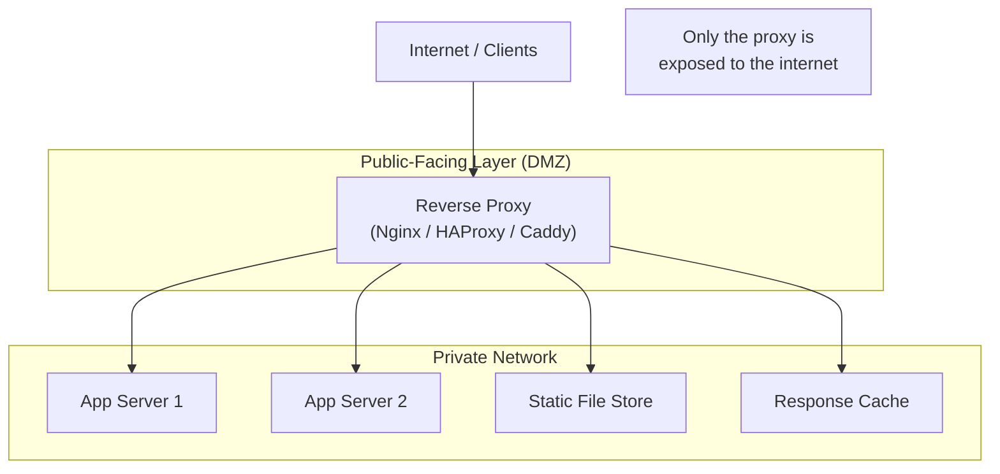

# Reverse Proxy

> **Building Blocks #3** — Engineering Handbook
> Language-agnostic · 8–10 min read

---

## 1. What Is a Reverse Proxy?

First, understand a **forward proxy**: it sits in front of *clients* and makes requests on their behalf. Companies use these to control what websites employees can access.

A **reverse proxy** is the opposite: it sits in front of *servers* and handles requests on their behalf. Clients think they're talking directly to the server — they have no idea a proxy is in between.

```
FORWARD PROXY (on behalf of clients):
Client → [Forward Proxy] → Internet → Server
(client hides behind proxy)

REVERSE PROXY (on behalf of servers):
Client → [Reverse Proxy] → Server
(server hides behind proxy)
```

> **Simple mental model:** A forward proxy protects clients. A reverse proxy protects servers.

---

## 2. Why Does It Exist?

Before reverse proxies, if you wanted to run multiple services on one machine, or protect your servers from direct internet exposure, you had very few options. Reverse proxies solve several problems at once by acting as the public face of your infrastructure while keeping real servers hidden and protected.

| Problem | How Reverse Proxy Solves It |
|---|---|
| Servers exposed directly to internet | Only the proxy is exposed; servers are on a private network |
| SSL on every server | Proxy handles SSL; servers speak plain HTTP internally |
| Static files slow to serve from app server | Proxy serves static files; app server handles only dynamic requests |
| One server can't handle all traffic | Proxy distributes load across multiple servers |
| No central place for caching | Proxy caches responses close to the client |
| DDoS hits servers directly | Proxy absorbs or filters attack traffic |

---

## 3. What a Reverse Proxy Does

### Hides Server Identity

Clients only ever see the proxy's IP address. They never know how many servers are behind it, what technology those servers use, or even that a proxy exists.

```
Client sees: api.company.com (proxy's IP)
Reality:     4 application servers on 10.0.0.1–10.0.0.4, never exposed
```

This is called **server anonymity**. It makes the backend topology invisible to the outside world — attackers cannot target individual servers directly.

### SSL Termination

Same as with load balancers — the proxy decrypts HTTPS traffic and forwards plain HTTP to backend servers, so they don't carry the encryption overhead.

### Serving Static Content

Application servers are expensive (they run your business logic). Serving a 2MB image file from them is wasteful. A reverse proxy can detect requests for static files and serve them directly from disk — the application server never gets involved.

```
GET /logo.png          → Proxy serves from disk directly       (fast)
GET /api/user/profile  → Proxy forwards to application server  (business logic)
```

### Compression

The proxy can compress responses (gzip/brotli) before sending them to clients, reducing bandwidth and improving load times — without the application server having to implement this.

### Caching

Frequently-requested responses are stored at the proxy. If 10,000 users request the same product page within a minute, the proxy serves it from cache for requests 2–10,000. The application server only handles request 1.

```
Request 1:  Proxy → Application server → response cached at proxy
Requests 2–10,000:  Proxy → serves from cache (app server not called)
```

---

## 4. Reverse Proxy vs Load Balancer vs API Gateway

These three are often confused because they can overlap. Here is the honest comparison:

| Feature | Reverse Proxy | Load Balancer | API Gateway |
|---|---|---|---|
| **Primary purpose** | Protect and represent servers | Distribute traffic evenly | Route requests to correct service |
| **SSL termination** | Yes | Yes (L7) | Yes |
| **Caching** | Yes | No | Sometimes |
| **Static file serving** | Yes | No | No |
| **Auth / Rate limiting** | No (basic) | No | Yes |
| **Compression** | Yes | No | Sometimes |
| **Knows about services** | No — single backend or pool | Identical instances | Multiple named services |
| **Common tools** | Nginx, HAProxy, Caddy | AWS NLB, HAProxy | Kong, AWS API GW, Nginx |

> **In practice, the lines blur.** Nginx can act as a reverse proxy, load balancer, and static file server simultaneously. The *concepts* are distinct even when a single tool plays multiple roles.

---

## 5. Common Reverse Proxy Architecture



The proxy lives in the DMZ (the public-facing zone). All application servers live on a private network with no direct internet access. The proxy is the only bridge between them.

---

## 6. Nginx as a Reverse Proxy — Conceptual Flow

Nginx is the most widely used reverse proxy in the industry. Understanding how it works conceptually is valuable even without knowing its syntax.

When a request arrives, Nginx evaluates rules in order:

```
Request: GET /images/photo.jpg
→ Rule 1: does path start with /images/? YES
→ Serve from local disk /var/www/static/
→ Done. Application server never involved.

Request: GET /api/users/123
→ Rule 1: does path start with /images/? NO
→ Rule 2: does path start with /api/? YES
→ Forward to application server pool
→ Application server handles and responds.
```

This simple decision tree is how Nginx handles millions of requests per second efficiently — most of the work is done without ever touching the application.

---

## 7. Canary Deployments via Reverse Proxy

A reverse proxy can route a percentage of traffic to a new version of your application, letting you test it with real users before full rollout.

```
Rule: send 5% of traffic to v2, 95% to v1

Request 1  → v1 (stable)
Request 2  → v1 (stable)
...
Request 20 → v2 (new version, being tested)
...
```

If v2 looks healthy (metrics good, no errors), increase the percentage gradually. If something breaks, route 100% back to v1 instantly. This is called a **canary deployment** — same concept introduced in the Observability NFR, now executed here at the proxy layer.

---

## 8. How Large Companies Use Reverse Proxies

| Company | Application | Source |
|---|---|---|
| **Netflix** | Uses Nginx and custom proxies to handle SSL termination and routing for API traffic | Netflix Tech Blog (public) |
| **Wikipedia** | Uses Nginx as reverse proxy to serve cached pages to millions of readers without hitting application servers | Public infrastructure talks |
| **Cloudflare** | Their entire global network is a reverse proxy at massive scale — every customer's traffic flows through it | Cloudflare public docs |
| **Most of the web** | Nginx powers ~34% of the internet's web servers, largely as a reverse proxy | Netcraft web server surveys |

> **Inferred:** Specific internal configurations are not public; usage patterns are well documented.

---

## 9. Best Practices

- **Never expose application servers directly to the internet** — always put a reverse proxy in front.
- **Serve static content at the proxy** — don't waste application server resources on files.
- **Enable compression at the proxy** — reduces bandwidth for all clients automatically.
- **Use the proxy for caching** — dramatically reduces load on application servers for cacheable content.
- **Terminate SSL at the proxy** — simplifies backend servers and centralizes certificate management.
- **Run the proxy redundantly** — it becomes a SPOF if only one instance runs.

---

## 10. Common Mistakes

| Mistake | Consequence | Fix |
|---|---|---|
| Exposing app servers to internet | Attackers can target servers directly | Route all traffic through reverse proxy |
| App server serves static files | Wastes compute on work the proxy can do faster | Configure proxy to serve static files |
| Single proxy instance | Proxy is now a SPOF | Run at least two proxy instances |
| No caching configured | Every request hits the app server | Cache stable responses at the proxy layer |
| Confusing with API Gateway | Missing auth/rate limiting that the proxy doesn't do | Use a dedicated API Gateway for those concerns |

---

## 11. Interview Questions

1. What is the difference between a forward proxy and a reverse proxy?
2. Why would you put a reverse proxy in front of your application servers?
3. What is the difference between a reverse proxy and a load balancer?
4. How can a reverse proxy improve performance without changing the application?
5. What is a canary deployment and how does a reverse proxy enable it?
6. How does a reverse proxy improve security?
7. When would you use Nginx as a reverse proxy vs an API Gateway?

---

## 12. Summary

| Concept | Key Takeaway |
|---|---|
| **What it is** | Sits in front of servers; clients never see servers directly |
| **vs Forward proxy** | Forward = hides clients. Reverse = hides servers |
| **Core functions** | SSL termination, static files, caching, compression, load distribution |
| **Security** | Servers never exposed to internet; only proxy is |
| **vs Load Balancer** | LB distributes load; RP adds caching, compression, file serving |
| **vs API Gateway** | GW adds auth and routing intelligence; RP is simpler |

---

## 13. Cross References

**Prerequisites:** System Design Fundamentals · Load Balancers (BB #1) · API Gateway (BB #2)

**Related Topics:** CDN (content caching taken to the edge) · Load Balancing · SSL/TLS

**What to Learn Next:** CDN (Building Blocks #4) · DNS (Building Blocks #6)

---

*System Design Engineering Handbook — Building Blocks Series*