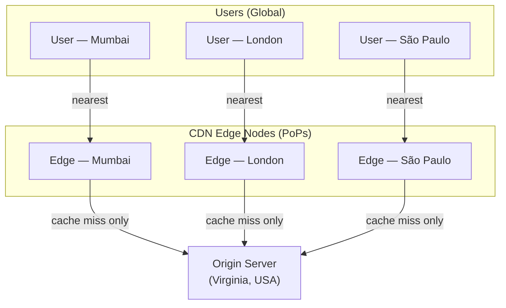

# CDN — Content Delivery Network

> **Building Blocks #4** — Engineering Handbook
> Language-agnostic · 8–10 min read

---

## 1. What Is a CDN?

Imagine your origin server sits in a data center in Virginia, USA. A user in Mumbai, India requests your website. Their request must travel from Mumbai → across the ocean → to Virginia → back across the ocean → to Mumbai. That round trip is physically constrained by the speed of light — it takes around 150–200ms just for the data to travel, regardless of how fast your server is.

A **Content Delivery Network** is a globally distributed network of servers — called **Points of Presence (PoPs)** or **edge servers** — placed in cities around the world. When a user requests content, they are served by the nearest edge server, not your distant origin.

```
WITHOUT CDN:
User in Mumbai → travels 14,000km → Origin (Virginia) → travels 14,000km → User
                 ~150ms each way

WITH CDN:
User in Mumbai → travels 30km → CDN edge (Mumbai) → User
                 ~1ms
```

The CDN stores a copy of your content. If the edge server has it → instant response. If not → it fetches from origin, caches it, and serves future requests locally.

---

## 2. Why It Exists — The Problem It Solves

| Problem | Without CDN | With CDN |
|---|---|---|
| **Geographic latency** | All users wait for data from one location | Users served from nearest location |
| **Origin server load** | Every user hits your origin server | CDN absorbs the majority of traffic |
| **Traffic spikes** | Viral content overwhelms origin | CDN handles spike at the edge |
| **Availability** | Origin goes down = everyone affected | CDN continues serving cached content |
| **Bandwidth cost** | High bandwidth bill from origin | Cheaper CDN bandwidth |

---

## 3. How a CDN Works — Step by Step

```
First request (cache MISS):
User → CDN edge (Mumbai) → "Don't have it" 
                          → fetch from Origin (Virginia)
                          → cache it at Mumbai edge
                          → serve to user

All subsequent requests (cache HIT):
User → CDN edge (Mumbai) → "Have it!" → serve instantly
                           (origin never contacted)
```

The key metric is **cache hit ratio** — the percentage of requests served from cache without touching the origin. A good CDN should achieve 80–95% cache hit ratio for typical static content.

---

## 4. What Gets Cached on a CDN?

CDNs are most effective for **static content** — files that don't change per user or per request.

| Content Type | Good for CDN? | Why |
|---|---|---|
| Images (jpg, png, svg) | ✅ Excellent | Same file for all users; rarely changes |
| CSS / JavaScript files | ✅ Excellent | Same for all users; versioned by filename |
| HTML (static pages) | ✅ Good | Same content for all visitors |
| Videos / audio | ✅ Excellent | Large files; huge latency impact |
| Fonts | ✅ Excellent | Same for all users |
| API responses (personalised) | ❌ Poor | Different per user; can't cache safely |
| User dashboards | ❌ Poor | Contains private, user-specific data |
| Real-time data (prices, stock) | ❌ Poor | Changes every second |

> **Rule of thumb:** If the response is the same for every user, it's a CDN candidate. If it differs per user or changes frequently, it's not.

---

## 5. Cache Invalidation — The Hard Problem

Content is cached at edge servers globally. What happens when your origin content changes?

```
You update your logo at origin.
But CDN edge servers in 200 cities still serve the old logo
until their cached copy expires.
```

### TTL (Time To Live)

Every cached object has a TTL — a duration after which the edge server considers it stale and fetches a fresh copy.

```
Cache-Control: max-age=86400   → cache for 24 hours
Cache-Control: max-age=3600    → cache for 1 hour
Cache-Control: no-cache        → always fetch from origin
```

**Short TTL** = content stays fresh but origin gets more traffic.
**Long TTL** = origin is protected but stale content lingers.

### Cache Busting

The cleanest solution: include a version number or hash in the filename. When content changes, the filename changes, so the CDN treats it as a brand new file.

```
logo-v1.png   → cached globally
              → you update the logo
logo-v2.png   → new filename = CDN fetches fresh copy
              → old file eventually expires from cache
```

This way you can set very long TTLs (cache for a year) without worrying about stale content — because changed content always has a new URL.

### Manual Purge

CDNs also allow you to manually invalidate specific files or patterns across all edge servers. This is used for urgent updates (fixing a broken JS file, removing inappropriate content).

---

## 6. CDN Architectures — Push vs Pull

| | Pull CDN | Push CDN |
|---|---|---|
| **How it works** | Edge fetches from origin on first cache miss | You proactively upload content to CDN |
| **Setup effort** | Low — point CDN at origin, it handles the rest | High — must push every file manually |
| **Best for** | Content with unpredictable access patterns | Large files that are always needed (videos, software downloads) |
| **Origin traffic** | First request per edge is a cache miss | No origin requests after initial push |
| **Storage** | Only caches what's actually requested | You control exactly what's stored |

> **Pull CDN is the most common choice** for web assets. Push CDN is used for content you know will be globally accessed (a new movie release, a software update).

---

## 7. CDN for Dynamic Content — Edge Computing

Modern CDNs can do more than cache static files. **Edge computing** runs lightweight logic at the CDN edge node — close to the user.

Examples:
- **A/B testing:** Decide which variant to serve without a round trip to origin
- **Authentication:** Validate a JWT token at the edge and reject bad requests before they reach origin
- **Personalisation:** Modify a response slightly based on user's country or device type
- **Bot detection:** Block malicious traffic at the edge

```
Traditional:  User → Origin (run logic here, far away)
Edge compute: User → CDN edge (run logic here, nearby) → only then origin if needed
```

This is increasingly important as systems mature — reducing origin load while improving response time.

---

## 8. CDN Architecture



---

## 9. How Large Companies Use CDNs

| Company | Application | Source |
|---|---|---|
| **Netflix** | Runs Open Connect — its own global CDN with servers placed inside ISPs. This delivers ~100% of video traffic without going through the public internet | Netflix Tech Blog (public) |
| **Cloudflare** | Provides CDN + DDoS protection + edge computing (Workers) from 300+ PoPs | Cloudflare public docs |
| **Amazon CloudFront** | AWS managed CDN; integrates with S3, EC2, API Gateway | AWS public docs |
| **Facebook/Meta** | Serves billions of images and videos via a proprietary CDN with prefetching | Public infrastructure talks |

> **Inferred:** Internal CDN topology details are not fully public; the general patterns are widely documented.

---

## 10. Best Practices

- **Serve all static assets through a CDN** — images, CSS, JS, fonts, videos.
- **Use long TTLs + cache busting** — set `max-age` to a year; change filenames when content changes.
- **Never cache private or personalised content** — user dashboards, auth tokens, private files.
- **Monitor cache hit ratio** — if it's below 70%, investigate what's causing cache misses.
- **Use a CDN as the first line of DDoS defense** — edge nodes absorb traffic that never reaches origin.
- **Enable compression at the CDN** — gzip/brotli reduces transfer size; the CDN can apply this automatically.

---

## 11. Common Mistakes

| Mistake | Consequence | Fix |
|---|---|---|
| Caching private/user-specific content | Users see each other's data | Only cache responses with no user-specific data |
| TTL too short | Origin gets too much traffic; CDN provides little benefit | Use long TTLs with cache busting for static assets |
| TTL too long without cache busting | Stale content served for hours/days after update | Use versioned filenames + long TTLs |
| No CDN for images/video | High latency for global users; high origin bandwidth costs | Route media through CDN |
| Forgetting CDN as a DDoS layer | DDoS traffic reaches origin | Let CDN absorb and filter edge traffic |

---

## 12. Interview Questions

1. What is a CDN and what problem does it fundamentally solve?
2. Walk through what happens on a cache miss and a cache hit.
3. What types of content are good CDN candidates? What types are not?
4. What is cache invalidation? What strategies exist?
5. What is cache busting and why is it preferred over short TTLs?
6. What is the difference between push and pull CDN?
7. How does a CDN improve availability, not just performance?
8. What is edge computing in the context of CDNs?

---

## 13. Summary

| Concept | Key Takeaway |
|---|---|
| **Purpose** | Serve content from servers near users; reduce latency and origin load |
| **How** | Cache content at global edge nodes; serve locally on hit; fetch from origin on miss |
| **Best for** | Static content: images, CSS, JS, video, fonts |
| **Avoid** | Private, personalised, or real-time content |
| **Cache invalidation** | TTL for expiry; cache busting (versioned filenames) for immediate change |
| **Pull vs Push** | Pull = lazy fetch on miss (common). Push = proactive upload (large known files) |
| **Bonus** | DDoS absorption, edge computing, compression |

---

## 14. Cross References

**Prerequisites:** System Design Fundamentals · Reverse Proxy (BB #3) · Latency & Throughput (NFR #1)

**Related Topics:** DNS (how users reach the CDN) · Caching Strategies · Availability (NFR #2)

**What to Learn Next:** Rate Limiting (Building Blocks #5) · DNS (Building Blocks #6)

---

*System Design Engineering Handbook — Building Blocks Series*