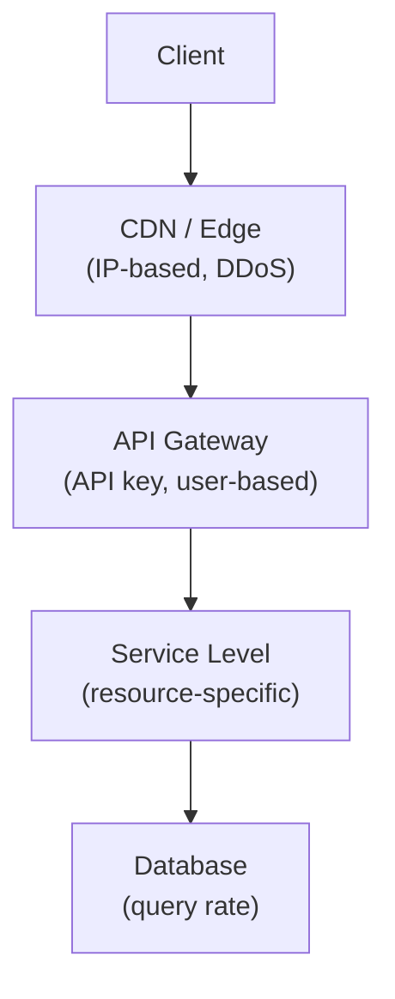

# Rate Limiting

> **Building Blocks #5** — Engineering Handbook
> Language-agnostic · 8–10 min read

---

## 1. What Is Rate Limiting?

Rate limiting controls how many requests a client can make to your system within a given time window. Once they exceed the limit, further requests are rejected until the window resets.

Think of a coffee shop that has a rule: one free refill per customer per hour. You can refill once. If you come back in 10 minutes and ask again, you wait. That rule protects the shop from one person monopolizing the coffee pot.

```
Rule: 100 requests per minute per API key

Requests 1–100:   ✅ Allowed
Request 101:      ❌ Rejected → 429 Too Many Requests
(next minute):    ✅ Counter resets → allowed again
```

---

## 2. Why It Exists

| Threat | What Happens Without Rate Limiting | How Rate Limiting Helps |
|---|---|---|
| **DDoS / Flood attack** | Millions of requests overwhelm servers | Requests capped per IP; excess dropped |
| **Brute force login** | Attacker tries millions of password combinations | After 5 failed attempts, block for 15 min |
| **Runaway client** | Bug in a client causes infinite retry loop | Client gets cut off; servers protected |
| **Resource fairness** | One heavy user consumes all capacity | Limits enforced per user/API key |
| **Cost control** | Expensive operations called without limit | Cap usage to control infrastructure cost |
| **API abuse** | Scrapers or bots drain your API | Bots hit rate limit quickly; blocked |

> **Rate limiting is fundamentally about fairness and protection.** It ensures that no single client — whether malicious or buggy — can degrade the experience for everyone else.

---

## 3. Rate Limiting Algorithms

The algorithm determines *how* you count and enforce the limit. Each makes a different trade-off.

### Fixed Window Counter
Divide time into fixed windows (every minute, every hour). Count requests in the current window. Reset at window boundary.

```
Window: 10:00:00 → 10:01:00
Limit: 100 requests per minute

10:00:01 → request #1  ✅
10:00:55 → request #100 ✅
10:00:56 → request #101 ❌ (limit hit)
10:01:00 → counter resets
10:01:01 → request #1 again ✅
```

**Problem — boundary burst:** A client can send 100 requests at 10:00:59 and 100 more at 10:01:01. That's 200 requests in 2 seconds, while the "limit" was 100 per minute.

```
10:00:59 → 100 requests (end of window 1)
10:01:01 → 100 requests (start of window 2)
→ 200 requests in 2 seconds. The fixed window missed this.
```

### Sliding Window Log
Record the exact timestamp of every request. When a new request arrives, count how many requests exist in the last N seconds/minutes.

```
New request at 10:01:30:
Look back 60 seconds → count requests from 10:00:30 to 10:01:30
If count < 100 → allow
If count ≥ 100 → reject
```

**Accurate** — no boundary burst problem. **Expensive** — must store and scan timestamps for every request.

### Sliding Window Counter
A hybrid of Fixed Window and Sliding Window Log. Uses weighted counting across the previous and current window to approximate a sliding window without storing every timestamp.

```
Current window count: 40 requests (60% through the window)
Previous window count: 80 requests
Weighted estimate: 80 × 0.4 + 40 = 72 requests in the "sliding" window
Limit: 100 → allow
```

Good balance of accuracy and storage efficiency. Used by Redis-based rate limiters.

### Token Bucket
A bucket holds tokens. Each request consumes one token. Tokens are added back at a fixed rate. If the bucket is empty, requests are rejected.

```
Bucket capacity: 10 tokens
Refill rate: 2 tokens per second

Client sends 10 requests in 1 second → bucket empties
Client waits 5 seconds → 10 tokens refilled
Client can burst again

→ Allows short bursts; sustained rate is limited by refill rate
```

**Best for:** APIs that want to allow occasional bursts but cap sustained throughput.

### Leaky Bucket
Requests go into a queue (the "bucket"). They're processed at a fixed, constant rate. If the queue is full, new requests are dropped.

```
Queue size: 10
Processing rate: 5 requests/second

Burst of 15 requests arrives:
  → 10 go into queue
  → 5 dropped immediately (queue full)
  → queue drains at 5/sec (smooth, constant output)
```

**Best for:** Smoothing out bursty traffic into a steady stream. Useful for protecting systems that can't handle variable load.

### Algorithm Comparison

| Algorithm | Burst Handling | Memory | Accuracy | Best For |
|---|---|---|---|---|
| Fixed Window | Poor (boundary burst) | Low | Low | Simple use cases |
| Sliding Window Log | None | High | High | When precision matters |
| Sliding Window Counter | Limited | Low | Medium | General use |
| Token Bucket | Yes — allows bursts | Low | High | APIs, user-facing systems |
| Leaky Bucket | Smooths bursts | Low | High | Constant-rate processing |

---

## 4. Where to Enforce Rate Limiting

Rate limiting can be applied at different layers. Each catches different threats.



| Layer | What It Limits | Why Here |
|---|---|---|
| **CDN / Edge** | Requests per IP | First line against DDoS; blocks before traffic hits infrastructure |
| **API Gateway** | Requests per API key / user | Enforces per-client business rules |
| **Service** | Requests per resource or operation | Fine-grained limits (e.g. max 5 emails per user per hour) |
| **Database** | Query rate | Protect DB from query flooding |

> **Apply rate limiting as early as possible.** A request blocked at the CDN costs almost nothing. A request that travels to your database before being rejected wastes resources all the way down.

---

## 5. Rate Limiting Headers

When a client is rate limited, good APIs communicate the state clearly via response headers:

```
HTTP/1.1 429 Too Many Requests
X-RateLimit-Limit:     100
X-RateLimit-Remaining: 0
X-RateLimit-Reset:     1693000860   (Unix timestamp when limit resets)
Retry-After:           30           (seconds to wait before retrying)
```

This allows well-behaved clients to back off gracefully instead of retrying immediately and making the problem worse.

---

## 6. Distributed Rate Limiting

On a single server, rate limiting is easy — keep a counter in memory. In a distributed system with many gateway instances, it's harder:

```
User sends requests:
  Request 1 → Gateway Instance A (counter: 1)
  Request 2 → Gateway Instance B (counter: 1 — doesn't know about A's count!)
  Request 3 → Gateway Instance C (counter: 1 — same problem)

Each instance thinks the user has only sent 1 request. The limit is bypassed.
```

**Solution: shared counter store (Redis)**

All gateway instances read and write the same counter in a central Redis instance. Redis's atomic operations ensure counters don't get corrupted under concurrent access.

```
User sends requests:
  Request 1 → Gateway A → Redis INCR user:123:count → 1 ✅
  Request 2 → Gateway B → Redis INCR user:123:count → 2 ✅
  Request 101 → Gateway C → Redis INCR user:123:count → 101 ❌ reject
```

---

## 7. Rate Limiting Strategies by Identity

You can apply limits at different granularities depending on what you want to protect.

| Identity | Example Rule | Use Case |
|---|---|---|
| **IP address** | 1,000 req/min per IP | DDoS protection, unauthenticated endpoints |
| **API key** | 10,000 req/day per key | External developer API plans |
| **User ID** | 100 posts per day per user | Social media, preventing spam |
| **Endpoint** | `/login` max 5 attempts per 15 min | Brute force protection |
| **Global** | Total system max 1M req/min | Circuit-breaker style overload protection |

---

## 8. How Large Companies Apply This

| Company | Application | Source |
|---|---|---|
| **GitHub** | Rate limits their API: 5,000 requests/hour for authenticated users, 60 for unauthenticated | GitHub public API docs |
| **Twitter/X** | Per-endpoint rate limits; developers must back off when limits are hit | Twitter public API docs |
| **Stripe** | Rate limits per API key; clear error messages with retry guidance | Stripe public docs |
| **Cloudflare** | IP-level rate limiting at the edge as a DDoS mitigation product | Cloudflare public docs |

---

## 9. Best Practices

- **Block at the edge first** — stop floods at CDN/gateway before they reach services.
- **Use Token Bucket for user-facing APIs** — allows natural bursts, caps sustained rate.
- **Use Leaky Bucket for backend pipelines** — ensures constant processing rate.
- **Use a shared store (Redis)** for distributed rate limiting.
- **Return clear headers** — `X-RateLimit-Remaining`, `Retry-After` guide clients to behave.
- **Apply limits per user, not just per IP** — sophisticated clients rotate IPs to bypass IP limits.
- **Rate limit login and sensitive endpoints aggressively** — brute force is easy without it.

---

## 10. Common Mistakes

| Mistake | Consequence | Fix |
|---|---|---|
| IP-only rate limiting | Attackers use botnets with thousands of IPs | Combine IP + user/API key limits |
| Fixed window only | Boundary burst doubles effective rate | Use Token Bucket or Sliding Window |
| Local (in-memory) counter | Bypassed by hitting different server instances | Shared counter in Redis |
| No `Retry-After` header | Clients hammer immediately after rejection; amplifies the problem | Always include retry guidance |
| No rate limiting on auth endpoints | Brute force login attacks succeed | Tight limits on `/login`, `/reset-password` |
| Limit too tight | Legitimate users get blocked; poor experience | Set limits based on real usage data |

---

## 11. Interview Questions

1. What is rate limiting and why is it important?
2. Explain the Token Bucket algorithm. What makes it suitable for user-facing APIs?
3. What is the boundary burst problem with Fixed Window counters?
4. How do you implement rate limiting in a distributed system with multiple gateway instances?
5. Where in the system should rate limiting be enforced, and why?
6. What HTTP status code does rate limiting return, and what headers should accompany it?
7. How would you rate-limit a login endpoint to prevent brute force attacks?

---

## 12. Summary

| Concept | Key Takeaway |
|---|---|
| **Purpose** | Protect systems from overload, abuse, and ensure fair usage |
| **Fixed Window** | Simple but vulnerable to boundary bursts |
| **Token Bucket** | Allows bursts; best for user-facing APIs |
| **Leaky Bucket** | Smooths bursts; best for constant-rate processing |
| **Distributed** | Use shared Redis counter across all instances |
| **Layers** | Apply at CDN → Gateway → Service; block as early as possible |
| **Communication** | Return 429 with `Retry-After` to guide clients |

---

## 13. Cross References

**Prerequisites:** System Design Fundamentals · API Gateway (BB #2) · Availability (NFR #2)

**Related Topics:** API Gateway · CDN · DDoS Protection · Security (NFR #7)

**What to Learn Next:** DNS (Building Blocks #6) · Service Discovery (Building Blocks #7)

---

*System Design Engineering Handbook — Building Blocks Series*