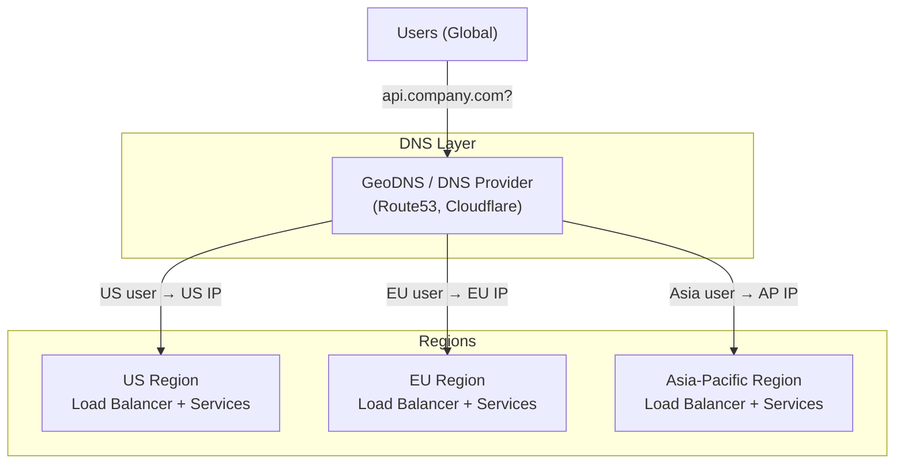

# DNS — Domain Name System

> **Building Blocks #6** — Engineering Handbook
> Language-agnostic · 8–10 min read

---

## 1. What Is DNS?

Every device on the internet is identified by an IP address — a number like `142.250.80.46`. Humans don't remember numbers well, so we use names like `google.com`. DNS is the system that translates those names into the IP addresses computers actually use to connect.

Think of DNS as the internet's phone book. You look up a name (google.com), it gives you the number (the IP address), and your device uses that number to make the actual connection.

```
You type: google.com
DNS says: 142.250.80.46
Browser connects to: 142.250.80.46
```

Without DNS, users would need to memorise IP addresses for every website — and any time a company moved their servers to a new IP, every user would instantly lose access.

---

## 2. Why DNS Matters for System Design

DNS is often treated as a solved problem — "it just works." But at scale, DNS becomes a powerful **traffic control** tool. You can use it to:

- Route users to the nearest data centre
- Distribute load across multiple servers
- Switch traffic during a deployment or outage
- Hide infrastructure changes from users entirely

> **Core insight:** Changing a DNS record changes where every user in the world connects to your system — instantly (within TTL). This makes DNS one of the highest-leverage controls in a production system.

---

## 3. How DNS Resolution Works — Step by Step

When you type `api.company.com` into a browser, a surprisingly detailed process runs:

```
Browser → "What is the IP of api.company.com?"

Step 1: Check browser cache → not found
Step 2: Check OS cache    → not found
Step 3: Ask Recursive Resolver (your ISP or 8.8.8.8)

Recursive Resolver:
  Step 4: Ask Root Nameserver → "Who handles .com?"
           Root → "Ask the .com TLD Nameserver"
  Step 5: Ask .com TLD Nameserver → "Who handles company.com?"
           TLD → "Ask ns1.company.com (Authoritative Nameserver)"
  Step 6: Ask Authoritative Nameserver → "What is api.company.com?"
           Authoritative → "142.250.80.46"

Step 7: Recursive Resolver returns 142.250.80.46 to browser
Step 8: Browser caches it for TTL duration
Step 9: Browser connects to 142.250.80.46
```

This entire process completes in **20–120ms** on a cold lookup. After that, the result is cached at multiple levels (browser, OS, resolver) for the TTL duration — subsequent lookups are near-instant.

---

## 4. DNS Record Types

DNS stores different types of records. These are the ones you'll encounter in system design:

| Record Type | Purpose | Example |
|---|---|---|
| **A** | Maps domain name to IPv4 address | `api.company.com → 142.250.80.46` |
| **AAAA** | Maps domain name to IPv6 address | `api.company.com → 2001:db8::1` |
| **CNAME** | Alias — points one name to another name | `www.company.com → company.com` |
| **MX** | Mail server for a domain | `company.com → mail.company.com` |
| **TXT** | Arbitrary text (used for verification, SPF) | Domain ownership proof |
| **NS** | Nameserver records — which server is authoritative | `company.com → ns1.company.com` |
| **SOA** | Start of Authority — metadata about the zone | Zone serial number, refresh intervals |

> **For system design, A and CNAME records are what matter most.** CNAME is particularly useful because you can change where a name ultimately resolves without touching every system that references it.

---

## 5. TTL — Time To Live

Every DNS record has a TTL — the number of seconds that resolvers and browsers may cache it.

```
api.company.com → 142.250.80.46 (TTL: 300 seconds)

→ For the next 5 minutes, any device that resolved this address
  will use the cached value WITHOUT asking DNS again.
```

**Short TTL (60s):**
- Changes propagate across the internet within ~1 minute
- More DNS queries → slightly higher cost and load
- Use for: IPs that change often, failover scenarios

**Long TTL (86400s = 24h):**
- Fewer DNS queries → lower load, cheaper
- Changes take up to 24 hours to propagate globally
- Use for: stable, rarely-changing addresses

> **Deployment tip:** Before a planned change (migration, IP change), lower your TTL to 60 seconds 24–48 hours in advance. Make the change. After it stabilizes, raise TTL back to normal.

---

## 6. DNS for Load Balancing and Traffic Control

DNS is a powerful routing tool when used deliberately.

### Round Robin DNS
Return multiple A records for the same domain. Clients use them in rotation.

```
api.company.com → [142.250.80.46, 35.186.194.8, 104.21.7.15]

Request 1 → 142.250.80.46
Request 2 → 35.186.194.8
Request 3 → 104.21.7.15
Request 4 → 142.250.80.46 (cycle repeats)
```

Simple, free load distribution — but has no health checking. If one IP is down, DNS still sends traffic to it. Not suitable for high-availability requirements alone.

### GeoDNS (Geographical DNS)
Return different IP addresses based on the geographic location of the resolver making the query.

```
Resolver in India  → api.company.com → 13.235.0.1  (Asia region)
Resolver in Germany → api.company.com → 18.185.0.1  (Europe region)
Resolver in US     → api.company.com → 3.208.0.1   (US region)
```

This is how global systems route users to their nearest data centre — no changes needed at the application layer.

### DNS Failover
Continuously health-check IP addresses. If one becomes unhealthy, remove it from DNS responses automatically.

```
Primary IP: 142.250.80.46 (healthy → returned in DNS)
Secondary IP: 35.186.194.8 (standby)

Primary goes down:
→ Health check fails
→ DNS stops returning primary IP
→ All new requests route to secondary IP
→ (Existing connections already using old IP must reconnect)
```

**Important limitation:** Users who cached the old IP before the change will keep using it until their TTL expires. This is why low TTL before a failover window matters.

---

## 7. DNS in System Architecture



DNS sits above everything else — it determines which entire region a user lands in, before any load balancer or API gateway sees the request.

---

## 8. DNS Security — Attacks and Defenses

DNS, being fundamental, is also a popular attack target.

| Attack | What It Does | Defense |
|---|---|---|
| **DNS Spoofing / Cache Poisoning** | Attacker injects false records into a resolver's cache; users redirected to malicious IP | DNSSEC (cryptographic signing of records) |
| **DNS DDoS** | Flood DNS servers with queries until they collapse | Use managed DNS providers with DDoS protection (Cloudflare, Route53) |
| **DNS Hijacking** | Attacker takes control of your domain registrar and changes NS records | MFA on registrar account; registry lock |
| **Subdomain Takeover** | Abandoned CNAME points to unclaimed cloud resource; attacker claims it | Audit and remove dangling DNS records |

> **The most important DNS security practice:** protect your domain registrar account with MFA and registry lock. If an attacker controls your registrar, they control your DNS, and therefore your entire internet presence.

---

## 9. How Large Companies Use DNS

| Company | Application | Source |
|---|---|---|
| **Amazon Route53** | Managed GeoDNS + health-check-based failover; powers millions of AWS customers | AWS public docs |
| **Cloudflare** | Authoritative DNS + DDoS protection + anycast routing | Cloudflare public docs |
| **Netflix** | GeoDNS routes users to nearest Open Connect appliance or region | Netflix Tech Blog (public) |
| **Google** | Runs 8.8.8.8 public recursive resolver; internal DNS handles millions of service endpoints | Public |

---

## 10. Best Practices

- **Set short TTLs before planned changes** — lower to 60s 24h before; raise after confirming.
- **Use GeoDNS** for multi-region systems — route users to the nearest healthy region.
- **Combine DNS failover with health checks** — don't rely on manual DNS changes during an outage.
- **Use a managed DNS provider** (Route53, Cloudflare) — not your domain registrar's basic DNS.
- **Protect your registrar account** — MFA + registry lock; it's the master key to your infrastructure.
- **Audit CNAME records** — dangling CNAMEs to decommissioned resources can be hijacked.

---

## 11. Common Mistakes

| Mistake | Consequence | Fix |
|---|---|---|
| Long TTL before infrastructure change | Old IP still used for hours after change | Lower TTL 24h before planned change |
| Round Robin DNS without health checks | Traffic routed to dead servers | Add health-check-based DNS failover |
| Weak registrar security | Attacker changes NS records → controls all DNS | MFA + registry lock on the registrar |
| Not accounting for TTL in RTO | Failover works but users keep hitting old IP | TTL is part of your RTO calculation |
| Dangling CNAME records | Subdomain takeover by attacker | Regularly audit and remove unused records |

---

## 12. Interview Questions

1. What is DNS and what problem does it solve?
2. Walk through the full DNS resolution process for a cold lookup.
3. What is TTL and what are the trade-offs of short vs long values?
4. What is GeoDNS and how does it help multi-region systems?
5. What is DNS failover and what are its limitations?
6. How does DNS TTL affect Recovery Time Objective (RTO) during a failover?
7. What is subdomain takeover and how do you prevent it?

---

## 13. Summary

| Concept | Key Takeaway |
|---|---|
| **Purpose** | Translates human-readable domain names to IP addresses |
| **Resolution** | Recursive lookup: Root → TLD → Authoritative → result cached |
| **TTL** | Cache duration. Short = fast changes. Long = fewer queries |
| **GeoDNS** | Route users to nearest region based on their location |
| **Failover** | Health-check IPs; remove unhealthy ones from DNS responses |
| **TTL + RTO** | DNS propagation delay is part of your failover time |
| **Security** | Protect the registrar; audit CNAMEs; use DNSSEC |

---

## 14. Cross References

**Prerequisites:** System Design Fundamentals · Load Balancers (BB #1)

**Related Topics:** CDN (uses DNS for edge routing) · Load Balancing · Availability (NFR #2) · GeoDNS

**What to Learn Next:** Service Discovery (Building Blocks #7) · Databases Series

---

*System Design Engineering Handbook — Building Blocks Series*