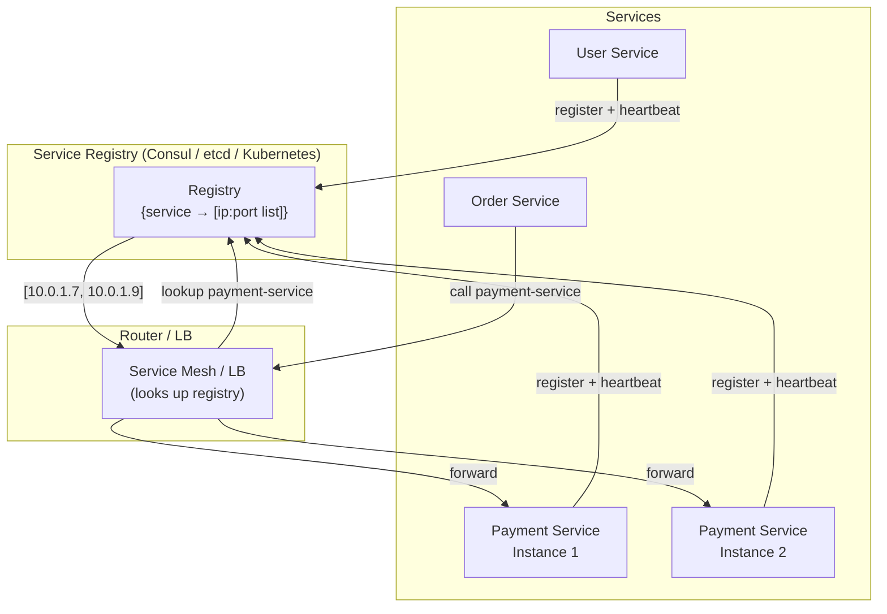

# Service Discovery

> **Building Blocks #7** — Engineering Handbook
> Language-agnostic · 8–10 min read

---

## 1. What Is Service Discovery?

In a traditional system, you have a few servers with fixed, known IP addresses. You hardcode those addresses in your config file and you're done. In a modern system with dozens of microservices, each running multiple instances that start, stop, crash, and scale dynamically — fixed addresses break down immediately.

**Service discovery** is the mechanism by which services in a distributed system automatically find and connect to each other — without hardcoded addresses.

```
TRADITIONAL (static):
Order Service config:
  payment_service_host = 10.0.1.5    ← hardcoded
  payment_service_port = 8080         ← hardcoded

Problem: Payment Service gets a new IP after a crash → connection fails → manual config update required

WITH SERVICE DISCOVERY:
Order Service asks: "Where is Payment Service right now?"
Registry answers:   "It's at 10.0.1.7:8080, 10.0.1.9:8080, and 10.0.2.3:8080"
Order Service connects to one of those.
```

---

## 2. Why This Problem Exists

Service discovery is a problem that only exists at a certain scale. Here's what creates it:

**Dynamic infrastructure:** Cloud instances are ephemeral. Containers start and stop. Auto-scaling adds and removes instances. Deployments replace old instances with new ones. The IP address of a service can change multiple times per hour.

**Microservices:** A system of 50 services, each with 3–10 instances, means hundreds of endpoints that need to know about each other. Manual management is impossible.

**Zero-downtime requirements:** When a service instance dies or a new one starts, other services must stop sending traffic to the old instance and start using the new one — automatically and immediately.

```
Without service discovery:
  New instance starts → no one knows it exists → traffic not routed to it
  Instance crashes   → others still try to call it → errors

With service discovery:
  New instance starts → registers itself → immediately receives traffic
  Instance crashes   → deregistered → traffic routes to healthy instances only
```

---

## 3. The Two Models: Client-Side vs Server-Side Discovery

### Client-Side Discovery

The service itself asks the registry for available instances, then picks one and connects directly.

```
Order Service:
  1. Ask Registry: "Where is Payment Service?"
  2. Registry returns: [10.0.1.7:8080, 10.0.1.9:8080]
  3. Order Service picks one (using round robin, least connections, etc.)
  4. Order Service connects directly

Registry → Client → Service
```

**Pros:** Simple; client controls load balancing logic.
**Cons:** Every client must implement registry lookup and load balancing. Every language/team reimplements this logic.

### Server-Side Discovery

The client makes a request to a router/load balancer. That router queries the registry and forwards the request to an appropriate instance. The client knows nothing about the registry.

```
Order Service:
  1. Call: "payment-service/charge"
  2. Router/LB asks Registry: "Where is Payment Service?"
  3. Router picks an instance and forwards the request
  4. Order Service receives response — never knew the real IP

Client → Router → Registry lookup → Service
```

**Pros:** Clients are simple; discovery logic is centralised.
**Cons:** The router is an extra hop; must be redundant.

> **Server-side discovery is more common in modern architectures** (Kubernetes uses this model). It keeps individual services simple.

---

## 4. The Service Registry

The registry is the central database that tracks which service instances are currently available and healthy.

```
Registry contents at a point in time:

Service          | Instance ID | IP          | Port | Status  | Last Heartbeat
─────────────────|─────────────|─────────────|─────|─────────|───────────────
payment-service  | i-abc123    | 10.0.1.7    | 8080 | HEALTHY | 2 seconds ago
payment-service  | i-def456    | 10.0.1.9    | 8080 | HEALTHY | 1 second ago
payment-service  | i-ghi789    | 10.0.2.3    | 8080 | UNHEALTHY| 45 sec ago
order-service    | i-jkl012    | 10.0.3.1    | 9090 | HEALTHY | 1 second ago
user-service     | i-mno345    | 10.0.4.2    | 7070 | HEALTHY | 3 seconds ago
```

Services register themselves when they start and deregister when they shut down gracefully. If they crash without deregistering, the registry detects this via missed heartbeats and marks them unhealthy.

---

## 5. Registration Patterns

### Self-Registration
Each service instance is responsible for registering itself with the registry when it starts up, sending heartbeats to stay registered, and deregistering when it shuts down.

```
Service starts:
  → POST /registry/register {name: "payment-service", ip: "10.0.1.7", port: 8080}

Every 10 seconds:
  → POST /registry/heartbeat {id: "i-abc123"}

Service shuts down:
  → POST /registry/deregister {id: "i-abc123"}
```

**Simple but fragile:** If the service crashes, it never sends the deregister call. The registry must detect this via missed heartbeats and eventually mark it unhealthy (after a delay).

### Third-Party Registration
A separate system (orchestrator like Kubernetes, or a sidecar process) monitors service instances and manages registration on their behalf.

```
Kubernetes detects new Pod started:
  → Registers it in the service registry automatically
Kubernetes detects Pod crashed:
  → Deregisters it immediately
Service code doesn't need to know about the registry at all.
```

**Cleaner:** Services don't need registry client code; registration is infrastructure's concern.

---

## 6. Health Checking in Service Discovery

The registry must only return healthy instances. There are two approaches:

| Approach | How It Works |
|---|---|
| **Heartbeat (pull)** | Registry periodically pings instances. No response = unhealthy. |
| **Self-reported (push)** | Instances send heartbeats to registry. Missed heartbeat = unhealthy. |

```
Timeline:
  Instance crashes at T=0
  Last heartbeat received at T=0
  Registry waits for next expected heartbeat at T=10 → missed
  Registry waits one more interval T=20 → missed again
  Registry marks instance UNHEALTHY at T=20
  Traffic stops routing to it

→ There is always a detection delay.
  The gap (here, 20 seconds) is when some requests may still go to the dead instance.
```

This is why services must also implement **client-side timeouts and retries** — discovery doesn't instantly know about failures.

---

## 7. DNS-Based Service Discovery

Rather than a dedicated registry, some systems use DNS itself as the service registry.

```
payment-service.internal → DNS lookup → [10.0.1.7, 10.0.1.9]
(standard DNS A records, updated dynamically as instances start/stop)
```

**Benefits:** No new infrastructure; DNS is universal; every language knows how to do DNS lookups.

**Limitations:** DNS TTL means there's a delay between an instance going down and DNS removing it from responses. Not suitable when you need very fast health propagation.

> **Kubernetes uses DNS-based discovery by default.** Every service gets a DNS name inside the cluster; the cluster's DNS server resolves it to the current healthy instances.

---

## 8. Service Discovery in a Microservices Architecture



---

## 9. Service Mesh — Discovery + More

A **service mesh** (Istio, Linkerd) takes service discovery further. A sidecar proxy runs alongside every service instance and handles all network communication automatically.

```
WITHOUT service mesh:               WITH service mesh:
Service A code:                     Service A code:
  - discovery logic                   - just call "service-b"
  - load balancing                    Sidecar handles:
  - retries                             - discovery
  - circuit breakers                    - load balancing
  - mTLS                               - retries
  - tracing                             - circuit breaking
                                        - mTLS
                                        - tracing
```

The service mesh makes the service code dramatically simpler — all network resilience patterns are handled by infrastructure, not each service individually.

---

## 10. How Large Companies Use Service Discovery

| Company | Application | Source |
|---|---|---|
| **Netflix** | Built Eureka — one of the first open-source service registries; used in their microservices | Netflix Tech Blog (public) |
| **HashiCorp Consul** | Widely adopted service registry with health checking, DNS interface, and key-value store | Public documentation |
| **Kubernetes** | Built-in service discovery via DNS + kube-proxy; foundational to the platform | Kubernetes public docs |
| **Uber** | Uses a combination of service mesh and registry for internal service routing across thousands of microservices | Uber Eng Blog (public) |

> **Inferred:** Internal implementation details vary; the patterns (registry, health checks, DNS-based discovery) are publicly documented.

---

## 11. Best Practices

- **Never hardcode service addresses** — even in "temporary" configurations.
- **Implement health checks properly** — the registry should only serve healthy instances.
- **Account for detection delay** — always use timeouts and retries on service calls; discovery is not instant.
- **Use DNS-based discovery when possible** — especially in Kubernetes environments.
- **Consider a service mesh** for mature microservices architectures — moves network concerns out of service code.
- **Make registration automatic** — use third-party/orchestrator registration so developers don't need to manage it.

---

## 12. Common Mistakes

| Mistake | Consequence | Fix |
|---|---|---|
| Hardcoded IP addresses | Breaks on any infrastructure change | Use service discovery or at minimum DNS names |
| No health checking | Dead instances stay in registry; callers get errors | Heartbeat + health check required |
| Ignoring detection delay | No retries when calling services | Always add timeout + retry around service calls |
| Single registry instance | Registry is now a SPOF | Run registry in a highly-available cluster |
| Not deregistering on shutdown | Stale entries in registry; false routing | Graceful shutdown hooks deregister the instance |

---

## 13. Interview Questions

1. What is service discovery and why is it necessary in microservices?
2. What is the difference between client-side and server-side service discovery?
3. What is a service registry? What information does it store?
4. How does health checking work in a service registry?
5. What is DNS-based service discovery and what are its trade-offs?
6. Why must services still implement timeouts and retries even with service discovery?
7. What is a service mesh and what problem does it solve beyond service discovery?

---

## 14. Summary

| Concept | Key Takeaway |
|---|---|
| **Purpose** | Automatically find and connect to service instances in dynamic environments |
| **Problem** | IPs change constantly — hardcoding breaks in cloud/container environments |
| **Client-side** | Client queries registry and picks an instance directly |
| **Server-side** | Router/LB queries registry on client's behalf — cleaner, more common |
| **Registry** | Database of healthy service instances; updated via heartbeats |
| **Health delay** | Registry doesn't know instantly when something dies — always use retries |
| **Service mesh** | Takes discovery further — handles all network resilience in the infrastructure |

---

## 15. Cross References

**Prerequisites:** System Design Fundamentals · Load Balancers (BB #1) · API Gateway (BB #2)

**Related Topics:** Load Balancing · DNS (BB #6) · Fault Tolerance (NFR #6) · Microservices

**What to Learn Next:** Databases Series — starting with Database Fundamentals

---

*System Design Engineering Handbook — Building Blocks Series*

---

> **Building Blocks series complete.**
> Covered: Load Balancers · API Gateway · Reverse Proxy · CDN · Rate Limiting · DNS · Service Discovery