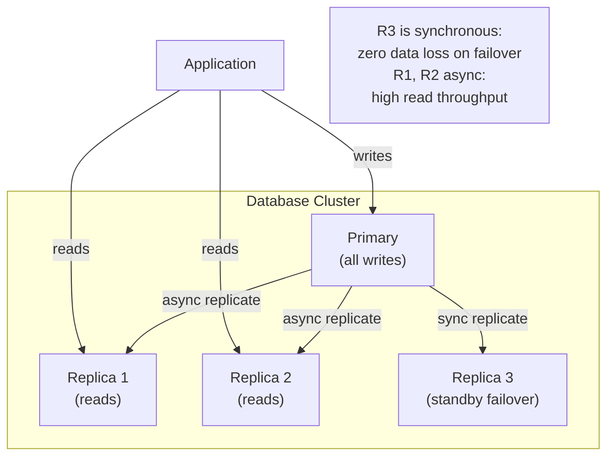

# Replication

> **Databases #5** — Engineering Handbook
> Language-agnostic · 8–10 min read

---

## 1. What Is Replication?

Replication is the process of copying data from one database node to one or more other nodes and keeping those copies in sync over time. Each copy is called a **replica**.

The two reasons you replicate are always the same:
- **Availability:** If the primary database dies, a replica takes over. No data is lost, no outage occurs.
- **Scale:** Distribute read traffic across multiple replicas so the primary isn't overwhelmed.

```
WITHOUT replication:            WITH replication:

       Reads ──→ DB             Reads  ──→ Replica 1
       Writes──→ DB             Reads  ──→ Replica 2
                                Reads  ──→ Replica 3
  (DB dies = everything gone)   Writes ──→ Primary
                                        ↓ replicates
                                        → Replica 1, 2, 3
                                (Primary dies → promote a replica)
```

---

## 2. Leader-Follower Replication (Primary-Replica)

The most common replication model. One node is the **leader (primary)** — it accepts all writes. One or more **followers (replicas)** receive copies of every write and serve read traffic.

```
Application
    │
    ├── Writes ──→ Primary  ──┐ replication
    │                         ├──→ Replica 1
    └── Reads  ──→ Replica 1  └──→ Replica 2
               ──→ Replica 2

Rules:
  All writes: primary ONLY
  Reads: any replica (or primary if fresh data needed)
```

**Failover:** When the primary dies, one replica is promoted to primary. The other replicas point to the new primary. Applications reconnect.

```
Primary dies:
  → Replica 1 promoted to new Primary
  → Replica 2 now replicates from Replica 1
  → Application connection string updated (via DNS or service discovery)
```

**Best for:** Read-heavy workloads (most web applications). Simple to reason about. Battle-tested.

---

## 3. Synchronous vs Asynchronous Replication

This is the most important trade-off in replication: how tightly do you synchronise the primary and replicas?

### Synchronous Replication

The primary waits for at least one replica to confirm it received the write before acknowledging the write to the client.

```
Client → Write → Primary
                  │
                  ├── Write to disk
                  └── Send to Replica 1 ── confirm ──→ Primary confirms to Client
```

- **Guarantee:** If primary dies immediately after, Replica 1 has the data. Zero data loss.
- **Cost:** Every write waits for a network round trip to the replica. Higher latency.
- **Risk:** If the synchronous replica is unreachable, writes block (or fail, depending on config).

### Asynchronous Replication

The primary acknowledges the write to the client immediately. Replication happens in the background.

```
Client → Write → Primary → confirms to Client immediately
                  │
                  └── (later) sends to Replica 1, 2...
```

- **Guarantee:** Fast writes. Primary never blocks on replica availability.
- **Cost:** If primary dies before replication completes, that data is lost — **replication lag**.
- **Risk:** Followers may serve stale data during the lag window.

### Semi-Synchronous

A middle ground: wait for one replica to confirm, allow others to be async. One guaranteed copy; rest are best-effort.

| | Synchronous | Asynchronous | Semi-Synchronous |
|---|---|---|---|
| **Data loss risk** | None | Yes (lag window) | Minimal (one confirmed copy) |
| **Write latency** | Higher | Lower | Medium |
| **Availability** | Lower (blocked by replica) | Higher | High |
| **Use when** | Data loss unacceptable | Performance critical | Balance of both |

---

## 4. Replication Lag

In asynchronous replication, replicas are always slightly behind the primary. This gap is **replication lag**.

```
Time:    T0         T1         T2
Primary: Write A    Write B    Write C
Replica:            Write A    Write B
                    ↑
                lag = 1 write behind

Read from replica at T1: "What is the value of A?"
→ Replica returns the value → correct (A just arrived)

Read from replica at T1: "What is the value of B?"
→ Replica returns stale value → B hasn't arrived yet
```

**Problems caused by replication lag:**

| Problem | Scenario |
|---|---|
| **Read-your-own-writes** | User posts a comment, immediately refreshes — comment missing (read hit a lagging replica) |
| **Monotonic reads** | User reads data twice — sees newer data first, then older data (hit different replicas) |
| **Stale reads** | User sees a product as in-stock; another replica shows it's sold out |

**Mitigations:**

| Problem | Fix |
|---|---|
| Read-your-own-writes | Route the user's own reads to the primary for a short window after they write |
| Monotonic reads | Stick each user to the same replica for a session |
| Stale reads | Accept them where staleness is tolerable; use primary read for critical data |

---

## 5. Multi-Leader Replication

Multiple nodes can accept writes. Each leader replicates to the others and to its own followers.

```
Data Centre A          Data Centre B
   Leader A  ←──────→  Leader B
   Replica 1           Replica 3
   Replica 2           Replica 4

Users in Europe → write to Leader A
Users in Asia   → write to Leader B
Both leaders sync with each other
```

**Advantage:** Write from any region — low latency for globally distributed users. Writes don't cross continents.

**Major challenge: Write conflicts.** If both Leader A and Leader B accept a write to the same row at the same time, both versions differ. The system must resolve this.

**Conflict resolution strategies:**

| Strategy | How | Problem |
|---|---|---|
| **Last-write-wins (LWW)** | Keep the write with the latest timestamp | Clocks drift; silently loses data |
| **First-write-wins** | Keep the first write; reject the second | May reject legitimate updates |
| **Merge** | Combine both values (works for counters, sets) | Not possible for all data types |
| **Application resolves** | Surface conflict to application/user | Correct, but complex to implement |

> **Multi-leader is powerful but complex.** Use it only when single-region write latency is a genuine business problem and you can handle conflict resolution correctly.

---

## 6. Leaderless Replication

No designated leader. Clients write to multiple nodes simultaneously. Reads also query multiple nodes and use the most recent value.

```
Write "price = £50":
  Client → Node 1 ✅
  Client → Node 2 ✅
  Client → Node 3 ❌ (unreachable)

Read "price":
  Client → Node 1 → £50
  Client → Node 2 → £50
  Client → Node 3 → £45 (stale)
  → Take majority/latest → £50
```

Uses **quorum reads and writes** (covered in the Consistency NFR document):
```
R + W > N ensures reads see the latest write
(R = read quorum, W = write quorum, N = total nodes)

Common: N=3, W=2, R=2 → 2+2 > 3 → consistent
```

**Used by:** Cassandra, DynamoDB, Riak.

**Advantage:** No single leader → no failover needed → very high availability.

**Disadvantage:** Eventual consistency by default; more complex conflict resolution.

---

## 7. Replication in System Architecture



---

## 8. How Large Companies Apply This

| Company | Application | Source |
|---|---|---|
| **GitHub** | MySQL with leader-follower; automated failover via Orchestrator tool | GitHub Eng Blog (public) |
| **Netflix** | Cassandra leaderless replication across multiple regions | Netflix Tech Blog (public) |
| **Amazon RDS** | Multi-AZ synchronous replication; automatic failover within 60 seconds | AWS public docs |
| **PostgreSQL** | Streaming replication widely used; synchronous standby for zero data loss | PostgreSQL docs (public) |

> **Inferred:** Specific internal configurations are not public; the patterns above are documented.

---

## 9. Best Practices

- **Always run at least one replica** — single database node is a SPOF and a durability risk.
- **Use synchronous replication for at least one replica** when data loss is unacceptable.
- **Monitor replication lag** — alert when it exceeds your RPO threshold.
- **Test failover regularly** — an untested failover fails when it matters most.
- **Route reads to replicas explicitly** — don't let all reads hit the primary by accident.
- **Use read-your-own-writes routing** to prevent users seeing missing own updates.

---

## 10. Common Mistakes

| Mistake | Consequence | Fix |
|---|---|---|
| All reads hitting the primary | Replicas are idle; primary is the bottleneck | Explicitly route reads to replicas |
| No monitoring of replication lag | Serving stale data without knowing it | Alert on lag > threshold |
| Untested failover | Failover takes minutes/hours instead of seconds | Regular failover drills |
| Multi-leader without conflict strategy | Silent data loss when conflicts occur | Define conflict resolution before deploying |
| Assuming replicas are always up-to-date | Application bugs from stale reads | Design application to tolerate lag; use primary reads when freshness critical |

---

## 11. Interview Questions

1. What are the two reasons to replicate a database?
2. Explain leader-follower replication. Which node accepts writes?
3. What is replication lag and what problems does it cause?
4. What is the difference between synchronous and asynchronous replication?
5. What is the read-your-own-writes problem and how do you solve it?
6. When would you use multi-leader replication? What is the key challenge?
7. How does leaderless replication use quorums to ensure consistency?

---

## 12. Summary

| Concept | Key Takeaway |
|---|---|
| **Replication** | Copy data to multiple nodes for availability and read scale |
| **Leader-follower** | One writes; many read. Simplest and most common. |
| **Sync vs Async** | Sync = no data loss, higher latency. Async = lower latency, risk of lag. |
| **Replication lag** | Replicas lag behind primary. Reads may be stale. |
| **Multi-leader** | Write to multiple regions. Powerful, but conflict resolution is hard. |
| **Leaderless** | Quorum-based. High availability. Eventual consistency. |

---

## 13. Cross References

**Prerequisites:** Database Fundamentals (DB #1) · Availability (NFR #2) · Consistency (NFR #5)

**Related Topics:** Partitioning & Sharding (DB #6) · Fault Tolerance (NFR #6) · Durability & DR (NFR #9)

**What to Learn Next:** Partitioning & Sharding (DB #6) · Transactions & Isolation (DB #7)

---

*System Design Engineering Handbook — Databases Series*