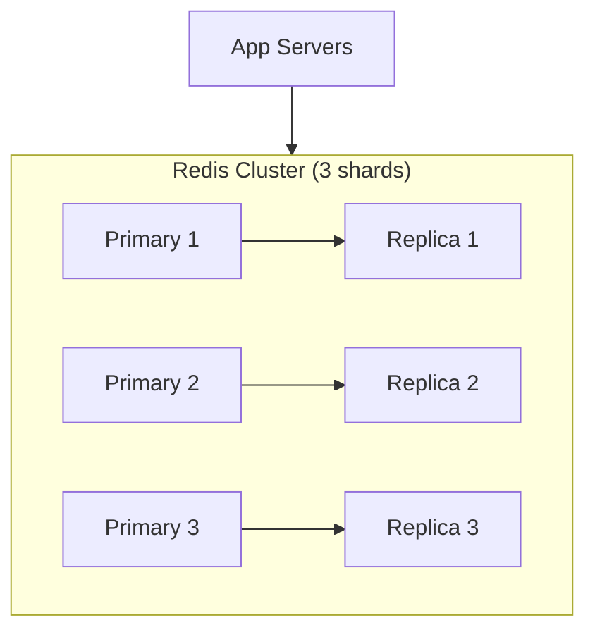

# 04 — Distributed Caching

> **04-Caching Series** — Engineering Handbook
> Language-agnostic · 8–10 min read

---

## 1. What Is Distributed Caching?

A distributed cache is a caching layer that runs as a **separate, shared service** — independent of your application servers. Every application server in your fleet talks to the same cache cluster, so they all share one consistent view of cached data.

This is in contrast to a **local (in-process) cache**, which lives inside a single application server's memory.

```
LOCAL CACHE:                        DISTRIBUTED CACHE:

App Server 1: [local cache A]       App Server 1 ──┐
App Server 2: [local cache B]       App Server 2 ──┼──→ [Redis Cluster]
App Server 3: [local cache C]       App Server 3 ──┘         ↑
                                                      all share same cache
Each server has a different,
inconsistent cache.                  One cache, consistent view.
```

The moment you run more than one application server, a local cache becomes problematic. App Server 1 might cache a user's profile. App Server 2 doesn't have it. App Server 1 invalidates it on write — App Server 2 still serves the old version. A distributed cache eliminates this class of problem entirely.

---

## 2. Redis vs Memcached — The Two Dominant Choices

Both are in-memory key-value stores used for distributed caching. The differences determine which to choose.

| | Redis | Memcached |
|---|---|---|
| **Data structures** | Strings, lists, sets, sorted sets, hashes, streams, bitmaps | Strings only |
| **Persistence** | Optional (RDB snapshots + AOF log) | None — memory only |
| **Replication** | Yes — primary/replica built in | No built-in replication |
| **Clustering** | Yes — Redis Cluster (automatic sharding) | Manual sharding at client |
| **Pub/Sub** | Yes | No |
| **Transactions** | Yes (MULTI/EXEC) | No |
| **Eviction policies** | 8 configurable policies | LRU only |
| **Memory efficiency** | Slightly higher overhead | Slightly more memory-efficient for pure strings |
| **Multi-threading** | Single-threaded command processing (I/O multi-threaded since v6) | Multi-threaded |
| **Use as** | Cache + data structure store + message broker | Pure cache only |

> **In most new systems, choose Redis.** It does everything Memcached does and more. Memcached's sole advantage is slightly better raw throughput for pure string caching at extreme scale — a niche use case.

**When Memcached still makes sense:**
- Pure string caching at extreme scale (millions of small objects, maximum throughput)
- Existing infrastructure already running Memcached at massive scale (Facebook's Memcached deployment)

---

## 3. Redis Data Structures — Why They Matter for Caching

Redis is not just a key-value store. Its native data structures let you model complex cached data without custom serialisation.

| Structure | Description | Cache Use Case |
|---|---|---|
| **String** | Plain value (text, number, JSON blob) | Cache any DB query result, session token |
| **Hash** | Map of field → value (like a row) | Cache a user object: `HGET user:123 name` |
| **List** | Ordered list of strings | Recent activity feed (push front, trim to N) |
| **Set** | Unordered unique values | "Who liked this post?" |
| **Sorted Set** | Values with scores; ranked order | Leaderboard: `ZADD scores 1500 user:456` |
| **Bitmap** | Bit array | Track which user IDs have seen a feature |
| **Stream** | Append-only log with consumer groups | Real-time event stream |

**Example — Leaderboard with Sorted Set:**
```
ZADD  game:leaderboard 9500 "Alice"
ZADD  game:leaderboard 8200 "Bob"
ZADD  game:leaderboard 11000 "Carol"

ZREVRANGE game:leaderboard 0 9 WITHSCORES
→ Returns top 10 players in score order, instantly, from cache
```

No database query needed. Redis computes the ranking natively.

---

## 4. Scaling a Distributed Cache

A single Redis node has limits: memory ceiling, CPU throughput, network bandwidth. When you outgrow one node, you scale the cache.

### Replication — Scale Reads

One primary Redis node accepts writes. One or more replicas receive copies of every write and serve reads.

```
App ──Writes──→ Primary Redis
                    │ replicates
App ──Reads──→  Replica 1
App ──Reads──→  Replica 2
```

Replication also provides high availability — if the primary fails, promote a replica.

### Sharding — Scale Memory and Writes

Partition data across multiple Redis nodes. Each node owns a subset of the key space.

```
Total cache: 3 Redis nodes

Key "user:001" → hash → Node 1
Key "user:002" → hash → Node 2
Key "user:003" → hash → Node 3
```

**Redis Cluster** (built-in) handles this automatically using **hash slots** (16,384 slots distributed across nodes). Consistent hashing ensures that adding/removing a node moves the minimum amount of data.

```
Redis Cluster architecture:

Node A: slots 0–5460
Node B: slots 5461–10922
Node C: slots 10923–16383

Each node also has one or more replicas for HA.
```

A Redis Cluster with 3 primaries + 3 replicas gives you: 3× the memory, 3× the write throughput, and high availability at every shard.

---

## 5. Cache Consistency Across Nodes

In a distributed cache, replication lag creates the same consistency challenges as database replication.

```
Write to primary Redis: user:123:name = "Alice" (was "Bob")
Replica hasn't caught up yet.

App Server 1 reads from primary → "Alice"  ✅ (fresh)
App Server 2 reads from replica → "Bob"   ❌ (stale — replication lag)
```

**Mitigations:**
- **Read from primary for critical data** — no replication lag
- **Use short TTL** — stale data self-heals within the TTL window
- **Accept it** — for non-critical data (profile photos, descriptions), milliseconds of staleness is harmless

---

## 6. Cache-Aside Pattern With Redis — The Full Flow

```
function get_user(user_id):
  key = "user:" + user_id

  // 1. Try cache
  cached = redis.GET(key)
  if cached:
    return deserialise(cached)          // cache hit — fast

  // 2. Cache miss — query DB
  user = database.query("SELECT * FROM users WHERE id = ?", user_id)

  // 3. Store in cache with TTL
  redis.SET(key, serialise(user), EX=3600)   // expires in 1 hour

  return user

function update_user(user_id, new_data):
  // 1. Write to DB (source of truth first)
  database.update("UPDATE users SET ... WHERE id = ?", user_id, new_data)

  // 2. Invalidate cache (not update — avoids race)
  redis.DEL("user:" + user_id)
```

---

## 7. Avoiding Single Points of Failure

A distributed cache that goes down takes your entire application with it — every request hits the database simultaneously.



**Design for cache failure:**
- **Run Redis in cluster mode with replicas** — if a primary fails, its replica is promoted automatically
- **Implement circuit breakers** — if Redis is down, degrade gracefully to DB reads rather than failing entirely
- **Set timeouts on cache calls** — a slow Redis node should not block your application
- **Never make the cache required for system function** — the DB is the source of truth; the cache is an optimisation

```
if redis.available():
    result = redis.GET(key)
    if result: return result

// fallback — cache unavailable or miss
return database.query(...)
```

---

## 8. Cache Key Design

Good cache key design prevents bugs and enables efficient management.

```
BAD:  "user"                   (too vague; collides across users)
BAD:  "1234"                   (no context; unclear what 1234 refers to)
GOOD: "user:1234"              (entity type + ID)
GOOD: "user:1234:profile"      (entity + ID + data type)
GOOD: "product:456:v3"         (entity + ID + version for versioned caching)
GOOD: "org:99:user:1234"       (multi-tenant: org first for easy bulk invalidation)
```

**Key namespacing:** Use a consistent separator (`:` is conventional for Redis). This enables bulk operations:
```
DEL user:1234:*   → delete all cache entries for user 1234
```

**Avoid embedding changeable data in keys.** If a user's role changes, a key like `admin:user:1234` becomes misleading.

---

## 9. How Large Companies Use Distributed Caching

| Company | Tool | Scale | Source |
|---|---|---|---|
| **Twitter/X** | Redis | Pre-computed timelines cached per user; hundreds of millions of keys | Public talks |
| **GitHub** | Redis | Session storage, rate limiting counters, job queues | GitHub Eng Blog (public) |
| **Facebook** | Memcached | World's largest Memcached deployment; billions of objects | Facebook Eng Blog (public) |
| **Stack Overflow** | Redis | All caching; serves millions of daily requests with minimal DB load | Stack Overflow Blog (public) |

---

## 10. Best Practices

- **Use Redis for new systems** — richer data structures, built-in replication, cluster mode.
- **Run Redis Cluster with at least one replica per shard** — eliminates the cache as a SPOF.
- **Design cache keys with a consistent naming convention** — `entity:id:type`.
- **Always set a TTL** — even in distributed caches; prevents stale data and memory leaks.
- **Implement fallback to database** — cache unavailability should degrade performance, not cause failures.
- **Set timeouts on Redis calls** — a slow cache node must not block application threads.
- **Monitor hit ratio, eviction rate, and memory usage** — these are your cache health signals.

---

## 11. Common Mistakes

| Mistake | Consequence | Fix |
|---|---|---|
| Single Redis node (no replication) | Cache failure = application failure | Redis Cluster with replicas |
| No timeout on Redis calls | Slow Redis blocks all app threads | Set connection and read timeouts |
| No fallback to DB | Cache failure causes full outage | Always fall back to DB on cache error |
| Poor key naming | Collisions; inability to bulk-invalidate | Consistent `entity:id:type` convention |
| Caching without TTL | Memory grows unbounded; stale data permanent | Always set TTL |
| Using local cache in multi-server deployment | Inconsistent cache across servers; stale reads | Use distributed cache (Redis) |

---

## 12. Interview Questions

1. What is the difference between a local cache and a distributed cache?
2. When would you choose Redis over Memcached?
3. How does Redis Cluster shard data across multiple nodes?
4. What happens if your Redis cluster goes down? How do you design for this?
5. How do you design cache keys to avoid collisions in a multi-tenant system?
6. What replication lag problem exists in distributed caches and how do you mitigate it?
7. Name three Redis data structures and give a caching use case for each.

---

## 13. Summary

| Concept | Key Takeaway |
|---|---|
| **Distributed cache** | Shared cache service across all app servers. One consistent view. |
| **Redis vs Memcached** | Redis wins for new systems — richer, replication, cluster, persistence. |
| **Replication** | Scale reads + HA. Primary writes; replicas serve reads. |
| **Redis Cluster** | Built-in sharding via hash slots. Scale memory and writes. |
| **Key design** | `entity:id:type`. Consistent naming enables bulk operations. |
| **Failure design** | Cache is an optimisation. DB is the source of truth. Always fall back. |

---

## 14. Cross References

**Prerequisites:** 01-caching-fundamentals.md · 02-caching-strategies.md · 03-eviction-policies.md

**Related Topics:** Replication (DB #5) · Scalability (NFR #3) · Fault Tolerance (NFR #6)

**What to Learn Next:** 05-cache-invalidation.md

---

*System Design Engineering Handbook — 04-Caching Series*