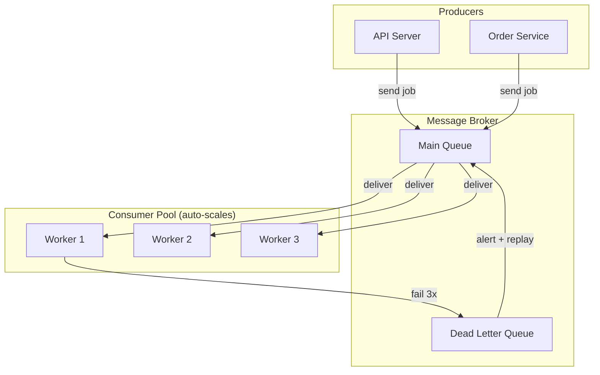

# 02 — Message Queues

> **05-Messaging Series** — Engineering Handbook
> Language-agnostic · 8–10 min read

---

## 1. What Is a Message Queue?

A message queue is a broker component that holds messages in order until a consumer is ready to process them. Think of it like a physical queue at a ticket counter: people join the back, and the clerk at the front serves them one by one. The queue absorbs the crowd — the clerk doesn't need to match the arrival rate of people.

```
Producers                Queue                  Consumers
                    ┌──────────────┐
Order Service  ──→  │ M1 M2 M3 M4 │  ──→  Worker A (processes M1)
Payment Service──→  │ M5 M6       │  ──→  Worker B (processes M2)
               ──→  └──────────────┘  ──→  Worker C (processes M3)

Messages wait in order. Workers take the next available message.
```

The defining characteristic of a queue: **each message is processed by exactly one consumer** and then removed. Once a message is handled, it's gone.

---

## 2. How Message Queues Work — Step by Step

```
1. Producer creates a message and sends it to the queue
2. Broker persists the message (to disk or memory)
3. Broker acknowledges receipt to the producer
4. Consumer polls the queue or receives a push delivery
5. Broker marks message as "in-flight" (invisible to other consumers)
6. Consumer processes the message
7. Consumer sends an ACK (acknowledgement) to the broker
8. Broker permanently deletes the message

FAILURE PATH (step 6 fails):
   Consumer crashes or fails to ACK within the visibility timeout
   → Broker makes message visible again
   → Another consumer picks it up
   → After N failures → message moves to Dead Letter Queue
```

**Visibility timeout** is the window the consumer has to process and ACK before the broker assumes it failed and requeues the message. Setting this correctly is critical:

```
Too short: Consumer is still processing → broker requeues → duplicate processing
Too long:  Consumer crashes → message stuck "in-flight" → long delay before retry
Rule:      Set to 2–3× the expected processing time with a buffer
```

---

## 3. Point-to-Point vs Publish-Subscribe

Queues operate in two delivery modes.

### Point-to-Point (P2P)

One producer, one consumer. Each message has one recipient. Like sending a direct message.

```
Producer → [Queue] → Consumer
                     (one-to-one)
```

**Use for:** Task assignment, RPC-over-queue, direct work delegation.

### Competing Consumers (Work Queue)

Multiple consumers read from the same queue. Each message goes to exactly one of them — whoever is free next. Like a pool of workers pulling from a shared task board.

```
Producer ──→ [Queue: T1 T2 T3 T4 T5]
                  ↓      ↓      ↓
             Worker A  Worker B  Worker C
             (gets T1) (gets T2) (gets T3)
```

This is the most common message queue pattern for scaling processing:
- Add more workers → more throughput
- Workers scale independently of producers
- No worker is overloaded — each pulls the next message when free

> **Competing consumers is the primary scaling mechanism for queue-based systems.** If processing is too slow → add workers. If processing is too fast → remove workers. Elastic, simple.

---

## 4. Dead Letter Queue (DLQ)

A Dead Letter Queue is a separate queue where messages are sent after they repeatedly fail to be processed successfully.

```
Normal queue: [M1, M2, M3]
              Consumer tries M1 → fails → retry
              Consumer tries M1 → fails → retry
              Consumer tries M1 → fails (3rd time)
              → M1 moves to Dead Letter Queue

Dead Letter Queue: [M1]
              → Engineers inspect, debug, fix, replay manually
```

**Without a DLQ:** A repeatedly-failing message either:
- Blocks the queue (starves all other messages), or
- Is silently dropped (data loss)

**With a DLQ:** The failure is captured safely, the main queue continues, and engineers can investigate at their own pace.

**DLQ best practices:**
- Alert on DLQ depth — any message in the DLQ is a failure worth knowing about
- Include original message + error reason + retry count in the DLQ entry
- Build a replay mechanism — once fixed, replay DLQ messages back to the main queue
- Set a TTL on the DLQ too — DLQ messages shouldn't accumulate forever

---

## 5. Queue Durability

A queue can be configured for different durability levels depending on what happens if the broker restarts.

| Durability | How | Survives Restart? | Performance |
|---|---|---|---|
| **In-memory** | Messages stored in RAM only | No — messages lost on restart | Fastest |
| **Durable (disk)** | Messages persisted to disk before ACK | Yes | Slower (disk I/O) |
| **Replicated** | Messages copied to multiple broker nodes | Yes, even on node failure | Slowest |

> **For any production use case where message loss is unacceptable, use durable + replicated queues.** The performance cost is almost always worth the durability guarantee.

---

## 6. Queue Ordering

Queues generally guarantee **FIFO (First In, First Out)** ordering — messages are delivered in the order they were sent. But at scale, this breaks down:

**With competing consumers:** Two workers process messages concurrently. Worker A is processing M1 (a slow operation). Worker B finishes M2 first. M2 is "done" before M1 even though M1 was queued first.

**With retries:** M1 fails and is retried. M2 is processed. M1 eventually succeeds. Result: M2 done before M1.

**If ordering matters (e.g. events for a specific user must be processed in order):**

```
Solution: Route all messages for the same entity to the same consumer

Message key = user_id
All messages for user_123 → Consumer A (always)
All messages for user_456 → Consumer B (always)
→ Order preserved per user
```

This is called **partitioned ordering** — strict order within a partition key, no order guarantee across different keys. This is exactly how Kafka handles ordering.

---

## 7. Common Queue Patterns

### Task Queue / Worker Queue

Distribute background jobs across a pool of workers.

```
Use case: Image resize on upload
User uploads → "resize image:abc.jpg" → [Queue] → Worker pool
Workers pick tasks and process at their own rate
Users don't wait — upload returns immediately
```

### Request-Reply over Queue

Simulate synchronous request/response through async messaging.

```
Caller sends request to queue with a correlation_id and reply_to queue
Processor receives, handles, sends response to reply_to queue
Caller listens on its reply queue for the matching correlation_id
```

Useful when two services need to communicate but can't make direct HTTP calls (different networks, different lifecycles).

### Priority Queue

Higher-priority messages are processed before lower-priority ones regardless of arrival order.

```
Queue: [LOW-M1, HIGH-M2, LOW-M3, CRITICAL-M4]
Consumer processes: CRITICAL-M4 → HIGH-M2 → LOW-M1 → LOW-M3
```

Used for: urgent notification delivery, SLA-differentiated processing.

---

## 8. Popular Message Queue Tools

| Tool | Model | Delivery | Durability | Best For |
|---|---|---|---|---|
| **RabbitMQ** | Queue + pub/sub hybrid | At-least-once, at-most-once | Durable (disk) | Complex routing, low-latency tasks |
| **Amazon SQS** | Managed queue | At-least-once | Fully managed, replicated | AWS-native; simple decoupling |
| **Amazon SQS FIFO** | Managed queue | Exactly-once | Fully managed | When strict ordering AND deduplication needed |
| **ActiveMQ** | Queue + pub/sub | At-least-once | Durable | Enterprise JMS applications |

> **In system design interviews:** If asked which queue to use, SQS for AWS-native systems, RabbitMQ for self-hosted complex routing. The reasoning matters more than the specific tool.

---

## 9. Architecture — Queue in a Real System



---

## 10. How Large Companies Use Message Queues

| Company | Tool | Use Case | Source |
|---|---|---|---|
| **Amazon** | SQS | Decouples microservices across AWS; billions of messages per day | AWS public docs |
| **Slack** | RabbitMQ (historically) | Notification delivery, asynchronous job processing | Slack Eng Blog (public) |
| **Robinhood** | RabbitMQ | Order processing queue; reliable delivery for financial operations | Public talks |
| **Dropbox** | Celery + RabbitMQ | Background job processing (file sync, thumbnail generation) | Dropbox Eng Blog (public) |

---

## 11. Best Practices

- **Always configure a DLQ** — no queue should exist without one.
- **Make consumers idempotent** — duplicate delivery is inevitable with at-least-once.
- **Set visibility timeout to 2–3× expected processing time.**
- **Monitor queue depth** — a growing queue signals consumer scaling is needed.
- **Keep messages small** — store large payloads in object storage; message carries a reference.
- **Set message TTL** — stale messages that are too old to be useful should be discarded.
- **Alert on DLQ** — any message in the DLQ is an operational event worth knowing about immediately.

---

## 12. Common Mistakes

| Mistake | Consequence | Fix |
|---|---|---|
| No DLQ configured | Failing messages loop forever or are silently dropped | Always configure DLQ |
| Non-idempotent consumer | Duplicate delivery causes duplicate side effects | Design consumers to handle duplicates |
| Visibility timeout too short | Messages redelivered while still being processed → duplicates | Set timeout to 2–3× processing time |
| Large payloads in messages | Broker memory exhaustion; slow network transfer | Store in S3; send reference URL |
| No queue depth monitoring | Backlog builds silently until broker or consumer crashes | Alert on queue depth exceeding threshold |
| Expecting strict global ordering | With competing consumers, global order is not guaranteed | Use partitioned ordering (route by entity key) |

---

## 13. Interview Questions

1. What is a message queue and what is its defining characteristic?
2. What is the competing consumers pattern and how does it enable scaling?
3. What is a Dead Letter Queue? Why is it mandatory?
4. What is a visibility timeout and what happens if it's set too short vs too long?
5. How do you maintain ordering when using competing consumers?
6. What is the difference between a durable and an in-memory queue?
7. How would you use a task queue to process image thumbnails asynchronously?

---

## 14. Summary

| Concept | Key Takeaway |
|---|---|
| **Queue** | Each message → one consumer → deleted after ACK |
| **Competing consumers** | Many workers, one queue. Auto-scales processing. |
| **DLQ** | Catches failed messages. Mandatory. Always configure. |
| **Visibility timeout** | Processing window. Set 2–3× expected duration. |
| **Ordering** | FIFO per queue, but concurrent consumers break global order. Route by key for per-entity ordering. |
| **Durability** | Disk + replication for production. Never in-memory only. |

---

## 15. Cross References

**Prerequisites:** 01-messaging-fundamentals.md

**Related Topics:** 03-event-streaming.md · 05-kafka-vs-rabbitmq.md · Fault Tolerance (NFR #6)

**What to Learn Next:** 03-event-streaming.md

---

*System Design Engineering Handbook — 05-Messaging Series*