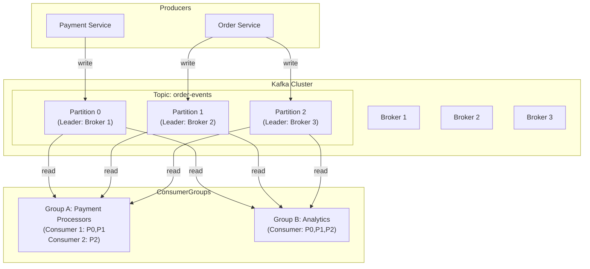

# 03 — Event Streaming

> **05-Messaging Series** — Engineering Handbook
> Language-agnostic · 8–10 min read

---

## 1. What Is Event Streaming?

Event streaming treats data as a continuous, ordered sequence of events — a log. Unlike a queue where messages are consumed and deleted, a stream **retains events** and allows multiple independent consumers to read from any point in the log.

Think of it like a river. A queue is a bucket that you empty; a stream is the river itself. The river keeps flowing regardless of how many people dip their cup in, and you can always walk upstream to see what happened earlier.

```
QUEUE model:
Producer → [M1, M2, M3] → Consumer A picks M1 → M1 deleted
                         → Consumer B picks M2 → M2 deleted

STREAM model:
Producer → [M1, M2, M3, M4, M5...]   (log grows; messages retained)
                    ↑           ↑
             Consumer A     Consumer B
             (at position 2) (at position 4)
             (independent;   (independent;
              re-reads M2)    re-reads M4)
```

---

## 2. Apache Kafka — The Reference Implementation

Kafka is the most widely adopted event streaming platform. Built at LinkedIn in 2011 and open-sourced, it now powers the data infrastructure of some of the largest companies in the world. Understanding Kafka's architecture is understanding event streaming.

### Core Concepts

**Topic:** A named, ordered, immutable log of events. Producers write to topics; consumers read from them. A topic is the unit of organisation in Kafka.

```
Topic: "order-events"
[order:1001:created, order:1002:created, order:1001:paid, order:1003:created, ...]
```

**Partition:** A topic is split into multiple partitions. Each partition is an independent, ordered log. Partitions are how Kafka achieves parallelism — multiple producers can write to different partitions, and multiple consumers can read from different partitions simultaneously.

```
Topic: "order-events" (3 partitions)
Partition 0: [M1, M4, M7, M10...]
Partition 1: [M2, M5, M8, M11...]
Partition 2: [M3, M6, M9, M12...]
```

**Offset:** The position of a message within a partition. Every message in a partition has a unique, monotonically increasing offset. Consumers track their position by storing the offset of the last message they processed.

```
Partition 0: offset 0   offset 1   offset 2   offset 3
             [M1]       [M4]       [M7]       [M10]
                                    ↑
                           Consumer A is at offset 2
                           (has processed M1, M4; next will read M7)
```

**Broker:** A Kafka server that stores partitions and serves producers and consumers. A Kafka cluster runs multiple brokers for fault tolerance and scale.

**Replication:** Each partition has a **leader** broker (handles reads/writes) and one or more **follower** replicas (copies for fault tolerance). If the leader fails, a follower is promoted automatically.

---

## 3. Consumer Groups — Scaling Consumption

A **consumer group** is a set of consumers that collectively consume all partitions of a topic. Each partition is assigned to exactly one consumer in the group.

```
Topic: "order-events" (4 partitions)
Consumer Group: "payment-processors" (2 consumers)

Consumer 1: reads Partitions 0, 1
Consumer 2: reads Partitions 2, 3
```

**Why this matters:**

To increase throughput: add more consumers to the group (up to the number of partitions). Each consumer handles a subset of partitions.

```
2 consumers: each handles 2 partitions
4 consumers: each handles 1 partition  → maximum parallelism
8 consumers: 4 sit idle (can't exceed partition count)
```

**Different consumer groups are fully independent.** Two groups reading the same topic don't affect each other — each group maintains its own offset. This means the same events can power completely independent pipelines.

```
Topic: "order-events"
  → Consumer Group A: "payment-service" (charges the card)
  → Consumer Group B: "analytics-service" (updates dashboards)
  → Consumer Group C: "notification-service" (sends email)

All three read every event independently. No contention.
```

> **This is Kafka's superpower vs a queue.** A queue can only deliver each message to one consumer. Kafka delivers the same events to as many independent consumer groups as you want.

---

## 4. Message Retention and Replay

Kafka retains messages for a configurable period (default: 7 days). This enables two powerful capabilities unavailable in traditional queues.

### Replay

Made a bug in your consumer that processed the last 3 hours of events incorrectly? Fix the bug, reset the consumer offset to 3 hours ago, and re-process the events.

```
Bug introduced at T=10:00
Bug discovered at T=13:00
Fix deployed at T=13:30

Reset consumer offset to T=09:55 (before the bug)
→ Re-process all events from 09:55 to present with the fixed consumer
→ Data corrected without any re-ingestion
```

This is only possible because Kafka kept the events. A queue would have deleted them after processing.

### New Consumer Onboarding

A new service that needs historical data can consume from offset 0 (the beginning of the retained window) to catch up before processing new events live.

```
New "fraud-detection" service deployed today:
→ Read from offset 0: consume last 7 days of "payment-events"
→ Build its local state / model from historical data
→ Reach the live edge → process new events in real time
```

---

## 5. Partitioning and Ordering

Kafka guarantees ordering only **within a partition**. Messages across different partitions have no ordering guarantee.

This means: if order matters for a set of related events, they must all go to the same partition. This is controlled by the **partition key**.

```
Use case: bank account transactions must be processed in order

Partition key = account_id

Account A transactions → always Partition 0
Account B transactions → always Partition 1
Account C transactions → always Partition 0

Account A: [deposit, withdraw, deposit] → all in order on Partition 0 ✅
Account B: [deposit, deposit, withdraw] → all in order on Partition 1 ✅
But Account A and Account C on the same partition could interleave:
[A:deposit, C:deposit, A:withdraw, C:deposit] — this is fine; they're independent
```

> **Choose partition keys the same way you choose shard keys in databases.** High cardinality, even distribution, and aligned with the ordering requirement.

---

## 6. Kafka Architecture



---

## 7. Kafka Delivery Guarantees

Kafka supports all three delivery guarantees, configurable by the producer and consumer:

| Configuration | Guarantee | Trade-off |
|---|---|---|
| `acks=0` | At most once | Fastest; producer doesn't wait for broker ACK; data loss possible |
| `acks=1` | At least once | Producer waits for leader ACK; loss if leader fails before replication |
| `acks=all` | At least once (durable) | Producer waits for all replicas; no data loss |
| `acks=all` + idempotent producer + transactions | Exactly once | Highest guarantee; highest cost |

> **For most production use cases: `acks=all` + idempotent consumer.** This gives durable delivery with at-most-once message loss risk, and idempotent consumers handle any duplicates.

---

## 8. Stream Processing

Beyond simple read-and-process, Kafka (and tools built on it) enables **stream processing** — transforming, aggregating, and joining event streams in real time.

```
Input stream: "payment-events"
  [payment:A:£50, payment:B:£200, payment:A:£30, payment:C:£100]

Stream processing:
  → Filter payments > £100
  → Group by user
  → Count transactions per user in last 60 seconds
  → Detect: any user with >10 transactions in 60s → fraud alert

Output stream: "fraud-alerts"
  [alert:B:suspicious-pattern]
```

**Tools:** Kafka Streams (built into Kafka), Apache Flink, Apache Spark Streaming.

This is how companies do real-time fraud detection, live dashboards, and dynamic pricing.

---

## 9. How Large Companies Use Kafka

| Company | Use Case | Scale | Source |
|---|---|---|---|
| **LinkedIn** | Activity feed, metrics, log aggregation — Kafka's origin | Trillions of messages/day | LinkedIn Eng Blog (public) |
| **Uber** | Driver location streams, surge pricing signals, trip events | Millions of events/second | Uber Eng Blog (public) |
| **Netflix** | Playback events, A/B test data, real-time monitoring pipeline | Billions of events/day | Netflix Tech Blog (public) |
| **Cloudflare** | DNS query logs, security event streams | Millions of events/second | Cloudflare Blog (public) |

---

## 10. Best Practices

- **Choose partition keys for even distribution AND ordering requirements** — same principles as shard keys.
- **Match consumer count to partition count** — more consumers than partitions = idle consumers.
- **Use consumer groups to fan out events** to multiple independent pipelines.
- **Set retention based on replay needs** — 7 days is standard; longer if disaster recovery requires it.
- **Monitor consumer lag** — the difference between latest offset and consumer's current offset. Growing lag = consumer falling behind.
- **Use `acks=all`** in production — the performance cost is worth the durability guarantee.

---

## 11. Common Mistakes

| Mistake | Consequence | Fix |
|---|---|---|
| Too few partitions | Can't scale consumers; throughput ceiling | Partition count = max expected consumers per group |
| Bad partition key (low cardinality) | Hot partition — one partition gets all traffic | High-cardinality key; hash-based distribution |
| More consumers than partitions | Excess consumers sit idle | Partition count limits consumer parallelism |
| Not monitoring consumer lag | Consumer falls behind unnoticed; events pile up | Alert on lag > threshold |
| Assuming global ordering | Messages on different partitions have no order | Use same partition key for related, order-sensitive events |

---

## 12. Interview Questions

1. What is a Kafka topic, partition, and offset?
2. How does a consumer group enable parallel consumption?
3. Why can two consumer groups read the same topic without interfering?
4. What is consumer lag and why does it matter?
5. How does Kafka guarantee ordering? What are its limits?
6. What enables event replay in Kafka that a traditional queue cannot offer?
7. How would you use Kafka to build a real-time fraud detection system?

---

## 13. Summary

| Concept | Key Takeaway |
|---|---|
| **Stream** | Retained, ordered log. Multiple consumers. Messages not deleted. |
| **Topic** | Named log. Unit of organisation. |
| **Partition** | Unit of parallelism and ordering. |
| **Offset** | Consumer's position in a partition. |
| **Consumer Group** | Scale consumption. Each partition → one consumer per group. |
| **Fan-out** | Multiple groups read same topic independently. Kafka's superpower. |
| **Replay** | Reset offset → reprocess historical events. Only possible with retention. |
| **Consumer lag** | Distance behind latest. Key health metric. |

---

## 14. Cross References

**Prerequisites:** 01-messaging-fundamentals.md · 02-message-queues.md

**Related Topics:** 04-messaging-patterns.md · 05-kafka-vs-rabbitmq.md · Consistency (NFR #5)

**What to Learn Next:** 04-messaging-patterns.md

---

*System Design Engineering Handbook — 05-Messaging Series*