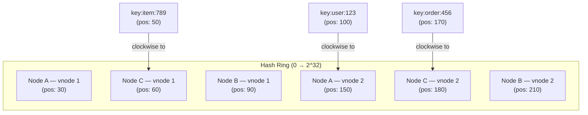

# 05 — Consistent Hashing

> **06-Distributed-Systems Series** — Engineering Handbook
> Language-agnostic · 8–10 min read

---

## 1. The Problem — Simple Hashing Breaks When Nodes Change

Imagine you have a distributed cache with 3 nodes. To decide which node stores a given key, you use modular hashing:

```
node = hash(key) % number_of_nodes

key "user:123" → hash = 456789 → 456789 % 3 = 0 → Node 0
key "user:456" → hash = 789012 → 789012 % 3 = 1 → Node 1
key "user:789" → hash = 012345 → 012345 % 3 = 2 → Node 2
```

This works perfectly — until you add or remove a node.

**Adding a 4th node:**

```
node = hash(key) % 4   (was % 3)

key "user:123" → 456789 % 4 = 1 → Node 1 (was Node 0!)
key "user:456" → 789012 % 4 = 0 → Node 0 (was Node 1!)
key "user:789" → 012345 % 4 = 1 → Node 1 (was Node 2!)
```

Almost every key now maps to a different node. The entire cache is invalidated. Every request misses and hits the database. This is a thundering herd at scale — potentially catastrophic for your database.

**Removing a node (e.g., a crash):**

Same problem. Almost all keys remap, cache is invalidated, database is overwhelmed.

> **Simple modular hashing is brittle.** Any change in the number of nodes invalidates almost all cached data. In a system that scales dynamically or must tolerate node failures, this is unacceptable.

---

## 2. The Solution — Consistent Hashing

Consistent hashing solves this by placing both nodes and keys on a **circular hash ring** (a ring of hash values from 0 to 2^32). When a node is added or removed, only a fraction of keys need to move.

### The Hash Ring

```
           0
      330     30
   300            60
  270    Ring      90
   240            120
      210     150
           180
```

**Placing nodes:** Hash each node's identifier to get a position on the ring.

```
Node A → hash("NodeA") → position 60
Node B → hash("NodeB") → position 180
Node C → hash("NodeC") → position 300
```

**Placing keys:** Hash each key to get a position on the ring. Each key is handled by the **first node clockwise from its position**.

```
key "user:123" → position 100 → first node clockwise = Node B (at 180)
key "user:456" → position 200 → first node clockwise = Node C (at 300)
key "user:789" → position 330 → first node clockwise = Node A (at 60, wrapping around)
```

---

## 3. Adding a Node — Minimal Disruption

Add Node D at position 130:

```
Before:  keys at 61–180 → Node B
After:   keys at 61–130 → Node D (new)
         keys at 131–180 → Node B (unchanged)
```

Only the keys between Node D's position and the previous node (Node A at 60) need to move to Node D. Everything else stays exactly where it is.

```
With N nodes, adding one node moves approximately 1/N of all keys.
With 10 nodes: ~10% of keys move. 90% stay.
With 100 nodes: ~1% of keys move. 99% stay.
```

Compare to simple hashing where adding one node moves ~(N-1)/N ≈ 100% of keys.

---

## 4. Removing a Node — Same Minimal Disruption

Remove Node B (crash at position 180):

```
Before:  keys at 61–180 → Node B
After:   keys at 61–180 → Node C (next clockwise, at 300)
```

Only Node B's keys move to Node C. All other keys are unaffected.

---

## 5. The Problem With Basic Consistent Hashing — Uneven Distribution

With a small number of nodes, the ring positions may not be evenly spaced. One node might own a large arc of the ring (many keys) while another owns a tiny arc.

```
Node A at 10
Node B at 15   (tiny arc: 10–15 = 5 units)
Node C at 200  (large arc: 15–200 = 185 units)
Node A again   (wraps: 200–360 → 10 = 170 units)

Node B gets very few keys. Node C gets many. Not balanced.
```

Also: when a node fails, all its keys go to the single next node — potentially doubling that node's load.

---

## 6. Virtual Nodes — Solving Uneven Distribution

The solution is **virtual nodes** (vnodes). Instead of placing each physical node at one position on the ring, each physical node is assigned **multiple positions** (virtual nodes), distributed around the ring.

```
Physical nodes: A, B, C
Virtual nodes per physical node: 3

Ring positions:
  A1→30, A2→150, A3→270  (Node A's 3 virtual nodes)
  B1→90, B2→210, B3→330  (Node B's 3 virtual nodes)
  C1→60, C2→180, C3→300  (Node C's 3 virtual nodes)

Ring (sorted): A1(30), C1(60), B1(90), A2(150), C2(180), B2(210), A3(270), C3(300), B3(330)
```

**Benefits of virtual nodes:**

- Keys are distributed more evenly across physical nodes
- When a node fails, its virtual nodes are spread around the ring — its keys are distributed across all remaining nodes, not dumped on a single neighbor
- Different physical nodes can have different numbers of virtual nodes — powerful nodes get more vnodes, weak nodes get fewer (weighted assignment)

```
Without vnodes (Node B fails):
  All Node B's keys → Node C (single node doubles its load)

With vnodes (Node B fails):
  B1's keys → C1 (nearest clockwise to B1)
  B2's keys → A3 (nearest clockwise to B2)
  B3's keys → A1 (nearest clockwise to B3, wrapping)
  → Load spread across multiple nodes ✅
```

---

## 7. Consistent Hashing in Practice



---

## 8. Where Consistent Hashing Is Used

| System | How It Uses Consistent Hashing |
|---|---|
| **Cassandra** | Partitions data across nodes using a consistent hash ring; vnodes enabled by default | Apache Cassandra docs |
| **DynamoDB** | Consistent hashing for distributing data across storage nodes | Amazon Dynamo paper (public) |
| **Memcached (client-side)** | Clients use consistent hashing to decide which cache node holds a key | Memcached documentation |
| **Redis Cluster** | Uses hash slots (16,384 slots on a ring) distributed across nodes | Redis Cluster docs |
| **Load balancers** | Some L4 load balancers use consistent hashing for session affinity (same client → same server) | Common pattern |
| **CDN routing** | Route requests to edge nodes using consistent hashing for cache affinity | Standard CDN design |

---

## 9. Consistent Hashing vs Rendezvous Hashing

A simpler alternative worth knowing: **Rendezvous hashing** (Highest Random Weight).

```
For a given key, compute hash(key, node) for each node.
Assign key to the node with the highest hash value.

Adding a node: only keys where the new node has the highest hash move.
Removing a node: only that node's keys move to the next-highest node.
```

Same property as consistent hashing (minimal key movement) but simpler to implement — no ring data structure needed. Works well for small clusters. Consistent hashing with vnodes is preferred at large scale for better load distribution.

---

## 10. Best Practices

- **Use 100–200 virtual nodes per physical node** — the standard in production systems (Cassandra default). Below 100, distribution can be uneven.
- **Weight vnodes by capacity** — more powerful nodes get more vnodes, receive proportionally more traffic.
- **Replication with consistent hashing** — in distributed databases, replicate each key to the next N clockwise nodes. Each physical node gets a replica of its neighbors' data.
- **Monitor hotspots** — even with vnodes, watch for uneven load distribution; adjust vnode count if needed.
- **Use consistent hashing for cache routing** — prevents cache stampede when nodes are added/removed.

---

## 11. Common Mistakes

| Mistake | Consequence | Fix |
|---|---|---|
| Simple modular hashing for dynamic clusters | Near-total cache invalidation on node change | Consistent hashing with vnodes |
| Too few virtual nodes | Uneven key distribution; one node overloaded | Use 100–200 vnodes per physical node |
| Ignoring hotspots with vnodes | Some keys accessed much more than others overwhelm one node | Application-level hot key detection and mitigation |
| Not replicating across vnodes | Node failure loses all its data | Replicate each partition to N next nodes on the ring |

---

## 12. Interview Questions

1. What is the problem with simple modular hashing when nodes are added or removed?
2. How does consistent hashing solve this problem?
3. What is a virtual node and why is it needed?
4. With 10 nodes and consistent hashing, approximately what fraction of keys move when you add an 11th node?
5. How does Cassandra use consistent hashing?
6. What happens to the keys of a failed node in a consistent hashing system with vnodes?
7. How would you implement data replication using the consistent hash ring?

---

## 13. Summary

| Concept | Key Takeaway |
|---|---|
| **Simple hashing** | `hash(key) % N`. Fast. Breaks completely when N changes. |
| **Consistent hashing** | Keys and nodes on a ring. Key goes to next clockwise node. |
| **Node added/removed** | Only ~1/N keys move. Everything else stays. |
| **Virtual nodes** | Each physical node at multiple ring positions. Even distribution. |
| **Failure with vnodes** | Failed node's keys spread across all remaining nodes, not one. |
| **Used by** | Cassandra, DynamoDB, Redis Cluster, distributed caches. |

---

## 14. Cross References

**Prerequisites:** 01-distributed-systems-fundamentals.md · Scalability (NFR #3) · Partitioning & Sharding (DB #6)

**Related Topics:** NoSQL (DB #3) · Caching (04-Caching) · Load Balancers (BB #1)

**What to Learn Next:** 07-Microservices section

---

*System Design Engineering Handbook — 06-Distributed-Systems Series*

---

> **06-Distributed-Systems series complete.**
> Covered: Fundamentals · CAP Theorem · Consistency & Clocks · Consensus & Leader Election · Consistent Hashing