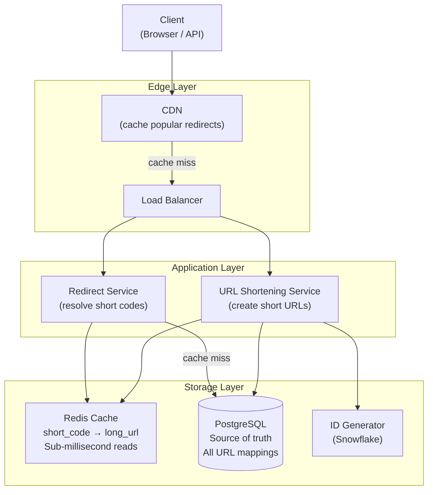
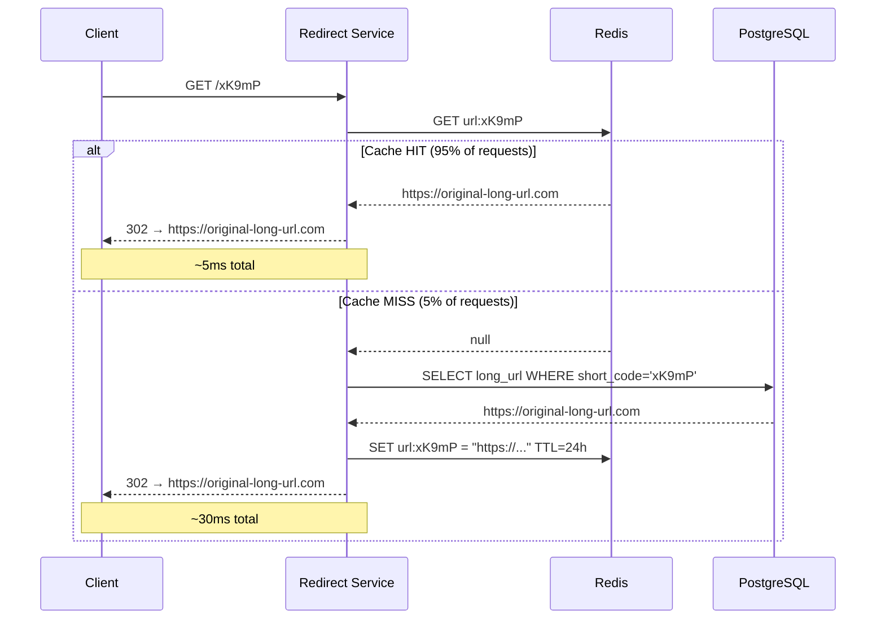
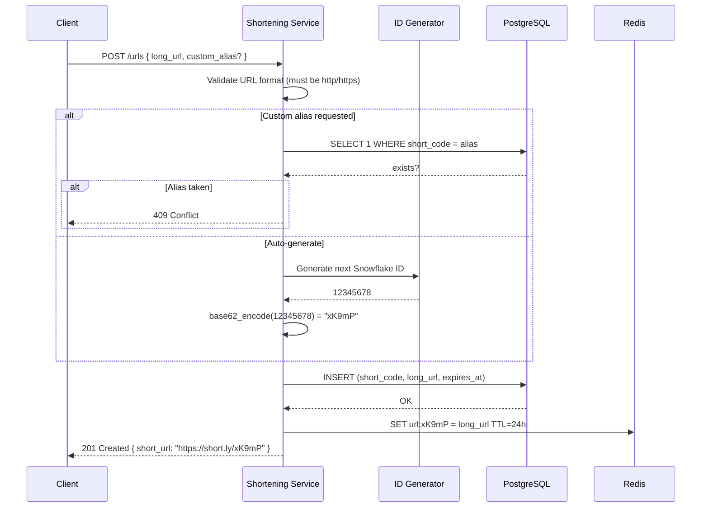

# 01 — Design a URL Shortener

> **Case Study #1** — Beginner
> Systems like: bit.ly, TinyURL, t.co

---

## The Problem

When you paste a long URL like `https://www.example.com/articles/2024/how-to-design-distributed-systems-at-scale?utm_source=newsletter` into a chat or tweet, it's ugly, wastes character limits, and breaks across lines. A URL shortener converts it into something like `https://short.ly/xK9mP` that redirects to the original.

Simple idea. But at scale — billions of URLs, hundreds of thousands of redirects per second — it becomes an interesting engineering problem.

---

## Step 1 — Requirements

### Clarifying Questions to Ask

```
"Should users be able to choose a custom alias?"
"Do short URLs expire or live forever?"
"Do we need click analytics?"
"What's the expected traffic — millions or billions of URLs?"
"Is this read-heavy or write-heavy?"
```

### Functional Requirements

| # | Requirement |
|---|---|
| FR-1 | Given a long URL, generate a unique short URL |
| FR-2 | When a short URL is accessed, redirect to the original |
| FR-3 | Users can optionally choose a custom alias |
| FR-4 | Short URLs can optionally have an expiry date |

**Out of scope:** User accounts, analytics dashboard, link editing after creation, QR codes.

### Non-Functional Requirements

| NFR | Target |
|---|---|
| Availability | 99.99% (users cannot reach destinations if we're down) |
| Redirect latency | P99 < 50ms |
| Shortening latency | P99 < 200ms |
| Short code uniqueness | Guaranteed — no two URLs share the same code |
| Read/write ratio | ~100:1 (far more redirects than new URLs created) |

---

## Step 2 — Scale Estimation

```
Assumptions:
  100 million new URLs created per day
  100:1 read-to-write ratio

Write RPS = 100M / 86,400 ≈ 1,160 writes/sec
Read RPS  = 1,160 × 100 = 116,000 reads/sec
Peak read = 116,000 × 2 ≈ 232,000 reads/sec

Storage per URL record ≈ 500 bytes
Daily storage = 1,160 × 86,400 × 500 bytes ≈ 50 GB/day
5-year storage = 50 GB × 365 × 5 ≈ 91 TB
```

**What this tells us:**
- 1,160 writes/sec → a single relational DB handles this comfortably
- 116,000 reads/sec → a database alone cannot serve this; caching is mandatory
- 91 TB → manageable with standard relational DB + archival strategy

---

## Step 3 — API Design

```
Create short URL:
  POST /urls
  Body: { "long_url": "https://...", "custom_alias": "mylink", "expires_at": "2025-01-01" }
  Response: { "short_url": "https://short.ly/xK9mP", "short_code": "xK9mP" }

Redirect:
  GET /{short_code}
  Response: 302 Redirect → Location: https://original-long-url.com
```

**Why 302 and not 301?**
- 301 (Permanent): browser caches the redirect forever. Subsequent requests never reach our server — analytics break, and we can't update the destination later.
- 302 (Temporary): browser always checks our server. We can track clicks and change the destination if needed.

---

## Step 4 — High-Level Design



### Component Breakdown

**CDN:** Caches redirect responses for the most popular short URLs. A viral link hit by millions of users is served entirely from edge — our servers never see most of that traffic.

**Redirect Service:** The hot path. Receives a short code, checks Redis, returns the long URL. Must be extremely fast.

**URL Shortening Service:** The cold path. Creates new short URLs. Lower traffic, higher latency budget.

**Redis Cache:** Stores `short_code → long_url` mappings in memory. The key insight: a 100:1 read ratio means the vast majority of our traffic is reads. If we cache the hot URLs, 95%+ of reads never touch the database.

**PostgreSQL:** Source of truth. Every URL mapping lives here permanently. Used only for cache misses during reads, and for all writes.

**Snowflake ID Generator:** Generates globally unique, time-ordered numeric IDs that we encode into short codes. Covered in depth below.

---

## Step 5 — The Core Problem: Generating Short Codes

This is the most interesting engineering problem in the whole system. We need to generate a 7-character code that:
- Is unique — no two long URLs share a code
- Is URL-safe — no special characters
- Does not leak the total count of URLs created

### Option A: Hash + Truncate (Rejected)

```
short_code = base62( md5(long_url) )[0:7]
```

**Problem:** Two different long URLs can produce the same 7-character prefix. At 100M URLs/day, collisions become significant. Handling them requires retrying with different prefixes — complex and fragile.

### Option B: Auto-Increment + Base62 Encode (Chosen)

```
Step 1: Generate a unique integer ID
        We use a Snowflake-style ID: timestamp + machine ID + sequence
        Globally unique, no coordination needed across machines

Step 2: Encode the integer to Base62
        Characters: 0-9, a-z, A-Z  (62 characters total)

Example:
  ID = 12,345,678
  12,345,678 in Base62 = "W7e4"

Capacity check:
  7 Base62 characters = 62^7 ≈ 3.5 trillion unique codes
  At 1,160 writes/sec → lasts ~95,000 years
```

**Why Base62?**
- URL-safe (no `/`, `?`, `#`, `&`)
- Case-sensitive, so more unique values per character than Base32
- Human-readable, short

```
Base62 encoding (intuition):
  Think of it like converting a number from base-10 to base-62.
  Instead of digits 0-9, you have digits 0-9-a-z-A-Z.

  12,345,678 ÷ 62 = 199,123 remainder 32  → character '6' (index 32 = '6')
  199,123 ÷ 62 = 3,211 remainder 21       → character 'P' (index 21 = 'P')
  ... continue until quotient is 0
  Read remainders in reverse → "W7e4"
```

---

## Step 6 — Redirect Flow (The Hot Path)

This is the path that must be fast. P99 < 50ms means caching is not optional.



---

## Step 7 — URL Creation Flow



---

## Step 8 — Database Schema

```sql
CREATE TABLE url_mappings (
    id           BIGINT        PRIMARY KEY,       -- Snowflake ID
    short_code   VARCHAR(10)   NOT NULL UNIQUE,   -- Base62 encoded
    long_url     TEXT          NOT NULL,
    created_at   TIMESTAMP   NOT NULL DEFAULT NOW(),
    expires_at   TIMESTAMP,                     -- NULL = never expires
    user_id      UUID,                            -- NULL = anonymous
    is_active    BOOLEAN       NOT NULL DEFAULT TRUE
);

-- The index that makes redirects fast
CREATE INDEX idx_short_code ON url_mappings(short_code);

-- Partial index: only active, non-expired URLs (smaller = faster)
CREATE INDEX idx_active_urls ON url_mappings(short_code)
    WHERE is_active = TRUE
    AND (expires_at IS NULL OR expires_at > NOW());
```

---

## Step 9 — Deep Dive: Handling Expiry

Short URLs with an expiry date need to stop redirecting after they expire. Two approaches:

**Option A — Check on every redirect:**
```
On redirect: if expires_at < NOW() → return 410 Gone

Cost: one extra comparison per request
Benefit: exact expiry
```

**Option B — TTL in Redis:**
```
When caching: SET url:xK9mP = long_url EX {seconds_until_expiry}
Redis automatically evicts the key when it expires

Cost: after Redis evicts, the next request hits the DB and
      must check expiry there too — one extra DB call per URL
Benefit: Redis automatically cleans up expired entries
```

**Chosen:** Option A for correctness (the DB is the source of truth for expiry), with Redis TTL set to min(24h, time_until_expiry) to avoid caching expired URLs.

---

## Step 10 — Trade-offs

| Decision | What We Chose | What We Gave Up | Why Acceptable |
|---|---|---|---|
| **Short code generation** | Snowflake ID + Base62 | Sequential IDs are predictable (users could enumerate) | UUIDs would be longer; sequential IDs are fine since we don't expose the count |
| **302 vs 301** | 302 (temporary redirect) | Browser never caches → slightly more server load | Analytics work, destinations can change |
| **Cache strategy** | Cache-aside with 24h TTL | Stale URLs possible if destination changes | URLs are effectively immutable after creation; stale window is acceptable |
| **Storage** | PostgreSQL | Not as write-scalable as Cassandra | 1,160 writes/sec is well within PostgreSQL's capability; no need for NoSQL complexity |
| **Caching layer** | Redis | Extra infrastructure to manage | At 116K reads/sec, the DB would collapse without it |

---

## Step 11 — Follow-up Questions Interviewers Ask

**"How would you handle a viral URL that gets 10 million hits in an hour?"**

The CDN handles this. We'd configure the CDN to cache the redirect response for popular short codes. The cache-control headers would be set to allow CDN caching for a short window (say, 60 seconds). 10 million hits over an hour = ~2,800 RPS. The CDN absorbs this entirely — our servers see almost none of it.

**"How would you support analytics — tracking clicks per URL?"**

Don't track synchronously on the redirect path — that would add latency. Instead, publish a click event to a Kafka topic asynchronously. A separate analytics service consumes these events, aggregates them, and writes to a time-series or wide-column store (Cassandra). The redirect path stays at < 10ms.

**"What if two users try to create the same custom alias at the same time?"**

The `UNIQUE` constraint on `short_code` in PostgreSQL handles this. One of the inserts will succeed; the other will get a unique constraint violation and return a 409 Conflict. This is the database enforcing our business rule — no application-level locking needed.

**"How would you scale this to 10× the load?"**

- Reads: scale Redis cluster horizontally (add nodes, consistent hashing handles redistribution). Add more redirect service instances behind the load balancer.
- Writes: at 11,600 writes/sec, a single PostgreSQL primary starts to strain. We'd consider sharding by short_code hash or moving to a more write-capable store.
- CDN cache-hit rate becomes even more important at 10× — tune TTLs to cache more aggressively.

---

## Summary

| Component | Choice | Reason |
|---|---|---|
| **Short code** | Snowflake ID + Base62 | Unique, URL-safe, compact, no coordination |
| **Primary store** | PostgreSQL | ACID, 1,160 writes/sec is well within capacity |
| **Read cache** | Redis, cache-aside | 116K reads/sec requires in-memory caching |
| **Edge caching** | CDN | Handles viral traffic without touching our servers |
| **Redirect type** | 302 | Analytics work, destinations can change |

**The core insight:** This system is extremely read-heavy (100:1 ratio). Every architectural decision flows from that: the cache exists because of it, the CDN exists because of it, and the redirect service is optimised separately from the shortening service because of it.

---

*System Design Engineering Handbook — Case Studies*