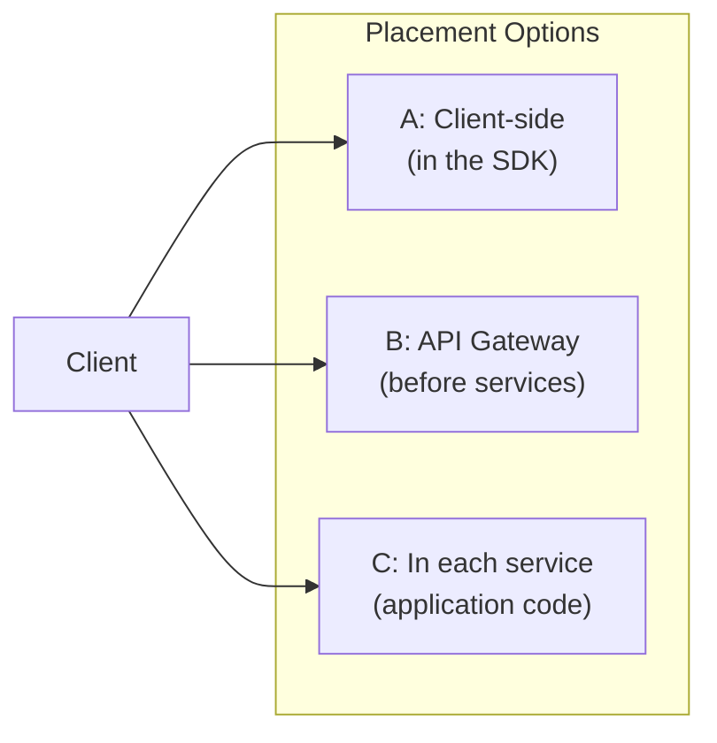
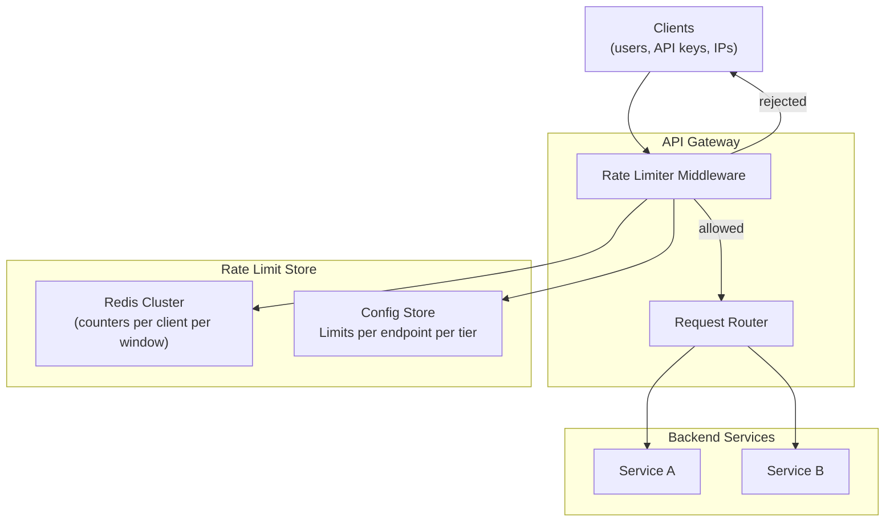
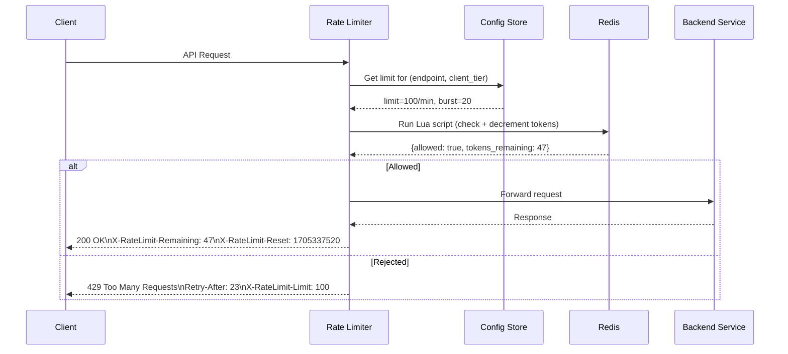
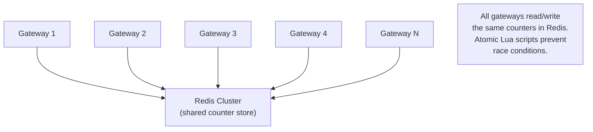

# 02 — Design a Rate Limiter

> **Case Study #2** — Beginner
> Used by: every API in production — Stripe, GitHub, Twitter, Cloudflare

---

## The Problem

Imagine you run an API. One day, a bug in a client application causes it to send 100,000 requests per second to your service. Your database gets overwhelmed, your servers crash, and every other customer is affected — because of one misbehaving client.

Or imagine an attacker trying millions of password combinations against your login endpoint. Without any defence, they can try indefinitely.

A **rate limiter** solves both problems. It controls how many requests a client is allowed to make within a time window, rejecting requests that exceed the limit. This protects your system from overload, prevents abuse, and ensures fair access for all clients.

---

## Step 1 — Requirements

### Clarifying Questions to Ask

```
"Do we rate limit per user, per IP, per API key, or all three?"
"What happens when a client hits the limit — error or queue?"
"Should limits be configurable per client or global?"
"Does this need to work across multiple servers?"
"What's the expected latency overhead — microseconds or milliseconds?"
```

### Functional Requirements

| # | Requirement |
|---|---|
| FR-1 | Reject requests that exceed the configured limit |
| FR-2 | Return clear error responses (HTTP 429) with retry information |
| FR-3 | Support different limits per endpoint, per user, per API key |
| FR-4 | Limits are configurable without redeploying |

**Out of scope:** Request queuing (we reject, not buffer), DDoS mitigation at the network layer, billing based on usage.

### Non-Functional Requirements

| NFR | Target |
|---|---|
| Latency overhead | < 5ms added to every request |
| Accuracy | Limits enforced correctly across all servers |
| Availability | Rate limiter failure should not bring down the main service |
| Scalability | Works correctly across hundreds of API server instances |

---

## Step 2 — Where Does the Rate Limiter Live?

Before thinking about algorithms, decide where the rate limiter runs.



| Placement | Pros | Cons |
|---|---|---|
| **Client-side** | Zero server load | Client controls it — trivially bypassed |
| **API Gateway** | Centralised; consistent for all services | Gateway becomes a bottleneck; harder to customise per-service |
| **Application layer** | Fine-grained; service-specific rules | Duplicated logic across services |
| **Middleware (shared library)** | Reusable across services | Must work distributed (shared state) |

**Chosen: API Gateway + shared Redis store.** The gateway intercepts every request before it reaches any service, checks limits in Redis, and either allows or rejects the request. Services themselves never implement rate limiting logic.

---

## Step 3 — The Core Problem: Counting Requests

The fundamental challenge is counting how many requests a client has made in the current time window — accurately, across all server instances, fast enough to add < 5ms of latency.

We'll look at the main algorithms, from simplest to most sophisticated.

---

## Step 4 — Algorithm 1: Fixed Window Counter

Divide time into fixed windows (e.g. every minute). Count requests in the current window.

```
Window: 14:00:00 → 14:01:00
Limit: 100 requests per minute

Request at 14:00:30 → counter = 1  ✅
Request at 14:00:45 → counter = 2  ✅
...
Request at 14:00:59 → counter = 100 ✅
Request at 14:00:59 → counter = 101 ❌ REJECTED

At 14:01:00 → counter resets to 0
```

**Implementation with Redis:**
```
key = "ratelimit:{user_id}:{window_start}"

INCR key          → atomically increment counter
EXPIRE key 60     → auto-delete after 60 seconds
if counter > 100 → reject
```

**The problem — boundary bursts:**

```
A client can effectively double their rate at window boundaries:

14:00:59 → 100 requests (end of window 1)
14:01:01 → 100 requests (start of window 2)

200 requests in 2 seconds — but our limit is 100/minute!
```

This is a real problem for latency-sensitive services.

---

## Step 5 — Algorithm 2: Sliding Window Log

Record the exact timestamp of every request. On each new request, count how many timestamps fall within the last 60 seconds.

```
New request at 14:01:30:
  Look at all stored timestamps for this user
  Count those in range [14:00:30, 14:01:30]
  If count < 100 → allow; add this timestamp
  If count ≥ 100 → reject

Sliding window eliminates boundary bursts entirely.
```

**The problem:** Storing a timestamp per request is memory-intensive. At 10,000 requests/second with a 1-minute window, you're storing 600,000 timestamps per user. Not practical at scale.

---

## Step 6 — Algorithm 3: Token Bucket (Recommended)

This is the most widely used algorithm in production. Think of it as a bucket of tokens:

```
Bucket has a CAPACITY (max tokens) and a REFILL RATE (tokens per second)

On each request:
  1. Add tokens to bucket based on time elapsed since last request
     new_tokens = elapsed_seconds × refill_rate
     tokens = min(capacity, current_tokens + new_tokens)

  2. If tokens ≥ 1 → allow request, subtract 1 token
     If tokens < 1 → reject request

Example:
  Capacity = 10 tokens
  Refill rate = 2 tokens/second

  Burst of 10 requests → bucket empties instantly ✅
  Next request at 0.4s → only 0.8 tokens → rejected ❌
  Request at 0.5s → 1 token → allowed ✅
  Wait 5 seconds → 10 tokens refill → another burst allowed ✅
```

**Why Token Bucket is great:**
- Allows natural bursts (users are bursty; this feels fair)
- Sustained rate is controlled by the refill rate
- Two parameters to tune: burst capacity and sustained rate

**Redis implementation:**
```
key = "ratelimit:{user_id}"

Use a Lua script (atomic execution in Redis):

  current_tokens, last_refill = GET key
  now = current_timestamp()
  elapsed = now - last_refill
  new_tokens = elapsed × refill_rate
  tokens = min(capacity, current_tokens + new_tokens)

  if tokens >= 1:
    tokens -= 1
    SET key {tokens, now}
    return ALLOW
  else:
    SET key {tokens, now}  # update last_refill even on reject
    return DENY
```

**Why Lua?** Redis executes Lua scripts atomically — the check-and-decrement happens as one operation. Without atomicity, two simultaneous requests could both read `tokens = 1`, both think they're allowed, and both decrement — allowing two requests when only one should pass.

---

## Step 7 — Algorithm 4: Sliding Window Counter (Best Balance)

A clever hybrid that approximates a sliding window without storing individual timestamps.

```
Use two fixed windows: current and previous
Estimate sliding window count using a weighted formula:

sliding_count = prev_window_count × (1 - elapsed_ratio) + current_window_count

Where elapsed_ratio = how far we are through the current window (0.0 to 1.0)

Example:
  Window = 1 minute
  Previous window count = 80 requests
  Current window count = 30 requests
  We're 25% through the current window (elapsed_ratio = 0.25)

  sliding_count = 80 × (1 - 0.25) + 30 = 80 × 0.75 + 30 = 60 + 30 = 90

  Limit = 100 → allow (90 < 100)
```

This gives near-perfect accuracy using only two counters — no timestamp storage, no boundary burst problem.

---

## Step 8 — Algorithm Comparison

| Algorithm | Accuracy | Memory | Boundary Burst | Complexity | Best For |
|---|---|---|---|---|---|
| Fixed Window | Low | Very low | ❌ Vulnerable | Simple | Internal tools where precision isn't critical |
| Sliding Window Log | Perfect | High | ✅ Safe | Medium | Low-traffic, high-precision needs |
| Token Bucket | High | Very low | ✅ Allows natural bursts | Medium | User-facing APIs (recommended) |
| Sliding Window Counter | High | Very low | ✅ Safe | Medium | High-scale APIs needing precision |

---

## Step 9 — Full System Design



### The Request Flow



---

## Step 10 — Distributed Rate Limiting

The hardest problem in this design: we have 100 API gateway instances, each running independently. How do they share rate limit state?

### Problem — Local Counters Don't Work

```
Without shared state:
  Client sends 100 requests, spread across 10 gateway instances
  Each instance sees only 10 requests
  Each instance: "10 < 100 limit → allow"
  All 100 requests allowed — but limit should have been hit after 100 total!
```

### Solution — Redis as Shared Counter



Every gateway checks the same Redis counter for a given client. Redis handles concurrent writes atomically with Lua scripts. This ensures correct enforcement regardless of which gateway instance receives the request.

**What if Redis goes down?**

Two options:
- **Fail open:** Allow all requests when Redis is unreachable. System is unprotected but available.
- **Fail closed:** Reject all requests when Redis is unreachable. System is protected but unavailable.

For most user-facing APIs, **fail open** is correct. A brief period of unprotected traffic is better than a complete outage. The rate limiter is a protection layer, not a business function.

---

## Step 11 — The Response Headers

Good rate limiters communicate their state clearly. Clients can use these headers to back off intelligently.

```
HTTP/1.1 200 OK
X-RateLimit-Limit:      100          (max requests per window)
X-RateLimit-Remaining:  47           (requests left in current window)
X-RateLimit-Reset:      1705337520   (Unix timestamp when window resets)

HTTP/1.1 429 Too Many Requests
X-RateLimit-Limit:      100
X-RateLimit-Remaining:  0
Retry-After:            23           (seconds to wait before retrying)
```

A well-behaved client reads `X-RateLimit-Remaining` and slows down before hitting 0. A naive client waits for 429 and then uses `Retry-After`. Both approaches work.

---

## Step 12 — Rules and Configuration

Rate limit rules should live in a config store, not in code. This allows changes without deployment.

```
Rules structure:
  /auth/login:
    per_ip:  5 requests / 15 minutes  (prevent brute force)
    per_user: 10 requests / 15 minutes

  /api/v1/search:
    free_tier:    100 requests / minute
    pro_tier:     1000 requests / minute
    enterprise:   10000 requests / minute

  /api/v1/payments:
    per_user:    10 requests / minute   (payments are expensive)
    global:      1000 requests / minute (protect downstream payment service)
```

Store these in a config service (or Redis itself). The rate limiter reads them at startup and refreshes periodically — changes propagate within seconds without any gateway restarts.

---

## Step 13 — Trade-offs

| Decision | What We Chose | What We Gave Up | Why Acceptable |
|---|---|---|---|
| **Algorithm** | Token Bucket | Perfect sliding window accuracy | Token bucket is accurate enough and allows natural bursts that make limits feel fair |
| **State store** | Redis | If Redis goes down, limiter fails | Fail-open keeps the system running; brief unprotected window is acceptable |
| **Placement** | API Gateway | Per-service customisation is harder | Centralised is simpler, consistent, and covers all services without duplication |
| **Atomicity** | Lua scripts in Redis | Slightly more complex than simple INCR | Race conditions without atomicity mean limits are enforced incorrectly |

---

## Step 14 — Follow-up Questions Interviewers Ask

**"How do you handle IP-based rate limiting when users are behind a NAT?"**

A corporate office might have 1,000 employees sharing one IP. Rate limiting by IP alone would block all of them when any one of them hits the limit. Solution: prefer user-level or API-key-level limits. Use IP as a fallback for unauthenticated endpoints.

**"How would you implement tiered limits — free vs paid?"**

The config store maps each API key to a tier (free/pro/enterprise). The rate limiter looks up the client's tier, then fetches the limit for that tier for the requested endpoint. All in Redis — the lookup adds < 1ms.

**"What if a client distributes requests across many IPs?"**

IP rotation defeats IP-based limits. This is why limiting by user identity (API key, JWT subject) is more robust than limiting by IP. For truly malicious actors rotating identities, you need application-layer fraud detection — beyond the scope of a rate limiter.

**"Could you use a rate limiter without Redis?"**

Yes — consistent hashing can route each client to the same gateway instance (sticky routing), allowing local in-memory counters. But this ties client to instance, breaks with scaling events, and requires re-hashing all clients when instances change. Redis shared state is simpler and more robust.

---

## Summary

| Component | Choice | Reason |
|---|---|---|
| **Algorithm** | Token Bucket | Allows bursts, enforces sustained rate, simple to tune |
| **State store** | Redis Cluster | Sub-millisecond reads/writes, atomic Lua scripts, shared across all gateways |
| **Placement** | API Gateway | Centralised, consistent, no duplication |
| **Failure mode** | Fail open | Availability over protection on Redis failure |
| **Config** | External config store | Rules change without deployment |

**The core insight:** The hard part of rate limiting is not the algorithm — it's the distributed state. Any system with multiple servers must share counter state, and that state must be updated atomically. Redis + Lua scripts solve both problems cleanly.

---

*System Design Engineering Handbook — Case Studies*