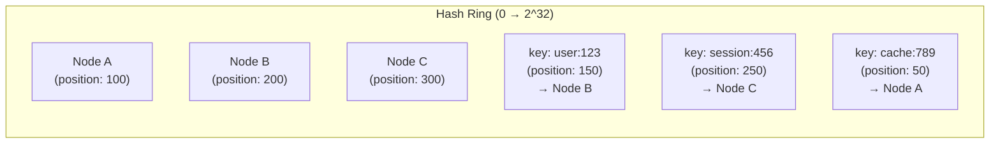
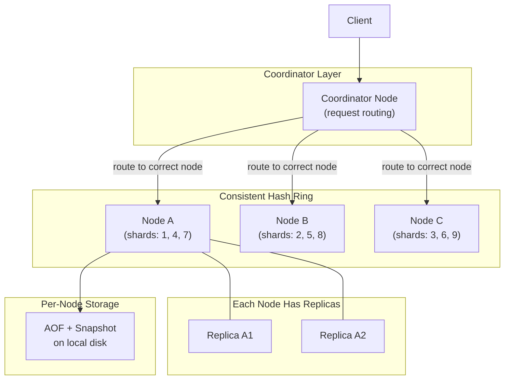
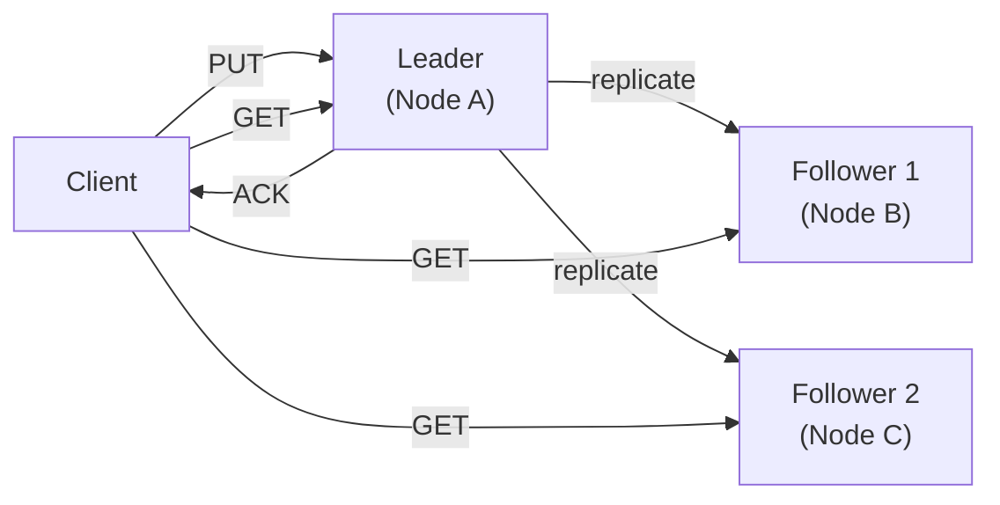
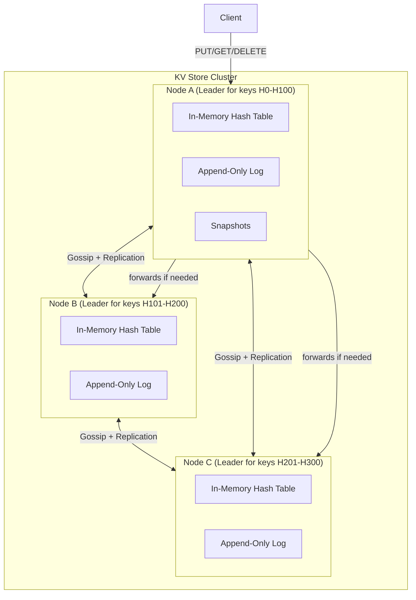

# 03 — Design a Key-Value Store

> **Case Study #3** — Beginner
> Systems like: Redis, DynamoDB, Cassandra, Memcached

---

## The Problem

A key-value store is one of the simplest databases imaginable: store a value under a key, retrieve it by key. Like a giant dictionary or hashmap.

```
PUT  key="user:123:session"  value="eyJhbGci..."
GET  key="user:123:session"  → "eyJhbGci..."
DELETE key="user:123:session"
```

But building one that is **fast, reliable, and scalable** — handling millions of operations per second while surviving node failures and network partitions — requires solving nearly every hard problem in distributed systems. This is why it's a favourite interview question: simple interface, deep engineering.

---

## Step 1 — Requirements

### Clarifying Questions to Ask

```
"Is this for caching (can tolerate data loss) or primary storage (must never lose data)?"
"What consistency model — strong or eventual?"
"What's the expected size of values — bytes, kilobytes, megabytes?"
"Do we need TTL (automatic expiry)?"
"What's the scale — thousands of RPS or millions?"
"Single region or globally distributed?"
```

### Functional Requirements

| # | Requirement |
|---|---|
| FR-1 | `PUT(key, value)` — store a value under a key |
| FR-2 | `GET(key)` → value — retrieve value by key |
| FR-3 | `DELETE(key)` — remove a key |
| FR-4 | Keys support TTL — automatically expire after N seconds |

**Out of scope:** Complex queries, transactions across multiple keys, secondary indexes, range scans (those belong in a different database).

### Non-Functional Requirements

| NFR | Target |
|---|---|
| Latency | P99 < 10ms for reads and writes |
| Availability | 99.99% |
| Durability | No data loss after a confirmed write |
| Scalability | Horizontally scalable — add nodes to increase capacity |
| Partition tolerance | Survives network partitions |

---

## Step 2 — Scale Estimation

```
Assumptions:
  10 million daily active users
  Each user generates 100 operations/day on average

Total ops/day = 10M × 100 = 1 billion ops/day
Average ops/sec = 1B / 86,400 ≈ 11,600 ops/sec
Peak ops/sec = 11,600 × 3 ≈ 35,000 ops/sec

Average value size = 1 KB
Daily data written (assuming 30% are writes):
  = 35,000 × 0.3 × 1 KB × 86,400 = ~900 GB/day

This tells us:
  35,000 ops/sec → cannot run on a single machine
  Need horizontal distribution across multiple nodes
  In-memory storage is essential for < 10ms latency
```

---

## Step 3 — Single-Node Design First

Before distributing, understand what one node looks like. Then we'll distribute it.

### The Storage Engine

For sub-10ms latency, data must be in **memory**. Disk access is 10,000× slower than RAM.

```
In-memory hash table:
  Key     → Value + TTL metadata
  "user:123" → { value: "Alice", expires_at: 1705337520 }
  "session:456" → { value: "token...", expires_at: 1705338000 }

Hash table gives O(1) get and put — perfect.
```

### Handling TTL

Two approaches to expire keys:

**Lazy expiry:** Check expiry only when the key is accessed.
```
GET "session:456":
  1. Look up the key
  2. If expires_at < now → delete and return null
  3. Otherwise → return value

Cost: Expired keys linger in memory until accessed.
```

**Active expiry:** Background thread periodically scans and deletes expired keys.
```
Every 100ms:
  Sample 20 random keys
  Delete any that are expired
  If > 25% of sampled keys were expired, repeat immediately

Cost: CPU overhead. Benefit: memory reclaimed without waiting for access.
```

**Production approach (Redis does this):** Both. Lazy expiry on access + periodic active expiry. This balances memory efficiency and CPU cost.

### Persistence — Surviving Restarts

An in-memory store loses all data on restart. Two strategies:

**Write-Ahead Log (WAL) / Append-Only File (AOF):**
```
Every write operation is appended to a log file on disk:
  WRITE user:123 "Alice" 1705337520
  WRITE session:456 "token..." 1705338000
  DELETE user:123

On restart: replay the log to reconstruct in-memory state
```
Durability: every write. Recovery: replay from beginning (slow for large logs).

**Periodic Snapshots (RDB):**
```
Every 60 seconds: dump the entire in-memory state to disk as a binary file.

On restart: load the snapshot file → state restored to 60 seconds ago.
```
Durability: up to 60 seconds of data loss. Recovery: fast (load one file).

**Production choice:** Use both. Snapshots for fast recovery. AOF for durability. This is exactly what Redis does — configurable based on durability requirements.

---

## Step 4 — Distributing Across Multiple Nodes

Single-node design can't handle 35,000 ops/sec at scale. We need to spread data across multiple nodes.

### The Core Challenge — Data Partitioning

We need to distribute keys across nodes so that:
- Every node handles a roughly equal share of the load (no hotspots)
- We can find which node holds a given key without asking all nodes

### Naive Approach — Modular Hashing (Don't Use)

```
node_index = hash(key) % number_of_nodes

user:123 → hash → 45678 → 45678 % 3 = 0 → Node 0
user:456 → hash → 89012 → 89012 % 3 = 1 → Node 1
```

**Problem:** Add or remove a node, and almost every key remaps to a different node.

```
Add a 4th node:
  user:123 → 45678 % 4 = 2 → Node 2 (was Node 0!)
  user:456 → 89012 % 4 = 0 → Node 0 (was Node 1!)

~75% of all keys move to different nodes.
The cache is invalidated — cold start, database overload.
```

### Consistent Hashing (Use This)

Consistent hashing places both nodes and keys on a virtual ring (hash values 0 to 2^32). Each key belongs to the first node clockwise from its position.



**Adding a new node:**
```
New Node D at position 175:

Before: keys at 101-200 → Node B
After:  keys at 101-175 → Node D (new)
        keys at 176-200 → Node B (unchanged)

Only ~1/N keys move. Everything else stays. ✅
```

**Virtual nodes** — each physical node gets 100-200 positions on the ring, ensuring even distribution even with a small number of physical nodes.

---

## Step 5 — Full Architecture



---

## Step 6 — Replication — Surviving Node Failures

If one node dies and it's the only copy of that data, we've lost it. We need replication.

### Leader-Follower Replication

Each partition has one leader node and N follower nodes (typically 2, giving 3 total copies — a replication factor of 3).

```
PUT user:123 → goes to Leader
  Leader writes locally
  Leader replicates to Follower 1 and Follower 2
  Leader acknowledges to client (after quorum write, explained below)

GET user:123
  Can be served by Leader or any Follower
```



### Handling Leader Failure

When the leader fails, one follower is promoted to leader:

```
Node A (leader) crashes.

Remaining nodes detect failure (missed heartbeats).
Election: Node B and Node C vote.
Node B wins (had the most up-to-date log).
Node B is now the leader.
Node C is the remaining follower.
Operator provisions a new follower to replace Node A.
```

During the election window (typically 1–5 seconds), the partition is unavailable. This is the cost of strong consistency — we don't serve stale data during a failover.

---

## Step 7 — Consistency: Quorum Reads and Writes

With replication comes the question: how many nodes must agree before we consider an operation successful?

```
N = total replicas (we use 3)
W = number of nodes that must confirm a WRITE
R = number of nodes that must respond to a READ

If R + W > N → reads and writes overlap → strong consistency
```

**Configuration options:**

| W | R | Consistency | Available writes | Available reads |
|---|---|---|---|---|
| 3 | 1 | Strong | Slow (all 3 must confirm) | Fast |
| 1 | 3 | Strong | Fast | Slow (all 3 must respond) |
| 2 | 2 | Strong | Balanced | Balanced |
| 1 | 1 | Eventual | Fastest | Fastest |

**Recommendation:** W=2, R=2 with N=3 for a general-purpose KV store. This tolerates one node failure while maintaining strong consistency.

```
PUT user:123 → "Alice":
  Leader writes to itself     ✅  (1/2)
  Leader replicates to F1     ✅  (2/2 quorum reached)
  Leader ACKs to client
  F2 replicates asynchronously (not needed for quorum)

GET user:123:
  Read from Leader + F1 → both return "Alice"
  Return "Alice" ✅
```

If the two responses disagree (due to replication lag), return the value with the higher version number.

---

## Step 8 — Handling the CAP Trade-off

During a network partition, nodes in different partitions can't communicate. We must choose:

```
Partition occurs — Node A separated from Node B and C:

CP choice (strong consistency):
  Node A: "I can't reach quorum → refuse all reads and writes"
  Users get errors, but no stale or conflicting data
  → Choose this for: financial data, inventory, sessions

AP choice (eventual consistency):
  Node A: "I'll serve reads from my local copy (may be stale)"
  Node A: "I'll accept writes locally (may conflict with B/C)"
  Users get responses, but may see stale data
  → Choose this for: shopping carts, user preferences, view counts
```

**For our general-purpose KV store:** Make this configurable per-key or per-namespace. High-value data uses CP; high-availability data uses AP. This is how DynamoDB's consistency model works.

---

## Step 9 — Conflict Resolution

With eventual consistency, two clients can write different values to the same key while a partition is active. When the partition heals, we have two conflicting values. How do we resolve?

### Last Write Wins (LWW)

Use timestamps — the write with the latest timestamp survives.

```
Client A writes: user:123 = "Alice" at T=100
Client B writes: user:123 = "Bob"   at T=102

Conflict resolved: "Bob" wins (T=102 > T=100)
```

**Problem:** Clock skew. If Node A's clock is 5ms ahead of Node B's, "earlier" writes can win over "later" ones. Silent data loss.

### Vector Clocks

Track causality explicitly — don't rely on clocks.

```
Initial: user:123 = "Alice"  version=[A:1, B:0, C:0]

Client A writes "Bob":    version=[A:2, B:0, C:0]
Client B writes "Charlie": version=[A:1, B:1, C:0]

Conflict detected: neither version dominates the other
→ Present both versions to the application
→ Application decides: keep "Bob", keep "Charlie", or merge
```

**For our KV store:** LWW for simplicity unless the application explicitly needs conflict awareness (e.g., shopping carts). Vector clocks for data where correctness matters more than simplicity.

---

## Step 10 — Request Routing

How does a client know which node holds a given key?

### Option A — Coordinator Node

```
Client → Coordinator → correct node

Coordinator knows the hash ring and routes appropriately.
Simple client; coordinator is a potential bottleneck.
```

### Option B — Client-Side Routing

```
Client knows the hash ring → routes directly to the correct node.
No bottleneck; client must stay in sync with cluster changes.
Used by: Cassandra drivers
```

### Option C — Gossip Any Node, Node Forwards

```
Client → any node → correct node (via gossip protocol)
No coordinator; any node can accept any request and forward.
Slight extra hop but very resilient.
Used by: DynamoDB, Cassandra
```

**Chosen: Gossip protocol with any-node forwarding.** No single coordinator bottleneck. Nodes share cluster state via gossip — each node knows the full ring and can forward directly.

---

## Step 11 — Failure Detection with Heartbeats and Gossip

How does a node know if another node has failed?

**Heartbeats:**
```
Every 500ms: each node sends a heartbeat to all other nodes
If no heartbeat for 3 seconds → mark as "suspected dead"
If no heartbeat for 10 seconds → mark as "confirmed dead" → update ring
```

**Gossip protocol:**
```
Every 1 second: each node picks 2 random neighbours
  → Shares its view of the cluster (which nodes are alive/dead)
  → Neighbours update their view

Information spreads logarithmically — in 10 rounds (10 seconds),
every node in a 1,000-node cluster knows about a failure.
```

---

## Step 12 — Complete Architecture



---

## Step 13 — Trade-offs

| Decision | What We Chose | What We Gave Up | Why Acceptable |
|---|---|---|---|
| **Storage** | In-memory (RAM) | Limited by RAM size, expensive | Disk is 10,000× slower; sub-10ms latency requires memory |
| **Partitioning** | Consistent hashing | Ring management complexity | Only ~1/N keys move when adding/removing nodes |
| **Replication** | 3 replicas (W=2, R=2) | 2× extra storage, slower writes | Survives one node failure without data loss |
| **Conflict resolution** | LWW by default | Potential data loss on clock skew | Simple and sufficient for most use cases; vector clocks available for critical data |
| **Consistency** | Tunable (CP or AP) | No single model for all use cases | Different data has different requirements; one size doesn't fit all |
| **Routing** | Gossip + any-node forward | Slight extra hop for misrouted requests | No coordinator bottleneck; highly resilient |

---

## Step 14 — Follow-up Questions Interviewers Ask

**"What happens when a new node joins the cluster?"**

The new node announces itself via gossip. The ring is updated. A subset of keys from existing nodes (those that now hash to the new node) are migrated to it. During migration, both the old and new node serve those keys — the old node forwards reads to the new node once migration is complete. This is a rolling migration with no downtime.

**"How would you handle hot keys — one key getting 90% of all traffic?"**

Consistent hashing doesn't help here — all traffic for one key goes to one node regardless. Solutions: (1) replicate hot keys to multiple nodes and load balance reads, (2) cache hot keys at the client or in an additional caching layer, (3) use a "key prefix" with a random suffix and distribute the key into multiple variants (`user:123:0`, `user:123:1`... then aggregate on read).

**"How is this different from Redis?"**

Redis is a single-node in-memory KV store with optional replication. Redis Cluster is the distributed version — it uses hash slots (16,384 slots distributed across nodes) which is a specific form of consistent hashing. Our design is conceptually similar to Redis Cluster but with the additional considerations of tunable consistency (Redis Cluster is eventually consistent during partitions).

**"How would you add support for different data types — lists, sets, sorted sets?"**

Extend the value storage to support typed values. Instead of `value: bytes`, the value is `{type: "list", data: [item1, item2, ...]}`. Operations on that key are type-aware — `LPUSH` only works on list-type values. This is exactly what Redis does — it's a KV store where values can be rich data structures.

---

## Summary

| Component | Choice | Reason |
|---|---|---|
| **Storage** | In-memory hash table + disk persistence | Sub-10ms latency requires RAM; persistence requires disk |
| **Partitioning** | Consistent hashing + virtual nodes | Minimal key movement when cluster changes |
| **Replication** | Leader-follower, RF=3, W=2, R=2 | Survives single node failure |
| **Failure detection** | Heartbeats + gossip | Fast detection, no single point of truth |
| **Consistency** | Tunable per use case | Strong for critical data; eventual for high-availability data |
| **Conflict resolution** | Last Write Wins | Simple default; vector clocks for critical data |

**The core insight:** The interface is trivial (get, put, delete). The engineering challenge is making that interface work correctly across distributed nodes when the network is unreliable and nodes can fail at any time. Every decision — consistent hashing, replication, quorum, gossip — exists specifically to solve that challenge.

---

*System Design Engineering Handbook — Case Studies*