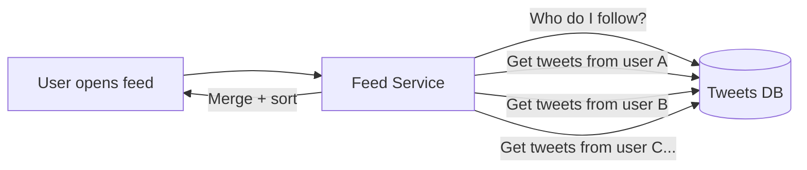
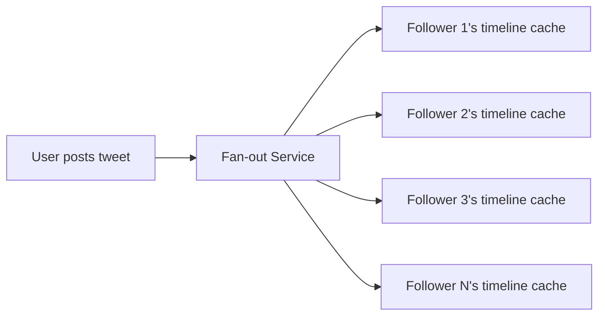
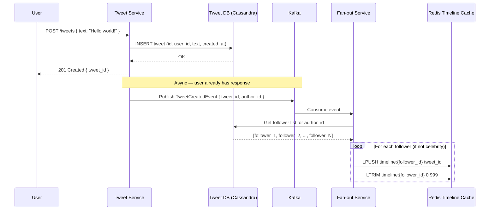
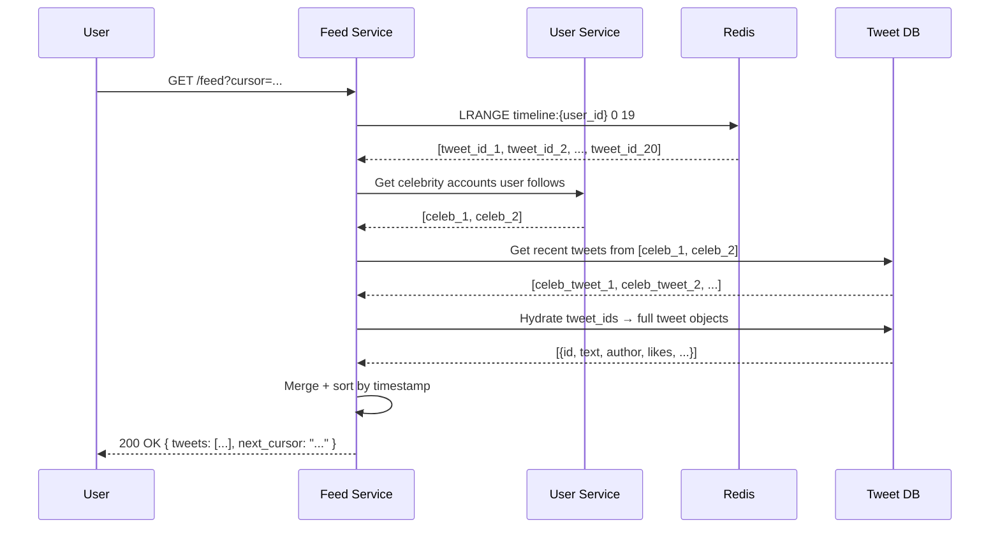

# 04 — Design Twitter / Social Feed

> **Case Study #4** — Intermediate
> Systems like: Twitter/X, Instagram Feed, LinkedIn Feed

---

## The Problem

Twitter lets users post short messages (tweets). When you follow someone, their tweets appear in your feed. Simple idea — but with 300 million active users, some accounts with 100 million followers, and a requirement that new tweets appear in followers' feeds within seconds, this becomes one of the most interesting feed design problems in the industry.

The core challenge: when Elon Musk tweets, how do you update 100 million timelines in real time without melting your servers?

---

## Step 1 — Requirements

### Clarifying Questions to Ask

```
"How many daily active users?"
"What's the average and maximum follower count?"
"Do we need real-time delivery or is a few seconds acceptable?"
"What goes in the feed — only tweets or also retweets, likes?"
"Do we need trending topics, search, ads?"
"Should the feed be purely chronological or ranked?"
```

### Functional Requirements

| # | Requirement |
|---|---|
| FR-1 | Users can post tweets (text, up to 280 chars) |
| FR-2 | Users can follow/unfollow other users |
| FR-3 | User sees a feed of tweets from people they follow |
| FR-4 | New tweets appear in followers' feeds within a few seconds |
| FR-5 | Feed is paginated — load more as user scrolls |

**Out of scope:** Trending topics, search, ads, notifications, direct messages, media uploads (treated as pre-uploaded URLs).

### Non-Functional Requirements

| NFR | Target |
|---|---|
| Availability | 99.99% |
| Feed load latency | P99 < 300ms |
| Tweet delivery to feed | Within 5 seconds for most users |
| Read/write ratio | ~100:1 (far more reads than tweets posted) |

---

## Step 2 — Scale Estimation

```
Daily Active Users:     300 million
Average tweets/user/day: 0.1 (most users read, few tweet)
Total tweets/day:        300M × 0.1 = 30 million/day
Tweet write RPS:         30M / 86,400 ≈ 350 writes/sec

Feed reads:             300M users × 5 feed loads/day
Feed read RPS:          300M × 5 / 86,400 ≈ 17,000 reads/sec
Peak read RPS:          17,000 × 3 ≈ 51,000 reads/sec

Average followers per user: 200
Max followers (celebrities): 100 million
```

**What this tells us:**
- 350 tweet writes/sec — manageable
- 51,000 feed reads/sec — caching is essential
- 100 million followers for one account — this is the hard problem

---

## Step 3 — The Core Problem: How Do You Build a Feed?

There are two fundamental approaches. Understanding why one fails at scale is the key insight.

### Approach A — Pull Model (Fan-out on Read)

When a user opens their feed, the system:
1. Looks up everyone they follow
2. Fetches the latest tweets from each of those accounts
3. Merges and sorts the results
4. Returns to the user



**Problem:** If you follow 1,000 people, loading your feed requires 1,000 database queries — then merging and sorting 1,000 result sets. At 51,000 reads/sec, this is catastrophically slow. A user following 1,000 accounts multiplies your DB load by 1,000.

### Approach B — Push Model (Fan-out on Write)

When a user posts a tweet, the system immediately pushes it into every follower's pre-computed timeline.



**Benefit:** Feed reads are instant — just read from the pre-computed cache.

**Problem:** A user with 10 million followers posts a tweet — the system must write to 10 million timeline caches. This takes minutes, not seconds.

### The Real Answer — Hybrid Model

Use push for regular users, pull for celebrities.

```
"Celebrity" = user with more than X followers (e.g. 1 million)

Normal user tweets (say, 200 followers):
  → Fan-out immediately to 200 follower timelines (fast)

Celebrity tweets (say, 100 million followers):
  → Store tweet in celebrity's tweet store only
  → When any follower opens their feed:
    → Load their pre-computed timeline (push model)
    → Merge in latest tweets from celebrities they follow (pull)
    → Return combined result

This way, the celebrity's tweet is fetched at read time
for each reader — distributing the load over time
instead of causing a massive write spike.
```

---

## Step 4 — High-Level Design

```mermaid
graph TB
    Client["Client (Mobile/Web)"]

    subgraph Edge
        LB["Load Balancer / CDN"]
    end

    subgraph Services
        TS["Tweet Service\n(write tweets)"]
        FS["Fan-out Service\n(push to timelines)"]
        FeedSvc["Feed Service\n(read timelines)"]
        UserSvc["User Service\n(follows/profile)"]
    end

    subgraph Storage
        TweetDB[("Tweet Store\nCassandra\nAll tweets ever")]
        UserDB[("User Store\nPostgreSQL\nProfiles + follows)"]
        TimelineCache[("Timeline Cache\nRedis\nPre-built feeds)"]
        MediaStore[("Media Store\nS3 + CDN\nImages/videos")]
    end

    subgraph Async
        MQ["Message Queue\n(Kafka)\nTweet events"]
    end

    Client --> LB
    LB --> TS & FeedSvc & UserSvc

    TS -->|"store tweet"| TweetDB
    TS -->|"publish event"| MQ
    MQ --> FS
    FS -->|"push to timelines"| TimelineCache

    FeedSvc -->|"read timeline"| TimelineCache
    FeedSvc -->|"cache miss or celebrity"| TweetDB
    FeedSvc -->|"who is celebrity?"| UserSvc
```

---

## Step 5 — Tweet Write Flow



**Why store only `tweet_id` in the timeline, not the full tweet?**

If we stored the full tweet text in every follower's timeline, and the author edits or deletes the tweet, we'd need to update it in every timeline. Instead, we store only the ID. When reading, we fetch tweet content in a second pass. This keeps the timeline cache small and the tweet data consistent.

**Why `LTRIM 0 999`?**

We only keep the 1,000 most recent tweet IDs per timeline. Older content is fetched from the tweet database if needed. This bounds the memory usage per user.

---

## Step 6 — Feed Read Flow



---

## Step 7 — Database Design

### Tweet Storage — Cassandra

Tweets are write-heavy and accessed by `user_id + time range`. Cassandra's wide-column model is perfect.

```sql
-- Cassandra table (schema concept)
-- Partition key: author_id (all tweets by one user together)
-- Clustering key: tweet_id DESC (newest first)

CREATE TABLE tweets (
    author_id   UUID,
    tweet_id    BIGINT,    -- Snowflake ID (encodes timestamp)
    text        TEXT,
    media_urls  LIST<TEXT>,
    like_count  COUNTER,
    created_at  TIMESTAMP,
    PRIMARY KEY (author_id, tweet_id)
) WITH CLUSTERING ORDER BY (tweet_id DESC);
```

### User and Follow Storage — PostgreSQL

```sql
CREATE TABLE users (
    id           UUID PRIMARY KEY,
    username     VARCHAR(50) UNIQUE NOT NULL,
    follower_count INT DEFAULT 0,
    following_count INT DEFAULT 0,
    is_celebrity BOOLEAN DEFAULT FALSE
);

CREATE TABLE follows (
    follower_id  UUID,
    following_id UUID,
    created_at   TIMESTAMP DEFAULT NOW(),
    PRIMARY KEY (follower_id, following_id)
);

-- Essential indexes
CREATE INDEX idx_follows_following ON follows(following_id);
-- "who follows this user?" — needed for fan-out
```

---

## Step 8 — Handling the Celebrity Problem In Detail

Let's trace exactly what happens when a celebrity with 50 million followers posts a tweet.

```
Without hybrid model:
  Celebrity posts tweet
  Fan-out service must write to 50M timeline caches
  At 100K writes/sec → takes 500 seconds = 8+ minutes
  Other users' fan-outs are blocked waiting
  System appears down for normal users during this time

With hybrid model:
  Celebrity posts tweet
  Tweet stored in Cassandra (fast)
  Fan-out service checks: follower_count > 1M → celebrity skip
  Event published to "celebrity tweet" Kafka topic

  When any follower opens their feed:
    Redis timeline loaded (regular accounts already fanned out)
    Feed service checks: do I follow any celebrities?
    If yes → fetch recent tweets from each celebrity from Cassandra
    Merge: [regular timeline] + [celebrity tweets] sorted by time
    Return
```

**The threshold matters:** Setting it too low means too many accounts trigger pull mode (slower reads). Too high means the fan-out spike is still too large. Experiment and tune — different platforms use different thresholds.

---

## Step 9 — Pagination with Cursor-Based Design

**Don't use offset-based pagination:**
```
GET /feed?page=2&limit=20

Problem: if new tweets are posted between page 1 and page 2 loads,
  items shift — users see duplicates or miss content
```

**Use cursor-based pagination:**
```
GET /feed?cursor=tweet_id_123&limit=20

Cursor is the tweet_id of the last seen item.
Next page: all items with tweet_id < cursor
→ New tweets appearing at the top don't affect previous pages
→ No duplicates, no missed items
```

---

## Step 10 — Trade-offs

| Decision | Chose | Gave Up | Why Acceptable |
|---|---|---|---|
| **Fan-out model** | Hybrid (push normal, pull celebrity) | Complexity — two code paths | Necessary to handle 100M follower accounts without 8-minute delays |
| **Tweet storage** | Cassandra | Complex queries, joins | Write-heavy time-series access pattern is Cassandra's strength |
| **Timeline** | Redis list of tweet IDs | Extra DB call to hydrate | Keeps cache small; tweet edits/deletes stay consistent |
| **Feed** | Eventual consistency | Feed may lag 1–5 seconds | Users don't notice a few seconds; availability is more important |
| **Pagination** | Cursor-based | More complex than offset | Eliminates duplicates and skipped items on new content |

---

## Step 11 — Follow-up Questions

**"How do you handle a user with 100 million followers who posts frequently?"**

Implement write throttling for celebrity accounts at the fan-out service. Rate limit how many celebrity tweets are fanned-out simultaneously. Additionally, batch celebrity tweets together — rather than updating timelines per-tweet, aggregate 5 minutes of tweets and push as one batch.

**"What if a user unfollows someone — how do you clean up the timeline?"**

Don't clean it eagerly. The next time the user loads their feed, tweets from the unfollowed user are simply not included when hydrating IDs. The stale IDs in Redis will expire or be pushed out naturally. This "lazy cleanup" avoids expensive immediate cache updates.

**"How would you add a ranked feed instead of chronological?"**

The ranking signals (engagement rate, recency, relationship strength) are computed offline and stored as scores. At read time, the timeline isn't sorted purely by time — a scoring service reorders tweets based on ML model predictions. This requires storing more data per timeline entry and adds ranking latency.

**"How would you handle a trending hashtag seen by millions simultaneously?"**

Cache the trending topic page aggressively — it's the same for everyone. A single CDN-cached response for `#WorldCup` serves millions of users without hitting your servers. This is fundamentally different from personalised feeds.

---

## Summary

| Component | Choice | Reason |
|---|---|---|
| **Tweet storage** | Cassandra | Write-optimised, time-ordered by user |
| **Timeline cache** | Redis (list of tweet IDs) | Fast reads; bounded memory per user |
| **Fan-out** | Hybrid: push for normal users, pull for celebrities | Avoids spike writes to 100M caches |
| **Feed delivery** | Eventual consistency (< 5 seconds) | Acceptable for social feeds |
| **Pagination** | Cursor-based | Stable pages even as new tweets arrive |

**The core insight:** The problem isn't writing tweets — 350 writes/sec is trivial. The problem is delivering those tweets to followers fast enough. The fan-out model exists entirely to move work from read time to write time. The celebrity problem shows the limit of that approach, requiring a hybrid that accepts slightly more complex reads to avoid catastrophic write spikes.

---

*System Design Engineering Handbook — Case Studies*