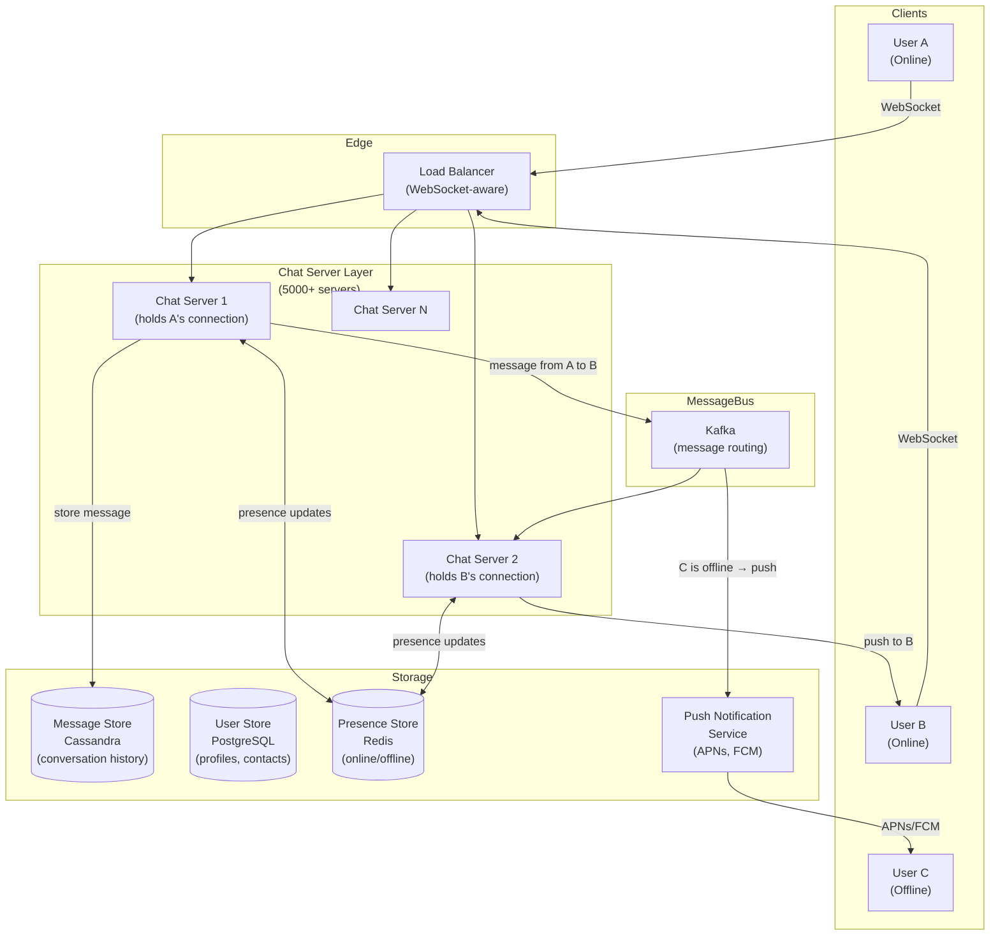
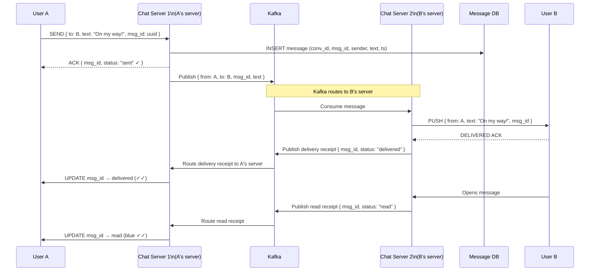
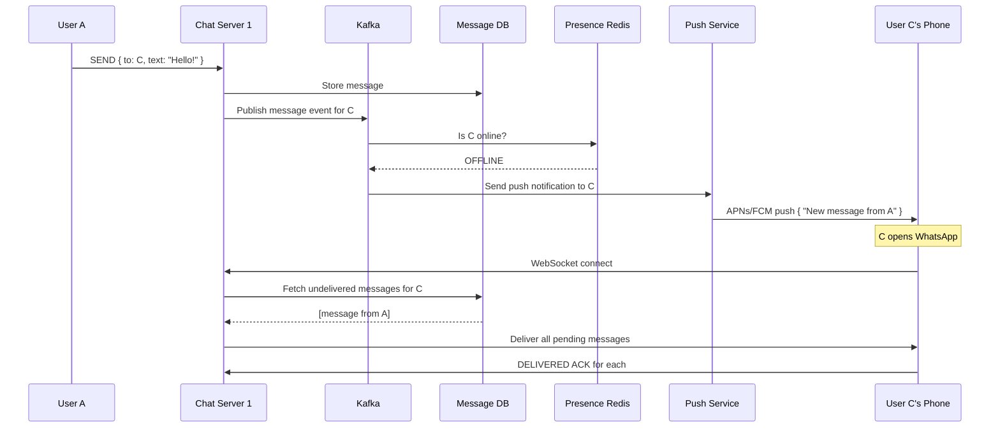

# 05 — Design WhatsApp / Chat System

> **Case Study #5** — Intermediate
> Systems like: WhatsApp, Facebook Messenger, iMessage, Telegram

---

## The Problem

WhatsApp delivers 100 billion messages per day. When you send "On my way!", it must arrive to your friend within a second — even if they're on a slow mobile connection in another country. The app must show you when messages are delivered, when they're read, and when your friend is typing.

The fundamental challenge: how do you maintain persistent, real-time connections with billions of mobile devices and deliver messages reliably, in order, even when devices go offline?

---

## Step 1 — Requirements

### Clarifying Questions to Ask

```
"One-to-one messaging only, or group chats too?"
"Do we need end-to-end encryption?"
"Should we store message history on the server?"
"Do we need read receipts and delivery receipts?"
"What about media — images, video, voice messages?"
"How many users are we targeting?"
```

### Functional Requirements

| # | Requirement |
|---|---|
| FR-1 | Users can send and receive text messages in real time |
| FR-2 | One-to-one and group messaging (up to 256 members) |
| FR-3 | Messages delivered when recipient comes online (offline delivery) |
| FR-4 | Delivery receipt (✓) and read receipt (✓✓) |
| FR-5 | Online/offline presence indicator |
| FR-6 | Message history — users can scroll back |

**Out of scope:** End-to-end encryption internals (assume messages are E2E encrypted at the app layer), voice/video calling, story features, payment integration.

### Non-Functional Requirements

| NFR | Target |
|---|---|
| Message delivery latency | < 500ms for online users |
| Availability | 99.99% |
| Message ordering | Preserved per conversation |
| Durability | No message loss |
| Scale | 500 million DAU, 100 billion messages/day |

---

## Step 2 — Scale Estimation

```
DAU:                       500 million
Messages per user per day: 40
Total messages/day:        500M × 40 = 20 billion

Message write RPS:         20B / 86,400 ≈ 231,000/sec
Peak write RPS:            231,000 × 2 ≈ 462,000/sec

Average message size:      100 bytes (text only)
Daily storage:             231,000 × 86,400 × 100 bytes ≈ 2 TB/day
5-year storage:            2 TB × 365 × 5 ≈ 3.65 PB

Concurrent connections:    50% of DAU online at peak
                          = 250 million persistent connections
```

**What this tells us:**
- 462,000 writes/sec → needs a write-optimised distributed store (Cassandra)
- 250 million persistent connections → WebSockets, many servers
- 3.65 PB over 5 years → cold message archival needed

---

## Step 3 — The Connection Problem: WebSockets

HTTP is request-response — the client must ask for new messages. That means polling ("do you have messages for me?") which is wasteful and slow. For real-time chat, we need the server to **push** messages to clients the moment they arrive.

**WebSocket** solves this. It upgrades an HTTP connection to a persistent bidirectional TCP connection. Once established, either side can send data at any time.

```
HTTP (polling):
  Client: "Any new messages?" → Server: "No"    (every 1 second)
  Client: "Any new messages?" → Server: "No"
  Client: "Any new messages?" → Server: "Yes! Here's a message"
  → Minimum 1 second delay; wasteful

WebSocket (push):
  Client opens connection → stays open
  Server: "Here's a message!" (instantly when it arrives)
  Server: "Here's another!" (instantly)
  → Sub-100ms delivery; efficient
```

### The Challenge: 250 Million Persistent Connections

Each connection is held by a chat server. One server can hold ~50,000 WebSocket connections (limited by file descriptors and memory). For 250 million connections:

```
Servers needed = 250M / 50,000 = 5,000 chat servers
```

This is why WhatsApp uses Erlang — its lightweight process model allows millions of connections per node. But for our design, we'll plan for thousands of servers.

---

## Step 4 — High-Level Design



---

## Step 5 — Message Send Flow (Both Users Online)



---

## Step 6 — Offline Message Delivery

When User C is offline, their chat server connection doesn't exist.



**Key detail:** The push notification doesn't contain the message — just a notification to open the app. When the app opens, it fetches messages directly from the chat server over a new WebSocket connection. This keeps message content on the secure channel, not in the push notification system.

---

## Step 7 — Presence System

Presence (online/offline/last seen) is one of the trickiest parts. Showing online status requires constant heartbeats and careful handling of disconnects.

```
When user connects:
  Chat server: SET presence:{user_id} = "online" EX 30 (Redis, TTL 30s)
  
Every 10 seconds (heartbeat):
  Chat server: SET presence:{user_id} = "online" EX 30 (refresh TTL)

When user disconnects (gracefully):
  Chat server: SET presence:{user_id} = "offline"
  Chat server: SET last_seen:{user_id} = current_timestamp

When user disconnects (network drop — no graceful close):
  No explicit disconnect signal
  Redis TTL expires after 30 seconds
  → User automatically appears offline after ~30 seconds
```

**Trade-off:** There's a 30-second window where a user who just lost connection still appears online. This is acceptable — perfectly instant presence is too expensive. WhatsApp and most chat apps accept this delay.

**Scale challenge:** With 500M users, broadcasting presence changes to all contacts is expensive. Solution: only send presence updates to contacts who are currently online. Fetch presence lazily — only when a user opens a conversation.

---

## Step 8 — Message Storage in Cassandra

Messages are the highest-volume data in the system. We need:
- Very high write throughput (231K/sec)
- Efficient retrieval: "get last 50 messages in conversation X"

Cassandra's wide-column model is ideal.

```sql
-- Cassandra schema (conceptual)
-- Partition key: conversation_id (all messages in one chat together)
-- Clustering key: message_id DESC (newest first, for reverse scroll)

CREATE TABLE messages (
    conversation_id UUID,
    message_id      BIGINT,      -- Snowflake ID (embeds timestamp)
    sender_id       UUID,
    message_type    TEXT,        -- 'text', 'image', 'voice'
    content         TEXT,        -- text or media URL
    status          TEXT,        -- 'sent', 'delivered', 'read'
    created_at      TIMESTAMP,
    PRIMARY KEY (conversation_id, message_id)
) WITH CLUSTERING ORDER BY (message_id DESC);
```

**Why message_id as a Snowflake ID?**

A Snowflake ID encodes a timestamp in the first 41 bits, so:
- IDs are sortable chronologically without a separate `created_at` column
- IDs are globally unique without coordination
- The clustering key on message_id DESC gives us newest-first ordering for free

---

## Step 9 — Group Messages

Group chats (up to 256 members) work differently from one-to-one.

```
For a group of 256 members:

Option A — Fan-out at send time:
  When A sends to group, replicate message to 255 recipients' queues
  256 writes per message
  At 231K messages/sec × 256 = 59M writes/sec → too expensive

Option B — Single write, fan-out at read:
  Store the message once with group_id
  Each member fetches messages using group_id as partition key
  Members' message cursors (last_read_id) determine "new" messages
  → 1 write per group message regardless of group size ✅

Chosen: Option B (single write)
```

```sql
-- Group membership
CREATE TABLE group_members (
    group_id   UUID,
    user_id    UUID,
    joined_at  TIMESTAMP,
    PRIMARY KEY (group_id, user_id)
);

-- Track what each user has read in each group
CREATE TABLE user_group_cursors (
    user_id    UUID,
    group_id   UUID,
    last_read_message_id BIGINT,
    PRIMARY KEY (user_id, group_id)
);
```

When a user opens a group chat:
1. Fetch `last_read_message_id` for this user + group
2. Fetch messages from the group's Cassandra partition with `message_id > last_read_message_id`
3. Update the cursor

---

## Step 10 — Message Ordering Guarantee

Within a conversation, messages must appear in the order they were sent. This seems simple but breaks in distributed systems.

```
Problem:
  A sends message at T=100 → routes to Chat Server 1
  B sends message at T=101 → routes to Chat Server 2
  Server 1 is slightly slower to write to Cassandra
  
  Cassandra receives:
    B's message (T=101) first
    A's message (T=100) second
  
  Storage order might not match send order.
```

**Solution: Snowflake IDs as the ordering key.** The Snowflake ID encodes the server's local timestamp. Combined with conversation-level sequencing (a per-conversation message sequence number), we guarantee total ordering within a conversation.

For our scale, Snowflake IDs alone are sufficient — the 1ms clock precision means only messages sent within the same millisecond could be out of order, and for those we use the sequence component of the Snowflake ID.

---

## Step 11 — Trade-offs

| Decision | Chose | Gave Up | Why Acceptable |
|---|---|---|---|
| **Connection protocol** | WebSocket | Stateless HTTP simplicity | HTTP polling is too slow and wastes bandwidth for real-time chat |
| **Message routing** | Kafka between chat servers | Direct server-to-server adds complexity | Kafka decouples servers; scales independently; provides durability |
| **Message storage** | Cassandra | Complex queries, joins | 231K writes/sec requires write-optimised, horizontally scalable store |
| **Offline delivery** | Push notification (no content) | App must connect to fetch | Security — message content never passes through push notification systems |
| **Group messages** | Single write, pull model | Slightly more complex read | Avoids multiplicative write cost for large groups |
| **Presence** | 30-second TTL | 30-second lag on network disconnect | Instant presence detection requires constant heartbeats — too expensive at scale |

---

## Step 12 — Follow-up Questions

**"How do you handle message ordering when users are on unreliable mobile connections?"**

The client maintains a local sequence counter and includes it in each message. If the server receives message #5 after message #7 (due to network reordering), it buffers #7 and waits for the gap to fill. A per-conversation sequence number in the database ensures the total order is always preserved in storage.

**"How would you implement end-to-end encryption?"**

E2E encryption happens at the client layer — the server never sees plaintext. WhatsApp uses the Signal Protocol: each user has a public/private key pair. When A sends to B, A encrypts using B's public key. The server stores and routes ciphertext only. The server cannot read any message content. Our server-side design is unchanged — we just store and route bytes we can't read.

**"How do you handle 10 million messages/second for a global viral event?"**

Horizontal scaling: more Kafka partitions, more Cassandra nodes, more chat servers. The architecture is designed to scale linearly — each layer adds capacity by adding nodes. The bottleneck would be the Cassandra write throughput, which we'd handle by pre-sharding the keyspace and provisioning more nodes in advance of predicted spikes.

**"What if a chat server crashes while users are connected?"**

Clients detect the WebSocket disconnect (within seconds). They reconnect via the load balancer, which routes them to a different chat server. During reconnect, the client fetches any messages it may have missed from Cassandra using its last received message ID as a cursor. No messages are lost — they're in Cassandra. Only the in-flight delivery may be delayed by a few seconds.

---

## Summary

| Component | Choice | Reason |
|---|---|---|
| **Real-time connection** | WebSocket | Push delivery; persistent bidirectional |
| **Message routing** | Kafka | Decouples chat servers; durability; replay |
| **Message storage** | Cassandra | 231K writes/sec; time-ordered per conversation |
| **Offline delivery** | Push notifications (APNs/FCM) | Only way to reach offline mobile devices |
| **Presence** | Redis with TTL | Fast reads; auto-expires on disconnect |
| **Group messages** | Single write + cursor per user | Avoids multiplicative write cost |

**The core insight:** Chat is fundamentally a connection management and message routing problem. The hard parts are: maintaining 250 million persistent WebSocket connections, routing messages between servers efficiently, and guaranteeing delivery even when recipients are offline. Kafka handles the routing. Cassandra handles the durability. Push notifications handle offline delivery.

---

*System Design Engineering Handbook — Case Studies*