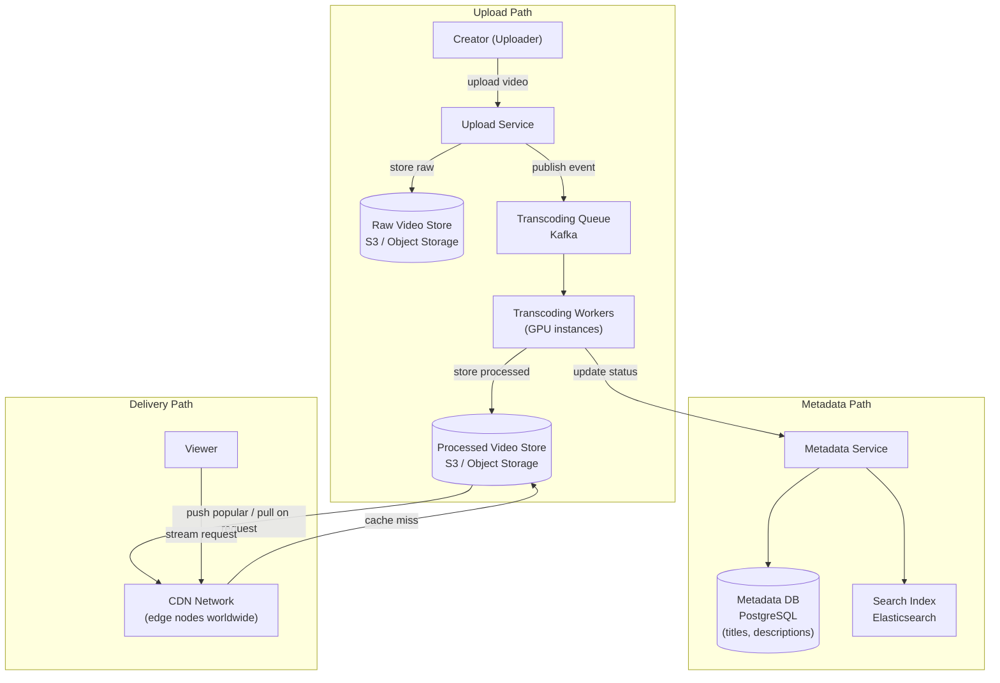
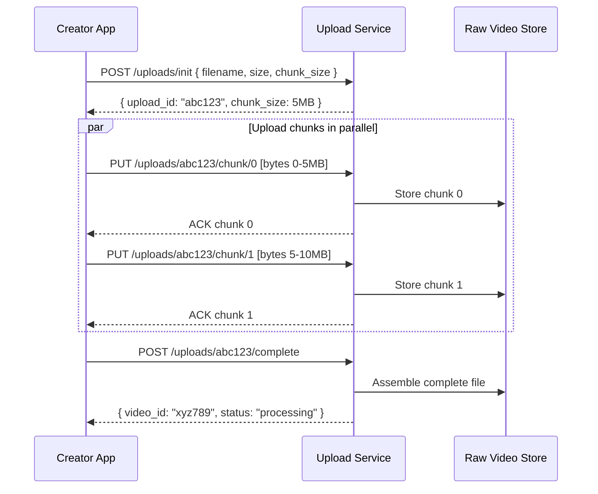
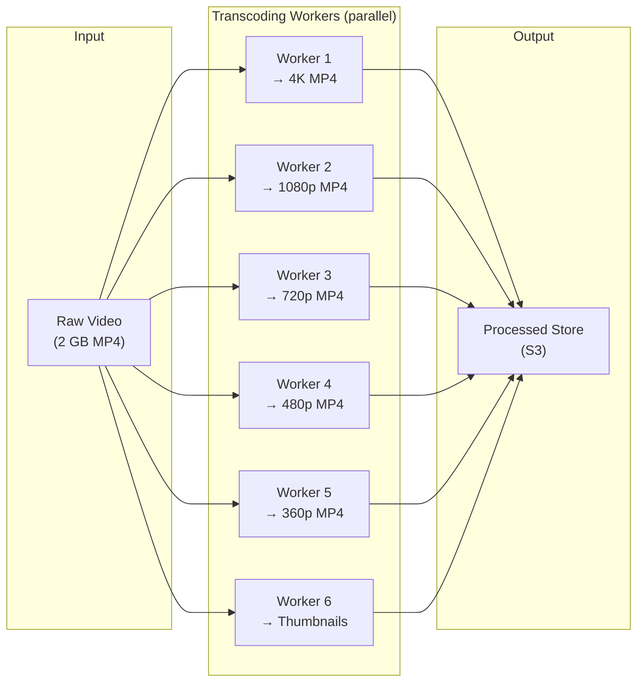
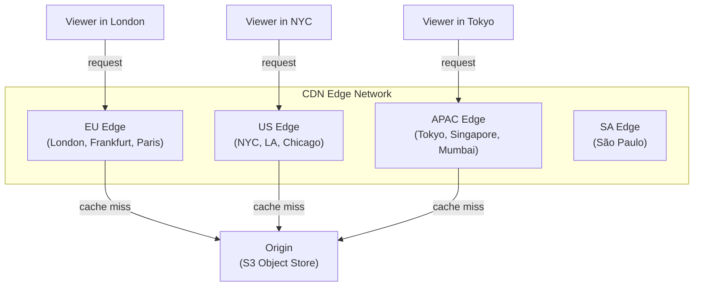

# 06 — Design YouTube / Video Platform

> **Case Study #6** — Intermediate
> Systems like: YouTube, Netflix, Vimeo, TikTok

---

## The Problem

YouTube has 2 billion users. 500 hours of video are uploaded every minute. A video uploaded in Mumbai must be playable within minutes — at multiple quality levels — for users in Tokyo, São Paulo, and London, all simultaneously.

The core challenges: handling massive video uploads, transcoding into multiple formats, and delivering video to billions of users globally with minimal buffering.

---

## Step 1 — Requirements

### Clarifying Questions to Ask

```
"Do we need live streaming or only pre-recorded video?"
"What video qualities should we support?"
"How quickly after upload should the video be available?"
"Do we need recommendations, search, comments?"
"What's the upload size limit?"
"Mobile and desktop, or web only?"
```

### Functional Requirements

| # | Requirement |
|---|---|
| FR-1 | Users can upload videos (up to 10 GB) |
| FR-2 | Videos available to watch within minutes of upload |
| FR-3 | Stream at multiple quality levels (360p, 720p, 1080p, 4K) |
| FR-4 | Adaptive bitrate — quality adjusts to connection speed |
| FR-5 | Users can like, comment, subscribe |
| FR-6 | View count and engagement metrics |

**Out of scope:** Live streaming, recommendations engine, ad system, creator monetisation, content moderation.

### Non-Functional Requirements

| NFR | Target |
|---|---|
| Video availability post-upload | Within 5 minutes |
| Playback start time | < 2 seconds |
| Availability | 99.99% |
| Durability | No video loss |
| Global scale | 2 billion users, 1 billion hours watched/day |

---

## Step 2 — Scale Estimation

```
Uploads:
  500 hours of video uploaded per minute
  = 500 × 60 = 30,000 seconds of video per minute
  Average file size: 1 GB per hour of video
  Upload data rate: 500 GB/minute = ~8.3 GB/second ingress

Views:
  1 billion hours watched per day
  = 1B × 3600 seconds = 3.6 trillion seconds/day
  = 41 million seconds of video watched per second

Assuming average 720p bitrate = 2.5 Mbps:
  Egress bandwidth = 41M streams × 2.5 Mbps
  → This is impossibly high from a single origin
  → CDN is not optional — it is the entire delivery strategy

Storage:
  After transcoding (5 quality levels × 3× original size):
  ~15 GB stored per hour of uploaded video
  Daily new storage: 500 hours × 60 min × 15 GB ≈ 450 TB/day
```

**What this tells us:**
- CDN must serve nearly all traffic — no architecture works without it
- Video processing pipeline must be massively parallel
- Object storage (S3-like) is the only viable solution for petabytes of video

---

## Step 3 — The Two Big Problems

### Problem 1 — Video Upload and Processing

A user uploads a single 2 GB MP4 file. It needs to become:
- 4K MP4 (for 4K TVs)
- 1080p MP4 (for desktop)
- 720p MP4 (for tablets)
- 480p MP4 (for mobile)
- 360p MP4 (for slow connections)
- Thumbnail images
- Audio-only track (for background play)

All within 5 minutes. That's a massive amount of transcoding work.

### Problem 2 — Video Delivery

Once transcoded, serving 1 billion hours of video per day globally is impossible from a single data centre. The video files must be physically close to the viewer.

---

## Step 4 — High-Level Architecture



---

## Step 5 — Video Upload Flow

Uploading a 2 GB file over a flaky internet connection is hard. We need to handle network interruptions gracefully.

### Resumable Upload with Chunking

```
Instead of one giant HTTP request (which fails if connection drops):

1. Client splits video into 5 MB chunks
2. Upload Service assigns an upload session ID
3. Client uploads chunks in parallel (4-8 simultaneous connections)
4. Each chunk gets an ACK from the server
5. If connection drops, client resumes from last ACKed chunk
6. When all chunks received, server assembles the complete file

Benefits:
  - Upload resumes from where it stopped (not from zero)
  - Multiple parallel connections saturate the upload bandwidth
  - Progress tracking is accurate
  - Server can start processing early chunks while later ones upload
```



---

## Step 6 — Video Transcoding Pipeline

This is the most computationally intensive part of the system. Transcoding a 1-hour video to 5 quality levels takes significant GPU time.



### How Transcoding Works

```
Transcoding = converting a video from one format/resolution to another

Input: raw 4K video at 50 Mbps
Output: 720p video at 2.5 Mbps

Process:
  1. Decode each frame of the input video (GPU-accelerated)
  2. Resize from 3840×2160 to 1280×720
  3. Re-encode using H.264/H.265 codec at target bitrate
  4. Package as MP4 or HLS segments

This is CPU/GPU intensive — a 1-hour video at 1080p
takes approximately 20-40 minutes to transcode on a single core.
With GPU acceleration and parallelism, we target < 5 minutes.
```

### DAG-Based Processing Pipeline

Break the transcoding job into a Directed Acyclic Graph (DAG) of tasks that can run in parallel:

```
Video received
    │
    ├─→ Extract audio track
    ├─→ Generate thumbnail frames (at 0s, 10s, 30s, 60s...)
    ├─→ Transcode 4K (if original is 4K)
    ├─→ Transcode 1080p
    ├─→ Transcode 720p
    ├─→ Transcode 480p
    └─→ Transcode 360p

All branches run in parallel on different worker nodes
When all complete → video marked "available"
```

A Kafka topic holds the transcoding jobs. Worker nodes consume jobs and process in parallel. When all segments for a video are complete, the orchestrator marks the video as available.

---

## Step 7 — Video Delivery with Adaptive Bitrate

Once a video is transcoded, how does a viewer stream it?

### Adaptive Bitrate Streaming (ABR)

Instead of serving one video file, serve many small segments. The player monitors connection speed and requests the appropriate quality level for each segment.

```
Video divided into 2-second segments:
  segment_001_4k.ts
  segment_001_1080p.ts
  segment_001_720p.ts
  segment_001_480p.ts
  segment_001_360p.ts

  segment_002_4k.ts
  ...

Manifest file (M3U8/MPD) lists all available segments:
  #EXTM3U
  #EXT-X-STREAM-INF:BANDWIDTH=8000000,RESOLUTION=3840x2160
  4k/segment_001.ts
  #EXT-X-STREAM-INF:BANDWIDTH=4000000,RESOLUTION=1920x1080
  1080p/segment_001.ts
  ...
```

**The player's adaptive algorithm:**

```
Player measures download speed for each segment.

Download speed > 4 Mbps → request 1080p segments
Download speed drops to 1.5 Mbps → switch to 480p mid-video
Download speed recovers → gradually switch back up to 1080p

Result: continuous playback with quality adapting to
        available bandwidth — minimises buffering
```

---

## Step 8 — CDN Strategy

The CDN is where all the scale lives. No single origin server can serve 41 million simultaneous video streams.



**Cache strategy:**
- Popular videos: cached at all edge nodes indefinitely (set by like/view count threshold)
- New videos: cached on first request at the nearest edge node, propagates as more users watch
- Very old/unpopular videos: served from origin (they'll rarely be requested)

**CDN cache hit rate target: 95%+**

At 95% hit rate, only 5% of requests reach the origin. At our scale, that's the difference between manageable origin traffic and catastrophic origin overload.

---

## Step 9 — Metadata Storage

Video files live in object storage. Everything else (title, description, view count, likes, comments) lives in structured databases.

```sql
-- Video metadata
CREATE TABLE videos (
    id           UUID PRIMARY KEY,
    creator_id   UUID NOT NULL,
    title        VARCHAR(255),
    description  TEXT,
    status       VARCHAR(20),   -- 'processing', 'available', 'deleted'
    duration_sec INT,
    view_count   BIGINT DEFAULT 0,
    like_count   BIGINT DEFAULT 0,
    created_at   TIMESTAMPTZ DEFAULT NOW()
);

-- Video quality variants
CREATE TABLE video_files (
    video_id   UUID,
    quality    VARCHAR(10),   -- '4k', '1080p', '720p', '480p', '360p'
    file_url   TEXT,          -- S3/CDN URL
    file_size  BIGINT,        -- bytes
    bitrate    INT,           -- kbps
    PRIMARY KEY (video_id, quality)
);
```

**View counts are a special problem:** Incrementing a counter for every view at 1 billion views/day = 11,600 increments/second on that column. At peak, a viral video might have 100,000 simultaneous viewers. Updating a single row 100,000 times per second locks the row and kills performance.

**Solution:** Count views asynchronously.

```
View happens → publish to Kafka "view event"
Aggregation service consumes events → batches them
Every 10 seconds → bulk update view_count for each video

Result: one DB write per 10 seconds instead of one per view
        Some lag (10s) but users don't notice
        View count is approximate (acceptable for display)
```

---

## Step 10 — Trade-offs

| Decision | Chose | Gave Up | Why Acceptable |
|---|---|---|---|
| **Upload** | Chunked resumable | Simpler single-request upload | Mobile connections drop; 10 GB files need resumability |
| **Transcoding** | Async pipeline | Video not immediately available | 5-minute delay is acceptable; live transcoding is too slow |
| **Delivery** | CDN with ABR | Origin serves nothing directly | Only way to serve 41M simultaneous streams globally |
| **View counts** | Async batching | Exact real-time count | 10-second lag invisible to users; avoids row-level lock contention |
| **Quality** | Pre-transcoded multiple qualities | Storage is 5× original size | Avoids real-time transcoding which would be too slow per-viewer |

---

## Step 11 — Follow-up Questions

**"How do you make a newly uploaded video available quickly?"**

Prioritise the 360p and 480p transcodes — these are fast and let users start watching while higher qualities are still being processed. Show lower quality first, upgrade the manifest file as higher qualities become available. Most users start watching immediately and the quality improves in the background.

**"How do you handle a viral video spike — a video suddenly gets 10 million views in 10 minutes?"**

The CDN absorbs this. A popular video at the edge node handles millions of requests without any origin involvement. The challenge is populating the CDN quickly — the first few requests to each edge node are cache misses. At extreme viral scale, we proactively push the video to all edge nodes before the spike hits (YouTube calls this "warming" the CDN).

**"How do you store thumbnails efficiently?"**

Thumbnails are just images — stored in the same object store as video files, served via CDN. The challenge is auto-generating good thumbnails. Transcode workers extract multiple frames (at 10%, 30%, 50% of video duration), and the system (or ML model) selects the most visually appealing one as the default thumbnail.

**"How would you implement video search?"**

Index video metadata (title, description, tags, transcript) in Elasticsearch. Video transcripts (speech-to-text) dramatically improve search quality — you can find a video about a topic even if the creator didn't tag it correctly.

---

## Summary

| Component | Choice | Reason |
|---|---|---|
| **Upload** | Chunked resumable via Upload Service | Reliability for large files on mobile connections |
| **Storage** | S3 / Object Store | Only viable option for petabytes of video |
| **Transcoding** | Async DAG pipeline with GPU workers | Parallelism achieves < 5 min for all quality levels |
| **Delivery** | HLS/DASH adaptive bitrate via CDN | Eliminates buffering; global scale impossible without CDN |
| **Metadata** | PostgreSQL | Structured data, manageable volume |
| **View counts** | Async via Kafka | Avoids write contention at high concurrent view rates |

**The core insight:** Video delivery is a data locality problem. Every other engineering challenge is secondary to the fundamental requirement that video bytes must be physically close to the viewer. The CDN is not an optimisation — it is the entire delivery architecture. Every other decision (transcoding pipeline, ABR, chunked upload) exists to make CDN delivery work correctly and efficiently.

---

*System Design Engineering Handbook — Case Studies*