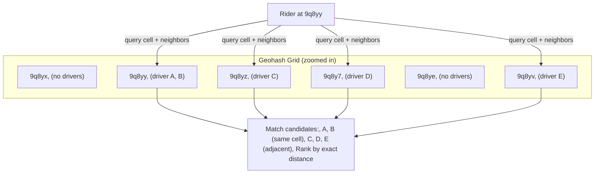
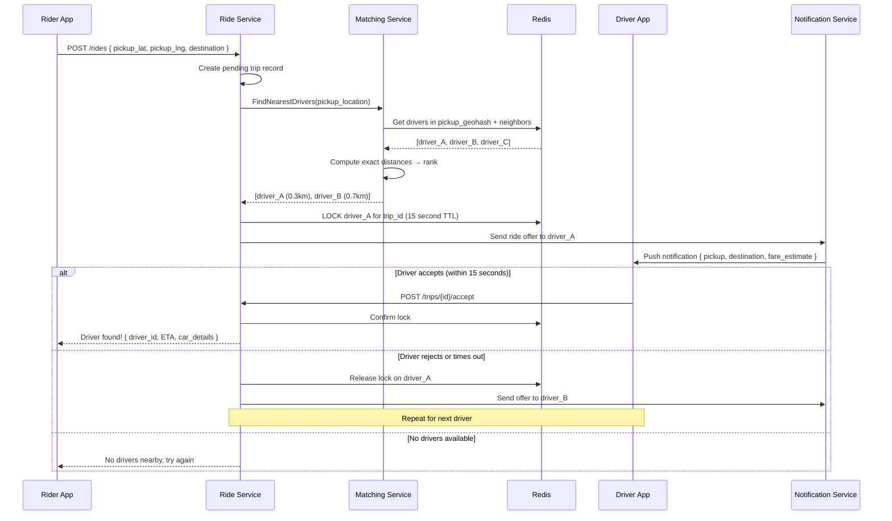
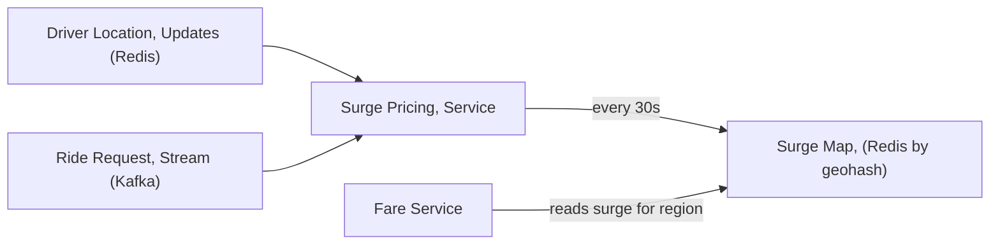

# 07 — Design Uber / Ride Sharing

> **Case Study #7** — Intermediate
> Systems like: Uber, Lyft, Ola, Grab, Didi

---

## The Problem

Uber connects a rider who needs a lift with the nearest available driver. When you open the app and request a ride, a driver must be found, matched, and assigned — all within seconds. Meanwhile, the map must show you the driver moving in real time, the fare must be calculated, and the payment must be processed when the trip ends.

The core challenges: real-time geospatial matching across millions of concurrent users, and handling the inherent complexity of a two-sided marketplace with dynamic pricing.

---

## Step 1 — Requirements

### Clarifying Questions to Ask

```
"What's the target city count — one city or global?"
"Do we need real-time driver location tracking on the map?"
"Should we design surge pricing?"
"What payment methods — just cards or wallets too?"
"Do we need ride scheduling (book in advance)?"
"Driver and rider ratings?"
```

### Functional Requirements

| # | Requirement |
|---|---|
| FR-1 | Rider can request a ride with pickup and destination |
| FR-2 | System matches rider to nearest available driver |
| FR-3 | Driver can accept or reject ride requests |
| FR-4 | Both rider and driver see real-time location on the map |
| FR-5 | System calculates fare based on distance + time + surge |
| FR-6 | Payment processed automatically at trip end |
| FR-7 | Rider and driver can rate each other |

**Out of scope:** Ride scheduling, driver onboarding, vehicle inspections, driver earnings payout, regulatory compliance.

### Non-Functional Requirements

| NFR | Target |
|---|---|
| Driver matching time | < 3 seconds |
| Location update lag | < 5 seconds (driver appears to move smoothly) |
| Availability | 99.99% |
| Surge accuracy | Price updates within 30 seconds of supply/demand shift |
| Scale | 20 million trips/day, 5 million concurrent drivers |

---

## Step 2 — Scale Estimation

```
Trips per day: 20 million
Trip RPS: 20M / 86,400 ≈ 231 trips/sec
Peak trip RPS: 231 × 3 ≈ 693 trips/sec

Active drivers: 5 million at peak
Location update frequency: every 5 seconds per driver
Location write RPS: 5M / 5 = 1,000,000 writes/sec

Location reads (riders watching driver on map): 
  ~10M active riders checking location every 2 seconds
  = 5,000,000 reads/sec

This location data is the highest-volume data in the system.
```

**What this tells us:**
- 1M location writes/sec → in-memory store (Redis) is mandatory
- 5M location reads/sec → caching and efficient geospatial indexing critical
- Trip creation at 693/sec → manageable with relational DB

---

## Step 3 — The Core Problem: Geospatial Matching

Finding the nearest available driver to a rider's location is the heart of the system. This is a **geospatial nearest-neighbour problem** that must complete in < 1 second.

### Naive Approach (Don't Use)

```
SQL query:
  SELECT driver_id, latitude, longitude
  FROM driver_locations
  WHERE is_available = TRUE
  ORDER BY sqrt((lat - rider_lat)^2 + (lng - rider_lng)^2)
  LIMIT 10;

Problem: Full table scan of 5 million drivers every time.
         Expensive computation for each row.
         At 693 matches/sec: impossible.
```

### Geohashing — The Solution

Divide the Earth into a grid. Each cell in the grid has a unique string code (the geohash). Nearby locations have similar geohash prefixes.

```
The Earth divided into cells of different precision levels:

Geohash length | Cell size
1              | ~5,000 km × 5,000 km  (continental)
4              | ~40 km × 20 km        (city)
6              | ~1.2 km × 0.6 km      (neighbourhood)
7              | ~150 m × 75 m         (city block)
8              | ~38 m × 19 m          (building)

Example:
  Uber HQ, San Francisco: geohash = "9q8yy"
  A nearby location 200m away: geohash = "9q8yy" (same prefix!)
  A location across the city: geohash = "9q8yz" (different)
```

**How we use geohashing for driver matching:**

```
Step 1: When a driver's location updates, compute their geohash (precision 6)
        Store in Redis: SADD "drivers:9q8yy" driver_id
        Store location: HSET "driver:123" lat 37.7749 lng -122.4194

Step 2: When rider requests a ride at position (37.7749, -122.4194):
        Compute rider's geohash: "9q8yy"
        
Step 3: Query Redis for all available drivers in that cell and adjacent cells:
        SMEMBERS "drivers:9q8yy"          (rider's cell)
        SMEMBERS "drivers:9q8yy+neighbor" (8 surrounding cells)
        
Step 4: From the returned driver IDs, calculate exact distances
        (Haversine formula) to find the truly nearest drivers
        
Step 5: Rank by distance, send offer to top 3 drivers
```



---

## Step 4 — High-Level Architecture

```mermaid
graph TB
    subgraph Clients
        RiderApp["Rider App"]
        DriverApp["Driver App"]
    end

    subgraph Gateway
        APIGW["API Gateway, (auth, rate limit)"]
    end

    subgraph Services
        RideSvc["Ride Service, (trip lifecycle)"]
        MatchSvc["Matching Service, (find nearest driver)"]
        LocationSvc["Location Service, (ingest + query)"]
        FareSvc["Fare Service, (calculate price)"]
        PaySvc["Payment Service"]
        NotifySvc["Notification Service, (push to apps)"]
    end

    subgraph Storage
        LocationStore[("Location Store | Redis | driver positions + geohash sets)"]
        TripDB[("Trip DB | PostgreSQL | trips, payments, ratings)"]
        UserDB[("User DB | PostgreSQL | riders + drivers)"]
    end

    subgraph Async
        Kafka["Kafka\n(location updates, trip events)"]
    end

    RiderApp & DriverApp --> APIGW
    APIGW --> RideSvc & LocationSvc

    RideSvc --> MatchSvc
    MatchSvc --> LocationStore
    LocationSvc --> Kafka
    Kafka --> LocationStore

    RideSvc --> FareSvc
    RideSvc --> PaySvc
    RideSvc --> TripDB
    RideSvc --> NotifySvc
    NotifySvc --> DriverApp & RiderApp
```

---

## Step 5 — Location Update Flow

Driver apps send their GPS coordinates every 5 seconds. This is our highest-volume write workload.

```mermaid
sequenceDiagram
    participant D as Driver App
    participant LS as Location Service
    participant Kafka as Kafka
    participant Redis as Redis (Location Store)

    loop Every 5 seconds
        D->>LS: PATCH /location { lat, lng, is_available }
        LS->>Kafka: Publish LocationUpdate { driver_id, lat, lng, geohash }
        LS-->>D: 200 OK

        Kafka->>Redis: Consumer processes update
        Redis: HSET driver:{driver_id} lat {lat} lng {lng}
        Redis: SREM drivers:{old_geohash} {driver_id}
        Redis: SADD drivers:{new_geohash} {driver_id}
    end
```

**Why Kafka in the middle?**

Location service can acknowledge the driver's app immediately (< 10ms) without waiting for Redis writes. Kafka provides a buffer — if Redis is briefly slow, location updates queue up rather than failing. It also allows multiple consumers: the matching service, surge pricing service, and analytics service all consume location data independently.

---

## Step 6 — Ride Request and Matching Flow



**The 15-second lock:** When we offer a trip to a driver, we lock that driver for 15 seconds. During this time, no other rider can be matched to them. If the driver doesn't respond, we release the lock and offer to the next driver. This prevents two riders from being matched to the same driver simultaneously.

---

## Step 7 — Live Map: Rider Watches Driver Approach

Once matched, the rider watches the driver's car move on the map in real time. This requires the rider's app to receive driver location updates continuously.

**Option A — Polling (Simple but wasteful):**
```
Rider app: GET /trips/{id}/driver_location every 2 seconds
Server: query Redis for driver location → return
→ 10M riders × 0.5 requests/sec = 5M reads/sec
  Manageable but wasteful for unchanged locations
```

**Option B — WebSocket / Server-Sent Events (Efficient):**
```
Rider app opens persistent connection to Trip Service
When driver location updates → server pushes to rider's connection
→ Rider always has latest location
→ No polling overhead
→ Only sends updates when location actually changes
```

**Chosen: Server-Sent Events (SSE)** — simpler than WebSockets for unidirectional server→client updates, works through most firewalls and proxies.

---

## Step 8 — Surge Pricing

When demand (riders) exceeds supply (available drivers) in an area, surge pricing increases the fare to attract more drivers.

```
Surge calculation (every 30 seconds, per geohash region):

  riders_requesting  = count of pending ride requests in region
  drivers_available  = count of available drivers in region
  
  supply_demand_ratio = drivers_available / riders_requesting
  
  if ratio < 0.5:  surge = 2.5×  (severe shortage)
  if ratio < 1.0:  surge = 1.5×  (moderate shortage)
  if ratio >= 1.0: surge = 1.0×  (normal)
```



---

## Step 9 — Fare Calculation

When a trip ends, the fare is calculated from the trip data.

```
Fare components:
  Base fare:    flat fee for getting in the car (£2.50)
  Distance:     per-mile rate × miles driven     (£1.50/mile)
  Time:         per-minute rate × minutes         (£0.20/min)
  Surge:        × surge multiplier               (1.0× – 3.0×)
  Minimum fare: max(calculated, £5.00)

Example trip:
  5 miles × £1.50 = £7.50
  20 minutes × £0.20 = £4.00
  Surge = 1.5×
  Total = (£2.50 + £7.50 + £4.00) × 1.5 = £21.00
```

The fare is estimated at the start of the trip (shown to the rider) and recalculated at the end using actual GPS data. The final fare is within a small percentage of the estimate unless the route changed significantly.

---

## Step 10 — Trip Database Schema

```sql
CREATE TABLE trips (
    id              UUID PRIMARY KEY,
    rider_id        UUID NOT NULL,
    driver_id       UUID,
    status          VARCHAR(20),   -- REQUESTED, MATCHED, ACTIVE, COMPLETED, CANCELLED
    pickup_lat      DECIMAL(10,7),
    pickup_lng      DECIMAL(10,7),
    destination_lat DECIMAL(10,7),
    destination_lng DECIMAL(10,7),
    surge_multiplier DECIMAL(4,2) DEFAULT 1.0,
    estimated_fare  DECIMAL(8,2),
    final_fare      DECIMAL(8,2),
    started_at      TIMESTAMPTZ,
    completed_at    TIMESTAMPTZ,
    created_at      TIMESTAMPTZ DEFAULT NOW()
);

CREATE TABLE trip_route_points (
    trip_id     UUID,
    captured_at TIMESTAMPTZ,
    lat         DECIMAL(10,7),
    lng         DECIMAL(10,7),
    PRIMARY KEY (trip_id, captured_at)
);
-- Route points stored for fare calculation and dispute resolution
```

---

## Step 11 — Trade-offs

| Decision | Chose | Gave Up | Why Acceptable |
|---|---|---|---|
| **Location store** | Redis with geohash sets | Persistence on crash | Speed is critical; data repopulates within 5 seconds as drivers update |
| **Geolocation** | Geohashing | Exact distance calculation | Near-O(1) set lookup; exact distance computed only for candidates (small set) |
| **Driver updates** | Kafka + Redis (async) | Immediate consistency | 5-second update frequency means 1-2 second lag is imperceptible |
| **Live map** | SSE (push) | Polling simplicity | Polling at scale (5M reads/sec) adds unnecessary load |
| **Surge pricing** | 30-second batches | Real-time per-second accuracy | 30 seconds is fast enough; per-second would be too noisy |

---

## Step 12 — Follow-up Questions

**"What if two riders are matched to the same driver simultaneously?"**

The Redis lock (with TTL) prevents this. When we offer a trip to a driver, we atomically set a lock key: `SETNX trip_lock:{driver_id} {trip_id} EX 15`. `SETNX` (Set if Not eXists) is atomic in Redis — only one rider can hold the lock. The second request to lock the same driver gets `0` (lock not acquired) and moves to the next driver.

**"How do you handle drivers at the boundary of two geohash cells?"**

A driver at the boundary of geohash cells 9q8yy and 9q8yz is stored in only one cell (wherever their current coordinates hash to). We always query the target cell and all 8 adjacent cells — so any driver within roughly 1-2 km of the rider is found regardless of which cell they're in.

**"How does the ETA estimate work?"**

ETA = (driving distance to pickup) / (average speed for that route given current traffic). Historical traffic data (from millions of Uber trips) combined with real-time signals gives estimated travel time by route. Google Maps API is used for actual route calculation — Uber doesn't build routing from scratch.

**"How do you detect driver fraud — drivers faking their location?"**

GPS coordinates are validated against the driver's previous location. If a driver's reported location jumps 10 km in 1 second, it's physically impossible and flagged as suspicious. Patterns are analysed offline and suspicious drivers are reviewed.

---

## Summary

| Component | Choice | Reason |
|---|---|---|
| **Driver locations** | Redis with geohash sets | 1M location writes/sec requires in-memory store; geohash enables O(1) nearby search |
| **Matching** | Geohash nearest-neighbour | Reduces search space from 5M drivers to dozens in the relevant area |
| **Trip events** | PostgreSQL | ACID transactions for financial data (fares, payments) |
| **Location pipeline** | Kafka + Redis consumers | Decouples 1M/sec ingestion from processing |
| **Live map** | Server-Sent Events | Real-time push without polling overhead |
| **Surge pricing** | 30-second batch computation | Real-time enough for pricing decisions |

**The core insight:** The entire matching system exists to solve one problem: "given a GPS coordinate, find the nearest of 5 million moving points within 1 second." Geohashing converts this from an O(N) scan to an O(1) set lookup. Everything else — the Kafka pipeline, the Redis locks, the SSE connections — is supporting infrastructure for that core operation.

---

*System Design Engineering Handbook — Case Studies*