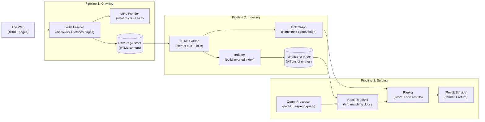
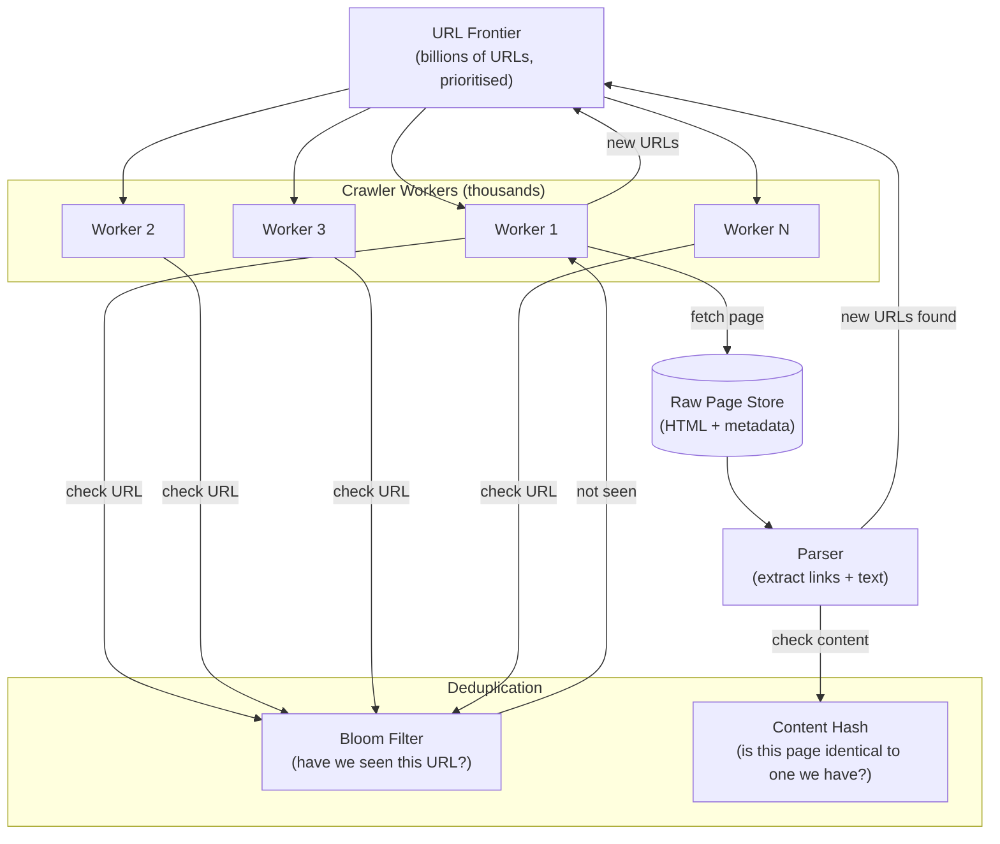
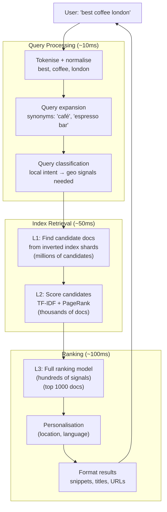
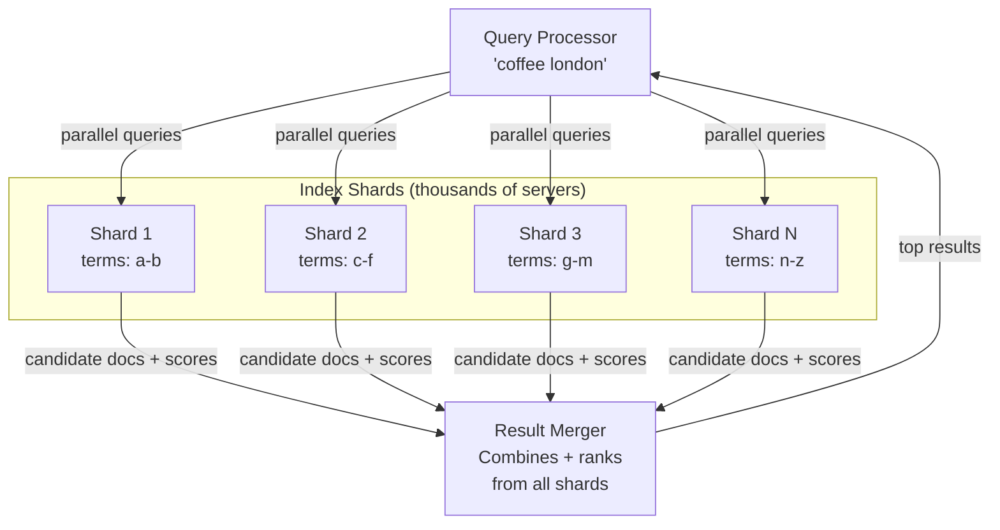

# 08 — Design Google Search

> **Case Study #8** — Advanced
> Systems like: Google Search, Bing, DuckDuckGo, Baidu

---

## The Problem

Google processes 8.5 billion searches per day. When you type "best coffee in London", it searches a index of 100 billion web pages and returns the most relevant results — in under 200 milliseconds.

Building a search engine involves three massive, distinct pipelines: **crawling** (discovering and downloading web pages), **indexing** (processing and storing them for fast retrieval), and **serving** (answering search queries in real time). Each is a large-scale distributed system in its own right.

---

## Step 1 — Requirements

### Clarifying Questions to Ask

```
"Full web search or domain-specific (e.g., e-commerce products)?"
"Do we need real-time results or is some delay acceptable?"
"What's the freshness requirement — how old can results be?"
"Do we need personalised results?"
"Images, videos, news, or text only?"
"How many queries per second?"
```

### Functional Requirements

| # | Requirement |
|---|---|
| FR-1 | User enters a query, receives a ranked list of relevant web pages |
| FR-2 | Results include title, URL, and a snippet of the page content |
| FR-3 | Index covers the entire public web (100 billion pages) |
| FR-4 | New and updated pages discoverable within days |
| FR-5 | Results ranked by relevance and authority |

**Out of scope:** Personalisation, Knowledge Graph (direct answer boxes), image/video search, ads, real-time news, spelling correction.

### Non-Functional Requirements

| NFR | Target |
|---|---|
| Query response time | P99 < 200ms |
| Index freshness | New content within 1-7 days |
| Availability | 99.99% |
| Index size | 100 billion documents |
| Query scale | 100,000 queries/second |

---

## Step 2 — Scale Estimation

```
Web pages to index: 100 billion
Average page size (after cleaning): 50 KB
Raw storage: 100B × 50 KB = 5 petabytes

After building inverted index (much smaller than raw):
  Inverted index ≈ 10-20% of raw content size
  Index storage: ~500 TB - 1 PB

Query volume: 100,000 QPS
Peak query: 100,000 × 2 = 200,000 QPS

Index update rate:
  Web changes constantly — pages update, new pages appear
  Target crawl rate: 5 billion pages/day (to keep index fresh)
  = 5B / 86,400 ≈ 58,000 pages fetched/second
```

**What this tells us:**
- No single machine holds the index — must be distributed across thousands
- The serving layer (query execution) must be extremely fast, reading from distributed index in < 100ms
- The crawling pipeline needs 58,000 fetches/second — massive parallelism required

---

## Step 3 — The Three Pipelines

A search engine has three distinct systems that work in sequence.



---

## Step 4 — Pipeline 1: Web Crawling

The crawler systematically visits web pages, downloads their HTML, extracts links, and adds new URLs to a queue.

### The URL Frontier

The URL Frontier is a priority queue of URLs waiting to be crawled. Not all pages are equal — important, frequently-updated pages (news sites, Wikipedia) should be crawled more often than rarely-changing pages.

```
Priority levels:
  High: News sites, popular domains, recently linked-to pages
  Medium: Regular websites, updated weekly
  Low: Old pages, rarely-linked sites

Crawl politeness rules:
  Don't crawl the same domain more than once per second
  Respect robots.txt (the site's crawl instructions)
  Don't hammer a site during its peak hours
```

### Crawling at Scale



**Bloom Filter for URL deduplication:**

A Bloom filter is a probabilistic data structure that answers "have I seen this URL before?" in O(1) time and a tiny fraction of the memory a hash set would need. It has a small false positive rate (occasionally says "seen" when not) but never false negatives. For deduplication of 100 billion URLs, this is ideal — a false positive just means we skip re-crawling a page we might not have crawled. Safe.

---

## Step 5 — Pipeline 2: Indexing

Raw HTML is useless for search. The indexing pipeline transforms it into a structure that enables fast retrieval.

### Step 2a — HTML Parsing and Text Extraction

```
Input: Raw HTML
  <html><head><title>Best Coffee London</title></head>
  <body><p>London's best coffee shops are...</p>
  <a href="https://other-site.com/coffee">coffee guide</a>
  </body></html>

Output:
  Title: "Best Coffee London"
  Body text: "London's best coffee shops are..."
  Outbound links: ["https://other-site.com/coffee"]
  URL: "https://this-site.com/coffee-guide"
```

### Step 2b — The Inverted Index

A forward index maps document → words. An inverted index maps word → documents. The inverted index is what makes search fast.

```
Forward index (what the page contains):
  doc_1 (coffee-guide.com) → ["coffee", "london", "best", "shops"]
  doc_2 (timeout.com)       → ["coffee", "london", "guide", "cafes"]

Inverted index (what documents contain this word):
  "coffee"  → [(doc_1, positions:[0,5,12]), (doc_2, positions:[0,8])]
  "london"  → [(doc_1, positions:[1]),      (doc_2, positions:[1])]
  "best"    → [(doc_1, positions:[2])]
  "guide"   → [(doc_2, positions:[2])]
  "cafes"   → [(doc_2, positions:[3])]
```

**Query: "coffee london"**

```
Look up "coffee" → doc_1, doc_2
Look up "london" → doc_1, doc_2
Intersection → doc_1, doc_2 (both contain both words)
Rank by relevance → return results
```

For 100 billion documents, this index is distributed across thousands of machines (sharded by term or by document range).

### Step 2c — PageRank (Link-Based Authority)

Not all pages about coffee are equally trustworthy. PageRank measures a page's authority by how many other authoritative pages link to it.

```
Core idea:
  A link from Page A to Page B is a "vote" for B's authority.
  A vote from an authoritative page (like Wikipedia) is worth more
  than a vote from a low-traffic personal blog.

PageRank is computed iteratively:
  Round 0: all pages start with equal score
  Round N: each page's score = sum of (linking page's score / linking page's outbound links)
  Repeat for many rounds until scores converge

After convergence:
  Wikipedia pages: very high PageRank
  NYT, BBC: high PageRank
  Random personal blog: low PageRank
```

PageRank is computed over the **link graph** (the directed graph of all web links — billions of nodes and edges). This is run as a distributed graph computation on a MapReduce-like system.

---

## Step 6 — Pipeline 3: Query Serving

This is what happens in < 200ms when you hit Enter.



### Retrieval with Distributed Index

The index is too large for one machine. It's sharded across thousands of servers.



All shards queried **in parallel**. The slowest shard determines the overall latency — so tail latency management is critical. If one shard is slow, we can use **hedged requests** (send the same query to two shard replicas, use whichever responds first).

---

## Step 7 — Ranking Signals

Modern search engines use hundreds of signals to rank results. Key categories:

| Signal Category | Examples |
|---|---|
| **Query-document relevance** | TF-IDF, BM25, term position, title vs body match |
| **Page authority** | PageRank, inbound link count, domain authority |
| **Content quality** | Page speed, mobile-friendly, HTTPS, content length |
| **User signals** | Click-through rate, dwell time (did users stay?), bounce rate |
| **Freshness** | When was the page last updated? (critical for news queries) |
| **Location** | User's location vs page's geographic relevance |
| **Language** | Match between query language and page language |

Modern ranking is done with machine learning models (neural networks trained on human quality raters and click data). But the foundation is always retrieval via inverted index → scoring → re-ranking.

---

## Step 8 — Trade-offs

| Decision | Chose | Gave Up | Why Acceptable |
|---|---|---|---|
| **Crawl freshness** | Crawl popular sites daily, others weekly | Real-time freshness everywhere | Crawling 100B pages continuously is impossible; prioritise what changes most |
| **Index distribution** | Shard by term range | Cross-term queries need to merge from multiple shards | Enables parallel retrieval; merge latency is small vs sequential lookup |
| **Bloom filter for dedup** | Probabilistic (small false positive rate) | Perfect accuracy | False positives just mean we skip re-crawling occasionally — safe |
| **PageRank** | Computed in batches (not real-time) | Link changes don't immediately affect ranking | Graph computation takes hours; real-time PageRank is infeasible at this scale |
| **Serving** | Multi-tier (L1/L2/L3 ranking) | Single ranking pass is simpler | Earlier stages cheap and fast; expensive ML ranking only on top candidates |

---

## Step 9 — Follow-up Questions

**"How do you handle web spam?"**

Multiple layers: link farms (many low-quality sites linking to each other) are detected by PageRank's convergence properties — fake authority doesn't accumulate the way real authority does. Content spam (keyword stuffing) is detected by natural language analysis. Manual spam reports feed into classifier training.

**"How would you make search results fresher?"**

A separate "freshness pipeline" prioritises crawling of high-authority sites every few hours. For breaking news, social media signals (Twitter trending) can trigger immediate re-crawls of relevant pages. A separate news index with lower freshness latency (minutes) handles time-sensitive queries.

**"How do you handle queries with no good results?"**

Spelling correction runs at query time (before retrieval). Query expansion adds synonyms and related terms. If results are still poor (low confidence scores), a "did you mean?" suggestion is shown. For extremely rare queries with no results, a fallback to a broader interpretation is tried.

**"How does autocomplete work?"**

Autocomplete is a prefix-matching problem. The most popular queries starting with each prefix are stored in a trie (prefix tree) or key-value store. When you type "best cof...", we look up all popular queries starting with that prefix and return them ranked by historical search volume.

---

## Summary

| Pipeline | Component | Scale |
|---|---|---|
| **Crawling** | URL Frontier + distributed crawlers | 58,000 fetches/second |
| **Indexing** | Inverted index | 100 billion documents |
| **Link analysis** | PageRank (batch) | Billions of links |
| **Serving** | Distributed index shards + multi-tier ranking | 100,000 QPS, < 200ms |

**The core insight:** Search speed is achieved by pre-computing everything possible. The inverted index is built offline so queries just do lookups, not computations. PageRank is computed in batch so queries don't traverse the link graph at query time. Multi-tier ranking applies expensive ML models only to a small set of candidates pre-filtered by cheap methods. The key principle: move work from query time to index time wherever possible.

---

*System Design Engineering Handbook — Case Studies*