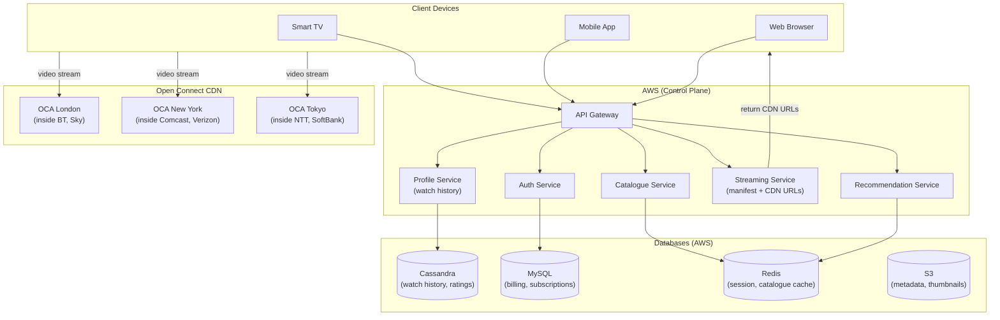
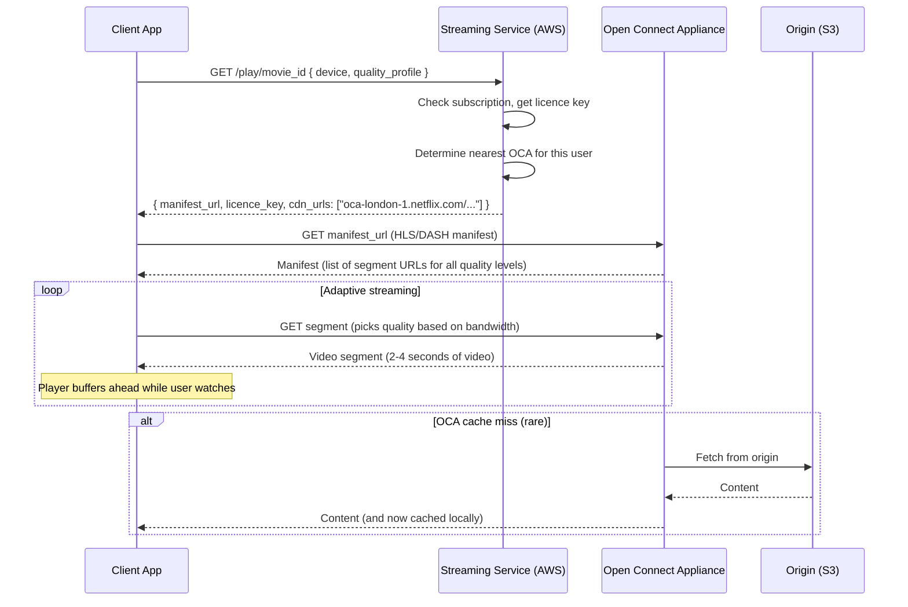
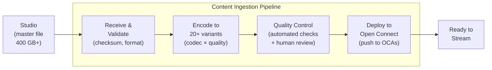
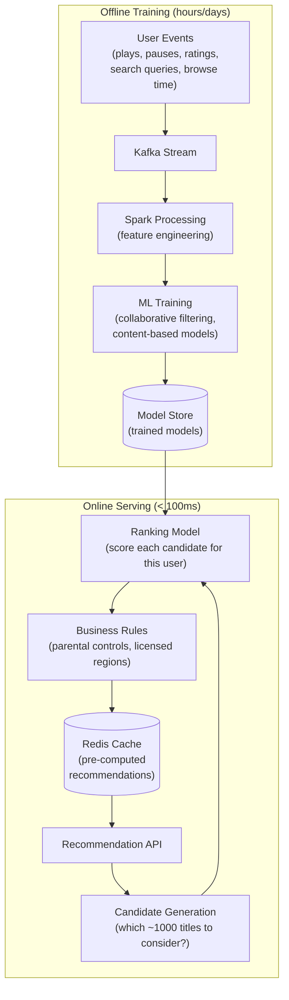

# 09 — Design Netflix

> **Case Study #9** — Advanced
> Systems like: Netflix, Disney+, HBO Max, Prime Video, Hulu

---

## The Problem

Netflix streams video to 230 million subscribers in 190 countries. On a typical evening, it serves 15% of all internet traffic worldwide. A subscriber in Mumbai clicking "Play" on a 4K movie must see the first frame within 2 seconds — with zero buffering — while 50 million other people are watching simultaneously.

The challenge is not just storing and transcoding video (covered in the YouTube case study). Netflix's distinct problems are: delivering at planetary scale through its own CDN, powering personalised recommendations for every subscriber, and doing all of this with 99.99% availability.

---

## Step 1 — Requirements

### Clarifying Questions to Ask

```
"Pre-recorded content only, or live streaming too?"
"Do we need to design the recommendation system?"
"Should we cover the content ingestion pipeline?"
"What devices — Smart TVs, mobile, web, gaming consoles?"
"What video quality — up to 4K HDR?"
"Offline downloads for mobile?"
```

### Functional Requirements

| # | Requirement |
|---|---|
| FR-1 | Users can browse and search the content catalogue |
| FR-2 | Streaming video starts within 2 seconds and plays without buffering |
| FR-3 | Support multiple quality levels with adaptive bitrate |
| FR-4 | Personalised homepage — different for every subscriber |
| FR-5 | Resume watching from where you left off, across devices |
| FR-6 | Multiple user profiles per account |

**Out of scope:** Content licensing, live streaming, offline downloads, billing system, content moderation.

### Non-Functional Requirements

| NFR | Target |
|---|---|
| Video start time | < 2 seconds (P95) |
| Buffering rate | < 0.1% of playback time |
| Availability | 99.99% |
| Scale | 230M subscribers, 50M concurrent streams at peak |
| Global | 190 countries, every continent |

---

## Step 2 — Scale Estimation

```
Concurrent streams at peak:       50 million
Average video bitrate (1080p):    5 Mbps

Peak egress bandwidth:
  50M × 5 Mbps = 250 Tbps

Netflix's actual public figure is ~200 Tbps peak egress.
No data centre on Earth can deliver 250 Tbps to users globally.
→ This must be served from servers physically near the users.

Content library:
  ~15,000 titles
  Each title transcoded into ~20 quality/codec combinations
  Average 2 hours per title
  Storage per title: ~50 GB (all variants combined)
  Total library: 15,000 × 50 GB = 750 TB

Manageable — the content library is actually modest in size.
The delivery infrastructure (CDN) is the scale challenge.
```

---

## Step 3 — The Core Insight: Open Connect

Netflix built its own CDN called **Open Connect**. Instead of paying CDN providers to cache content on generic servers, Netflix partners directly with ISPs and places its own servers **inside** their networks.

```
Traditional CDN:
  User → ISP → Internet → CDN Edge Server → Origin

Open Connect:
  User → ISP → Open Connect Appliance (inside ISP's network!)
             (Netflix's server sitting inside your ISP's building)

Result:
  Video data travels only from the ISP's equipment room
  to your home — maybe 1-2 km.
  Not across the internet.
  Not between data centres.
  Sub-millisecond network path.
```

Netflix has placed Open Connect Appliances (OCAs) in over 1,000 ISP locations globally. Popular content is pre-loaded onto these appliances overnight (during off-peak hours). When you press Play, the video is already there — physically inside your internet provider's building.

---

## Step 4 — High-Level Architecture



**The split:** The control plane (browse, search, auth, recommendations) runs on AWS. The video data itself never touches AWS during playback — it comes directly from Open Connect.

---

## Step 5 — What Happens When You Press Play



---

## Step 6 — Content Ingestion Pipeline

Before Netflix can stream a movie, it must be processed. This is the studio-to-streaming pipeline.



**Encoding variants (why 20+?):**

```
Quality levels: 4K, 1080p, 720p, 480p, 360p
Codecs:         H.264, H.265 (HEVC), AV1 (newer, better compression)
HDR variants:   HDR10, Dolby Vision, standard

4K + H.265 + HDR  → best quality for supported TVs
1080p + H.264     → widely compatible for older devices
360p + H.264      → minimum quality for very slow connections
AV1 variants      → ~30% smaller files at same quality vs H.264

Each combination is a separate encoded file.
```

**Why AV1?** AV1 achieves the same visual quality as H.264 at 30-50% smaller file size. For Netflix delivering 200 Tbps globally, a 30% reduction in file size = 30% less bandwidth cost = hundreds of millions of dollars annually.

---

## Step 7 — Personalised Recommendations

Netflix's recommendation system determines what content appears on your homepage. 80% of what people watch is discovered via recommendations — not search. This makes the recommendation system directly responsible for subscriber retention.



**How recommendations work at a high level:**

```
Collaborative filtering:
  "Users who watched and loved 'Stranger Things' also loved 'Dark'"
  Your taste profile = weighted average of your viewing history
  Find users with similar taste profiles
  Recommend what they liked that you haven't seen

Content-based filtering:
  "You loved thriller movies with female protagonists set in Europe"
  Find movies matching those attributes you haven't seen yet

The combination of both, plus contextual signals
(time of day, device, country) gives personalised results.
```

**The A/B testing pipeline:** Netflix runs hundreds of A/B experiments simultaneously. The recommendation algorithm, the thumbnail images, the ordering of rows on the homepage — all are tested with different user segments to measure which version increases engagement.

---

## Step 8 — Watch History and Resume Playback

When you pick up your phone after watching on your TV, Netflix knows exactly where you left off. This requires durable, consistent tracking of every user's position in every piece of content.

```
Data to track per user per title:
  watched_at (list of viewing sessions)
  last_position (seconds into the video)
  completion_percentage
  device_type

Storage: Cassandra
  Partition key: user_id (all history for one user together)
  Clustering key: (title_id, watched_at) DESC

Write: Every 10 seconds during playback
  UPSERT { user_id, title_id, position_seconds, updated_at }

Read: On app open
  Get last_position for all titles user has started
```

**Why write every 10 seconds?**

If we only write on pause/stop, a crash (app force-quit, battery dies) loses your place. Writing every 10 seconds means at worst you're set back 10 seconds — invisible to most users.

With 50 million concurrent streams × 1 write per 10 seconds = 5 million writes/second to Cassandra. This is exactly Cassandra's sweet spot.

---

## Step 9 — Chaos Engineering

Netflix is famous for **Chaos Monkey** — a tool that randomly terminates production server instances during business hours to ensure the system is resilient to failures.

```
The philosophy:
  "If something is going to fail in production, let it fail
   now when engineers are at their desks — not at 3 AM."

What Chaos Monkey does:
  Randomly selects a production instance
  Terminates it (equivalent to a server crashing)
  Observes how the system responds

What it proves:
  If the system handles it gracefully → the resilience design works
  If it causes an outage → there's a hidden dependency/SPOF to fix

Extensions:
  Chaos Kong: terminates an entire AWS availability zone
  Latency Monkey: introduces artificial network latency
  Conformity Monkey: detects instances not following best practices
```

This is baked into Netflix's engineering culture. Every service is designed with the assumption that it will receive traffic after its dependencies fail. The result: Netflix's streaming service stayed up during several large AWS outages that brought down many other services.

---

## Step 10 — Trade-offs

| Decision | Chose | Gave Up | Why Acceptable |
|---|---|---|---|
| **CDN** | Build own (Open Connect) | Massive capital investment in hardware | At Netflix's scale, cost per GB of own CDN << third-party CDN |
| **OCA placement** | Inside ISPs | Dependent on ISP partnership agreements | Direct ISP placement = last-mile problem solved; no cross-internet hops |
| **Encoding** | 20+ variants including AV1 | Encoding cost and complexity | 30% bandwidth savings at Netflix's scale = enormous money |
| **Watch history** | Write every 10 seconds | More Cassandra writes | 10-second loss is imperceptible; losing position on crash is annoying |
| **Recommendations** | Pre-computed, cached | Slightly stale (hours old) | Models retrain daily; freshness of hours is fine for content recommendations |

---

## Step 11 — Follow-up Questions

**"How does Netflix decide which content to put on which OCA?"**

Content popularity varies by region and time. Netflix analyses viewing patterns to predict what will be popular in each geographic area. Popular global content (new season of Stranger Things) goes to every OCA worldwide. Regional content (Bollywood films) goes only to OCAs in South Asia and markets with large South Asian diaspora. Content is pre-loaded during off-peak hours (2-6 AM local time) when there's spare bandwidth.

**"What happens if an OCA goes down?"**

The streaming service maintains a ranked list of OCAs for each region. If the primary OCA is unavailable, the client is directed to the next-nearest OCA. If no OCA has the content cached, the client falls back to the origin on S3 (slower, but available). Netflix is designed to degrade gracefully rather than fail completely.

**"How do you handle thumbnail personalisation?"**

The thumbnail you see for a movie may be different from what another subscriber sees. Netflix A/B tests different thumbnails and serves the one most likely to make you click, based on your viewing history. An action fan might see the explosion; a romance fan might see the love story angle. The same movie, different first impression.

---

## Summary

| Component | Choice | Reason |
|---|---|---|
| **Video delivery** | Open Connect (own CDN inside ISPs) | 200 Tbps impossible any other way; last-mile solved |
| **Control plane** | AWS microservices | Scales independently of video delivery |
| **Watch history** | Cassandra | 5M writes/sec; time-ordered per user |
| **Recommendations** | Pre-computed + ML | Real-time ranking on 15K titles is fast enough |
| **Metadata/catalogue** | Redis + MySQL | Fast catalogue reads, reliable subscription management |
| **Resilience** | Chaos Engineering | Forces design-for-failure into engineering culture |

**The core insight:** Netflix's biggest engineering achievement is not the video player or the recommendation algorithm — it's the Open Connect CDN. Moving video bytes to be physically inside ISPs, pre-loading popular content overnight, and eliminating long-distance internet hops is what makes 200 Tbps of global delivery economically and technically possible.

---

*System Design Engineering Handbook — Case Studies*