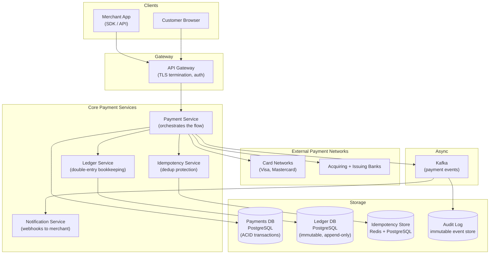
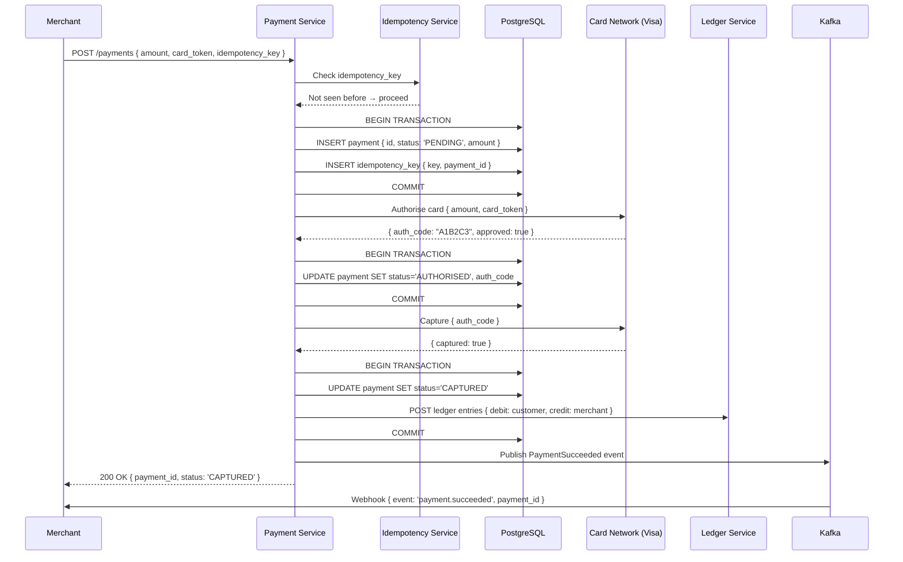

# 10 — Design a Payment System

> **Case Study #10** — Advanced
> Systems like: Stripe, PayPal, Square, Razorpay, Braintree

---

## The Problem

A payment system moves money between parties. When a customer buys something online, money must flow from their bank account to the merchant's account — reliably, securely, and exactly once. No double charges. No lost payments. No inconsistent states where money leaves one account but never arrives in another.

This is where correctness requirements are absolute. A social feed being slightly stale is annoying. Money disappearing or doubling is catastrophic — legally, financially, and reputationally.

---

## Step 1 — Requirements

### Clarifying Questions to Ask

```
"Are we processing card payments, bank transfers, or both?"
"Do we need to support refunds and chargebacks?"
"What's the expected transaction volume?"
"Multi-currency support?"
"Do we need to store card data (requires PCI-DSS compliance)?"
"Synchronous or asynchronous settlement?"
```

### Functional Requirements

| # | Requirement |
|---|---|
| FR-1 | Customer can initiate a payment (card or bank transfer) |
| FR-2 | Payment either fully succeeds or fully fails — no partial states |
| FR-3 | Merchants receive funds after settlement |
| FR-4 | Full refund and partial refund supported |
| FR-5 | Payment status queryable at any time |
| FR-6 | Duplicate payment requests are rejected |

**Out of scope:** Fraud detection ML model, cryptocurrency, FX trading, lending products, card issuing.

### Non-Functional Requirements

| NFR | Target |
|---|---|
| Correctness | No double charges, no lost payments — ever |
| Availability | 99.999% (five nines — payment downtime = direct revenue loss) |
| Idempotency | Duplicate requests must be detected and rejected |
| Latency | P95 < 3 seconds (card processing includes bank network) |
| Auditability | Every state change logged immutably, forever |
| Compliance | PCI-DSS for card data |

---

## Step 2 — Scale Estimation

```
Transaction volume: 1 million transactions/day (medium payment processor)
Peak TPS: 1M / 86,400 ≈ 12 transactions/sec
Peak with 5× spike: ~60 transactions/sec

Note: Even Visa (global scale) processes ~24,000 TPS at peak.
      Payment systems are NOT high-throughput in the way Twitter is.
      They are high-stakes — correctness matters far more than speed.

Data per transaction: ~2 KB (payment details, metadata, audit trail)
Daily storage: 1M × 2 KB = 2 GB/day
Annual: ~730 GB — trivially manageable

Ledger entries: each transaction generates 2 ledger entries (debit + credit)
Annual ledger entries: 1M × 2 × 365 = 730 million entries
```

**What this tells us:**
- Throughput is low — 60 TPS is well within a single database's capacity
- The challenge is correctness, not scale
- Every design decision serves the goal of never processing a payment twice or losing one

---

## Step 3 — The Money Movement Model

Before designing the system, understand how money actually flows.

```
Customer pays £100 to Merchant via Stripe:

1. Customer's bank (Issuing Bank)     → holds customer's money
2. Card network (Visa/Mastercard)     → routes the transaction
3. Acquirer bank (Stripe's bank)      → receives money on Stripe's behalf
4. Stripe (Payment Processor)         → deducts fees, routes to merchant
5. Merchant's bank (Merchant Bank)    → merchant receives funds

Timeline:
  T+0s:  Customer card charged (authorisation)
  T+2s:  Payment confirmed to customer and merchant
  T+1d:  Settlement — funds actually move between banks
  T+2d:  Merchant can access funds
```

**Two phases:**
- **Authorisation:** "Does this card have enough funds? Reserve them."
- **Capture:** "Actually take the money."

These can be separated (e.g. hotels authorise at check-in, capture at check-out). Most e-commerce combines them in one step (auth + capture simultaneously).

---

## Step 4 — Idempotency — The Most Critical Design Decision

In distributed systems, requests can be retried. A network timeout doesn't tell you whether the request succeeded or failed. For payment processing, retrying a failed (or timed-out) request without idempotency protection means charging the customer twice.

**The solution: idempotency keys.**

```
Client sends payment request with a unique idempotency key:

First attempt:
  POST /payments
  Idempotency-Key: "order-12345-attempt-1"
  Body: { amount: 100, currency: "GBP", card_token: "tok_abc" }

  Server: key not seen before → process payment → charge £100 → return result
  Server: store {key: "order-12345-attempt-1", result: {payment_id, status: "success"}}

Network failure — client doesn't receive response. Retries:
  POST /payments
  Idempotency-Key: "order-12345-attempt-1"  (same key!)
  Body: { amount: 100, currency: "GBP", card_token: "tok_abc" }

  Server: key already seen → return stored result → DO NOT charge again
  Client receives: {payment_id, status: "success"} (same as before)

Customer is charged exactly once. ✅
```

**Implementation:**

```sql
CREATE TABLE idempotency_keys (
    key_hash       CHAR(64) PRIMARY KEY,  -- SHA256 of the idempotency key
    payment_id     UUID,
    request_hash   CHAR(64),              -- hash of request body
    response_body  JSONB,                 -- stored result
    created_at     TIMESTAMPTZ DEFAULT NOW(),
    expires_at     TIMESTAMPTZ            -- clean up old keys after 24h
);
```

The request body hash is also stored. If the same key is reused with different parameters (someone sending a different amount with the same key), it's rejected as an error — same key must mean same request.

---

## Step 5 — High-Level Architecture



---

## Step 6 — Payment Processing Flow



---

## Step 7 — Double-Entry Bookkeeping

Every money movement creates exactly two ledger entries: a debit from one account and a credit to another. The sum of all debits must equal the sum of all credits — always.

```
Transaction: Customer pays £100 to Merchant
  DEBIT:  Customer's balance    -£100
  CREDIT: Merchant's balance    +£97  (after Stripe's 3% fee)
  CREDIT: Stripe's revenue      +£3

Rule: Total debits = Total credits
  £100 = £97 + £3 ✅

The ledger table is immutable — entries are never updated or deleted.
Corrections are made by creating new entries (reversals).

Example: Full refund
  DEBIT:  Merchant's balance    -£97
  CREDIT: Customer's balance    +£97
  DEBIT:  Stripe's revenue      -£3   (fee refunded on full refund)
  CREDIT: Stripe's costs         +£3
```

```sql
CREATE TABLE ledger_entries (
    id              UUID PRIMARY KEY DEFAULT gen_random_uuid(),
    transaction_id  UUID NOT NULL,        -- links debit and credit pairs
    account_id      UUID NOT NULL,        -- which account
    entry_type      VARCHAR(10) NOT NULL, -- 'DEBIT' or 'CREDIT'
    amount          BIGINT NOT NULL,      -- in minor units (pence, cents)
    currency        CHAR(3) NOT NULL,     -- ISO 4217
    created_at      TIMESTAMPTZ NOT NULL DEFAULT NOW(),
    balance_after   BIGINT NOT NULL       -- account balance after this entry
    -- NO UPDATE, NO DELETE permissions on this table
);
```

**Why store balance_after?** For auditing — you can reconstruct any account's balance at any point in time by looking at any ledger entry. No need to replay the entire ledger history.

---

## Step 8 — Handling Failures at Every Step

The payment flow involves multiple steps, each of which can fail. The system must handle every failure mode without corrupting data.

```
Failure scenarios and responses:

1. Payment Service crashes after DB insert but before calling card network:
   → Payment is in PENDING status
   → Background reconciliation job detects stale PENDING payments
   → Checks with card network: was this ever authorised?
   → If no: mark FAILED (no charge happened)
   → If yes: update to AUTHORISED (charge did happen)

2. Card network returns error:
   → Payment marked FAILED
   → Idempotency key stored with FAILED result
   → Retry with same key → immediately returns FAILED (no re-attempt)

3. Capture succeeds but client never receives response:
   → Client retries with same idempotency key
   → Idempotency service returns stored CAPTURED result
   → Client gets success — no double charge

4. Payment Service crashes between AUTHORISED and CAPTURED:
   → Reconciliation detects AUTHORISED payments not captured within N minutes
   → Automatically issues capture request
   → OR issues void (cancel the authorisation) based on business rules
```

**The reconciliation job** is not optional — it is the safety net that catches every gap between what the payment service did and what the card network records. Payment processors run reconciliation continuously.

---

## Step 9 — The Ledger as the Source of Truth

The payments table tracks the state machine (PENDING → AUTHORISED → CAPTURED). The ledger is the financial record. They must always agree.

```
Consistency rule:
  If payment status = CAPTURED:
    Ledger MUST have: debit customer + credit merchant + credit Stripe

  If payment status = FAILED:
    Ledger MUST have: no entries for this payment
    OR: reversal entries that net to zero

Daily reconciliation:
  Sum of all ledger credits - Sum of all ledger debits = 0
  (for every currency)

  Any non-zero result = data integrity error → immediate alert
```

---

## Step 10 — PCI-DSS: Handling Card Data

Storing raw card numbers (PAN — Primary Account Number) requires PCI-DSS Level 1 compliance — the most demanding security certification. Most payment processors avoid storing raw card data entirely.

**Tokenisation:**

```
1. Customer enters card number on a secure hosted form (hosted by Stripe)
   → Card number sent directly to Stripe's servers, never to merchant's servers

2. Stripe returns a single-use token: "tok_abc123"
   → Token represents the card without revealing its number

3. Merchant's server sends the token to Stripe to charge:
   POST /charges { token: "tok_abc123", amount: 100 }

Merchant's server NEVER sees the actual card number.
Merchant's server does NOT need PCI-DSS Level 1 compliance.
Only Stripe's vaults store the actual card numbers.
```

---

## Step 11 — Trade-offs

| Decision | Chose | Gave Up | Why Acceptable |
|---|---|---|---|
| **Database** | PostgreSQL (ACID) | NoSQL scalability | At 60 TPS, a single Postgres instance is fine; ACID is non-negotiable |
| **Idempotency** | Keys with stored results | Slightly more storage | Absolute requirement — no alternative for preventing double charges |
| **Ledger** | Immutable append-only | Cannot fix mistakes by editing | Corrections done via reversal entries — financial standards require immutability |
| **Asynchronous** | Webhooks for merchant notification | Merchant must handle async events | Synchronous webhooks create dependency chains; async is more resilient |
| **Card data** | Tokenisation (never store PAN) | Must integrate with tokenisation provider | Eliminates PCI-DSS scope for most of the system |

---

## Step 12 — Follow-up Questions

**"How do you prevent race conditions — two requests trying to charge the same card at the same time?"**

The idempotency key prevents exact duplicate requests. For different requests that might conflict (e.g. two refund requests for the same payment), use database-level locking: `SELECT ... FOR UPDATE` on the payment row within a transaction. Only one transaction holds the lock; the other waits. The second sees the state left by the first (e.g. already refunded) and returns an error.

**"How would you handle chargebacks?"**

A chargeback is when a customer disputes a charge with their bank. The bank reverses the funds immediately and the payment processor must respond with evidence or accept the loss. This creates a new state machine: `CHARGEBACK_INITIATED → CHARGEBACK_WON / CHARGEBACK_LOST`. Funds are held in escrow during dispute. Ledger entries are created for each state transition. The merchant is notified via webhook.

**"How do you ensure no money is lost in the system?"**

The double-entry ledger guarantees this mathematically: debits always equal credits. Daily reconciliation verifies this invariant. Any discrepancy triggers an alert. Additionally, compare internal ledger totals with the card network's settlement file (received daily) — any mismatch indicates a missed transaction.

**"How would you scale this to 100× the transaction volume?"**

At 6,000 TPS, a single PostgreSQL instance hits its limit. Shard the payments table by `merchant_id` — each merchant's payments go to one shard, keeping transactions local. The ledger is read-heavy for reconciliation — add read replicas. The idempotency store moves to Redis cluster. Most payment processing is actually parallelisable — each payment is independent.

---

## Summary

| Component | Choice | Reason |
|---|---|---|
| **Database** | PostgreSQL | ACID transactions non-negotiable for financial data |
| **Idempotency** | Key-based with stored result | Only protection against double charges on retry |
| **Ledger** | Immutable append-only, double-entry | Financial integrity; auditability |
| **Card data** | Tokenisation | Avoid PCI-DSS scope; never store raw PAN |
| **Failure handling** | Reconciliation job | Safety net for every possible crash scenario |
| **Events** | Kafka + webhooks | Decouple merchant notification from payment processing |

**The core insight:** Payment systems are not hard because of scale — 60 TPS is nothing. They are hard because correctness requirements are absolute. Every design decision (idempotency, ACID transactions, immutable ledger, reconciliation) exists to answer the question: "What happens if anything fails at any point?" The answer must always be: "No money is lost, no customer is charged twice."

---

*System Design Engineering Handbook — Case Studies*