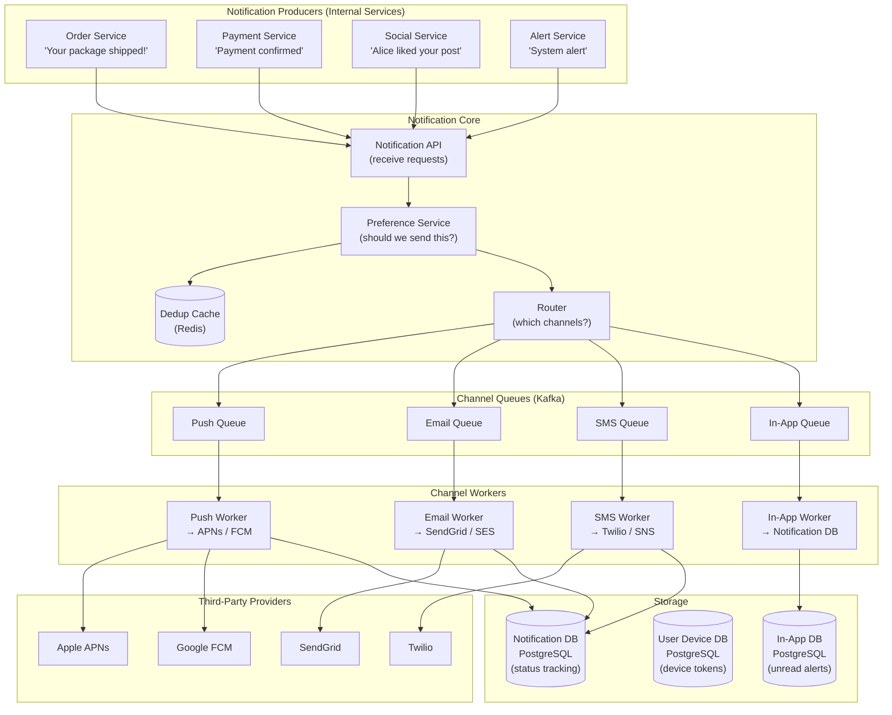
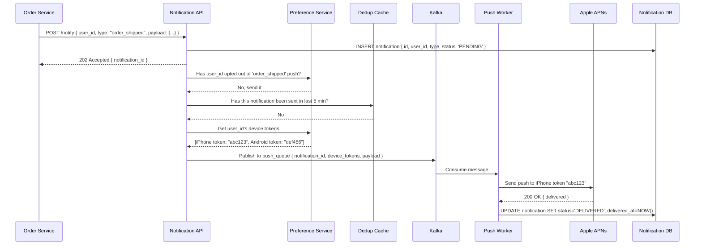
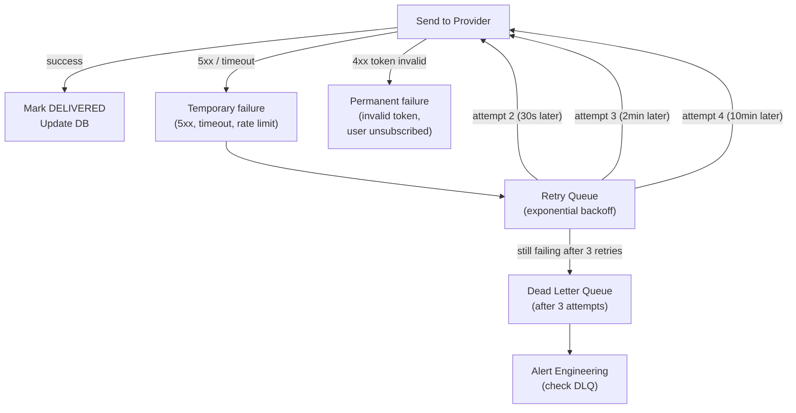
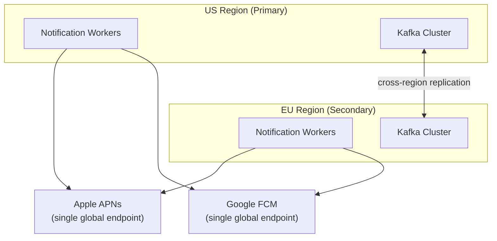

# 11 — Design a Notification System

> **Case Study #11** — Intermediate
> Used by: every major app — Uber, Amazon, LinkedIn, Facebook, banking apps

---

## The Problem

A notification system delivers messages from your application to your users through one or more channels: push notifications to mobile apps, SMS, email, or in-app alerts. When a driver arrives, Uber sends you a push. When your package ships, Amazon emails you. When someone likes your post, Instagram sends both a push and an in-app notification.

The challenge: delivering notifications reliably to hundreds of millions of users across multiple channels, at high throughput, without losing any and without annoying users with duplicates.

---

## Step 1 — Requirements

### Clarifying Questions to Ask

```
"Which channels — push, SMS, email, in-app, or all four?"
"Do we need real-time delivery or is some delay acceptable?"
"What happens if a notification fails to deliver?"
"Do we need user preferences (opt-out of certain types)?"
"Should we track open rates and delivery status?"
"Is this B2C (user-facing) or B2B (app developers integrating our API)?"
```

### Functional Requirements

| # | Requirement |
|---|---|
| FR-1 | Send push notifications (iOS via APNs, Android via FCM) |
| FR-2 | Send SMS via third-party provider (Twilio, SNS) |
| FR-3 | Send email via third-party provider (SendGrid, SES) |
| FR-4 | Deliver in-app notifications (visible when user opens the app) |
| FR-5 | Respect user preferences (users can opt out of notification types) |
| FR-6 | Track delivery status (sent, delivered, opened) |
| FR-7 | Retry failed deliveries with backoff |

**Out of scope:** Building our own SMTP server, WhatsApp/Telegram integration, notification scheduling UI, marketing campaign builder.

### Non-Functional Requirements

| NFR | Target |
|---|---|
| Throughput | 10 million notifications/day (~120/sec average) |
| Delivery latency | P95 < 10 seconds for push; < 30 seconds for email/SMS |
| Reliability | At-least-once delivery (retry on failure) |
| Deduplication | No duplicate notifications to the same user |
| Availability | 99.9% |

---

## Step 2 — Scale Estimation

```
Notifications per day: 10 million
Types breakdown (typical):
  Push:  60% = 6 million/day = 70/sec
  Email: 30% = 3 million/day = 35/sec
  SMS:   10% = 1 million/day = 12/sec

Peak (assume 5× average):
  Push: 350/sec
  Email: 175/sec
  SMS: 60/sec

Third-party rate limits (typical):
  APNs: no hard limit but recommend batching
  FCM: 600,000 messages/minute = 10,000/sec
  Twilio SMS: 1 message/sec per phone number (hundreds of numbers needed)
  SendGrid: up to 100,000 emails/day on starter plans
```

**What this tells us:**
- Volume is moderate — not Twitter scale
- The hard part is multi-channel orchestration and reliable delivery
- Must integrate with multiple third-party providers with different APIs and rate limits

---

## Step 3 — High-Level Architecture



---

## Step 4 — The Notification Flow



---

## Step 5 — User Preferences — Should We Send This?

Not every notification should reach every user. Before routing to any channel, check:

```
Preference checks (in order):

1. Global opt-out:
   Has the user completely disabled all notifications? → stop

2. Type opt-out:
   Has the user disabled this notification type?
   (e.g. "unsubscribed from promotional emails") → stop for email

3. Channel opt-out:
   Has the user disabled this channel?
   (e.g. "turn off push notifications for this app") → skip push

4. Quiet hours:
   Is it 2 AM in the user's timezone?
   Non-urgent notifications should not wake people → delay until morning

5. Frequency cap:
   Has this user received more than 5 notifications today? → rate limit

6. Device token validity:
   Is the device token still valid? (user may have deleted the app) → skip
```

```sql
CREATE TABLE user_notification_preferences (
    user_id         UUID,
    notification_type VARCHAR(50),   -- 'order_shipped', 'promotion', etc.
    channel         VARCHAR(20),    -- 'push', 'email', 'sms', 'in_app'
    enabled         BOOLEAN DEFAULT TRUE,
    updated_at      TIMESTAMPTZ,
    PRIMARY KEY (user_id, notification_type, channel)
);

CREATE TABLE user_quiet_hours (
    user_id         UUID PRIMARY KEY,
    quiet_start     TIME,            -- e.g. 22:00
    quiet_end       TIME,            -- e.g. 08:00
    timezone        TEXT             -- e.g. 'Europe/London'
);
```

---

## Step 6 — Deduplication — No Duplicate Notifications

If a service retries a failed notification request, or a bug triggers the same notification twice, users should receive it only once.

```
Deduplication key = hash of (user_id + notification_type + content_hash + time_window)

Time window: 5 minutes (typical)
→ Same notification triggered twice within 5 minutes → second is dropped

Implementation with Redis:
  key = sha256("user:123:order_shipped:order-456")
  
  SETNX dedupe:{key} 1 EX 300  (set if not exists, expires in 5 minutes)
  
  If SETNX returns 1 → first time seen → send notification
  If SETNX returns 0 → already sent → drop duplicate
```

**Why 5 minutes?** Long enough to catch immediate retries and bugs. Short enough that if the same event genuinely happens twice within a reasonable time (two separate orders shipping on the same day), both notifications still go through.

---

## Step 7 — Retry Strategy for Failed Deliveries

Third-party providers fail. APNs goes down. SendGrid has rate limits. Retries must be intelligent.



**Exponential backoff schedule:**
```
Attempt 1: immediate
Attempt 2: 30 seconds later
Attempt 3: 2 minutes later
After 3 failures: move to Dead Letter Queue

Total wait before DLQ: ~12 minutes
DLQ: engineers investigate; may manually replay or discard
```

**Permanent failures are not retried:**
- APNs 410: token is no longer valid (user deleted app) → delete the device token from our DB
- FCM: `NotRegistered` error → same; token invalid
- SendGrid 550: email address doesn't exist → mark as invalid, don't retry

---

## Step 8 — Device Token Management

Push notifications require device tokens — unique identifiers assigned by APNs (iOS) and FCM (Android) to each app installation. These change and expire.

```sql
CREATE TABLE user_devices (
    id              UUID PRIMARY KEY DEFAULT gen_random_uuid(),
    user_id         UUID NOT NULL,
    platform        VARCHAR(10) NOT NULL,  -- 'ios', 'android'
    device_token    TEXT NOT NULL UNIQUE,
    app_version     VARCHAR(20),
    last_seen_at    TIMESTAMPTZ,
    is_active       BOOLEAN DEFAULT TRUE,
    created_at      TIMESTAMPTZ DEFAULT NOW()
);
```

**Token lifecycle:**
```
User installs app → app registers with APNs/FCM → receives token
App sends token to our server → stored in user_devices

Token invalidation events:
  User deletes app → token becomes invalid
  User reinstalls app → new token issued
  User gets new phone → new token issued

Detection: APNs/FCM returns error on invalid token → mark is_active=FALSE
Cleanup: periodic job removes tokens inactive for > 90 days
```

---

## Step 9 — In-App Notifications

Unlike push notifications (delivered to the OS), in-app notifications appear inside the app and require the user to open it.

```
In-app notification table:

CREATE TABLE in_app_notifications (
    id              UUID PRIMARY KEY,
    user_id         UUID NOT NULL,
    title           VARCHAR(255),
    body            TEXT,
    action_url      TEXT,           -- what happens on tap
    is_read         BOOLEAN DEFAULT FALSE,
    created_at      TIMESTAMPTZ DEFAULT NOW()
);

CREATE INDEX idx_unread ON in_app_notifications(user_id, is_read, created_at DESC);

API:
  GET /notifications → returns unread in-app notifications for the user
  PATCH /notifications/{id}/read → marks as read
  GET /notifications/count → returns unread count (the badge number)
```

When the user opens the app, the client fetches unread notifications. If the user has a persistent WebSocket connection (e.g. WhatsApp), in-app notifications can be pushed in real time. For simpler apps, polling on app open is sufficient.

---

## Step 10 — Multi-Region Reliability

For a globally deployed notification system, the DLQ and retry queues must survive regional failures.



If the US region is down, the EU region continues processing from the replicated Kafka queues. APNs and FCM are global services — both regions connect to the same endpoints.

---

## Step 11 — Trade-offs

| Decision | Chose | Gave Up | Why Acceptable |
|---|---|---|---|
| **Queue per channel** | Separate Kafka topics | Single queue is simpler | Push and email have different rate limits and failure modes; isolation prevents one slow channel from blocking others |
| **At-least-once delivery** | Retry on failure (may duplicate) | Exactly-once (complex) | Deduplication cache handles duplicates; at-least-once is far simpler |
| **Third-party providers** | SendGrid, Twilio, APNs, FCM | Building own SMTP/SMS | Third parties handle deliverability, compliance, carrier relationships |
| **Preference checks** | Before queuing | After queuing | Early rejection saves queue capacity and worker processing |
| **Quiet hours** | Delay non-urgent notifications | Some latency on delivery | Better user experience than waking people at 3 AM |

---

## Step 12 — Follow-up Questions

**"How do you handle millions of notifications triggered by a single event?"**

Fan-out on the producer side: when "Server is down" alert must go to 10,000 engineers, the Alert Service creates 10,000 individual notification records and batches them into Kafka. Workers consume and send in parallel. This is not a push fan-out — it's natural parallel processing.

**"How do you prevent a noisy service from spamming users?"**

Rate limiting per service (the Notification API rejects requests beyond X per minute from a given service) and per user (frequency caps). A bug causing 1,000 notifications to fire in a second is caught by the rate limiter before most reach the queue.

**"How would you add email open tracking?"**

Embed a 1×1 pixel tracking image with a unique URL in the email body. When the email client loads the image (user opens the email), our server logs the open event. Update `notification_events` table with `opened_at`. This is standard email tracking practice — controversial for privacy but widely used.

---

## Summary

| Component | Choice | Reason |
|---|---|---|
| **Queue** | Kafka per channel | Isolation between channels; independent scaling |
| **Delivery** | At-least-once + dedup cache | Simpler than exactly-once; dedup handles duplicates |
| **Preference** | Pre-queue check | Prevents wasted work processing notifications users don't want |
| **Retry** | Exponential backoff, 3 attempts | Handles transient provider failures without overloading |
| **Device tokens** | PostgreSQL + active flag | Invalidate on APNs/FCM error; clean up periodically |
| **In-app** | PostgreSQL + unread count | Simple, fast, sufficient for most app patterns |

**The core insight:** A notification system is a routing and delivery orchestration problem. The complexity is not in sending one notification — it's in: checking whether to send, choosing which channels, deduplicating across retries, and handling the failure modes of four different third-party providers. Every component exists to answer one of these concerns reliably at scale.

---

*System Design Engineering Handbook — Case Studies*