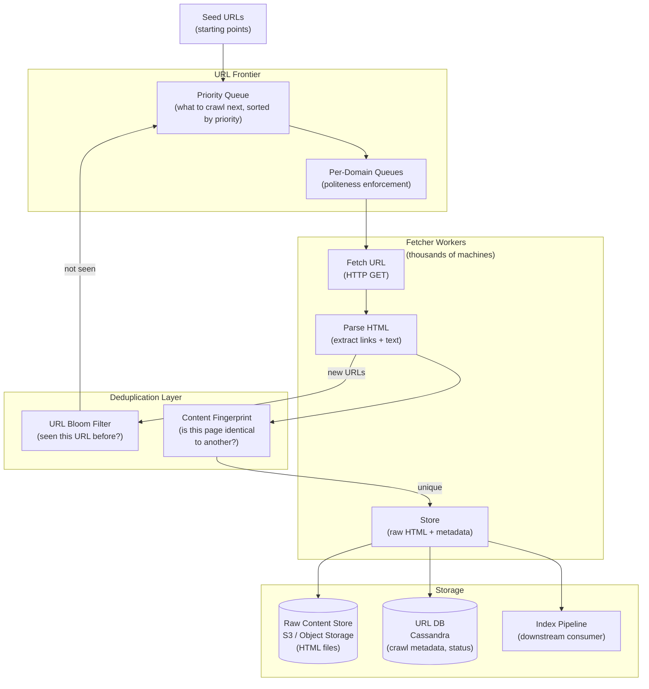
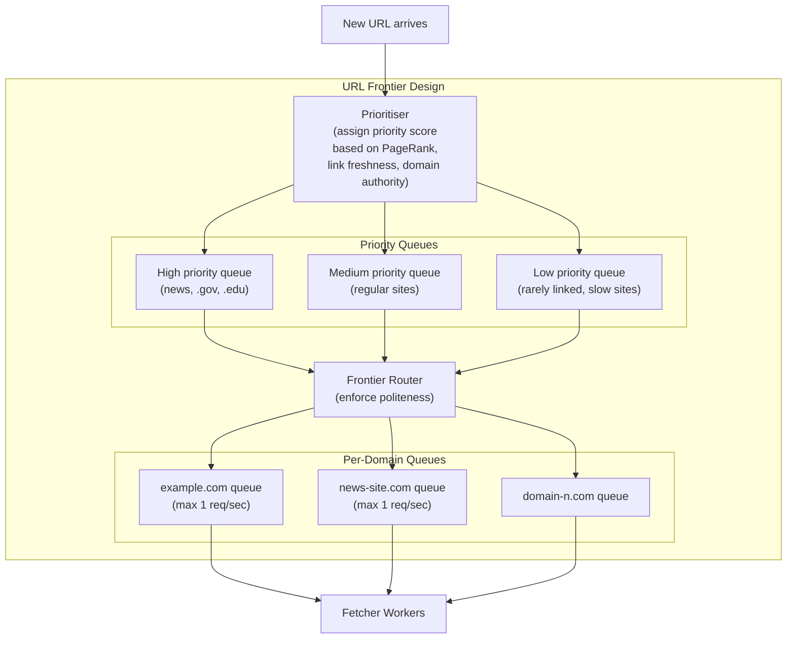

# 12 — Design a Web Crawler

> **Case Study #12** — Intermediate
> Used by: Search engines (Google, Bing), SEO tools (Ahrefs, SEMrush), data pipelines

---

## The Problem

A web crawler systematically browses the internet, downloading web pages and following links to discover new ones. It is the foundation of every search engine — without it, there is no index to search. It also powers SEO analysis tools, price comparison sites, and research data pipelines.

The challenge: the web has over 100 billion pages, it changes constantly, and crawling it must be done politely (without overwhelming any single website), efficiently (prioritising important and changing content), and correctly (without getting stuck in infinite loops or downloading the same page a million times).

---

## Step 1 — Requirements

### Clarifying Questions to Ask

```
"What is the purpose — search engine index, SEO analysis, or specific data extraction?"
"How much of the web do we need to cover?"
"How fresh does the data need to be?"
"Do we need to render JavaScript-heavy pages?"
"Do we need to respect robots.txt?"
"What output format — raw HTML, extracted text, or structured data?"
```

### Functional Requirements

| # | Requirement |
|---|---|
| FR-1 | Start from a set of seed URLs and discover new URLs by following links |
| FR-2 | Download and store page content (HTML) |
| FR-3 | Respect robots.txt rules for each domain |
| FR-4 | Avoid crawling the same URL twice (deduplication) |
| FR-5 | Prioritise crawling important and frequently-changing pages |
| FR-6 | Re-crawl pages periodically to detect changes |

**Out of scope:** JavaScript rendering (SPA content), login-gated content, image/video crawling, real-time crawling.

### Non-Functional Requirements

| NFR | Target |
|---|---|
| Throughput | 1 billion pages crawled per day |
| Politeness | No more than 1 request/second to any single domain |
| Freshness | Popular pages re-crawled within 24 hours; others within 7 days |
| Deduplication | Same URL never fetched twice unless intentionally re-crawled |
| Storage | Store raw HTML + extracted links for all crawled pages |

---

## Step 2 — Scale Estimation

```
Target: 1 billion pages/day

Fetch rate needed:
  1B / 86,400 ≈ 11,600 pages/second

Average page size: 50 KB (HTML only, no images)
Data ingested: 11,600 × 50 KB = ~580 MB/second = ~50 TB/day

Unique URLs in the frontier (to crawl):
  Web has ~100B unique URLs
  At 1B crawled/day → full web crawl takes 100 days
  Frontier queue size: must hold billions of URLs

Links extracted per page: ~50 outbound links on average
New URLs discovered: 11,600 × 50 = 580,000 new URLs/second
  (most will be duplicates already in frontier or already crawled)
```

**What this tells us:**
- This is a distributed system problem — no single machine comes close
- URL deduplication is the highest-volume operation (580,000 checks/second)
- Storage is significant — 50 TB/day means petabyte-scale infrastructure

---

## Step 3 — Core Components



---

## Step 4 — The URL Frontier

The URL frontier is the heart of the crawler — the prioritised queue of URLs waiting to be crawled. It must handle billions of URLs with three competing concerns:

**Priority:** More important pages (high PageRank, frequently updated) should be crawled first.

**Politeness:** We must not hammer a single website with requests. Maximum 1 request per second per domain, and ideally much less.

**Freshness:** Pages that change frequently (news sites) should be re-crawled more often than static pages.



**The politeness problem in detail:**

```
Naive: pull URLs from the priority queue and fetch immediately
Problem: all 50 top-priority URLs might be from google.com
         → 50 simultaneous requests to google.com → their servers flag us as an attack

Polite approach:
  Per-domain queue: google.com's URLs sit in a dedicated queue
  Rate limiter: only pull from google.com's queue every 1+ seconds
  Multiple domains: crawl google.com, then nytimes.com, then wikipedia.org...
  → Many sites crawled in parallel, but each site receives polite traffic
```

---

## Step 5 — URL Deduplication with Bloom Filters

With 100 billion URLs in existence and 580,000 new URLs discovered per second, we must quickly determine whether we've already seen a URL.

**Why not a hash set in a database?**

A hash set of 100 billion URLs would require terabytes of memory or slow disk access. We'd need O(1) lookup with very low memory.

**Bloom Filter:**

A Bloom filter is a probabilistic data structure that answers "have I seen this?" using a fraction of the memory of a hash set.

```
How it works:
  A bit array of N bits, initially all 0
  K different hash functions

  Adding a URL:
    Hash URL with each of K functions → get K positions in the array
    Set those K bits to 1

  Checking a URL:
    Hash URL with same K functions → get K positions
    If ALL K bits are 1 → "probably seen" (may be false positive)
    If ANY bit is 0 → "definitely not seen"

Properties:
  False positives possible (< 1% with good parameters)
  False negatives impossible
  100 billion URLs → ~120 GB memory (vs terabytes for hash set)
  O(K) = O(1) lookup time
```

For a crawler, a false positive (thinking we've seen a URL we haven't) means we skip that URL. Acceptable — we might miss a few pages, but we never crawl the same page twice unnecessarily.

---

## Step 6 — Content Deduplication

The web is full of duplicate content. The same article appears on 100 syndication sites. The same product appears on multiple category pages. Without content deduplication, we store (and index) the same content many times.

```
When we download a page:
  1. Compute SimHash (or MD5) of the page content
  2. Check if this hash exists in our content fingerprint store
  3. If seen → skip storing (just record we visited the URL)
  4. If new → store the content, add hash to fingerprint store

SimHash (better than MD5 for near-duplicates):
  Two pages that are 95% identical produce SimHash values that differ
  in only a few bits → detectable as near-duplicates

  MD5: two 95%-identical pages produce completely different hashes
  SimHash: small edit distance in the hash for small content differences
```

---

## Step 7 — Robots.txt and Crawl Etiquette

Every well-behaved crawler must check and respect `robots.txt`.

```
Site publishes rules at: https://example.com/robots.txt

Example robots.txt:
  User-agent: *
  Disallow: /admin/
  Disallow: /private/
  Crawl-delay: 5

  User-agent: Googlebot
  Allow: /admin/public/
  Disallow: /admin/internal/

Rules:
  Don't crawl paths listed under Disallow
  Respect Crawl-delay (wait N seconds between requests to this domain)
  Respect User-agent-specific rules (we may have our own identity)
```

**Implementation:**

```
Before crawling any URL from a new domain:
  1. Fetch https://domain.com/robots.txt
  2. Parse rules for our crawler's user-agent
  3. Cache rules for this domain (TTL: 24 hours)
  4. Before each request: check if path is allowed

Cache robots.txt in Redis:
  Key: "robots:{domain}"
  Value: parsed rules object
  TTL: 86400 seconds (24 hours)
```

---

## Step 8 - Fetching and Parsing

```mermaid
sequenceDiagram
    participant F as Fetcher Worker
    participant R as robots.txt Cache
    participant Domain as Target Website
    participant C as Content Store (S3)
    participant DB as URL DB (Cassandra)
    participant Bloom as Bloom Filter
    participant Frontier as URL Frontier

    F->>R: Is https://example.com/article allowed?
    R-->>F: Yes, crawl-delay: 1s

    F->>Domain: GET /article (with User-Agent, Accept-Encoding headers)
    Domain-->>F: 200 OK { HTML content }

    F->>C: PUT raw HTML { url, content, fetched_at }
    F->>DB: UPDATE url_record { status: 'fetched', content_hash, fetched_at }

    F->>F: Parse HTML → extract all <a href="..."> links

    loop For each extracted link
        F->>Bloom: Have we seen this URL?
        Bloom-->>F: Not seen
        F->>Frontier: ADD url with priority score
        Bloom Mark URL as seen
    end
```

**HTTP headers to send:**

```
User-Agent: MyCrawler/1.0 (https://mysite.com/crawler-info)
Accept-Encoding: gzip, deflate  (receive compressed responses — saves bandwidth)
If-Modified-Since: [last crawl time]  (skip download if unchanged)

The If-Modified-Since header is key for re-crawls:
  Server returns 304 Not Modified → same content, no download needed
  Saves bandwidth and processing for frequently re-crawled stable pages
```

---

## Step 9 — Re-crawl Scheduling

The web changes constantly. Pages need to be re-crawled to detect updates.

```
Re-crawl priority formula:
  score = (page_importance × recency_of_change) / time_since_last_crawl

  page_importance: estimated PageRank / inbound link count
  recency_of_change: how often has this page changed historically?

High priority for re-crawl:
  News sites (change every hour) → re-crawl every few hours
  E-commerce product pages (prices change) → re-crawl daily
  Blog posts (rarely update after publishing) → re-crawl weekly
  Archived content → re-crawl monthly or not at all

Implementation:
  URL DB includes: last_fetched_at, change_frequency, next_crawl_at
  Scheduled job: every hour, query for URLs where next_crawl_at <= NOW()
  Add to frontier with appropriate priority
```

---

## Step 10 — Storage Schema

```sql
-- URL tracking database (Cassandra)
-- Partition by domain for locality

CREATE TABLE crawl_urls (
    domain          TEXT,
    url             TEXT,
    status          TEXT,          -- 'pending', 'fetched', 'failed', 'disallowed'
    http_status     INT,
    content_hash    TEXT,
    content_size    BIGINT,
    fetched_at      TIMESTAMP,
    next_crawl_at   TIMESTAMP,
    inbound_links   INT,           -- estimate of importance
    PRIMARY KEY (domain, url)
);

-- Content stored separately in S3
-- S3 key: s3://raw-crawl/{year}/{month}/{day}/{content_hash}.html.gz
```

---

## Step 11 — Trade-offs

| Decision | Chose | Gave Up | Why Acceptable |
|---|---|---|---|
| **URL dedup** | Bloom filter | Perfect accuracy | 1% false positive = 1% of new URLs skipped; acceptable for web scale |
| **Content dedup** | SimHash | Exact duplicate detection only | SimHash catches near-duplicates that MD5 misses |
| **Politeness** | Per-domain queues with rate limiting | Maximum fetch speed | Ethical requirement; banned IPs cannot crawl anything |
| **Storage** | S3 for raw HTML | Complex retrieval | Object storage is the only viable option at 50 TB/day |
| **Frontier** | Priority + per-domain queues | Simpler FIFO queue | FIFO would hammer popular domains and ignore important pages |

---

## Step 12 — Follow-up Questions

**"How do you handle crawler traps — infinite URL spaces like calendars or search results?"**

Detect and limit URL patterns. If a domain generates URLs like `?date=2024-01-01`, `?date=2024-01-02`... indefinitely, the crawler detects the pattern and caps how many variations it follows from a single domain. Also set a maximum crawl depth (links followed from seed URL) and a per-domain URL limit.

**"How do you crawl JavaScript-rendered pages?"**

Standard HTTP crawlers only see server-rendered HTML. For SPAs (React, Angular apps), a headless browser (Puppeteer, Playwright) renders the page in a real browser engine, waits for JavaScript to execute, then extracts the resulting HTML. This is 100× slower and more resource-intensive — used selectively for important domains known to require JS rendering.

**"How would you handle rate limiting from websites?"**

Respect 429 Too Many Requests responses. Back off exponentially. Use the `Retry-After` header if provided. Maintain reputation per domain — if a site consistently rate-limits us, reduce our crawl rate permanently for that domain.

**"How would you prioritise newly discovered URLs from high-authority sites?"**

When we find a link on wikipedia.org (very high authority) to a page we've never seen, that page gets a high initial priority score based on the authority of the linking page. This is how PageRank-like signals seed the frontier before we've computed full link graph statistics.

---

## Summary

| Component | Choice | Reason |
|---|---|---|
| **URL frontier** | Priority queue + per-domain queues | Prioritise important pages; enforce politeness |
| **URL dedup** | Bloom filter | O(1) lookup; ~120 GB for 100B URLs vs terabytes for hash set |
| **Content dedup** | SimHash fingerprinting | Catches near-duplicates that exact hashing misses |
| **Raw storage** | S3 | Only viable option for 50 TB/day |
| **Crawl metadata** | Cassandra | High write throughput; partition by domain for locality |
| **robots.txt** | Cached in Redis per domain | Must check before every request; caching avoids repeat fetches |

**The core insight:** A web crawler is a distributed BFS (Breadth-First Search) over a graph of 100 billion nodes, subject to politeness constraints. Every design decision serves two competing goals: maximising crawl coverage (priority queues, parallel workers) while being a good citizen of the web (rate limiting, robots.txt, crawl-delay). The Bloom filter for URL deduplication is the single most important data structure — without it, the system would re-crawl the same pages endlessly.

---

*System Design Engineering Handbook — Case Studies*