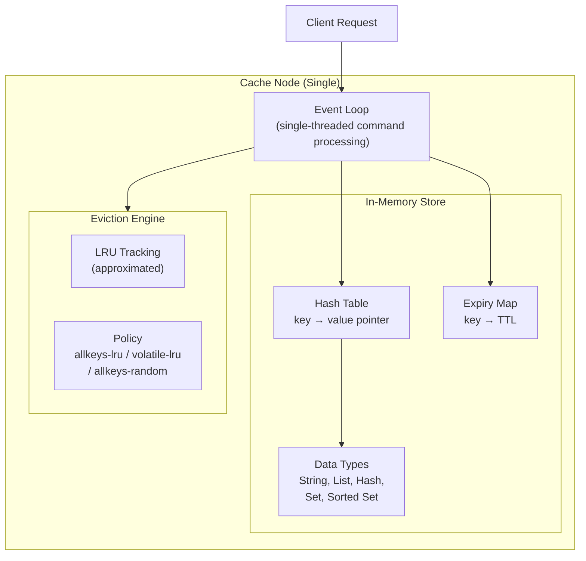
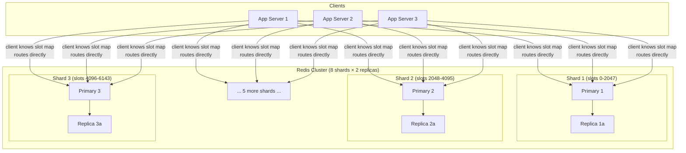
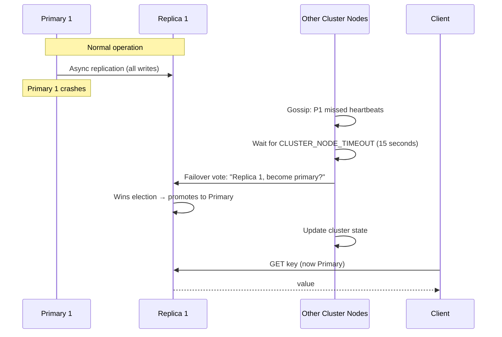
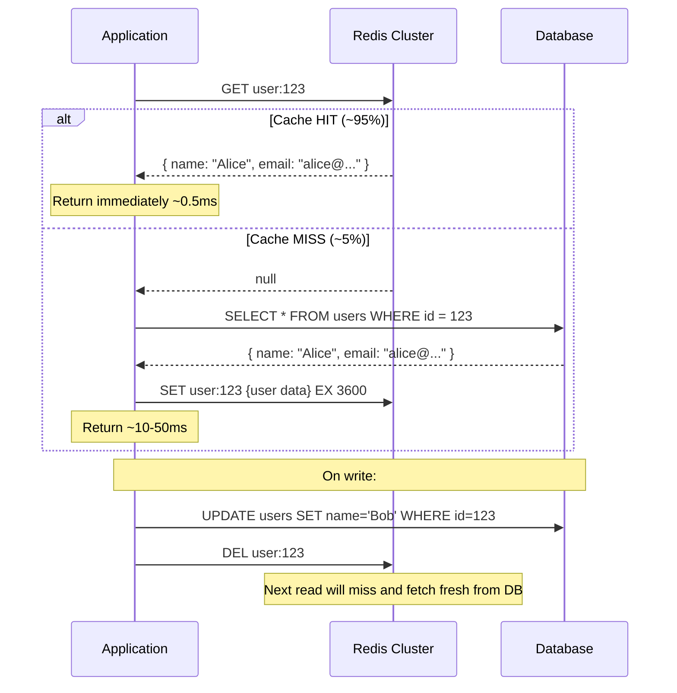

# 13 — Design a Distributed Cache

> **Case Study #13** — Intermediate
> Systems like: Redis Cluster, Memcached, Amazon ElastiCache, Hazelcast

---

## The Problem

Applications repeatedly access the same data — user sessions, product details, configuration — from a database. Each database query takes 10-100ms. A distributed cache sits in front of the database, storing frequently accessed data in memory across multiple nodes, so those queries take under 1ms instead.

Building one that works correctly across dozens of machines — distributing data evenly, surviving node failures, maintaining consistency, and scaling horizontally — requires solving several interesting distributed systems problems.

---

## Step 1 — Requirements

### Clarifying Questions to Ask

```
"Is this a standalone cache service or embedded in an application?"
"What data types — strings only, or richer structures (lists, sets, sorted sets)?"
"Do we need persistence, or is this cache-only (data can be lost on restart)?"
"What's the expected data size — gigabytes or terabytes?"
"Do we need strong consistency or is eventual consistency acceptable?"
"What's the expected read/write ratio?"
```

### Functional Requirements

| # | Requirement |
|---|---|
| FR-1 | `SET key value [EX seconds]` — store a value with optional TTL |
| FR-2 | `GET key` — retrieve a value by key |
| FR-3 | `DEL key` — delete a key |
| FR-4 | Automatic eviction when memory is full (configurable policy) |
| FR-5 | TTL — keys expire automatically after N seconds |
| FR-6 | Support common data structures: strings, hashes, lists, sets, sorted sets |

**Out of scope:** Disk persistence (RDB/AOF), pub/sub messaging, Lua scripting, stream processing.

### Non-Functional Requirements

| NFR | Target |
|---|---|
| Latency | P99 < 1ms for GET/SET |
| Throughput | 1 million ops/second (across the cluster) |
| Availability | 99.99% — tolerate single node failure |
| Horizontal scaling | Add nodes without downtime |
| Memory efficiency | Data evenly distributed; no hotspots |

---

## Step 2 — Scale Estimation

```
Total data to cache: 100 GB (hot working set)
Read/write ratio: 80:20

Throughput: 1M ops/sec
  Reads: 800,000/sec
  Writes: 200,000/sec

Single Redis node capacity: ~100,000-200,000 ops/sec

Nodes needed: 1M / 150,000 ≈ 7 nodes
  → Use 8 primary nodes (with headroom)
  → 8 replicas (one per primary)
  → 16 total nodes

Memory per node: 100 GB / 8 = 12.5 GB data per node
  → Provision 32 GB RAM per node (50% overhead for Redis internals, keys, etc.)
```

---

## Step 3 — Single Node First

Before distributing, understand what one cache node looks like.



**Why single-threaded command processing?**

Redis is single-threaded for command processing. This sounds slow but is actually genius: no locks needed, no context-switching overhead. A single thread can process 100,000+ simple operations per second because the operations are in-memory (nanoseconds) and I/O is handled by epoll (non-blocking). The bottleneck is never CPU — it's network I/O, which is handled separately.

---

## Step 4 — Data Distribution: Consistent Hashing

With 8 nodes, we need to decide which node stores which keys. We need:
- Even distribution (no one node gets all the hot keys)
- Minimal disruption when nodes are added or removed

**Simple modular hashing fails** when nodes change (covered in Case Study #3). Consistent hashing is the solution.

**Redis's approach: Hash Slots**

Redis Cluster uses 16,384 hash slots. Every key maps to exactly one slot. Slots are distributed across nodes.

```
Hash slot assignment:
  hash_slot = CRC16(key) % 16384

  Node 1 handles slots: 0 – 2047    (12.5% of keys)
  Node 2 handles slots: 2048 – 4095
  Node 3 handles slots: 4096 – 6143
  ...
  Node 8 handles slots: 14336 – 16383

Example:
  GET user:123
  CRC16("user:123") % 16384 = 5298
  Slot 5298 → Node 3
  Client connects to Node 3 directly
```

**Adding a new node:**

```
Before: 8 nodes, 2048 slots each
Add Node 9:

Move some slots from existing nodes to Node 9:
  Take 228 slots from each of 8 nodes
  Node 9 receives 1,824 slots (~11% of total)

Data for those slots migrates from old owners to Node 9.
During migration, both nodes can serve requests (migrating keys forward).
No downtime — gradual migration while cluster stays operational.
```

---

## Step 5 — Cluster Architecture



**Client-side routing:**

The client library (redis-py, Jedis, ioredis) maintains the slot map — which node owns which slots. On startup, the client fetches this map from the cluster. On every operation, the client computes the slot and connects directly to the correct node. No proxy, no coordinator.

If a client routes to the wrong node (e.g. the slot map is stale after a resharding), the node returns `MOVED 5298 10.0.1.5:6379` — the correct address. The client updates its slot map and retries.

---

## Step 6 — Replication and Failover

Each primary has one replica. If a primary dies, its replica is automatically promoted.



**Replication lag concern:**

Replication is asynchronous. If Primary 1 crashes immediately after a write, that write may not have reached Replica 1. The write is lost.

For a cache, this is acceptable — the cache's source of truth is the database. A lost cache write means a cache miss on the next read, which goes to the database. Slightly slower, but no data corruption.

For session storage or other "semi-authoritative" use cases, this is a risk to acknowledge.

---

## Step 7 — Eviction When Memory Is Full

When the cache reaches its memory limit, it must evict entries to make room.

```
Redis eviction policies (configured per deployment):

noeviction:     Return error on writes when full (not useful for cache)
allkeys-lru:    Evict least recently used key among ALL keys ← recommended for cache
volatile-lru:   LRU, but only among keys with TTL set
allkeys-lfu:    Evict least frequently used key (better for popularity-skewed workloads)
volatile-lfu:   LFU, but only among keys with TTL set
allkeys-random: Random eviction
volatile-ttl:   Evict key with shortest remaining TTL first
```

**LRU approximation:**

True LRU requires maintaining a doubly-linked list of all keys sorted by access time — expensive. Redis uses an approximation: when eviction is needed, sample 5 random keys and evict the one with the oldest last-access time. This approximates LRU with much less overhead.

---

## Step 8 — Cache-Aside Pattern Integration

The distributed cache doesn't operate in isolation — it integrates with the application layer via the cache-aside pattern.



---

## Step 9 — Handling Hot Keys

A hot key is a key accessed so frequently that the single node owning it becomes a bottleneck. Example: a product key for the viral product being ordered by millions of users simultaneously.

```
Problem:
  Key "product:iphone-16" → always on Node 3
  Node 3 receives 500,000 GET ops/sec for this key alone
  Other nodes are idle
  Node 3 is saturated → P99 latency spikes

Solutions:

1. Local in-process cache on application servers:
   Cache the hot key in each app server's memory for 1-5 seconds
   → Drastically reduces cache cluster load for hot keys
   → Brief staleness acceptable for product details

2. Key replication with random suffix:
   Store "product:iphone-16:0", "product:iphone-16:1", ..., "product:iphone-16:9"
   Each maps to a different node
   On read: pick a random suffix → distributed load
   On write: update all 10 variants → write amplification (acceptable since writes are rare)

3. Increase cluster size:
   More shards = more nodes = each node handles fewer ops/sec
   But doesn't solve single-key hotspot
```

---

## Step 10 — Monitoring the Cache

Key metrics to watch:

| Metric | What It Tells You | Alert When |
|---|---|---|
| **Hit rate** | % of requests served from cache | < 80% (cache too small or wrong keys cached) |
| **Eviction rate** | Keys removed due to memory pressure | Rising (cache too small for working set) |
| **Memory usage** | % of max memory used | > 85% (approaching eviction threshold) |
| **Connected clients** | Connections in use | Near max_clients (connection pool issues) |
| **Command latency** | P99 of GET/SET | > 2ms (node overloaded or network issue) |
| **Replication lag** | How far behind replicas are | > 100ms (replica may serve stale data) |

---

## Step 11 — Trade-offs

| Decision | Chose | Gave Up | Why Acceptable |
|---|---|---|---|
| **Distribution** | Hash slots (16,384) | Consistent hashing ring | Hash slots are simpler to reason about; fixed number is predictable |
| **Replication** | Async (primary → replica) | Strong consistency | For a cache, lost writes just cause a miss — source of truth is the DB |
| **Eviction** | LRU approximation (sample 5) | Perfect LRU | Exact LRU needs a sorted list of all keys — too expensive; approximation is good enough |
| **Routing** | Client-side (client knows slot map) | Proxy-based routing | Client-side avoids proxy bottleneck; one extra hop on MOVED is rare |
| **Failover** | Automatic election (15s timeout) | Instant failover | 15 seconds of downtime for a shard on failure; acceptable for cache |

---

## Step 12 — Follow-up Questions

**"How do you handle cache warming after a restart or new deployment?"**

Cache warming means pre-loading frequently accessed data before directing live traffic. Approaches: (1) replay recent reads from logs against the new cache, (2) proactively load top-N keys by access frequency from the DB before switching traffic, (3) gradually ramp traffic from 0% to 100% on the new cache, allowing it to warm naturally. The third option is simplest and most common.

**"What is the Thundering Herd problem and how do you prevent it?"**

When a popular cache entry expires, many simultaneous requests miss and all query the database at once. Prevention: (1) mutex/lock — only one request fetches from DB; others wait for it to populate the cache. (2) Probabilistic early expiration — re-fetch a cache entry before it expires with increasing probability as TTL approaches zero. (3) Stale-while-revalidate — serve the stale entry while a background task fetches the fresh value.

**"How would you implement distributed locking using this cache?"**

`SET lock_key unique_value NX EX 30` — set if not exists, with 30-second TTL. If returns OK → lock acquired. If returns null → lock held by someone else. On unlock: check the value equals your token (prevent deleting someone else's lock), then `DEL lock_key`. The NX + EX atomicity is what makes this safe.

---

## Summary

| Component | Choice | Reason |
|---|---|---|
| **Data distribution** | Hash slots (16,384) across nodes | Even distribution; predictable reshard behaviour |
| **Replication** | Async primary-replica, RF=2 | Sufficient for cache (lost writes = miss, not corruption) |
| **Failover** | Automatic promotion after 15s | Acceptable downtime; avoids split-brain |
| **Eviction** | allkeys-lru (approximate) | Right tradeoff between accuracy and overhead |
| **Client routing** | Client-side slot map | No proxy bottleneck |
| **Hot keys** | Local app cache + key sharding | No cluster solution for single-key hotspot; handle at app layer |

**The core insight:** A distributed cache is a distributed hash table with TTLs and eviction. The engineering challenges are distribution (consistent hashing / hash slots), failure handling (replication + automatic failover), and operational concerns (hot keys, eviction, monitoring). The data model is simple — the distribution and reliability story is complex.

---

*System Design Engineering Handbook — Case Studies*