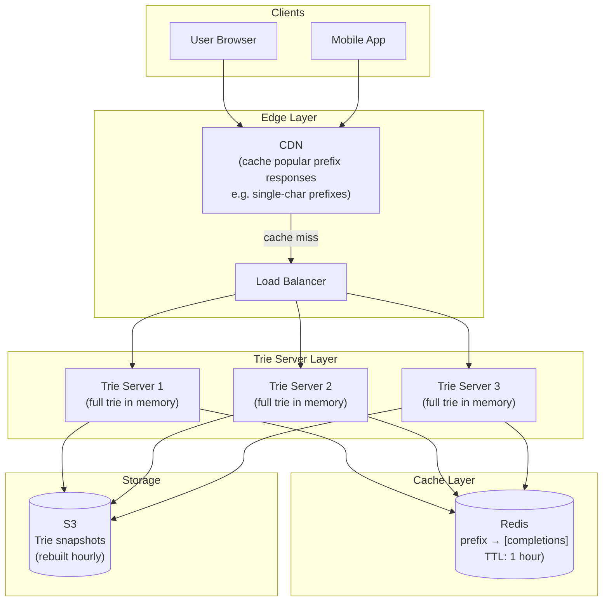
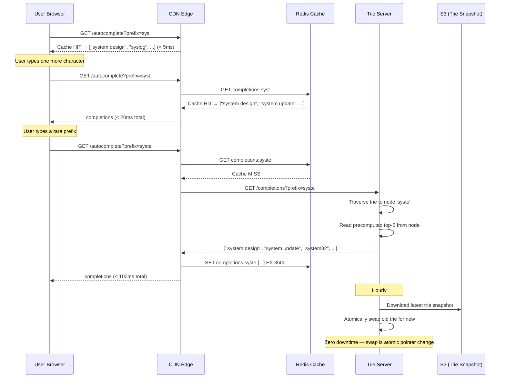
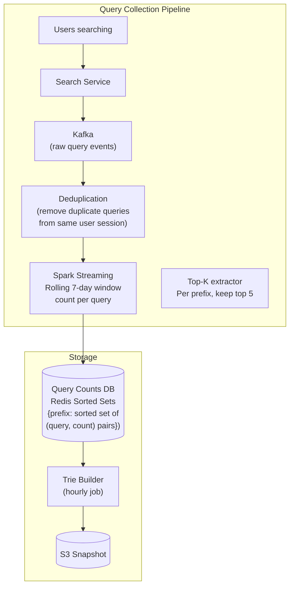

# 14 — Design Typeahead / Autocomplete

> **Case Study #14** — Intermediate
> Used by: Google Search, Amazon search bar, Twitter search, IDE code completion, Slack

---

## The Problem

When you type "sys" into Google's search bar, it instantly suggests "system design", "system design interview", "system design course" before you finish typing. This happens in under 100 milliseconds — faster than you can blink — for billions of users simultaneously.

Typeahead (also called autocomplete or search-as-you-type) is deceptively simple: given a prefix string, return the most relevant completions. Building it to work at scale — low latency for every keystroke, globally consistent rankings, personalised suggestions — requires careful thinking about data structures, caching, and distributed systems.

---

## Step 1 — Requirements

### Clarifying Questions to Ask

```
"What are we autocompleting — search queries, usernames, product names, or all of the above?"
"How many suggestions to return per prefix?"
"Should suggestions be ranked by popularity, personalisation, or both?"
"How frequently do rankings update — real-time or batch?"
"Is this global (one ranking for everyone) or personalised per user?"
"What languages and character sets must we support?"
"What's the latency budget — 50ms, 100ms, 200ms?"
```

### Functional Requirements

| # | Requirement |
|---|---|
| FR-1 | As a user types, return the top 5 query completions matching the typed prefix |
| FR-2 | Suggestions ranked by global popularity (search frequency) |
| FR-3 | Results return within 100ms of each keystroke |
| FR-4 | New trending queries appear in suggestions within an hour |
| FR-5 | Support prefix matching — "sys des" should suggest "system design" |

**Out of scope:** Personalised suggestions (same query for all users), spell correction, semantic search (results are prefix-based, not meaning-based), query completion for non-ASCII languages (handled separately).

### Non-Functional Requirements

| NFR | Target |
|---|---|
| Latency | P99 < 100ms end-to-end (including network) |
| Throughput | 10,000 requests/second (one per keystroke per user) |
| Availability | 99.99% |
| Freshness | Trending queries appear within 1 hour |
| Data size | Store completions for ~10 million unique queries |

---

## Step 2 — Scale Estimation

```
Daily Active Users: 10 million
Average characters typed per search: 6 keystrokes before selecting
Searches per user per day: 5

Total typeahead requests/day = 10M × 6 × 5 = 300 million requests/day
Average RPS = 300M / 86,400 ≈ 3,500 RPS
Peak RPS (5× average) ≈ 17,500 RPS

Data size:
  10 million unique queries, average 30 chars each = 300 MB of query strings
  Frequency scores per query: 8 bytes each = 80 MB
  Total: ~400 MB — fits easily in memory

Prefixes to index:
  Average query length: 30 chars → 30 prefixes per query
  10M queries × 30 = 300 million prefix entries
  With deduplication (many queries share prefixes): ~50 million unique prefix nodes
```

**What this tells us:**
- 17,500 RPS is high but manageable with proper caching
- The data set (400 MB of queries + scores) fits in a single machine's memory
- The real challenge is the trie data structure at scale and cache invalidation when rankings update

---

## Step 3 — The Core Data Structure: Trie

A **trie** (prefix tree) is the natural data structure for prefix matching. Each node represents one character. Traversing from the root to any node spells out a prefix. Each node stores the top-K completions for that prefix.

```
Trie for queries: "system", "system design", "system design interview", "syslog"

                (root)
                  │
                 [s]
                  │
                 [y]
                  │
                 [s]
               /     \
            [t]       [l]
             │         │
            [e]       [o]
             │         │
            [m]       [g]
           /   \
         [ ]   end → "system"
          │
         [d]
          │
         ...→ "system design", "system design interview"

At each node, we precompute and store:
  top-5 completions for this prefix
  sorted by frequency/score

Node at "sys":
  top_completions = [
    "system design interview" (score: 95,000),
    "system design" (score: 87,000),
    "syslog" (score: 42,000),
    "system update" (score: 31,000),
    "system32" (score: 28,000)
  ]
```

**Why store top-K at every node?**

If we only stored data at leaf nodes, answering "top suggestions for prefix 'sys'" would require traversing the entire subtree rooted at 'sys', scoring all completions, and sorting — expensive for every keystroke. By precomputing and storing top-K at every intermediate node, a query becomes a single trie node lookup: O(length of prefix) time.

---

## Step 4 — Building and Updating the Trie

The trie is built from aggregated search query logs. The pipeline:

```mermaid
graph LR
    subgraph Offline["Offline Pipeline (runs hourly)"]
        Logs["Search Query Logs\n(raw events)"]
        Kafka["Kafka Stream"]
        Spark["Spark Aggregation\nCount query frequencies\nover rolling 7-day window"]
        TopK["Top-K per Prefix\n(compute top 5 completions\nfor every prefix)"]
        TrieBuild["Trie Builder\nBuild complete trie\nfrom aggregated data"]
        Snapshot[("Trie Snapshot\nS3 / Object Store")]
    end

    subgraph Online["Online Serving"]
        TrieServer["Trie Servers\n(trie loaded in memory)"]
        Cache[("Redis Cache\n(popular prefix → completions)")]
        Client["Client (Browser / App)"]
    end

    Logs --> Kafka --> Spark --> TopK --> TrieBuild --> Snapshot
    Snapshot -->|"hourly reload"| TrieServer
    Client -->|"prefix request"| Cache
    Cache -->|"cache miss"| TrieServer
    TrieServer -->|"populate cache"| Cache
    Cache -->|"result"| Client
```



**Why offline, not real-time?**

Rebuilding the trie with new frequency data in real time is complex and expensive. An hourly batch rebuild is sufficient — trending queries appear within one hour, which is acceptable. The batch approach also allows a complete, consistent snapshot to be loaded atomically into serving nodes.

---

## Step 5 — Serving Architecture



**Why replicate the full trie on every server instead of sharding?**

Sharding by prefix range (Shard 1: a-m, Shard 2: n-z) would require knowing which shard to query before knowing the prefix. Simpler to replicate the full trie (400 MB) on each server — it fits in RAM and avoids cross-shard queries. Any server can answer any prefix request. As the trie grows, we can shard later.

---

## Step 6 — The Full Query Flow



---

## Step 7 — Caching Strategy

The distribution of prefix queries follows a power law — a small number of popular prefixes ("a", "go", "am", "sys") account for the vast majority of all requests. This is ideal for caching.

```
Prefix frequency distribution (approximate):
  Single character prefixes ("a", "b"...): millions of requests/day
  Two character prefixes ("go", "am"...): hundreds of thousands/day
  Five character prefixes ("syste"...): thousands/day
  Eight character prefixes ("system d"...): dozens/day

Caching strategy:
  CDN: cache single and double-character prefixes (tiny number, massive hit rate)
  Redis: cache all prefixes up to 5-6 characters (covers ~90% of requests)
  Trie server: serve everything else (long, rare prefixes — low volume)

Expected overall cache hit rate: > 95%
→ Trie servers see only ~5% of traffic
```

**Cache invalidation on trie update:**

When a new trie snapshot is loaded hourly, stale cache entries may still exist. Options:
- TTL-based: all cache entries have 1-hour TTL. They naturally expire around the same time the new trie loads. Accept up to 1 hour of stale suggestions.
- Active invalidation: after loading a new trie, publish a "trie updated" event. Cache invalidation service deletes affected keys. More complex but achieves faster freshness.

For a typeahead system, 1-hour staleness is acceptable — use TTL.

---

## Step 8 — Handling Multi-Word Prefixes

"system design" should complete to "system design interview" and "system design course". Naive trie: only single-word prefixes work naturally. We need to handle the space character.

**Approach: Treat spaces as characters in the trie.**

```
Trie stores the full query string including spaces:
  "system " → node
  "system d" → node
  "system de" → node
  "system des" → node
  "system desi" → node
  "system desig" → node
  "system design" → leaf with score

When user types "system des":
  Traverse trie to node "system des"
  Return precomputed top-5 completions from that node
  Result: ["system design", "system design interview", "system design course"]
```

This works because the trie stores the entire query string including spaces. The lookup is identical — traverse character by character, retrieve top-K from the reached node.

---

## Step 9 — Trie Storage and Serialisation

The in-memory trie must be serialised to disk for hourly snapshots and loaded efficiently on restart.

```
Serialised trie format:
  Each node: {
    char: 's',
    children: [child_node_ids],
    completions: [
      { query: "system design", score: 87000 },
      { query: "system design interview", score: 65000 },
      ... up to top-5
    ]
  }

Storage format: Protocol Buffers or MessagePack (compact binary)
Estimated size: 50M nodes × 200 bytes average = ~10 GB on disk

Loading time: 10 GB at 1 GB/s disk read = ~10 seconds
→ Load in background, swap atomically when ready
→ Zero downtime on trie reload
```

---

## Step 10 — Scaling the Data Collection

How do we know which queries are most popular? We collect every search query from every user.



**Redis Sorted Sets for real-time top-K:**

```
For prefix "sys", maintain a sorted set in Redis:
  Key: topk:sys
  Members: query strings
  Scores: frequency counts

ZADD topk:sys 87000 "system design"
ZADD topk:sys 65000 "system design interview"
ZADD topk:sys 42000 "syslog"

ZREVRANGE topk:sys 0 4 WITHSCORES
→ Returns top 5 with scores, O(K log N)

When a user searches "system design":
  ZINCRBY topk:sys  1 "system design"
  ZINCRBY topk:syst 1 "system design"
  ZINCRBY topk:syste 1 "system design"
  ... (increment for every prefix of the query)
```

This gives near-real-time frequency counts, but updates every prefix for every search event (expensive at scale). For a full-scale system, batch updates via Spark and hourly trie rebuilds are more practical.

---

## Step 11 — Database Schema

```sql
-- Stores aggregated query frequencies
-- Used as input to the trie builder
CREATE TABLE query_frequencies (
    query           TEXT PRIMARY KEY,
    frequency       BIGINT DEFAULT 0,
    last_updated    TIMESTAMPTZ DEFAULT NOW()
);

-- Stores the current top-K completions per prefix
-- Materialised by the trie builder; used by Redis warm-up
CREATE TABLE prefix_completions (
    prefix          TEXT,
    rank            INT,           -- 1 = top suggestion, 5 = 5th suggestion
    completion      TEXT,
    score           BIGINT,
    snapshot_id     UUID,          -- which trie generation this belongs to
    PRIMARY KEY (prefix, rank)
);

CREATE INDEX idx_prefix_completions_prefix ON prefix_completions(prefix);
```

---

## Step 12 — Trade-offs

| Decision | Chose | Gave Up | Why Acceptable |
|---|---|---|---|
| **Data structure** | Trie with precomputed top-K at every node | Lower memory (compute top-K at query time) | Computing top-K at query time requires full subtree traversal — too slow for 100ms budget |
| **Trie distribution** | Full replication on every server | Sharding (smaller per-server footprint) | Trie fits in RAM (400 MB); replication avoids cross-shard lookups |
| **Update strategy** | Hourly batch rebuild | Real-time updates | Batch is simpler and consistent; 1-hour staleness acceptable for suggestions |
| **Ranking** | Global popularity | Personalisation | Personalisation adds per-user storage and lookup complexity; global ranking is good enough |
| **Cache TTL** | 1 hour (matches trie refresh rate) | Instant invalidation on update | Accept up to 1-hour stale suggestions; avoids complex active invalidation |

---

## Step 13 — Follow-up Questions

**"How would you add personalised suggestions?"**

Store each user's recent search history (last 100 queries) in a user-specific store (Redis per user). At query time: fetch global top-K from the trie, fetch user's recent matching queries, blend them (e.g. 60% global + 40% personal), return the merged top-5. The personal component is fast because it's a small list scan, not a trie traversal.

**"How would you handle trending queries that appear suddenly?"**

A trending query (e.g. a breaking news event) might not appear in the trie for up to an hour. Real-time trending detection: monitor the rate of increase in query frequency. If a query's frequency doubles in 5 minutes, add it to a "trending" store. The serving layer blends trie completions with trending queries. This gives sub-minute freshness for truly viral queries without rebuilding the full trie.

**"How would you support different languages and scripts?"**

Each language gets its own trie (Latin, Cyrillic, Chinese, Arabic, etc.). The routing layer detects the character set of the prefix and routes to the appropriate trie. For Chinese (where characters don't separate into prefixes the same way), Pinyin (romanised phonetic spelling) can be used as the index key with character completions as values.

**"What if the same prefix maps to too many queries — the node has millions of completions?"**

The trie only stores top-K (e.g. 5) completions per node, not all completions. When the trie is built, the offline pipeline computes the global top-5 for every prefix and stores only those. Millions of less-popular completions are simply not stored at that prefix node — they may appear deeper in the trie (at more specific prefix nodes) but not at the general node.

**"How do you prevent offensive or inappropriate queries from appearing as suggestions?"**

Maintain a denylist of blocked query strings and patterns. During trie construction, filter out any query matching the denylist. For user-reported bad suggestions, add to the denylist and trigger an early trie rebuild. Apply the denylist at the serving layer too (in case a query slips through) as a final filter before returning results.

---

## Summary

| Component | Choice | Reason |
|---|---|---|
| **Core data structure** | Trie with precomputed top-K at every node | O(prefix_length) lookup; no subtree traversal at query time |
| **Storage** | Full trie replicated in memory on each server | 400 MB fits in RAM; avoids cross-shard queries |
| **Caching** | CDN for 1-2 char prefixes; Redis for 3-6 chars | Power law distribution means a small cache covers most traffic |
| **Updates** | Hourly batch rebuild from Spark aggregation | Consistency; simplicity; 1-hour freshness is acceptable |
| **Data collection** | Kafka → Spark → aggregated counts | Scalable; decouples collection from serving |
| **Multi-word prefixes** | Treat space as a character in the trie | Transparent — no special handling needed at query time |

**The core insight:** The key engineering decision is to precompute and store top-K completions at every trie node during the offline build phase, rather than computing them at query time. This converts a potentially expensive subtree traversal into a single node lookup — the difference between 1,000ms and 1ms at query time. Every other design decision (caching layers, CDN, batch rebuild, replication) exists to serve that lookup fast, reliably, and at scale.

---

*System Design Engineering Handbook — Case Studies*