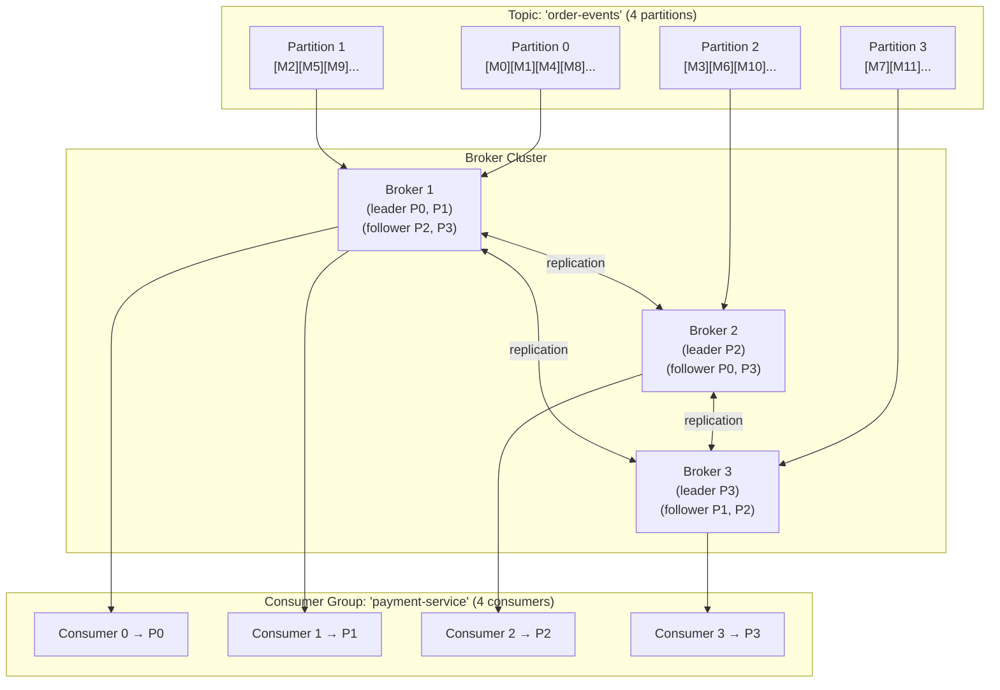
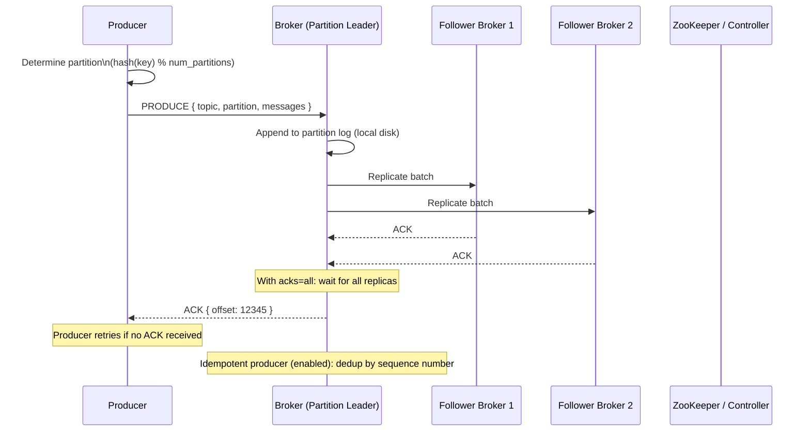
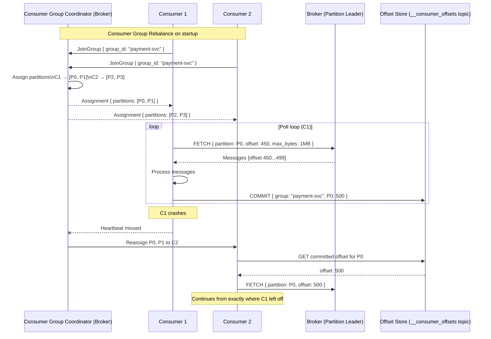
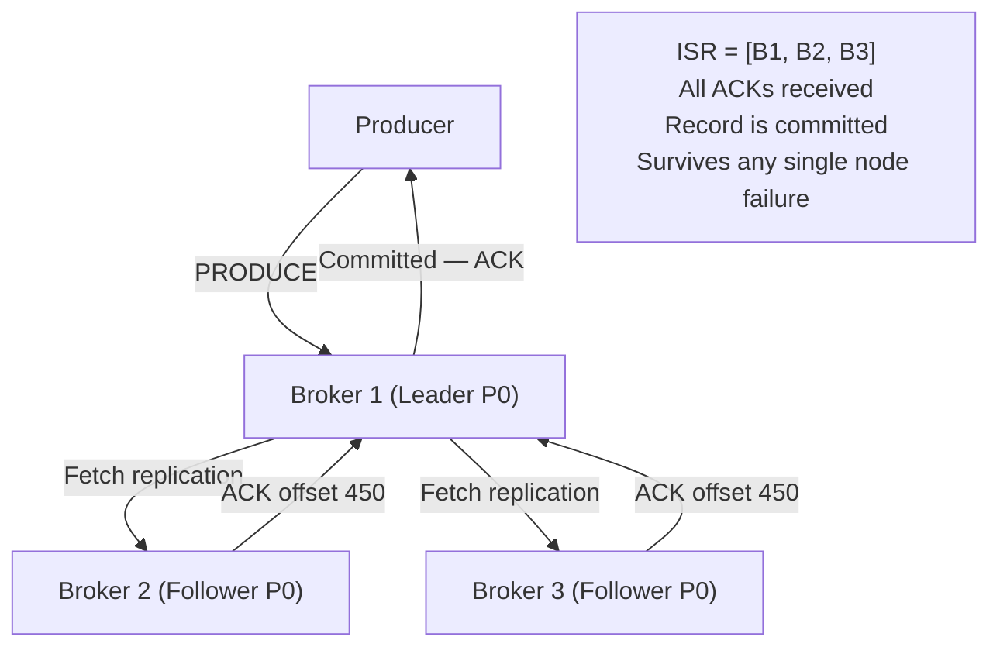

# 15 — Design a Distributed Message Queue

> **Case Study #15** — Advanced
> Systems like: Apache Kafka, Amazon SQS, RabbitMQ, Apache Pulsar, Google Pub/Sub

---

## The Problem

A distributed message queue is the plumbing of a distributed system. Producers write messages to it. Consumers read and process those messages. The queue decouples the two: producers don't wait for consumers, consumers process at their own pace, and the system stays available even when parts of it fail.

Building one that is durable (messages are never lost), scalable (handles millions of messages per second), ordered (messages are processed in the correct sequence), and fault-tolerant (survives node failures without losing a single message) requires solving several hard distributed systems problems simultaneously.

This case study goes deeper than the Kafka overview in the Messaging section — we're designing the internals of the system itself, not just using it.

---

## Step 1 — Requirements

### Clarifying Questions to Ask

```
"Queue semantics or stream semantics — are messages deleted after consumption?"
"What delivery guarantee — at-most-once, at-least-once, or exactly-once?"
"Do we need message ordering — globally, per partition, or none?"
"What's the retention period for messages?"
"Do consumers need to replay messages from any point in history?"
"What's the expected message throughput — thousands or millions per second?"
"What's the maximum message size?"
"Push-based or pull-based delivery?"
```

### Functional Requirements

| # | Requirement |
|---|---|
| FR-1 | Producers can publish messages to named topics |
| FR-2 | Consumers can subscribe to topics and receive messages |
| FR-3 | Messages within a partition are delivered in order |
| FR-4 | Messages are retained for a configurable period (e.g. 7 days) |
| FR-5 | Consumers can replay messages from any offset |
| FR-6 | Multiple independent consumer groups can read the same topic |
| FR-7 | Topics can be partitioned for parallel consumption |

**Out of scope:** Dead letter queues (configuration, not core design), consumer group management UI, schema registry, stream processing (Kafka Streams), exactly-once semantics (complexity beyond scope).

### Non-Functional Requirements

| NFR | Target |
|---|---|
| Throughput | 1 million messages/second per cluster |
| Latency | P99 < 10ms end-to-end (producer → consumer) |
| Durability | No message loss after acknowledgement |
| Availability | 99.99% |
| Ordering | Strict ordering within a partition |
| Retention | 7 days by default, configurable |
| Scalability | Linear horizontal scaling by adding brokers |

---

## Step 2 — Scale Estimation

```
Target throughput: 1 million messages/second
Average message size: 1 KB

Ingress data rate: 1M × 1 KB = 1 GB/second
With 3× replication: 3 GB/second total disk writes

Daily storage (7-day retention):
  1 GB/sec × 86,400 = ~86 TB/day
  7 days × 86 TB = ~600 TB total retention storage
  → Requires many brokers; each with large fast SSDs

Broker capacity (typical):
  1 broker: ~100 MB/sec write throughput (network + disk bound)
  Brokers needed: 1 GB/sec / 100 MB/sec = 10 brokers minimum
  With headroom and replication: 30+ brokers in production

Consumer throughput:
  1M messages/sec × 3 consumer groups = 3M reads/sec
  Sequential disk reads: fast (page cache), minimal extra disk I/O
```

**What this tells us:**
- This is a write-heavy, storage-heavy system
- Sequential writes to disk (append-only log) are the key performance enabler
- The page cache does most of the read serving — consumers are often reading data that's still in OS memory

---

## Step 3 — The Foundational Insight: The Commit Log

The most important design decision in a message queue is the storage model. A distributed message queue like Kafka is built on an **append-only, immutable commit log**.

```
TRADITIONAL QUEUE (delete after consume):

[M1][M2][M3][M4][M5]
Consumer reads M1 → M1 deleted
Consumer reads M2 → M2 deleted
[M3][M4][M5]

Problem: only one consumer can read; no replay; must track "delivered" state

COMMIT LOG (append-only, immutable):

offset: 0    1    2    3    4    5    6    7
       [M1] [M2] [M3] [M4] [M5] [M6] [M7] [M8] → append new messages here

Consumer Group A offset: 5 (reading M6)
Consumer Group B offset: 3 (reading M4, processing slower)
Consumer Group C offset: 0 (replaying from the beginning)

Each consumer group tracks its own position (offset).
Messages are NEVER deleted (until retention period expires).
Any consumer group can read at any speed independently.
```

**Why is this so powerful?**

- Multiple consumer groups read the same data independently — one pipeline for real-time processing, one for analytics, one for audit logging
- Replay is free — reset your offset and reprocess any historical window
- Ordering is guaranteed — log is strictly sequential
- The broker is simple — it just appends writes and serves reads from a log; no complex "which message goes to which consumer" routing

---

## Step 4 — Topics, Partitions, and Brokers



**Topics:** Logical grouping of messages (like a table name). Producers write to a topic. Consumers subscribe to a topic.

**Partitions:** A topic is split into N ordered, immutable logs (partitions). Partitions enable parallelism — different consumers handle different partitions simultaneously. Ordering is guaranteed within a partition, not across partitions.

**Brokers:** Servers in the cluster. Each partition has one **leader broker** (handles reads and writes) and multiple **follower brokers** (replicas). Partitions are distributed across brokers to balance load.

---

## Step 5 — Producer: How Messages Are Written



**The acks parameter is the most important producer configuration:**

```
acks=0:   Producer does not wait for ACK. Lowest latency.
          Risk: message lost if broker crashes before writing to disk.
          Use: telemetry, metrics where some loss is acceptable.

acks=1:   Producer waits for leader to write to its local log.
          Risk: message lost if leader crashes before replicating.
          Use: moderate durability requirement.

acks=all: Producer waits for ALL in-sync replicas to acknowledge.
          No message loss as long as at least one replica survives.
          Cost: higher latency (must wait for slowest replica).
          Use: financial data, order events, anything where loss is unacceptable.
```

**Producer batching — the throughput enabler:**

```
Naive: send one message at a time
  1 message × 10ms network RTT × 1M messages/sec = impossible

Batching:
  Producer buffers messages for 5ms (linger.ms = 5)
  Sends a batch of ~500 messages in one network request
  
  Cost: 5ms additional latency per message
  Benefit: 500× reduction in network round trips
           Disk writes are sequential (much faster than random)
           Compression is more effective on batches

Compression options: none, gzip, snappy, lz4, zstd
  zstd: best compression ratio (40-70% size reduction)
  snappy: fastest compression/decompression
  Choice depends on CPU vs network bandwidth trade-off
```

---

## Step 6 — Consumer: How Messages Are Read



**The offset commit is critical.** The consumer's position in each partition is stored in a special internal topic (`__consumer_offsets`). When a consumer crashes and another takes over, it reads the committed offset and continues from that point. If the consumer processed a message but crashed before committing the offset, the next consumer will re-process it — this is the source of at-least-once delivery.

**Pull vs Push:**

```
Push (broker pushes to consumer):
  Broker controls delivery rate
  Consumer can be overwhelmed if processing is slow
  Used by: RabbitMQ, many traditional queues

Pull (consumer polls broker):
  Consumer controls its own pace
  Consumer fetches when ready — natural backpressure
  Consumer can batch fetch (fetch many messages at once)
  Used by: Kafka, SQS

Kafka uses pull for a key reason: consumer diversity.
  Some consumers process in 1ms. Others take 1 second.
  With pull, each consumer fetches at its own rate.
  With push, the broker must track and throttle each consumer separately — complex.
```

---

## Step 7 — Replication: Ensuring Durability

Each partition has one leader and N-1 followers. The **In-Sync Replicas (ISR)** set is the group of followers that are fully caught up with the leader.

```
Setup:
  Partition 0: Leader = Broker 1, Followers = Broker 2, Broker 3
  ISR = [Broker 1, Broker 2, Broker 3] (all caught up)

Normal operation:
  Producer writes to Leader (Broker 1)
  Leader appends to its log
  Followers fetch new records and acknowledge
  ISR stays = [B1, B2, B3]
  Leader commits record when min.insync.replicas are in ISR (typically 2)

Broker 2 falls behind (network issue):
  ISR shrinks: [Broker 1, Broker 3]
  Producer with acks=all waits for ACK from both remaining ISR members
  min.insync.replicas = 2 → still satisfied → writes continue

Broker 3 also falls behind:
  ISR = [Broker 1] (only leader)
  min.insync.replicas = 2 → NOT satisfied
  Producer receives NotEnoughReplicasException → must retry

If Leader (Broker 1) crashes:
  Controller detects failure
  Elects new leader from ISR (Broker 3 if it was in ISR)
  Broker 3 becomes new leader
  Consumers transparently redirect to Broker 3
  No messages lost (Broker 3 had all committed data)
```



---

## Step 8 — Controller and Cluster Coordination

The cluster needs a coordinator — one node that makes authoritative decisions:
- Which broker is the leader for each partition?
- Which brokers are alive?
- When to trigger leader election after a failure?

**ZooKeeper (traditional Kafka approach):**

```
ZooKeeper maintains cluster metadata:
  /brokers/ids/{broker_id} → broker endpoint
  /controller → which broker is the active controller
  /topics/{topic}/partitions/{id}/state → leader + ISR

Controller election:
  Multiple brokers try to create /controller (ephemeral ZooKeeper node)
  First one wins → becomes the controller
  If controller dies → ZooKeeper node disappears → re-election

Problem: ZooKeeper is an additional system to operate.
         Adds operational complexity.
         Metadata bottleneck at scale.
```

**KRaft (Kafka's newer approach — Raft-based, no ZooKeeper):**

```
A subset of brokers run as a Raft quorum (the "metadata quorum").
Cluster metadata stored in an internal log (like a topic).
Leader election via Raft consensus among the quorum members.
No external dependency — Kafka manages itself.

Advantages:
  Simpler operations (one system instead of two)
  Better performance (metadata stored locally, not in ZooKeeper)
  Supports millions of partitions (ZooKeeper was a bottleneck)
```

---

## Step 9 — Storage Layout

Each partition is stored as a series of segment files on disk.

```
Partition directory: /data/kafka/order-events-0/

Segment files:
  00000000000000000000.log    (messages from offset 0 to 999,999)
  00000000000000000000.index  (sparse index: offset → file position)
  00000000000000000000.timeindex (time → offset, for time-based lookups)

  00000000000001000000.log    (messages from offset 1,000,000 to 1,999,999)
  00000000000001000000.index
  00000000000001000000.timeindex

  ... (new segment created when current reaches 1 GB or 7 days old)

Active segment: newest log file (append-only writes)
Older segments: immutable (read-only, eligible for deletion after retention)
```

**The sparse index:**

```
Index file maps selected offsets to their byte position in the .log file:
  offset 0       → byte position 0
  offset 1000    → byte position 48,230
  offset 2000    → byte position 98,441
  ...

To find message at offset 1,234:
  1. Binary search index for largest offset ≤ 1,234 → find offset 1,000 at byte 48,230
  2. Scan .log file forward from byte 48,230 until offset 1,234 found
  → Maximum scan: 1000 messages (the index granularity)
  → Fast even without a dense index
```

**Why sparse instead of dense index?**

A dense index (one entry per message) at 1 million messages per second would be 1 million index entries per second — too much overhead. A sparse index every 4KB of log data is tiny and still allows fast enough lookups.

---

## Step 10 — Log Compaction

Retention by time or size deletes old segments. But what if you need to keep the **latest value per key** indefinitely? Log compaction keeps only the most recent message per key, deleting older duplicates.

```
Original log:
  offset 0:  key=user:123  value="Alice"
  offset 1:  key=user:456  value="Bob"
  offset 2:  key=user:123  value="Alice Smith"    ← updated name
  offset 3:  key=user:789  value="Carol"
  offset 4:  key=user:456  value="Robert"          ← updated name

After compaction:
  offset 2:  key=user:123  value="Alice Smith"    ← kept (most recent)
  offset 3:  key=user:789  value="Carol"
  offset 4:  key=user:456  value="Robert"          ← kept (most recent)
  (offsets 0 and 1 deleted — stale values for same keys)
```

Use cases for compacted topics:
- User profile store (keep latest profile per user_id)
- Database changelog (keep latest value per primary key)
- Configuration (keep latest config value per config key)

---

## Step 11 — End-to-End Latency Breakdown

Understanding where the 10ms P99 target is spent:

```
Producer batching (linger.ms):     0 – 5ms  (configurable)
Network: producer → broker:        1 – 3ms
Broker disk write:                 0.5 – 2ms (NVMe SSD)
Replication to followers:          1 – 3ms
Broker ACK to producer:            0ms (included in replication)
Consumer poll interval:            0 – 5ms (configurable)
Network: broker → consumer:        1 – 3ms

Total: 3 – 21ms
P99 at 10ms: achievable with low linger.ms and fast network
```

**To minimise latency:** Set linger.ms=0 (no batching delay), use NVMe SSDs, deploy producers and consumers in the same datacenter as brokers. Accept lower throughput in exchange for lower latency.

**To maximise throughput:** Set linger.ms=5-10ms, enable compression (lz4 or zstd), batch.size=1MB. Accept higher latency in exchange for higher throughput.

---

## Step 12 — Trade-offs

| Decision | Chose | Gave Up | Why Acceptable |
|---|---|---|---|
| **Storage model** | Append-only immutable log | Cannot update/delete individual messages | Immutability enables sequential writes (fast), replication (simple), replay (powerful) |
| **Consumer model** | Pull-based | Push simplicity | Pull gives consumers natural backpressure; each consumer reads at its own pace |
| **Delivery guarantee** | At-least-once (default) | Exactly-once simplicity | Exactly-once is possible but complex; make consumers idempotent instead |
| **Ordering** | Per-partition only | Global ordering | Global ordering requires single partition → no parallelism; per-partition ordering is sufficient for most use cases (route related events to same partition) |
| **Retention** | Time-based (7 days) | Infinite retention | Storage cost grows unbounded with infinite retention; 7 days is enough for most replay needs |
| **Replication** | Async (followers fetch from leader) | Sync (leader waits for all followers before ACK) | Async replication is faster; acks=all gives durability at the cost of waiting only for ISR members, not all brokers |

---

## Step 13 — Follow-up Questions

**"How do you guarantee exactly-once delivery?"**

Exactly-once requires coordination at three levels: (1) Idempotent producer — the broker deduplicates retried messages using a producer ID + sequence number; messages received twice are stored only once. (2) Transactions — the producer wraps a batch of writes across multiple partitions in an atomic transaction; all succeed or all are rolled back. (3) Idempotent consumer — the consumer processes and commits its offset in a single atomic operation (write output + commit offset in the same transaction). This is Kafka's "exactly-once semantics" — complex to implement correctly.

**"How do you handle a consumer that is extremely slow?"**

A slow consumer accumulates **consumer lag** — the gap between the latest offset in the partition and the consumer's current offset. If lag grows faster than the consumer can process, and old segments are deleted before the consumer reads them, the consumer **falls off the end of the retention window** and must reset to the earliest available offset (losing some messages). Solution: monitor consumer lag, alert when it exceeds a threshold, and either speed up the consumer (add instances) or increase retention duration as a buffer.

**"How do you handle producer ordering when retries are involved?"**

Without idempotency, a retry could result in message M2 being written after M3 (the retry of M2 arrives after M3 was accepted). Enable idempotent producers: the broker assigns each producer a unique producer ID. Each message includes a sequence number. The broker accepts only the next expected sequence number, rejecting out-of-order messages (which are retries already committed). This gives per-producer ordering without duplicates.

**"What happens during a partition leader election?"**

When the current leader fails, the controller detects the failure (missed heartbeats) and selects a new leader from the ISR. The new leader begins serving reads and writes. Messages that were in-flight to the old leader but not yet replicated are lost — this is why min.insync.replicas is important. The consumer group coordinator detects that affected consumers can no longer reach the old leader and redirects them to the new leader. During the election window (typically seconds), affected partitions are unavailable.

**"How would you implement message priorities?"**

Kafka has no built-in priority. Common workaround: create separate topics per priority level (e.g. `orders-high`, `orders-medium`, `orders-low`). Consumers poll from high-priority topics first, then medium, then low. Or use multiple consumer groups with different throughput allocations. For true priority queues, RabbitMQ has native priority support — it's a better fit for that use case.

---

## Summary

| Component | Choice | Reason |
|---|---|---|
| **Storage model** | Append-only immutable commit log | Sequential writes are fast; replication is simple; replay is free |
| **Partitioning** | Per-topic partitions distributed across brokers | Parallelism without losing ordering within a partition |
| **Replication** | Leader + ISR followers, async replication | Durability without synchronous coordination overhead |
| **Consumption** | Pull-based, consumer-managed offsets | Natural backpressure; independent consumer groups |
| **Coordination** | Controller (ZooKeeper or KRaft) for leader election | Centralised metadata; clean failover |
| **Log storage** | Segmented files with sparse index | Efficient sequential I/O; fast offset-based lookup |
| **Compaction** | Optional per-topic | Enables changelog and event-sourcing patterns |

**The core insight:** The commit log is the entire foundation. By treating messages as an immutable, append-only sequence of records rather than items in a queue that disappear after consumption, the system gains: independent consumer groups at no extra cost, replay capability for free, simple replication (followers just catch up by reading the log), and predictable sequential I/O performance. Every other design decision — partitioning, ISR replication, offset-based consumption, log compaction — is an extension of this fundamental choice.

---

*System Design Engineering Handbook — Case Studies*